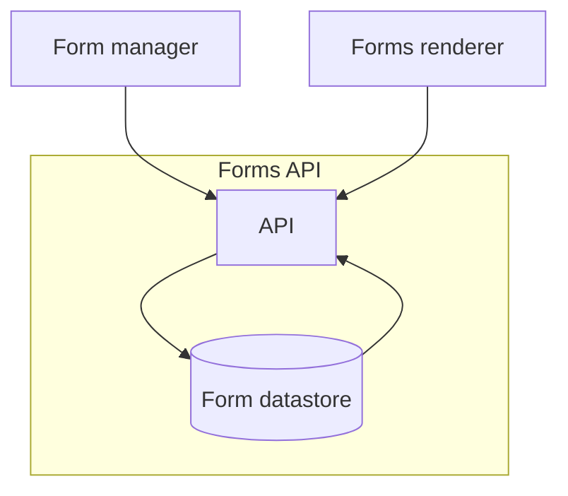
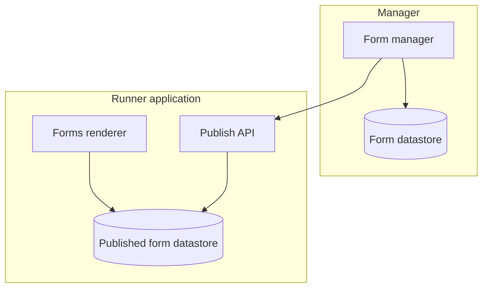
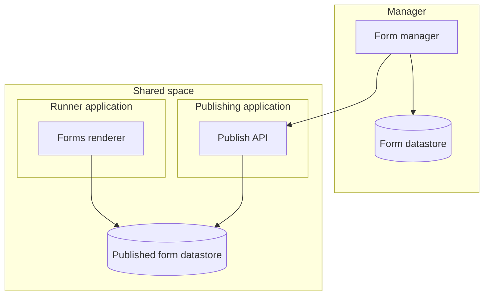
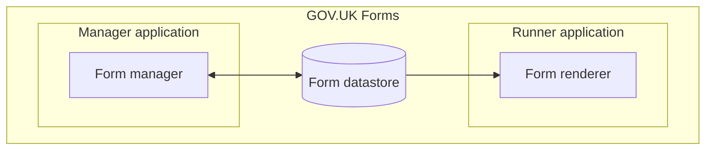
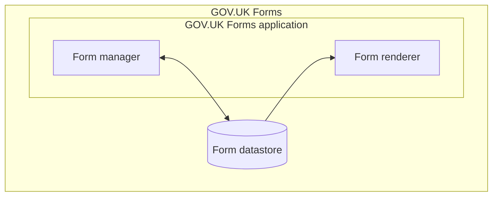

# ADR004: Store form schemas in an API

Date: 2022-02-18

## Status

Proposed

## Context

- Manager/Designer components don't need to be as scalable as the runner
- Runner needs to scale to number of users
  - Sustainability, runner not needed during quiet times
- "Published forms" need to be accessible to the runner

### Option 1 - Forms API

- Stores the forms in a datastore with the API being a separate application
- Runner depends on API
- Three applications to deploy with dependencies, too complex?
- Could cache API responses for speed

### Option 2a - Runner as an API

- Stores the published forms alongside the runner
- Runner doesn't depend on api but exposes it instead
- Only two applications to deploy

### Option 2b - Publishing API, stores in shared datastore

- Stores the published forms in a datastore directly accessible to the runner
  - This doesn't necessarily have to be a database (e.g. S3 with a cache)
- Runner can be focused only on rendering
- Publish API separate
- Only two applications to deploy

### Option 3 - Manager and Runner share database

- Form manager and runner share the same DB
- No need to build/maintain APIs
- Shared DB schema is a concern

### Option 4 - Monolithic manager and runner

- Single application to deploy
- Single DB schema to maintain
- Updates to manager will impact the runner

## Decision
## Consequences

> both positive and negative consequences of the decision
