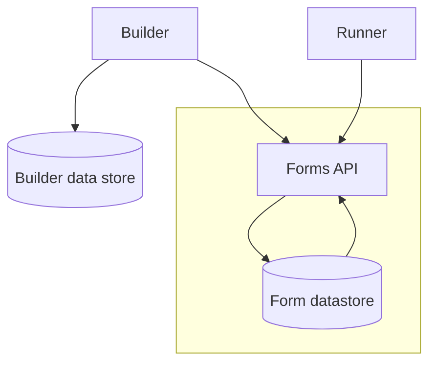
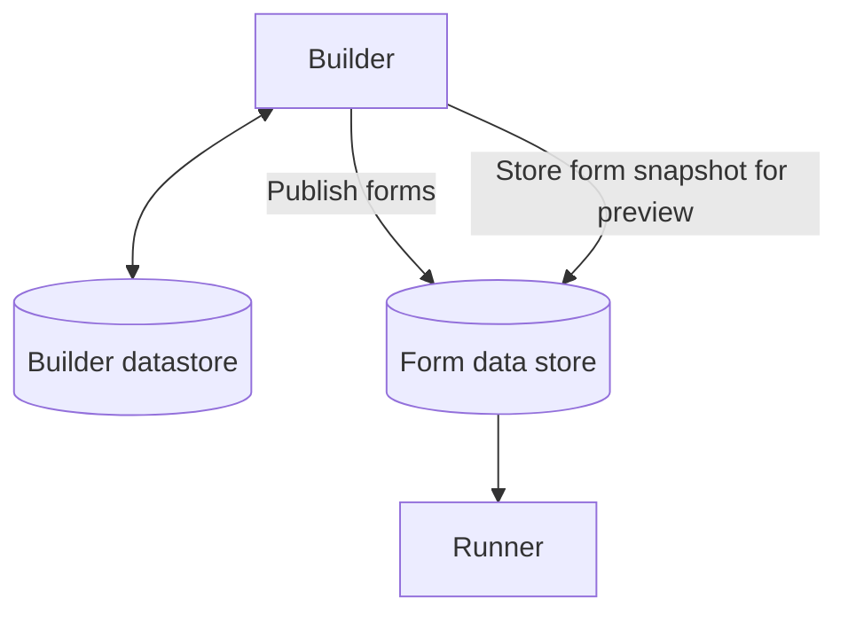

# ADR004: Store form schemas in an API

Date: 2022-02-18

## Status

Accepted

## Context

- Manager/Designer components don't need to be as scalable as the runner
- Runner needs to scale to number of users
  - Sustainability, runner not needed during quiet times
- "Published forms" need to be accessible to the runner

The GOV.UK Forms service is made up of two major user facing services:
- The service where form creators can create, manage, and publish forms (the "builder")
  - This service will need to have access to user information for signing in/permissions management
- The service that people filling out the published forms use to fill in and submit their answers (the "runner")

The rough flow of our service is as follows:
- Form creator logs in
- Form creator uses the builder to create a form
- Form creator previews what the form looks like for users
- Form creator publishes the form
- Person filling out the form accesses the form
- Person filling out the form completes the form
- Person filling out the form submits the form

Underlying both of these is the stored structure of the form. This has two states which may represent the data in different ways:
- The structure which the builder creates
  - The way this is stored may want to be optimised for ease of editing/updating, for example each page being a distinct database entry rather than the form as one big block.
- The structure that the runner uses to render the form
  - The way this is stored may wish to be optimised for being able to see the whole format at once for determining things such as the next page to visit, any conditional logic, etc.

The way this data is stored and access needs to:

- Be scalable, as more forms are created the more the form structure will be required to be read as there will be more people filling out forms.
  - The scaling needs of the builder and the runner are different - the builder will have a lot less traffic compared to the runner and as such has different scaling needs.
- Allow for the "previewing" of non-published forms, i.e. The runner must be able to see non-published forms
- Allow forms to have owners and permission management
- < other requirements >

### Option 1 - Forms API

#### Summary

In this model the Forms API would be responsible for managing the storage of the form. The builder would hold the information about the users and the API would hold information about the forms, with one of them holding the information mapping user/permissions to forms.

The API would be responsible for holding the status of each form (published/unpublished) and providing the structure to the reader.

The runner would read published forms from the API and render them.

#### Pros

- An API allows for separate scaling based on demand on the runner without needing to scale the builder
- Able to more easily fine tune how data gets stored/life cycle management of versions
- Form structures for the runner to read are generated on access, meaning updates to the schema are easy to roll out

#### Cons

- More complex to manage - adds an additional application to update/deploy
- Permissions for the forms will not be able to be stored in the same place as either the users or the forms, making connecting that data more complicated
- Security implications
  - The forms API will need to be secured, though there are multiple ways of doing this it adds an additional complexity to creating it

### Option 2 - Published and preview forms are stored in a datastore

#### Summary

The builder would be responsible for holding the information about the users, permissions, and the structure of the forms that are in progress. However, when a form is "published", that structure would be uploaded to the published form data store. To support the preview feature, the builder would expose an API endpoint available to the runner to get the current structure so that it can be viewed before publishing.

The data store would be a simple file store such as S3 that was available to the runner. In this model it would enable the most recent version of the published forms to be available to the runner without the need to run/scale a server to manage it. Depending on the file store used, there may be other features we can take advantage of. The form data stored would also need an indication of whether or not it was a "preview" snapshot or a published form so that the runner could handle it correctly.

The runner would read the published form form the data store directly when being accessed by the user.

#### Pros

- There would only be two services to manage the deployment/updates of
- Data stores such as S3 provide high uptime/performance
- Potential cost saving benefits as we would be paying per access of a form rather than for running a server, which could be cached to reduce cost further
- No need to create authentication methods around a central API

#### Cons

- Updates to the form schema would require all forms to be republished on update

#### Additional considerations

- We would need to understand how to manage "withdrawing" a form that is no longer in use. This could be managed via storing the status of the form in the form structure data that is stored in the data store.

## Decision

We have decided to implement Option 1 - the Forms API.

## Consequences
As a result of this decision, we will have to build a new API application and deploy this. We will need to ensure that the API is adequately secured. We should consider adding validations to the API to ensure that only valid forms are stored. 
