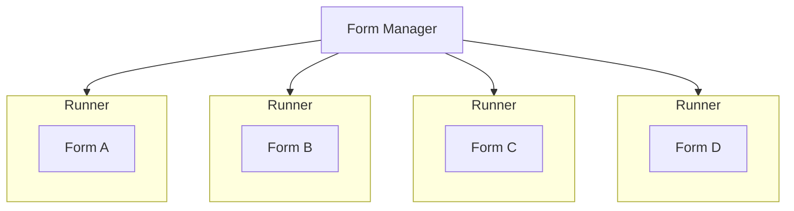
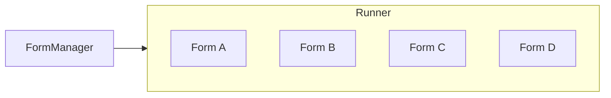

# ADR005: Use multi-tenant runner

Date: 2022-02-18

## Status

Proposed

## Context

The forms platform has a "runner", the service that runs the forms itself to the user who is filling them in.

There are two different ways to approach the runner - single or multi tenant. Two existing forms creation services (MOJ Forms, XGovFormBuilder) both use the single tenant approach.

### Single tenant structure

In this structure, each form has its own runner which serves each form to the end user. This enables you to manage and scale each form individually as well as limit the impact if one form runner encounters an error.

### Multi tenant structure

In this structure, there is one runner that serves forms to the end user. This enables you to have easier control over updating the runner where required (dependency version increases, service updates, etc.)

## Decision

We have decided to use a multi tenant runner to host and run multiple forms.

## Consequences

We will be able to deploy updates to the runner more easily.

We will be able to scale the service to the total number of people filling in forms, rather than having idle servers for every low use form, reducing energy usage.

If the runner service encounters an error, all forms will be impacted rather than just one.
