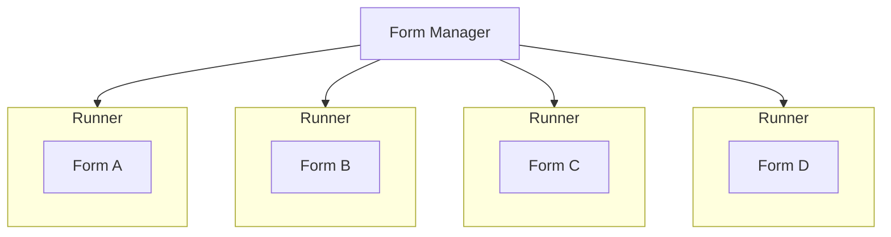
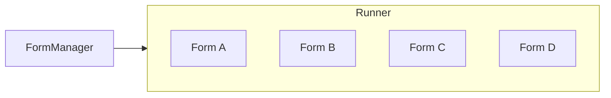

# ADR005: Use multi-tenant runner

Date: 2022-04-07

## Status

Accepted

## Context

The forms platform has a "runner", the service that runs the forms itself to the user who is filling them in.

There are two different ways to approach the runner - single or multi tenant. Two existing forms creation services (MOJ Forms, XGovFormBuilder) both use the single tenant approach.

### Single tenant structure

In this structure, each form has its own runner which serves each form to the end user. This:

- Limit the impact if one form runner encounters an error
- Makes it more complicated to roll out updates to each runner as we scale
- Requires us to run a server consistantly for all forms regardless of traffic, using up money + energy when not required

### Multi tenant structure

In this structure, there is one runner service that serves forms to the end user. This:

- Enables us to have easier control over updating the runner where required (dependency version increases, service updates, etc.)
- Enables the ability to scale to the overall load on the forms service, removing the need to run idle servers for forms that have no traffic
- Makes errors in the forms runner service have wider impact as all forms will be effected rather than just the one on the runner encountering the error

## Decision

We have decided to use a multi tenant runner to host and run multiple forms.

## Consequences

We will be able to deploy updates to the runner more easily.

We will be able to scale the service to the total number of people filling in forms, rather than having idle servers for every low use form, reducing energy usage.

If the runner service encounters an error, all forms will be impacted rather than just one.
