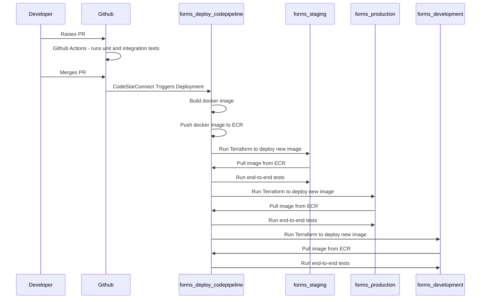

# ADR011: Using CodePipeline and CodeBuild for Deployments

Date: 2022-11-30

## Status

Accepted

## Context

GOV.UK Forms is migrating from GOV.UK PaaS to Amazon Web Services. GOV.UK Forms will continue to use [continuous integration ("CI")](https://aws.amazon.com/devops/continuous-integration/) practices and further adopt [continuous deployment ("CD")](https://aws.amazon.com/devops/continuous-delivery/) practices. [Github Actions](https://github.com/features/actions) are currently used for CI by running tests on each PR before permitting a merge. Github Actions are also currently used for automatic deployments to the existing PaaS development environment whilst being manually triggered for deployments into PaaS staging and PaaS production.

## Decision

Continue to use Github Actions for CI. AWS [CodePipeline](https://aws.amazon.com/codepipeline/) and [CodeBuild](https://aws.amazon.com/codebuild/) will be used to build the Docker image and automatically deploy and run post deployment tests on all new releases into all new AWS environments. An initial build of a trial pipeline concluded AWS CodePipeline and CodeBuild provide the necessary features for this approach to be successful.

The deployment pipelines will exist within the forms-deploy AWS account and deploy cross-account into forms-development, forms-staging and forms-production. Docker images will be pushed into ECR within the forms-deploy account and pulled by ECS tasks running in forms-development, forms-staging and form-production accounts.

A simplistic representation is:

The development environment is for developing new features and debugging in a production like environment and is not intended as a pre-production test environment. The successful deployment and testing of a release into development will not be necessary before deploying the release into staging. Keeping the development environment off of the path to production allows it to be used for experimentation without preventing deployments to production. Automatic deployments to the development environment can be paused if a developer is using it for long periods of time.

## Consequences

- Authentication and Authorisation for pushing images and deploying to our AWS accounts is maintained by AWS IAM which offers secure and granular control within and across accounts.
- Github Actions will have no permissions to make direct changes to the GOV.UK Forms AWS environments.
- CI processes using Github Actions remain unchanged.
- GOV.UK Forms can benefit form the existing AWS CodePipeline and CodeBuild experience within GDS and CDDO.
- Pipelines in a single account (forms-deploy) which deploy cross account provide better visibility and debugging of issues than pipelines within each account being deployed to.
- GOV.UK Forms developers will need to learn AWS CodePipeline and CodeBuild. The initial creation of the pipelines requires a fairly steep learning curve (most of which has already been acquired during the initial investigation) but the on-going maintenance and operation is less demanding.
- AWS CodePipeline's [CodeStarSourceConnection](https://docs.aws.amazon.com/codepipeline/latest/userguide/action-reference-CodestarConnectionSource.html) does not currently support path-based triggers. Further investigation will be required to develop an acceptable solution before the non-application related [Terraform module in the forms-deploy](https://github.com/alphagov/forms-deploy/tree/main/infra/deployments) mono-repo are deployed via the pipelines.