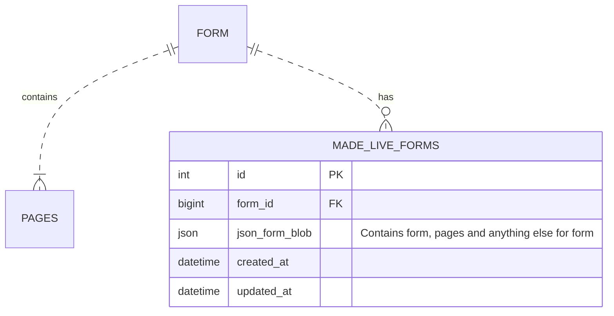

# ADR016: Draft/live forms

Date: 2023-03-03

## Status

Accepted

## Context

There is a need to create live versions of a form. While working on a spike for this feature it become clear that paper trail along with other 3rd party gems (See ADR015) were not the right solution for us. We needed a simplified implementation that could be both flexible and performant.

We took a step back and re-evaluated our position. All we needed was a snapshot of the form and its pages as a JSON blob. 

## Decision

We decided that a new table called `made_live` would be created to store copies of forms, pages and any other data needed by `forms-runner` or `forms-admin` as JSON. Each form could potentially have one or more live forms but only the last created `made_live_forms` record would be used and considered as the "live form".

## Consequences

Regardless how we implemented draft/live forms we will always have to considerate when adding new features to forms/pages to ensure they are backwards compatible. 

Even though we have to maintain this outselves, it still feels incredible flexible for things we may want to add to form/pages in the future. We also do not have to rely on a 3rd party to give us this functionality.

## References

- Spike looking at PaperTrail and version associations records

