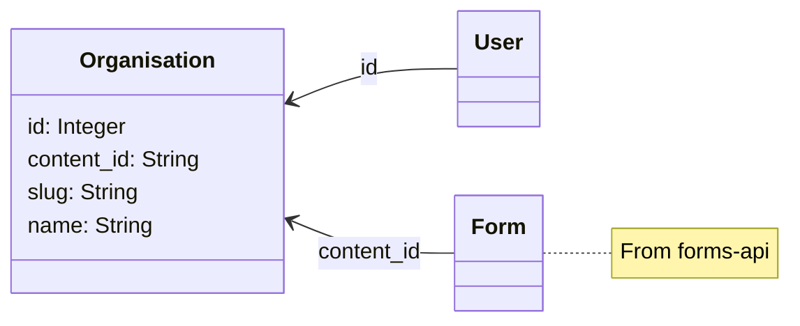

# ADR018: Use the GOV.UK organisation API

Date: 2023-05-22

## Status

Proposed

## Context

We are migrating from GOV.UK Signon to another identity provider (see [ADR015](./AD015-idp-authentication)). Currently when users sign in Signon sends us information about the organisation they belong to. Alternative identity providers we are considering will not necessarily be able to provide that organisation information, so we must manage and store it within our own service.

The list of known organisations in GOV.UK Signon comes from the [GOV.UK organisations API]. This API serves the same list of government organisations as shown on the GOV.UK website at [gov.uk/government/organisations](https://www.gov.uk/government/organisations). The API also includes historical organisations, information about the organisation including its type and relationships with other organisations, and a stable and universally unique identifier for each organisation (the "content ID"). In total the GOV.UK organisation API currently lists 1178 historical and current government organisations, including central government departments, agencies and other public bodies. It does not include local government bodies, however for the public beta of GOV.UK Forms we are targeting central government and do not expect any users from local government.

Using the GOV.UK organisation API will give us access to a ready made list of organisations for our users (including organisations for all existing users), and will mean we do not have to create any user interface for creating and managing organisations within our service. The main tradeoff is we introduce a dependency with another team within GDS.

[GOV.UK organisations API]: https://docs.publishing.service.gov.uk/repos/collections/api.html

## Decision

We will use the GOV.UK organisation API to populate the list of allowed organisations for users.

## Consequences

Using the GOV.UK organisation API will give us access to a ready made list of organisations for our users (including organisations for all existing users), and will mean we do not have to create any user interface for creating and managing organisations within our service. The main tradeoff is we introduce a dependency with another team within GDS. This affects how we manage users when organisations change for whatever reason.

### How to manage changes to organisations

We will be reliant on the rainbow content team in the GOV.UK programme to manage the list of organisations for us. This includes things like adding new organisations, changes to organisation names, and the like. When users come to us asking for their organisation name to be changed, we will have to tell them to talk to publishers in their organisation who have access to Whitehall Admin or to the GOV.UK content team. For changes to small organisations publishers can make their own changes (supported by GOV.UK 2nd line). Large organisational changes within central government are called 'machinery of government changes' and the rainbow team has an established process in place to deal with these. Although it is a complex process and can take two to three months in some cases, departments will already be aware of this and we expect that if we say that we need time for changes to be processed by GOV.UK they will be understanding of this.

In the organisations API organisations are never removed, only 'closed', with reasons for closure added to the object [[1]]. This means we should not need to be concerned about a change to the organisation list causing our users to lose access to our service.

[1]: https://www.gov.uk/guidance/how-to-publish-on-gov-uk/organisation-pages#close-an-organisation

### Changes to GOV.UK Forms database and API

To avoid relying on the GOV.UK organisation API heavily, we will store the contents of the organisation list that we need in the forms-admin database. Currently we require just the organisation title and the URL path (slug). We will store the content ID alongside the slug and name so that we are able to keep the our cached data consistent with the API data if the slug and name change. Organisation information was previously stored on each individual user, now users will have an optional reference to an organisation in a new organisations table. This will make it easier to update the database with data from the organisations API.

The below figure shows how the `Organisation` model will associate with other models in the forms-admin system. As `User`s are also records within the same database, they can refer to `Organisation`s using the primary key, for efficiency. The `Form` model represents resources in the forms-api database, across app boundaries, so uses the content ID. If for some reason a database change results in primary keys changing for the organisations table, it will not be required to update the forms-api database.

Note that previously the forms-api used the slug to identify the organisation, however the content ID is more stable. We can expect that organisation slugs may change within the organisation API without our awareness.

### Task to update forms-admin database

To keep the organisations table in the forms-admin database up-to-date, we will use a Rails [Active Job] task. We can run this on a daily or weekly schedule, although initially we may be able to run it on-demand only. This is the same approach used by the GOV.UK Signon app [[2]]. The use of the stable content ID in our database means we can be certain of being able to keep data consistent between our service and the API. We do need to be aware of rate limiting, currently the API is limited to no more than 4000 requests in a 5 minute period, but as there are only 59 pages to request currently this should not be a concern.

[Active Job]: https://guides.rubyonrails.org/active_job_basics.html

[2]: https://github.com/alphagov/signon/blob/b7a53e282c55d8ef3ab6369a7cb358b6ae100d27/lib/organisations_fetcher.rb
