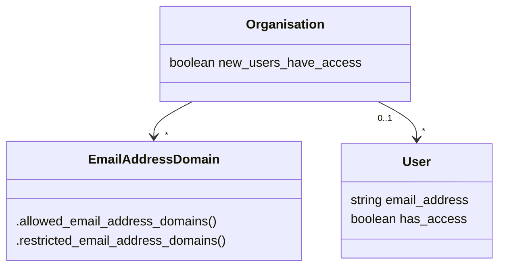
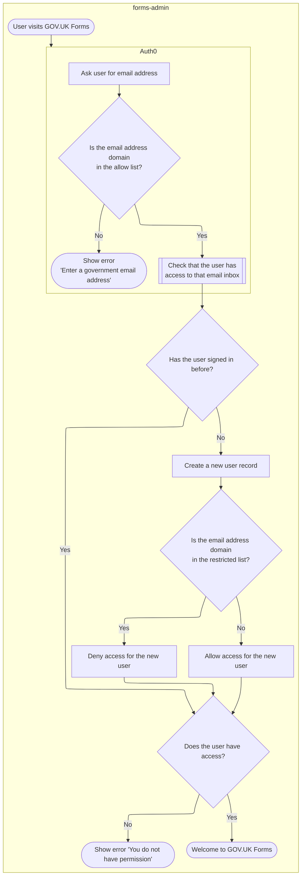

# ADR024: Store the list of approved email address domains as a configuration file in the forms-deploy repo

Date: 2024-01-29

## Status

Accepted

## Context

We want to allow anyone with a government email address to be able to use GOV.UK Forms to create forms. Most, email addresses in government have a domain that ends with `.gov.uk`, but not all. For this reason we need a list of allowed email address domains.

However, not all government organisations want to allow anyone in their organisation to use GOV.UK Forms. For this reason we need a list of email address domains that have access restrictions.

Currently in our source code there are two different lists of email address domains in two different repos, with some duplication:

- [forms-deploy/infra/deployments/production/auth0/main.tf](https://github.com/alphagov/forms-deploy/blob/879f20c24a9dc1ed5d7037239a1f22c335d84820/infra/deployments/production/auth0/main.tf)
- [forms-admin/app/models/user.rb](https://github.com/alphagov/forms-admin/blob/0028969189cf69682c54fb9422ca129012fbf3ee/app/models/user.rb) includes a list of restricted domains

Additionally [forms-admin/app/validators/allowed_email_domain_validator.rb](https://github.com/alphagov/forms-admin/blame/0028969189cf69682c54fb9422ca129012fbf3ee/app/validators/allowed_email_domain_validator.rb) defines a validator that is supposed to check whether an email address has a domain in the list of allowed domains; however it does this currently by assuming that the user's email address is in the list of allowed domains. This was done to avoid further duplication, but limits what users can do.

We would like a different approach to storing this data, one that allows us to have a single source of truth that is easy to maintain.

We may also in future want to be able to use the association between an organisation and it's email address domains to be able to provide more granular access control, and/or stricter validation, and/or protective monitoring. We currently have data about government organisations in the databases for our service, and an existing model for organisations in our code.

Ideally, we would have a email address domain model. Each domain would belong to an organisation, and each organisation would have have zero or more domains. The organisation model would have the option of whether new users in that organisation would have access to GOV.UK Forms. The lists of allowed and restricted email address domains would be derived from the access control option on associated organisations.

The obvious option for managing the email address domain data would be to store it in a database alongside the organisation data, as part of the service, and manage it like any other database records in a Rails app, with Rake tasks, a RESTful API, and/or web forms.

However, there are two downsides to this approach: One, this is configuration data that is defines how the service is run, and should be stored in a way which allows control, auditing and replication independent of the runtime data. Two, these lists need to be used in two different places, in the identity provider that authenticates users email addresses as well as the `forms-admin` app.

The identity provider we are using currently is Auth0; it is configured using Terraform code in the `forms-deploy` repository. The `forms-admin` app is built and run as a container. The container image is built from code in the `forms-admin` repository and deployed as part of a release pipeline. This pipeline is defined using code in the `forms-deploy` repo, and also itself retrieves the `forms-deploy` repo to determine how the `forms-admin` app should be deployed. Getting data from the databases into Auth0 is more difficult compared to getting data into the app during deployments. This suggests a solution where a single source-of-truth outside of the database is access by code in the `forms-deploy` repo both when Auth0 is configured by terraform and when the deployment pipeline is run.

## Decision

Whenever forms-admin is deployed, the [app pre-deploy task] will load the email domain configuration from files in the forms-deploy repo into the app database.

Add configuration file(s) (YAML or JSON) to forms-deploy repo with list of domains and associated organisations
    - Suggest folder `forms-deploy/config/data/<environment>` or similar
    - We might want to have different configurations for different environments

Add Rake task to load domain configuration into database from file or environment variable
    - See spike in forms-admin branch https://github.com/alphagov/forms-admin/compare/main...ldeb-spike-domains-read-into-database
    - We want to make sure the database matches the contents of the files exactly, so the task will need logic to delete domains that are not in the file
    - For local development we can have test/fixture files that are used instead of production configuration

Change the pre-deploy configuration to run the load domain configuration task
    - See spike in forms-deploy branch https://github.com/alphagov/forms-deploy/compare/main...ldeb-spike-domains-config-data-pre-deploy-envvars
    - Getting the configuration file into the task container is tricky, so we instead inject the file contents as an environment variable

[app pre-deploy task]: https://github.com/alphagov/forms-deploy/blob/c3c7ff4ce5fe75ca406af370eec013e03d425848/infra/modules/forms-admin/main.tf#L183

## Consequences

Positive consequences:

- Email address domains will have a first class model in app code, we can associate organisations with domains and vice versa.

- Configuration of domains will be version controlled.

Negative consequences:

- There could be a mismatch between data in the app database and the configuration file.

- Developers will need to be involved in updating the domain list.

A change to the domain list will require a re-deploy.
