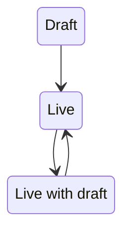

# ADR025: Use AASM to manage form state 

Date: 2024-02-05

## Status

> Accepted

## Context

### Before

Initially, there only three "states" that a form could be in, "Draft", "Live" and a combination of the two "Live with draft". These states were not hardcoded and we inferred by a combination of attribute  

1. Draft - All "Form" records are draft
2. Live - A "Form" record has a snapshot of the form and associated children records stored in `made_live_forms` table. A form can have `made_live_form` records but we only ever return the latest live form.
3. Live with draft - This is calculated by checking the forms `updated_at` timestamp is after `live_at` which means there has been some changes to the form since it went live. A form coudl return back to Live when the users makes the changes live

#### Pros
- easy at first to implement
- no state to track in the database

#### Cons
- not scalable to include new states in the future
- developers have to remember when doing data migrations/editting to try not to trigger the `updated_at` timestamp to be updated
- difficult to "rollback" a state

We received a tech support request from users after a small change to how "What happens next" column which triggered 
`updated_at` to be updated to a time after the form went live. The users asked why their forms were now being shown as 
having a draft version when nothing had changed. It was time for us to look for a better solution.

We needed something that
- manage & track the state of each form
- allowed us to use guards to ensure that forms could not be left in an invalid state (example live forms that didn't 
  have `made_live_forms` records

A [spike was completed](https://github.com/alphagov/forms-api/pull/414) to investigate how easy it would be to implement a state machine gem such as [AASM](https://github.com/aasm/aasm).

## Decision

AASM is a well known state machine which seemed to fit our needs better than us manually trying to track the state with a 
plain enum database column. It would first used to replicate our existing states and can then be used in the future to
introduce new states like `archived` forms.

The follow work was done in this order to add proper state management:

- [add state column to form model and bare bones state machine](https://github.com/alphagov/forms-api/pull/422)
- [tidy up migrations into a single migration file](https://github.com/alphagov/forms-api/pull/428)
- [Integrate FormStateMachine into Form model and start tracking state through events](https://github.com/alphagov/forms-api/pull/425)
- [Change has_draft_version & has_live_version to use form state column](https://github.com/alphagov/forms-api/pull/429)

While implementing the above, we discovered we needed to temporaryly introduce a new state to transistion from `live` to `draft`
in time to take a high profile form offline and not leave it in an invalid state of `live` with no `made_live_forms` records.
- [add archive_live_form state machine event to transition live form to draft](https://github.com/alphagov/forms-api/pull/430)

## Consequences

### Pros
- Adds guards against transitioning a record to an state if all the required sections haven't been completed,
- Better strict control of the flow of the states/events eg A->B->C instead of A->C->B
- all business related logic in once file and can be reused in controller action, rails console or rake tasks

### Cons
- team needs to be disciplined to not update the `state` column directly
- remember to keep [Form state/event diagram](https://github.com/alphagov/forms/blob/69b56f0174d368fc2cdb0a56fc9cc00ac1c9a9f6/diagrams/form-states-and-events.md) up to date
