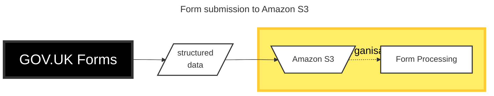

# ADR033: Offer Amazon S3 as an option to send form submissions

Date: 2024-06-04

## Status

Proposed

## Context

Users of GOV.UK Forms have asked for an alternative to email delivery of form submissions to allow integration with form processing systems.

On 4th December 2023 we held a "Defining GOV.UK Forms API integration" technical discussion with representation from several other government organisations.

## Decision

Allow organisations to choose to send form submissions to an [Amazon S3](https://aws.amazon.com/s3/) bucket they host.

## Consequences

> both positive and negative consequences of the decision
