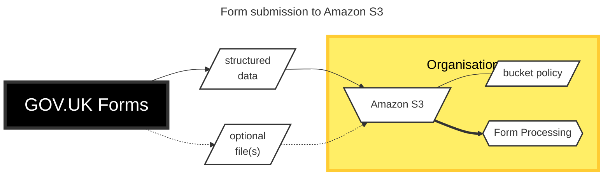

# ADR033: Offer Amazon S3 as an option to send form submissions

Date: 2024-06-04

## Status

Proposed

## Context

Users of GOV.UK Forms have asked for an alternative to email delivery of form submissions to allow integration with form processing systems.

Initially it was thought this might be acheived via POST to an http endpoint.

## Decision

Allow organisations to choose to send form submissions to an [Amazon S3](https://aws.amazon.com/s3/) bucket they host, with a policy configured to allow GOV.UK Forms to write to it. They can then integrate with their form processing systems as required.

## Consequences

* The receiving organisation must be using Amazon Web Services for this option to be suitable. An additional option may be required for organisations that can't use Amazon S3.
* When GOV.UK Forms supports file upload, these files can also be sent via Amazon S3
