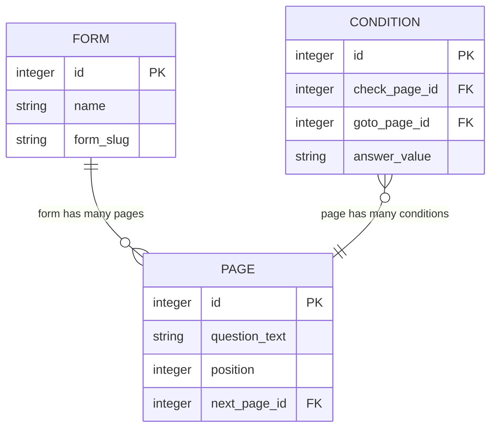
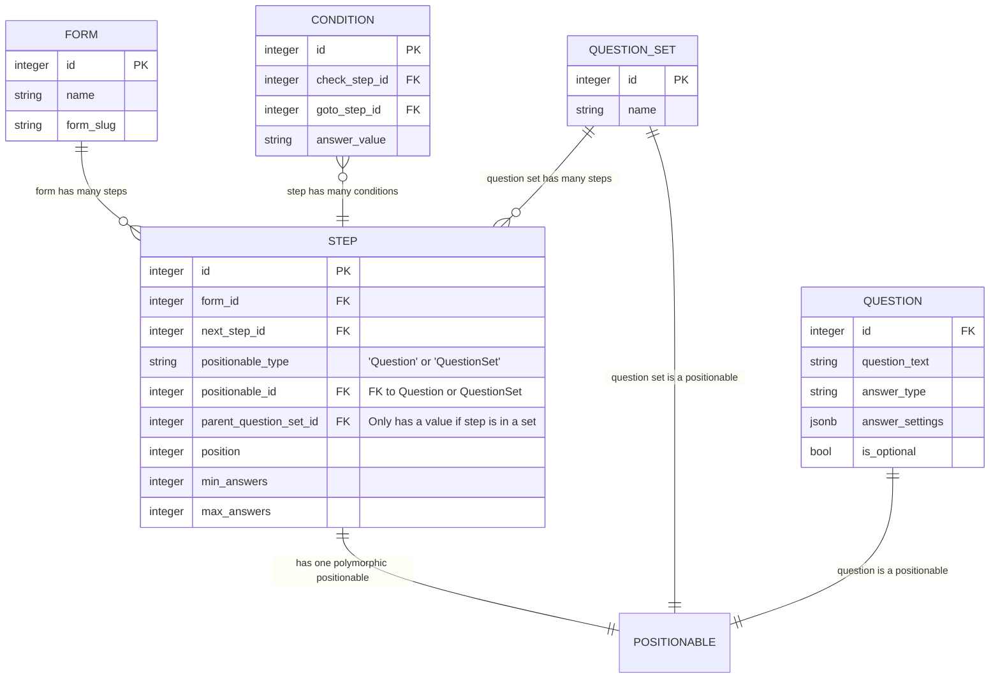

# ADR034: Add another answer data model

Date: 2024-06-19

## Status


## Context

Currently, we only support answering a form's questions once per submission. 

We want to allow forms to include 
 - single questions that can be answered multiple times
 - sets of multiple questions that can be answered multiple times

Questions will have a minimum and maximum number of answers that can be given, which the form builder will specify for each question or set of questions.

Question sets can take place at any point within a form.

We want to support routing to the start of a question set, and skipping over a question set. Routing will not lead into the middle of a question set, or from within a question set to the outside. 

The current data structure for a form in the API is roughly: 



A `PAGE` contains question data and its position within the form.

A `PAGE` can have a `CONDITION`, which is used to describe conditional routing from that page.

### Proposal

#### Proposed forms-api data model



The new `STEP` entity represents the position of a question or question set in a form. 

The new `QUESTION` entity represents the properties of a question for the `STEP` they belong to.

The new `QUESTION_SET` entity represents a set of `STEPs` that can be anwered multiple times. Each of the `STEPs` within a `QUESTION_SET` will have a `QUESTION`. 

We use a polymorphic association on the `STEP` entity (the 'positionable') to establish a one-to-one association with either a `QUESTION` or a `QUESTION_SET`.

Steps have `min_answers` and `max_answers` values, which indicate how many times the question or set of questions can be answered.

#### Proposed MadeLiveForm JSON structure

This is the JSON structure for storing a live form that runner retreives from forms-api.

In the proposed structure, the `pages` field is replaced with `steps`. Each "step" in the `steps` array has a `type` field, which indicates whether it is a Question or a QuestionSet, and a `data` field which contains either a Question or QuestionSet object.

A QuestionSet object contains a `steps` field which contains an array of Step objects for that QuestionSet. These Step objects will always have a `type: "Question"`.

```json
{
  "id": 123,
  "name": "All question types form",
  "form_slug": "all-question-types-form",
  "start_page": 1,
  ...
  "steps": [
    {
      "id": 5,
      "next_step_id": 6,
      "position": 1,
      "min_answers": null, // would this have a value if the question can only be answered once?
      "max_answers": null,
      "type": "Question", // this tells us the "data" field contains a question object
      "data": { // this contains the Question attributes
        "question_text": "What is your name?",
        "is_optional": false
        ...
      },
      "routing_conditions": []
    },
    {
      "id": 6,
      "next_step_id": 7,
      "position": 2,
      "min_answers": 1,
      "max_answers": 5,
      "type": "QuestionSet", // this tells us the "data" field contains a question set object
      "data": { // this contains the QuestionSet attributes
        "name": "What addresses have you lived at in the past 3 years?",
        "steps": [
          {
            "id": 10,
            "next_step_id": 11,
            "position": 1,
            "min_answers": null,
            "max_answers": null,
            "type": "Question",
            "data": {
              "question_text": "What was your address?"
              ...
            }
          },
          {
            "id": 11,
            "next_step_id": 12,
            "position": 2,
            "min_answers": null,
            "max_answers": null,
            "type": "Question",
            "data": {
              "question_text": "What date did you start living at this address?"
              ...
            }
          },
          {
            "id": 12,
            "next_step_id": null,
            "position": 3,
            "min_answers": null,
            "max_answers": null,
            "type": "Question",
            "data": {
              "question_text": "What date did you stop living at this address?"
              ...
            }
          }
        ]
      }
    },
    {
      "id": 7,
      "next_step_id": null,
      "position": 3,
      "min_answers": 1,
      "max_answers": 10,
      "type": "Question",
      "data": {
        "question_text": "What countries have you travelled to in the past year?",
        "is_optional": false
        ...
      }
    }
  ]
}

```

#### Runner session data structure

When a user is filling out a form, we store their completed answers in a session stored in a Redis database. The session currently has the following data structure:

```json
{
  "session_id": "37e7691c31a61c0169469ebcf2441f34",
  "answers": {
    // at the root level of the answers, the keys are the form IDs
    "123": {
      // at the next level, the keys are the page IDs
      "5": {
        // each page contains key value pairs for the question's form fields
        "date_day": "1",
        "date_month": "1",
        "date_year": "1900",
        "date": "1900-01-01"
      },
      "6": {
        "full_name": "John Doe"
      }
    }
  }
}

```

For the new data model with question sets we think the data structure of the session would be something like:

```json
{
  "session_id": "37e7691c31a61c0169469ebcf2441f34",
  "answers": {
    // at the root level of the answers, the keys are the form IDs
    "123": {
      // at the next level, the keys are the step IDs for the question or question set
      "5": {
        "full_name": "John Doe"
      },
      "6": {
        // question sets have a nested object with keys corresponding to the step IDs for its questions
        "10": [
          // value for each question is an array with an entry per answer provided
          {
            "address1": "The Whitechapel Building",
            "postcode": "E1 8QS"
          },
          {
            "address1": "Aviation House",
            "address2": "WC2B 6NH"
          }
        ],
        "11": [
          {
            "date": "2018-01-01"
          },
          {
            "date": "2015-01-01"
          }
        ],
        "12": [
          {
            "date": ""
          },
          {
            "date": "2018-01-01"
          }
        ]
      },
      "7": [
        // for single questions that can have multiple answers, the value is an array with an entry per answer given
        {
          "text": "Spain"
        },
        {
          "text": "Italy"
        }
      ]
    }
  }
}

```

## Decision

> what the team has decided to do

## Consequences

> both positive and negative consequences of the decision
