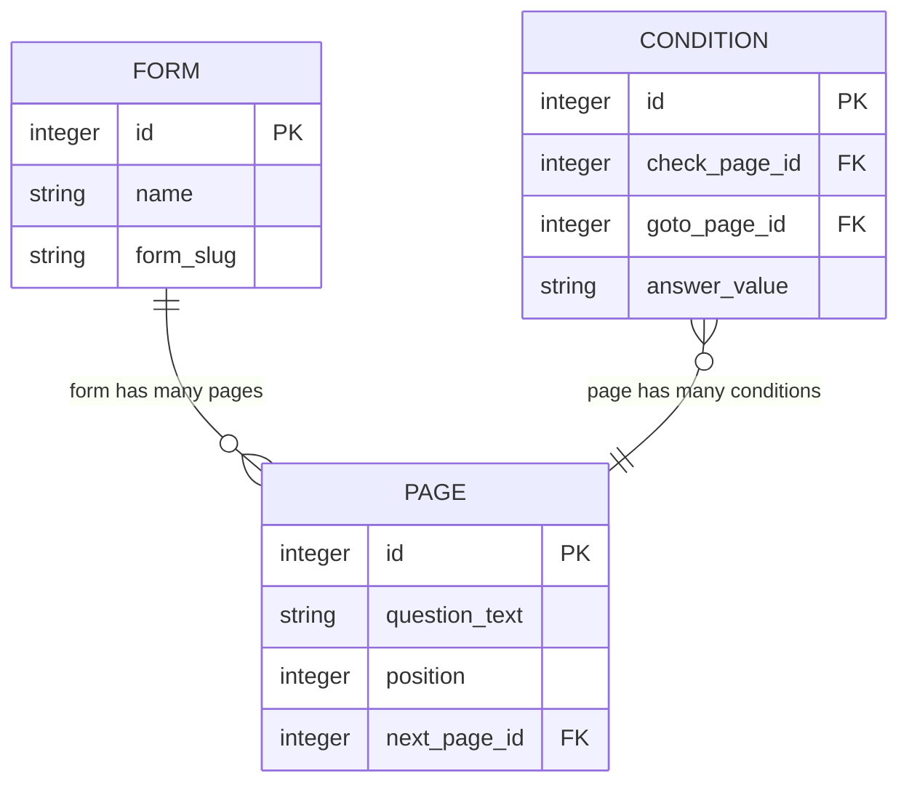
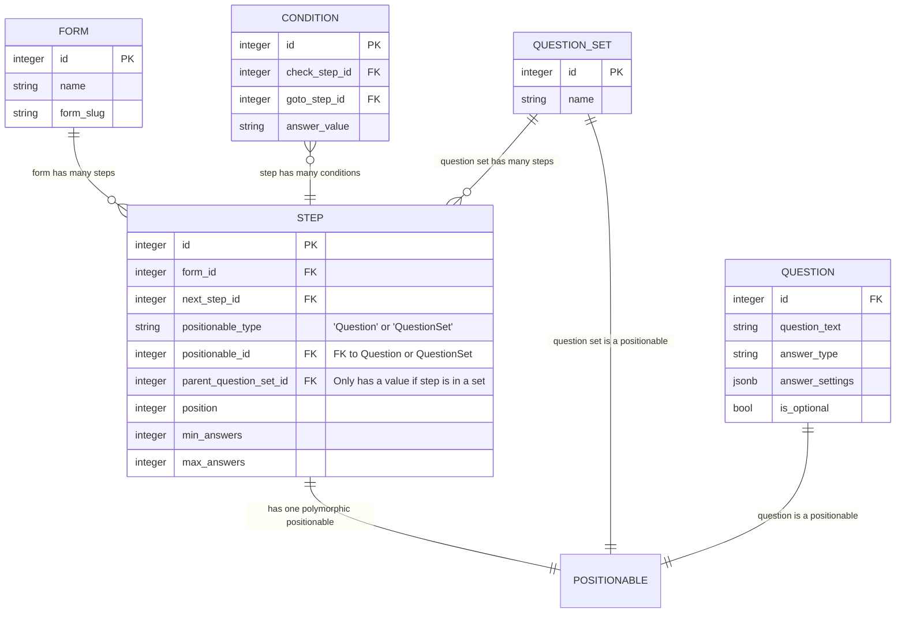
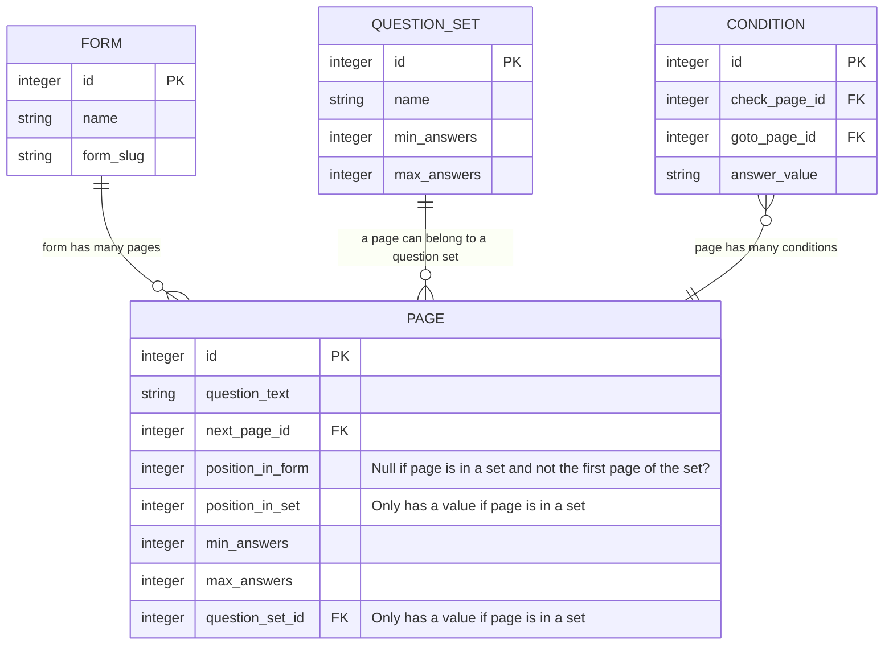

# ADR034: Add another answer data model

Date: 2024-06-19

## Status

## Context

Currently, we only support answering a form's questions once per submission. 

We want to allow forms to include 
 - single questions that can be answered multiple times
 - sets of multiple questions that can be answered multiple times

Questions will have a minimum and maximum number of answers that can be given, which the form builder will specify for each question or set of questions.

Question sets can take place at any point within a form.

We want to support routing to the start of a question set, and skipping over a question set. Routing will not lead into the middle of a question set, or from within a question set to the outside. We will likely want to also support routing between questions within a question set.

The current data structure for a form in the API is roughly: 



A `PAGE` contains question data and its position within the form.

A `PAGE` can have one or more `CONDITIONs`, which are used to describe conditional routing from that page.

## Options

### Option 1: Separate out "steps" from "questions" and "question sets"

This option separates pages into "Steps" and "Questions", with a new "QuestionSet" type representing a set of questions. A "Step" will either point to a "Question" or "QuestionSet" using the polymorphic associations feature of Rails.

#### Forms-api database schema



The new `STEP` entity represents the position of a question or question set in a form. 

The new `QUESTION` entity represents the properties of a question for the `STEP` they belong to.

The new `QUESTION_SET` entity represents a set of `STEPs` that can be anwered multiple times. Each of the `STEPs` within a `QUESTION_SET` will have a `QUESTION`. 

We use a polymorphic association on the `STEP` entity (the 'positionable') to establish a one-to-one association with either a `QUESTION` or a `QUESTION_SET`.

Steps have `min_answers` and `max_answers` values, which indicate how many times the question or set of questions can be answered.

#### JSON representation of a form used by Runner

This is the JSON structure for storing a live form that runner retreives from forms-api.

In the proposed structure, the `pages` field is replaced with `steps`. Each "step" in the `steps` array has a `type` field, which indicates whether it is a Question or a QuestionSet, and a `data` field which contains either a Question or QuestionSet object.

A QuestionSet object contains a `steps` field which contains an array of Step objects for that QuestionSet. These Step objects will always have a `type: "Question"`.

```json
{
  "id": 123,
  "name": "All question types form",
  "form_slug": "all-question-types-form",
  "start_page": 5,
  ...
  "steps": [
    {
      "id": 5,
      "next_step_id": 6,
      "position": 1,
      "min_answers": null, // would this have a value if the question can only be answered once?
      "max_answers": null,
      "type": "Question", // this tells us the "data" field contains a question object
      "data": { // this contains the Question attributes
        "question_text": "What is your name?",
        "is_optional": false
        ...
      },
      "routing_conditions": []
    },
    {
      "id": 6,
      "next_step_id": 7,
      "position": 2,
      "min_answers": 1,
      "max_answers": 5,
      "type": "QuestionSet", // this tells us the "data" field contains a question set object
      "data": { // this contains the QuestionSet attributes
        "name": "What addresses have you lived at in the past 3 years?",
        "steps": [
          {
            "id": 10,
            "next_step_id": 11,
            "position": 1,
            "min_answers": null,
            "max_answers": null,
            "type": "Question",
            "data": {
              "question_text": "What was your address?"
              ...
            }
          },
          {
            "id": 11,
            "next_step_id": 12,
            "position": 2,
            "min_answers": null,
            "max_answers": null,
            "type": "Question",
            "data": {
              "question_text": "What date did you start living at this address?"
              ...
            }
          },
          {
            "id": 12,
            "next_step_id": null,
            "position": 3,
            "min_answers": null,
            "max_answers": null,
            "type": "Question",
            "data": {
              "question_text": "What date did you stop living at this address?"
              ...
            }
          }
        ]
      }
    },
    {
      "id": 7,
      "next_step_id": null,
      "position": 3,
      "min_answers": 1,
      "max_answers": 10,
      "type": "Question",
      "data": {
        "question_text": "What countries have you travelled to in the past year?",
        "is_optional": false
        ...
      }
    }
  ]
}

```

#### Runner session data structure

When a user is filling out a form, we store their completed answers in a session stored in a Redis database. The session currently has the following data structure:

```json
{
  "session_id": "37e7691c31a61c0169469ebcf2441f34",
  "answers": {
    // at the root level of the answers, the keys are the form IDs
    "123": {
      // at the next level, the keys are the page IDs
      "5": {
        // each page contains key value pairs for the question's form fields
        "date_day": "1",
        "date_month": "1",
        "date_year": "1900",
        "date": "1900-01-01"
      },
      "6": {
        "full_name": "John Doe"
      }
    }
  }
}

```

For the new data model with question sets we think the data structure of the session would be something like:

```json
{
  "session_id": "37e7691c31a61c0169469ebcf2441f34",
  "answers": {
    // at the root level of the answers, the keys are the form IDs
    "123": {
      // at the next level, the keys are the step IDs for the question or question set
      "5": {
        "full_name": "John Doe"
      },
      "6": {
        // question sets have a nested object with keys corresponding to the step IDs for its questions
        "10": [
          // value for each question is an array with an entry per answer provided
          {
            "address1": "The Whitechapel Building",
            "postcode": "E1 8QS"
          },
          {
            "address1": "Aviation House",
            "address2": "WC2B 6NH"
          }
        ],
        "11": [
          {
            "date": "2018-01-01"
          },
          {
            "date": "2015-01-01"
          }
        ],
        "12": [
          {
            "date": ""
          },
          {
            "date": "2018-01-01"
          }
        ]
      },
      "7": [
        // for single questions that can have multiple answers, the value is an array with an entry per answer given
        {
          "text": "Spain"
        },
        {
          "text": "Italy"
        }
      ]
    }
  }
}
```

#### Pros

- The nested "steps" matches quite well with how we might present the questions/sets in the question list in Forms-admin.
- Introducing the idea of a "Step" that can be of different types might allow for us to add steps to a form that aren't questions, for example adding a payment page and allowing its position in the form to be customised.

#### Cons

- The idea of polymorphism has quite a large cognitive overhead. The data model could be difficult for developers to understand.
- This data structure would require quite a big migration that has lots of moving parts. It could take a long time to implement and might be risky.
- The API between forms-api and form-admin will need to change significantly.
- There is some complexity to serializing and deserializing the JSON representation of a form when dealing with polymorphism.

### Option 2: Keep pages holding their position in a form, whilst also being able to assign them to sets.

This option keeps the "Pages" model largely the same, with the position remaining a property of a page. A page can have a "question set" associated with it, which holds information about the set it is in, such as the name and minimum and maximum answers.

#### Forms-api database schema



In this model, we add a `question_set_id` foreign key to a `PAGE`. This is used to identify when a question is part of a question set.

The `next_page_id` will point to the next question in the form regardless of whether it is in a `QUESTION_SET` or not. For the last page in a set, the `next_page_id` will point to the next page after the set. This indicates that once a user has finished providing as many repeat answers to the question set as they need to, they will be directed to this page next. Runner will inevitably need more logic in addition to the existing routing logic to determine which page a user is shown next when sets are introduced.

When the position of a `QUESTION_SET` within a form is changed, we'd have to update both the `next_page_id` of the proceeding page, and also the `next_page_id` of the final page in the set.

The`postion` attribute of a `PAGE` has been replaced by `position_in_form` and `position_in_set` attributes. The `position_in_form` will be set if the question is not in a question set, or is the first page of a question set. The `position_in_set` attribute will identifty the position of a question within a set.

#### JSON representation of a form used by Runner

In the JSON structure, the `pages` array holds all pages in a form. All entries are at the same level, regardless of whether they belong to a set.

We identify pages in a set by the `question_set_id`. There is a separate `question_sets` attribute on the form object which is an array of all the question sets in a form.

An entry in the `question_sets` array has a `first_page`, similar to the `start_page` on a form, to easily identify the first page in the set. We could also store the `last_page` if this makes the navigation logic in Runner easier.

```json
{
  "id": 123,
  "name": "All question types form",
  "start_page": 5,
  "pages": [
    {
      "id": 5,
      "next_page_id": 6,
      "position_in_form": 1,
      "min_answers": null,
      "max_answers": null,
      "question_text": "What is your name?"
    },
    { // this is the first page in a set
      "id": 6,
      "next_page_id": 7,
      "position_in_form": 2,
      "position_in_set": 1,
      "min_answers": null,
      "max_answers": null,
      "question_text": "What was your address?",
      "question_set_id": 1
    },
    {
      "id": 7,
      "next_page_id": 8,
      "position_in_form": null, // this is null because it is not the first page in the set
      "position_in_set": 2,
      "min_answers": null,
      "max_answers": null,
      "question_text": "What date did you start living at this address?",
      "question_set_id": 1
    },
    { // this is the last page in a set
      "id": 8,
      "next_page_id": 9,
      "position_in_form": null,
      "position_in_set": 3,
      "min_answers": null,
      "max_answers": null,
      "question_text": "What date did you stop living at this address?",
      "question_set_id": 1
    },
    {
      "id": 9,
      "next_page_id": null,
      "position_in_form": 3,
      "min_answers": 1,
      "max_answers": 10,
      "question_text": "What countries have you travelled to in the past year?"
    }
  ],
  "question_sets": [
    {
      "id": 1,
      "name": "What addresses have you lived at in the past 3 years?",
      "min_answers": 1,
      "max_answers": 5,
      "first_page": 6
    }
  ]
}
```

#### Runner session data structure

The runner session data structure should not have to change much, except the value associated with a page will be an array when the page is either a single question that can be answered multiple times, or belongs to a question set.

If we wanted to allow for questions within a set to be themselves answered multiple times per set of answers, we might have difficulties with this data structure.

```json
{
  "session_id": "37e7691c31a61c0169469ebcf2441f34",
  "answers": {
    // at the root level of the answers, the keys are the form IDs
    "123": {
      // at the next level, the keys are the page IDs
      "5": {
        "full_name": "John Doe"
      },
      "6": [
        // value for each question in a set is an array with an entry per answer provided
        {
          "address1": "The Whitechapel Building",
          "postcode": "E1 8QS"
        },
        {
          "address1": "Aviation House",
          "address2": "WC2B 6NH"
        }
      ],
      "7": [
        {
          "date": "2018-01-01"
        },
        {
          "date": "2015-01-01"
        }
      ],
      "8": [
        {
          "date": ""
        },
        {
          "date": "2018-01-01"
        }
      ],
      "9": [
        // for single questions that can have multiple answers, the value is an array with an entry per answer given
        {
          "text": "Spain"
        },
        {
          "text": "Italy"
        }
      ]
    }
  }
}

```

#### Pros

- The migration for this change is small compared to option 1. 
  - The database schema in forms-api doesn't change dramatically
  - The JSON representation of a form used by Runner does not change dramatically
- The API between forms-api and forms-admin will need to be added to, but we should be able to modify the existing API endpoints for adding pages rather than needing a completely new set of endpoints

#### Cons

- The logic that forms-runner needs to perform in order to determine which page to direct the user to next might be slightly less clear than Option 1. The next_page for the last page in a question set will not be the next page the user sees if they choose to add another answer.
- The data model doesn't map quite as well to what the user sees in forms-admin when creating a form compared with Option 1.

## Decision

> what the team has decided to do

## Consequences

> both positive and negative consequences of the decision
