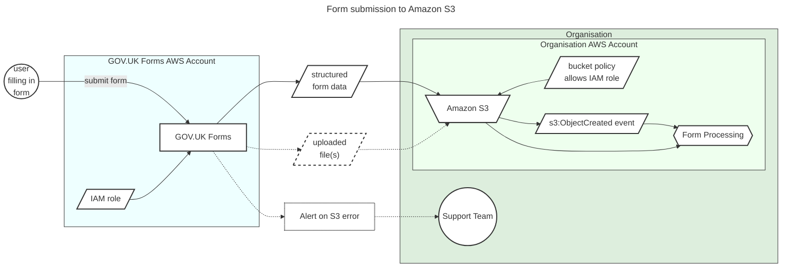

# ADR035: Offer Amazon S3 as an option to send form submissions

Date: 2024-10-08

## Status

Accepted

## Context

Sending form submissions via email is useful for teams who already receive forms in an email inbox. Some users of GOV.UK Forms have asked for an alternative to email delivery of form submissions to allow automated integration with form processing systems.

Initially it was thought this might be acheived via a [webhook mechanism similar to GOV.UK Pay](https://docs.payments.service.gov.uk/webhooks/), which requires setting up a custom endpoint that is both available and secure, with the associated ongoing support and maintenance. Advice from NCSC encouraged us to explore the use of managed services as alternatives to a self-hosted webhook.

## Decision

Allow organisations to choose to send form submissions to an [Amazon S3](https://aws.amazon.com/s3/) bucket they host, with a policy configured to allow GOV.UK Forms IAM role to write to it. They can then integrate with their form processing systems as required.

Writing to S3 is synchronous, so a user filling in a form will only get a success confirmation if the form is written to S3. If there is an error, the user will be notified, and the organisation's support team will be notified.

## Consequences

* The format of the `structured form data` that represents the submitted form can be defined in a separate ADR.
* The receiving organisation must be using Amazon Web Services for this option to be suitable. An additional option may be required for organisations that can't use AWS and/or Amazon S3.
* The receiving organisation is responsible for how they process the received file(s). There may be opportunities to share implementation patterns as they are developed.
* When GOV.UK Forms supports file upload, these files can also be sent via Amazon S3.
