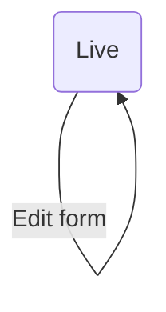
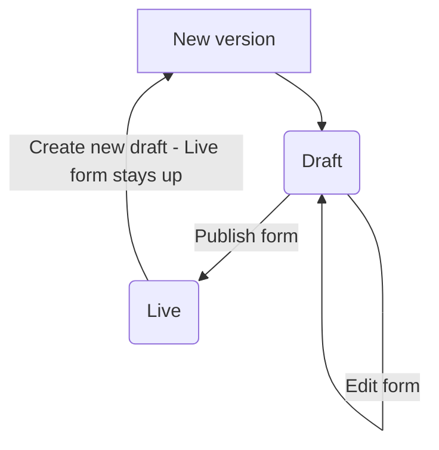

# DR007: We'll get ready to support a live form first, then build draft when we have time

Date: 2022-08-01

## Status

Proposed

## Context

We need to know what is needed for the first form, so we know what work we need to prioritise. At the moment, in the development version of GOV.UK Forms, there is only one concept of a live form. There is no separate "draft" or preview version. There is no versioning. The way we would build the platform to support the first form would likely differ, depending on how we want to support the form creators at the Insolvency Service to make changes to their first live form. What happens to an end user and their data if they're in the middle of completing the form when the form creator makes a change?

[More context for team members](https://docs.google.com/document/d/1xPmYDPYmZXCBkvWIV6QoDuGLaS-iSEq1jk6aehIfz6k/edit#)

## Decision

We'll finish getting everything ready to support a live form first (Option 1), then build a way to create and edit a draft when we have time (Option 4).

### Option 1: All forms created with GOV.UK Forms are “live”. Forms are edited directly

### Option 4: A single “draft” version of a form can be worked on while a separate “live” version exists

## Consequences

While GOV.UK Forms will soon have a way to draft forms, if we don't have this in time for our partner to make their first form live, we're comfortable that the associated risks are low enough, particularly around disrupting end users if a change is made to a live form. If a change is made to a live form while an end user is filling in the form, they will probably get an error page, and have to start again. If multiple changes are made in a row, this could be frustrating for the end user.

We have discarded these options:

- Option 2: Each form starts as “draft”, then can be made “live” but can’t be set to “draft” again. “Live” forms are edited directly
- Option 3: Each form starts as “draft”, then can be made “live”. “Live” forms can’t be edited but can move back into “draft”, making form unavailable until it is “live” again

as for the extra effort, they don't offer much benefit to our users, as changes to live forms are still disruptive, as with Option 1.
