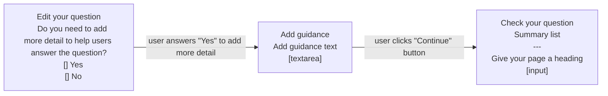

# Confirmation email for form fillers v1

## Status

Date created: *2023-11-07*  

Developed  

___

## Contents

- [Status](#status)
- [Contents](#contents)
- [What](#what)
- [Key decisions](#key-decisions)
- [Design](#design)
- [Notes](#notes)
- [Research focus](#research-focus)

___

 

## What

### As-is

- 

### To-be

- 

## Key decisions

It was agreed that we'll build a minimum version

 

## Design

What are we doing... 

### Page

*caption*

 

#### Flow of prototype tested

 

## Notes

- 

___

 

## Research focus

### Things we plan to focus on in testing:
-  

[Research plan/discussion guide](https://docs.google.com/document/d/14Omvdh5-ck9A8NoPzB7TbF5mTpzVRoHU0oCODcJzAPg/edit#heading=h.d7qnjjmaxy08)  

### Update: what we found through testing  

[Playback: User Research - Detailed Guidance (Google slides)](https://docs.google.com/presentation/d/1cZKLrPDaXZlqHtg_y8rYE2eKA1B26Hc8YiUBJKGc-jg/edit#slide=id.g2793e27bf4a_0_65)  
[UR Playback: Detailed Guidance (Video)](https://drive.google.com/drive/folders/1L52JCUb8hLea32lS5im6mM7Y4AKhZGWV)  

 

___

 

[Back to the top](#confirmation-email-for-form-fillers-v1)
