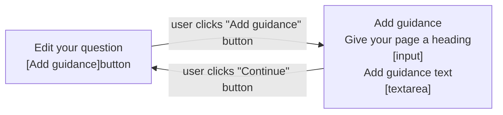
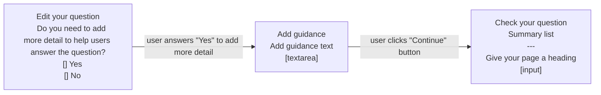

# Add guidance v1

## Status

Date created: *2023-10-03*  

Developed  

___

## Contents

- [Status](#status)
- [Contents](#contents)
- [What](#what)
- [Key decisions](#key-decisions)
- [Design for build](#design-for-build)
- [Design to test in the prototype](#design-to-test-in-the-prototype)
- [Notes](#notes)
- [Research focus](#research-focus)

___

 

## What

### As-is

- Form creators need to consider whether adding additional content to the hint text would make it too long and - if so - whether it would be better to have a longer question or add additional content to the start page

### To-be

- Form creators can add additional content and context to individual question pages to help form fillers understand what's needed from them. They can use basic formatting like headings, lists and links.

## Key decisions

It was agreed that we'll build a minimum version that covers the basic functionality needed for this feature, while making it available as soon as possible so that more forms can be onboarded. 

In parallel, we'll design and test another version in the prototype. This version is a larger change to the overall flow of adding and editing a question, so we believe we need to validate it before commiting to development.

### What we will support
- Headings - second (H2) and third (H3) level only
- Paragraphs - allowing blocks of content that are clearly distinct from each other
- Lists - both bulleted and numbered lists
- Links:
  - support for simple URLs to guidance pages
  - these will not be validated as real URLs
  - clicked links will always open in a new window or tab
- Maximum of 5,000 characters - this does not include the Markdown tags
- Previewing Markdown as it will be displayed to the form filler: 
  - preview will be in page and will not include the question or input
  - preview will be enhanced using Javascript so users can quickly switch in page without a reload
- Basic WYSIWYG functionality for the Markdown textarea:
  - this will cover only the formatting we'll support, such as H2, H3, link, bulleted list and numbered list
  - this is a Javascript enhancement only
- Formatting help - guidance to help form creators write Markdown for supported formats, especially helpful where Javascript is disabled

### What we will not support
- Headings:
  - level 1 (H1) as this is covered by a separate input to ensure valid and accessible page markup
  - levels 4 to 6 (H4, H5, H6) as we believe this is unnecessary at this time, and adds more potential for missuse
- Bold - we believe that adding this now could cause missuse and potentially add more difficulty for form fillers, but we'll keep an eye on it for future iterations
- Underline - we believe that this is not going to be needed for any of the forms on our platform, but we'll keep an eye on it for future iterations
- Tables - this is complex Markdown and we do not currently have a need to include it
- Blockquotes - this is something we don’t believe there will be a need for
- Inset text - this would be a custom piece of Markdown and there's currently no need to include it
- Notifications - this would be a custom piece of Markdown and there's currently no need to include it
- Warning text - this would be a custom piece of Markdown and there's currently no need to include it
- Code snippets - this is unlikely to be something we'll need to consider
- HR - this is unlikely to be something we'll need to consider

### Markdown errors
- We'll have an empty input error
- We'll have a character count error, triggering where character count is over 5,000 not including Markdown
- We believe we can offer some initial errors to cover unsupported formats
- We want to include validations on:
  - links:
    - has a URL been provided?
    - is it a valid URL?
    - is it an email address - is it valid?

 

## Design for build

### Edit question page

*This shows the “Edit question” page with the new “Guidance” section, and the following explanatory text: “Only add guidance if you need to give a longer explanation of how to answer the question, or to format your content. For example, you can use paragraphs, links or lists.” This is followed by a grey, secondary “Add guidance” button.*  

The form creator can now add guidance if they need to give the form filler a longer explanation of how to answer the question. It also highlights that form creators can use this feature if they need to add formatting or links to their 'help' text.  

Once clicked, the form creator is then taken to the “Add guidance” page, which is a sub journey of the overall add/edit-a-question flow. This means they're taken out of the larger linear flow and will be returned after they've added whatever guidance content is needed.  

### Add guidance page - no Javascript

We explain when to use the guidance feature:
> Use guidance if you need to:
> - explain how to answer the question in more detail
> - provide more context
> - format your content - for example, with links, sub-headings or lists  

We then ask the user to “Give your page a heading”  
> Use a heading that’s a statement rather than a question - for example, ‘Interview needs’. This will be your main page heading.  

This is to make sure we have a clear H1 for the page.  

Next, they can add guidance text in a textarea using Markdown:  
> Use Markdown if you need to format your guidance content. Formatting help can be found below.  

They can then choose to “Update preview” to preview how the content will look to the form filler (on the frontend).
The button will reload the page and take the browser focus to the “Preview your guidance text” `
` to reduce confusion and scroll fatigue.  

Due to Javascript being disabled, the “Formatting help” details component will be expanded on page load. This does add more scolling and noise to the screen but it should at least be obvious and helpful to users - as they won’t have the WYSIWYG buttons. We're starting with content based on what Notify use, as they've done a lot of testing with a similar user type to us and have found that their implementation is working as expected. We'll monitor this through research.  

When a user has added their guidance and previewed it they may need to return to their guidance text to make quick changes or minor fixes. To avoid scrolling and reduce confusion we've added a link under the preview area to “Edit guidance text” - this moves focus back to the "Add guidance text" textarea further up the page.  

### Add guidance page - Javascript enhancement

#### Add guidance text

Using the tab component from the design system we're reducing the scroll on this screen when Javascript is enabled. And we're able to help form creators quickly preview without the page reloading. We're also able to offer a limited WYSIWYG for adding or editing Markdown.  

#### Preview guidance text

#### Notes on Javascript-enhanced guidance text

We will need to test and validate whether:  
1. the use of the tab component works for our users and is accessible  
2. giving the supported formats as a WYSIWYG above the text area is helpful to our users, and verify that the implementation is accessible  
3. we can do error validation between the “Write” and “Preview” tabs using Javascript - making sure this is handled in an accessible way  

### Your questions - live form questions summary

*This screen shows the list of questions for a form that is ‘live’ on GOV.UK Forms. It shows summary cards for each question in the form. The second question now has a row for “Page heading” and another for “Guidance text” as the form creator has added this. These rows appear as the first two rows in the card, above “Hint text” and “Answer type”.*  

### Add guidance error messages

Three errors as they could appear on the “Add guidance” page are:  
1. ‘Enter a page heading’ - where the form creator has not added a page heading  
2. ‘Enter guidance text’ - where the form creator has not added any guidance text  
3. ‘Guidance text can only contain formatting for links, subheadings (##), bulleted lists (*), or numbered lists (1.)’ - where the form creator has added invalid Markdown, such as a single hashtag (#) for a heading level 1 (H1)  

### Returning to the "Edit question" page

Once a form creator has added the guidance information they're then returned to the “Edit question” page. Here, the guidance section has now turned into a summary-list view where they can see the page heading and guidance text they've added - along with the Markdown. They have the option to “Change” either of these from here.  

#### "Edit question" return example for “Selection from a list” answer type

When a form creator returns to the “Edit question” page after adding their guidance information, if the answer type is “Selection from a list” they are not shown the “Question settings” section where they can make this question optional.  

#### "Edit question" return example for most other answer types

When a user returns to the “Edit question” page after adding their guidance information, if the answer type is not a “Selection from a list” then they are still shown the “Question settings” section where they can make this question optional.  

 

#### Flow for intitial build

 

## Design to test in the prototype

In order to explore an alternative option we agreed to test a more complex journey change in the prototype. This version removes the answer-type summary list from the “Edit question” screen, so it no longer shows previous options selected to set up the question. Instead, it uses routing to build a complex question with additional guiidance.  

In the prototype we also wanted to test the introduction of a “Check your question” page (that is, a ‘summary’ page) at the end of the create-a-question journey. We wanted to know if adding another screen would be useful to form creators or if it would make the journey more laborious.  

### “Edit question” page - without summary information

*The “Answer settings” section has been replaced with “Do you need to add guidance to help people answer the question?”*

The new question uses similar help text to the build version: “Only add guidance if you need to give a longer explanation of how to answer the question, or to format your content. For example, you can use paragraphs, links or lists.”  

It can be answered ‘Yes’ or ‘No’. If answered ‘Yes’, the user is taken to an “Add guidance” page where they can add any additional guidance.  

### “Add guidance” page - no Javascript enhancement

We include the same guidance to explain when to use the guidance feature as the initial build version:  
> Use guidance if you need to:  
> - explain how to answer the question in more detail  
> - provide more context  
> - format your content - for example, with links, sub-headings or lists  

We do not ask for the ‘page heading’ at this point. We believe that this will help form creators focus on the single task of adding their ‘help’ text. We ask for the ‘page heading’ at the end of the journey when they'll have the context of the question page as a whole.  

The form creator is now asked to “Add guidance text” with hint text that says: “Use Markdown if you need to format your guidance content. Formatting help can be found below.” This is above a textarea with a character count below showing “You have 4000 characters remaining”. There is a grey “Preview guidance” button that updates the page and generates a preview of what the content will look like to form fillers. The focus is moved to the ‘preview area’ to reduce scrolling. However, if the user is not re-focussed correctly they're presented with a green ‘success’ notifcation banner at the top of the page which links them to the ‘preview area’ when clicked.  

The next section is “Formatting help”, which lists the supported Markdown the form creator can use when creating their guidance. We’re starting with content based on what Notify use, as they’ve done a lot of testing with a similar user type to us and have found that their implementation is working as expected. We'll monitor this through research. The form creator can either ‘continue’ using a green call-to-action button, or ‘cancel’ the addition of guidance which returns them to the “Edit question” page.  

#### “Add guidance” page with “Preview your guidance text” showing

The form creator is only presented with this view if they click “Preview guidance”. By clicking the green “Continue” button they will be moved on in the flow without first being presented with the ‘preview area’.  

*This is a version of the page where the user has added their ‘guidance text’ and clicked the “Preview guidance” button.*  

The new “Preview your guidance text” section gives a simple explanation of what the form creator is seeing in the ‘preview area’ box: “Below is a preview of how your guidance content will be shown to the person completing the question.”  

The ‘preview area’ shows the Markdown has been converted to a presentation of the HTML as interpreted by the browser. This means they're able to get an idea of how this will appear for form fillers going through the form. Below the ‘preview area’ is a link - “Edit guidance text” - that the form creator can use to quickly take them back up the page to make edits or fixes to the Markdown they've written.  

If the user clicked the “Continue” call-to-action button they'd move on to the “Check your question” summary page, which would allow them to review everything about this question.  

### “Check your question” page

#### No guidance text added  

This page plays back the selections that form creators have made to build their question.  
It starts with a section called “Your question”. This section has a summary list with a row for each piece of information given: 
“Question”, “Hint text (optional)”, and “Add guidance” - which is set to “No” in this instance.  

The next section is called “Answer settings”. This shows the “Answer type” - currently set as “Selection from a list of options” - so it includes a row for “Options”, “People can only select one option” and “Include an option for ‘None of the above’”. Where a different “Answer type” is selected the user will have the additional information associated with that answer type here.  

#### Guidance text has been added  

This page is now showing that the form creator has selected “Yes” for “Add guidance”. A new row has been added to the “Your question” section, called “Guidance text”. This row plays back the Markdown as it was written (with the Markdown code showing). Where the content is considered to be very long - length to be confirmed - we'll hide the overflow and will add a “Show” link to expand the rest of the Markdown when clicked.  

This question's “Answer type” is “Person’s name” so the second section - “Question settings” - can be seen. This section only contains a single row for “Make this questional optional” - currently set as “No” by the form creator.  

The next section - “Answer settings” - plays back the additional answer information associated with a “Person’s name” “answer type”.   

Because the form creator has chosen to ‘add guidance’ for this question, we present them with a new input - “Give your page a heading”. This has some simple hint text: “Use a heading that’s a statement rather than a question - for example, ‘Interview needs’. This will be your main page heading.” 

The hint text is intended to help from creators create a useful heading for the page - making sure that the form is marked up correctly for accessibility, while remaining relevant to the information the form filler will see on screen. It also explains where this text will appear - giving the form creator more context about why we're asking for it.  

 

#### Flow of prototype tested

 

## Notes

- As part of the first iteration we're attempting to create a new custom graphical interface that helps users add/edit Markdown by the use of buttons. Note that:  
  - this functionality will need usability and accessibility testing
  - we won’t be testing this component as part of this iteration and should focus on it in a future round of research before we consider re-using it on other screens within the product

- The implementation we're taking into development is at risk as we are currently unsure if the ‘formatting help’ and other parts of the guidance are going to help our users. We believe this is a low risk and that by putting this in the product we'll get better-quality feedback and a better understanding of how our users are using the feature.

___

 

## Research focus

### Things we plan to focus on in testing:
- Testing the new journey for adding questions
- Testing user experience for adding detailed guidance:
  - Do they understand what the feature is?
  - Are they able to distinguish detailed guidance from hint text?
  - Are they likely to use the correct feature for their need?
  - Do users understanding why they're being asked for a ‘page heading’?
- Testing user experience of formatting with Markdown:
  - Can users write/create working Markdown based on a document version of a form?
  - Do users find the ‘formatting help’ useful, and are they able to fix issues themselves?
-  Although not a priority, we will keep an eye on how users interact with and what they say about the “Check your question” summary page:
  - Do users like it?
  - Do users find it useful?
  - Do users feel like it adds another barrier to creating questions, or does it give them confidence that the question they're creating will be correct?
  - Is there anything they were or were not expecting in terms of the journey/page in particular?  

[Research plan/discussion guide](https://docs.google.com/document/d/14Omvdh5-ck9A8NoPzB7TbF5mTpzVRoHU0oCODcJzAPg/edit#heading=h.d7qnjjmaxy08)  

### Update: what we found through testing  

[Playback: User Research - Detailed Guidance (Google slides)](https://docs.google.com/presentation/d/1cZKLrPDaXZlqHtg_y8rYE2eKA1B26Hc8YiUBJKGc-jg/edit#slide=id.g2793e27bf4a_0_65)  
[UR Playback: Detailed Guidance (Video)](https://drive.google.com/drive/folders/1L52JCUb8hLea32lS5im6mM7Y4AKhZGWV)  

 

___

 

[Back to the top](#add-guidance-v1)
