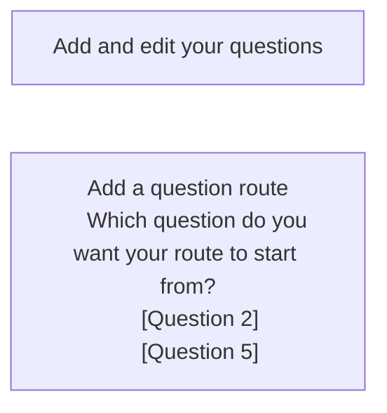

# Add guidance v1

## Status

Date created: *2023-10-03*  

Developed  

___

## Contents

- [Status](#status)
- [Contents](#contents)
- [What](#what)
- [Key decisions](#key-decisions)
- [Designs](#designs)
  - [Notes](#notes)
- [Research focus](#research-focus)

___

 

## What

### As-is

- Form creators need to consider if adding additional content to the hint text is too much, or if it makes more sense to have a longer question or additional content on the start page

### To-be

- Form creators can add additional content and context to individual question pages, using some basic formatting including headings, lists and links to support form completers at their time of need

## Key decisions

It was agreed that we will build a minimum version that covers the basic functionality making sure we are able to offer the feature to allow more forms to be onboarded. In parallel we will design and test another version in the prototype. This version is a larger change to the overall flow of adding and editing a question and so we believe we need to validate before commiting to development.

### We agreed that we will support
- Headings - second (H2) and third (H3) level only
- Paragraphs - allowing blocks of content that are clearly distinct from each other
- Lists - both bulleted and numbered lists
- Links
  - support for simple URLs to guidance pages
  - these will not be validated as real URLs
  - clicked links will always open in a new window or tab
- Maximum of 5000 characters - this does not include the markdown tags
- Previewing markdown as it will be displayed to the form completer 
  - preview will be in page and not include the question or input
  - preview will be enhaced using javascript so users can quickly switch in page without a reload
- Basic WYSIWYG functionality for the markdown textarea
  - this will only cover the formatting we will support such as, H2, H3, link, bulleted list and numbered list
  - this is a javascript enhancement only
- Formatting help - guidance to help form creators write markdown for supported formats, especially helpful where javascript is disabled

### We will not support
- Headings
  - level one (H1) as this is covered by a separate input to ensure valid and accessible page markup
  - levels four to six (H4, H5, H6) as we believe this to be unnecessary at this time, and adds more potential for missuse
- Bold - we believe that adding this now could cause missuse and potentially add more difficulty for form completers, but will keep an eye on for future iterations
- Underline - we believe that this is not going to be needed for any of the forms on our platform, but will keep an eye on for future iterations
- Tables - this is complex markdown and we curently do not have a need to include this
- Blockquotes - this is something that we don’t believe there will be a need for
- Inset text - this would be a custom piece of markdown and currently there is no need to include it
- Notifications - this would be a custom piece of markdown and currently there is no need to include it
- Warning text - this would be a custom piece of markdown and currently there is no need to include it
- Code snippets - this is unlikely to be something we will need to consider
- HR - this is unlikely to be something we will need to consider

### Markdown errors
- We will have an empty input error
- We will have a character count error, triggering where character count is over 5000 not including markdown
- We believe we can offer some initial errors to cover unsupported formats
- We want to include validations on
  - links
    - has a URL been provided
    - is it a valid URL
    - is it an email address - is it valid

 

## Design for build

### page

*description*

 

#### flow

 

## Design to test in the prototype

### page

*description*

 

#### flow

 

### Notes

- 

___

 

## Research focus

### Scenarios to test (prioritised for time):
- 

 

___

 

[Back to the top](#add-guidance-v1)
