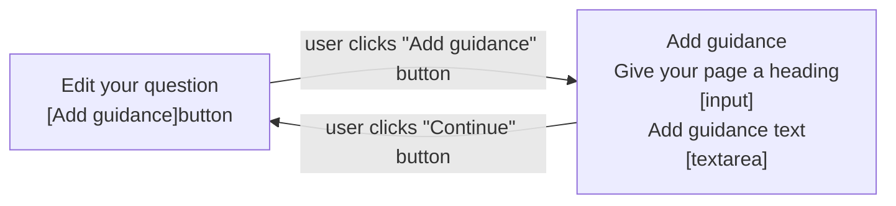
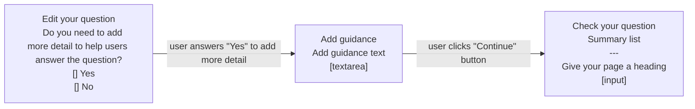

# Add guidance v1

## Status

Date created: *2023-10-03*  

Developed  

___

## Contents

- [Status](#status)
- [Contents](#contents)
- [What](#what)
- [Key decisions](#key-decisions)
- [Design for build](#design-for-build)
- [Design to test in the prototype](#design-to-test-in-the-prototype)
- [Notes](#notes)
- [Research focus](#research-focus)

___

 

## What

### As-is

- Form creators need to consider whether adding additional content to the hint text would make it too long and - if so - whether it would be better to have a longer question or add additional content to the start page

### To-be

- Form creators can add additional content and context to individual question pages to help form completers understand what's needed from them. They can use basic formatting like headings, lists and links.

## Key decisions

It was agreed that we'll build a minimum version that covers the basic functionality needed for this feature, while making it available as soon as possible so that more forms can be onboarded. 

In parallel, we'll design and test another version in the prototype. This version is a larger change to the overall flow of adding and editing a question, so we believe we need to validate it before commiting to development.

### What we will support
- Headings - second (H2) and third (H3) level only
- Paragraphs - allowing blocks of content that are clearly distinct from each other
- Lists - both bulleted and numbered lists
- Links:
  - support for simple URLs to guidance pages
  - these will not be validated as real URLs
  - clicked links will always open in a new window or tab
- Maximum of 5,000 characters - this does not include the Markdown tags
- Previewing Markdown as it will be displayed to the form completer: 
  - preview will be in page and will not include the question or input
  - preview will be enhanced using Javascript so users can quickly switch in page without a reload
- Basic WYSIWYG functionality for the Markdown textarea:
  - this will cover only the formatting we'll support, such as H2, H3, link, bulleted list and numbered list
  - this is a Javascript enhancement only
- Formatting help - guidance to help form creators write Markdown for supported formats, especially helpful where Javascript is disabled

### What we will not support
- Headings:
  - level 1 (H1) as this is covered by a separate input to ensure valid and accessible page markup
  - levels 4 to 6 (H4, H5, H6) as we believe this is unnecessary at this time, and adds more potential for missuse
- Bold - we believe that adding this now could cause missuse and potentially add more difficulty for form completers, but we'll keep an eye on it for future iterations
- Underline - we believe that this is not going to be needed for any of the forms on our platform, but we'll keep an eye on it for future iterations
- Tables - this is complex Markdown and we do not currently have a need to include it
- Blockquotes - this is something  we don’t believe there will be a need for
- Inset text - this would be a custom piece of Markdown and there's currently no need to include it
- Notifications - this would be a custom piece of Markdown and there's currently no need to include it
- Warning text - this would be a custom piece of Markdown and there's currently no need to include it
- Code snippets - this is unlikely to be something we'll need to consider
- HR - this is unlikely to be something we'll need to consider

### Markdown errors
- We'll have an empty input error
- We'll have a character count error, triggering where character count is over 5,000 not including Markdown
- We believe we can offer some initial errors to cover unsupported formats
- We want to include validations on:
  - links:
    - has a URL been provided?
    - is it a valid URL?
    - is it an email address - is it valid?

 

## Design for build

### Edit question page

*This shows the “Edit question” page with the new “Guidance” section, and the following explanatory text: “Only add guidance if you need to give a longer explanation of how to answer the question, or to format your content. For example, you can use paragraphs, links or lists.” This is followed by a grey, secondary “Add guidance” button.*

The form creator can now add guidance if they need to give the form completer a longer explanation of how to answer the question. It also highlights that form creators can use this feature if they need to add formatting or links to their 'help' text.  

Once clicked, the form creator is then taken to the “Add guidance” page, which is a sub journey of the overall add/edit-a-question flow. This means they're taken out of the larger linear flow and will be returned after they've added whatever guidance content is needed.

### Add guidance page - no Javascript

We explain when to use the guidance feature:
> Use guidance if you need to:

> - explain how to answer the question in more detail
> - provide more context
> - format your content - for example, with links, sub-headings or lists

We then ask the user to “Give your page a heading”
> Use a heading that’s a statement rather than a question - for example, ‘Interview needs’. This will be your main page heading.

This is to make sure we have a clear H1 for the page.

Next, they can add guidance text in a textarea using Markdown:
> Use Markdown if you need to format your guidance content. Formatting help can be found below.

They can then choose to “Update preview” to preview how the content will look to the form completer (on the frontend).
The button will reload the page and take the browser focus to the “Preview your guidance text” `
` to reduce confusion and scroll fatigue.  

Due to Javascript being disabled, the “Formatting help” details component will be expanded on page load. This does add more scolling and noise to the screen but it should at least be obvious and helpful to users - as they won’t have the WYSIWYG buttons. We're starting with content based on what Notify use, as they've done a lot of testing with a similar user type to us and have found that their implementation is working as expected. We'll monitor this through research.  

When a user has added their guidance and previewed it they may need to return to their guidance text to make quick changes or minor fixes. To avoid scrolling and reduce confusion we've added a link under the preview area to “Edit guidance text” - this moves focus back to the "Add guidance text" textarea further up the page.  

### Add guidance page - Javascript enhancement

#### Add guidance text

Using the tab component from the design system we're reducing the scroll on this screen when Javascript is enabled. And we're able to help form creators quickly preview without the page reloading. We're also able to offer a limited WYSIWYG for adding or editing Markdown.  

#### Preview guidance text

#### Notes on Javascript-enhanced guidance text

We will need to test and validate whether:
1. the use of the tab component works for our users and is accessible
2. giving the supported formats as a WYSIWYG above the text area is helpful to our users, and verify that the implementation is accessible
3. we can do error validation between the “Write” and “Preview” tabs using Javascript - making sure this is handled in an accessible way

### Your questions - live form questions summary

*This screen shows the list of questions for a form that is ‘Live’ on GOV.UK Forms. It shows summary cards for each question in the form. The second question now has a row for “Page heading” and another for “Guidance text” as the form creator has added this. These rows appear as the first two rows in the card, above “Hint text” and “Answer type”.*

### Add guidance error messages

Three errors as they could appear on the “Add guidance” page are:
1. ‘Enter a page heading’ - where the form creator has not added a page heading
2. ‘Enter guidance text’ - where the form creator has not added any guidance text
3. ‘Guidance text can only contain formatting for links, subheadings (##), bulleted lists (*), or numbered lists (1.)’ - where the form creator has added invalid Markdown, such as a single hashtag (#) for a heading level 1 (H1)

### Returning to the "Edit question" page

Once a user has added the guidance information required they are then returned to the “Edit question” page. Here, the guidance section has now turned into a summary list view where they can see the page heading and guidance text they've added - showing the Markdown. They have the option to “Change” either of these from here.

#### "Edit question" return example for “Selection from a list” answer type

When a user returns to the “Edit question” page after adding their guidance information, if the answer type is “Selection from a list” they are not shown the “Question settings” section where they can make this question optional. 

#### "Edit question" return example for most other answer types

When a user returns to the “Edit question” page after adding their guidance information, if the answer type is not a “Selection from a list” then they are still shown the “Question settings” section where they can make this question optional. 

 

#### Flow

 

## Design to test in the prototype

### page

*description*

 

#### flow

 

## Notes

- 

___

 

## Research focus

### Scenarios to test (prioritised for time):
- 

 

___

 

[Back to the top](#add-guidance-v1)
