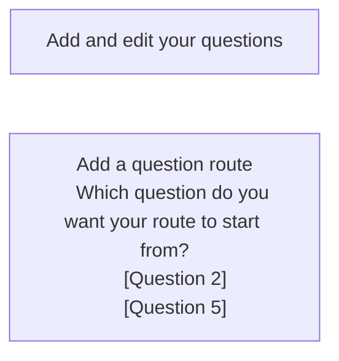

# Add guidance v1

## Status

Date created: *2023-10-03*  

Developed  

___

## Contents

- [Status](#status)
- [Contents](#contents)
- [What](#what)
- [Key decisions](#key-decisions)
- [Designs](#designs)
  - [Notes](#notes)
- [Research focus](#research-focus)

___

 

## What

> What are we proposing/doing?  
> - description of the feature

### As-is

- 

### To-be

- 

## Key decisions

- 

 

## Designs

### page

*description*

 

#### flow

 

### Notes

- 

___

 

## Research focus

### Scenarios to test (prioritised for time):
- 

 

___

 

[Back to the top](#add-guidance-v1)
