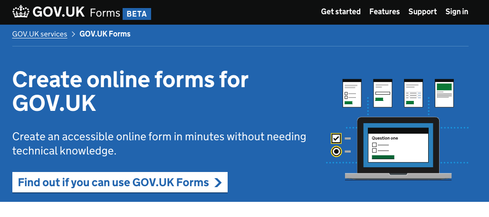

#   Early Access journey designs

## Status

- Date created: *2023-11-9*
- Developed 

## Contents
- [As is](#as-is)
- [To be](#to-be)
- [Key decisions](#key-decisions)
- [Designs](#designs)

## As is 
Currently, the adoption team have to manually create trial accounts and editor accounts for people.

There is currently no process for people to:

- create a trial account themselves
- request to upgrade to an editor account

## To-be
The early access journey enables people to:

- create a trial account
- try the product out
- request to upgrade to an editor account

## Key decisions
It was agreed that we'd build a minimum version that is needed for this journey - to make it available as soon as possible so people can try the product and start making forms. 

During the early access phase - before we move into public beta - we'll iterate on this process to make it more self-service and to automate some of the tasks the adoption team currently have to do. 

We are using Auth0 for authentication.

## Designs
- [Figma files for designs can be found here](https://www.figma.com/file/pCN39S9tIDlgicZ05Nj47J/Early-Access?type=design&node-id=337%3A3586&mode=design&t=0R6O7wWl9Alok9vs-1 "Figma files for designs can be found here")
- [Protoype can be found here](https://forms-prototypes-pr-201.herokuapp.com/product-pages)
 

### Product site homepage

*This shows 'GOV.UK Forms' product landing page.*

We changed the main call to action and header text on the homepage so visitors to the site would know they can now find out if they can use GOV.UK Forms. 

We removed the previous call to action which encouraged people to sign up to our mailing list. 

The button now reads 'Find out if you can use GOV.UK Forms' and when clicked, takes you to the 'Get started' page. 

### Get started page (Product site)

*This shows the ‘Get started’ page and explains what the product is, what it can be used for, how to create a trial account and the criteria you need to meet to be able to upgrade your account to be able to make forms live. It includes a green call-to-action button to ‘create a trial account’.*  

In this page we needed to set expectations for potential users and explain the process as concisely as possible. We needed to make it clear that:

- the product can only be used for forms for GOV.UK at the moment
- the product has fairly limited features, so you need to check if it's suitable for you - you can do this with a trial account and by reading the ‘features’ page - that we link to
- you can create a trial account, but you cannot make forms live with a trial account
- you can ask to be upgraded to be able to make forms live from your trial account but you have to meet some criteria

We also included a link to sign up for the mailing list for those people who want to use the product but can't yet because they don't meet the criteria or because we haven't built all the features they'd need. 

Once the 'Create a trial account' button is clicked the user is taken to the Auth0 'create an account' page. They authenticate with their gov.uk email address and that creates a trial account for them in GOV.UK Forms. 

### Trial account notification banner

*The trial account banner says: 'You have a trial account. You can create a form, preview and test it. You need an editor account to be able to make a form live.' And then there's a link with the test 'Find out if you can upgrade to an editor account.'*  

Once the users are authenticated with Auth0 they are taken to the GOV.UK Forms landing page. 

Here we show a notification banner to inform the user that they have a trial account.

When a user clicks the link they are taken to the 'Requirements to upgrade to an editor account' page. 

### Requirements to upgrade to an editor account

 

*The 'Requirements to upgrade to an editor account' page describes the requirements the person - and their forms - need to meet to be upgraded to be able to make forms live.*

We also wanted to set expectations that this is not necessarily a super fast process, and that you will be sent an email asking for more information when you confirm that you meet the requirements. 

There is a check box for people to select to confirm they meet the requirements. 

Once the check box is ticked, the user then clicks 'Continue' and is taken to the 'What happens next' page. 

### What happens next page

 

*This page informs the user about the next steps.* 

We are using a panel component with text that says *We've sent you an email to request more information* 

Beneath the panel component there's a 'What happens next' heading and text that says *Check your email and reply with the information requested. we'll then get in contact with you to discuss the next steps. It may take up to 2 weeks.*

Then there's a 'Back to your forms' link to allow users go back.

The user will also have an email asking for more information. When they reply to that email, it creates a ticket for the adoption team to respond to. 

### Memorandum of Understanding page

 

*This page shows the Memorandum of Understanding.*

If the adoption team identifies that this user is from a department that needs to agree to the MOU, they send a link to it via email. At this stage users are asked to click to that link and are taken to the ‘Memorandum of Understanding’ page. 

The user then needs to read the MOU and agree to it on behalf of their organisation. 

At the end of the MOU there’s a check box where it says *I agree to the MOU on behalf of my organisation*. Once checked the users are asked to click ‘Save and continue’. Users are then taken to the ‘Agreeing to MOU' page. 

### You’ve agreed to the MOU

 

On this page we inform users that they have agreed to the MOU with a panel that says *You’ve agreed to the MOU*. We also have a ‘What happens next’ heading with text saying *We’ll email you with any updates to the MOU that are made in the future.* 

At the top left hand corner we have also included a back button, allowing users to go back to the MOU.

### ‘You have an editor account’ notification banner

 

When the adoption team has upgraded the trial user user and they sign back in to their account, they’re shown a notification banner that says *You now have an editor account. You can create a form and make it live.*  

## Changes we made after research

 

After research, we made a few content changes to:

- the product site homepage
- the ‘get started’ page
- the ‘requirements to become an editor’ page
- the ‘what happens next’ page
- the automated email that is sent to you when you request to upgrade

[Back to the top](#early-access-journey-designs)
