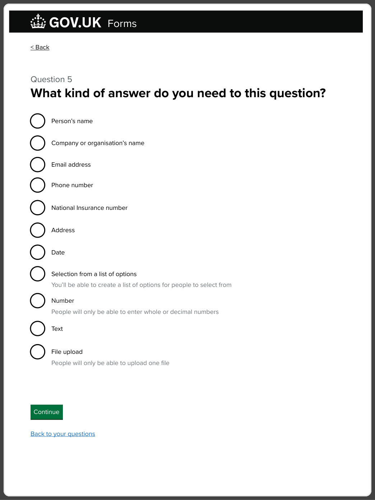
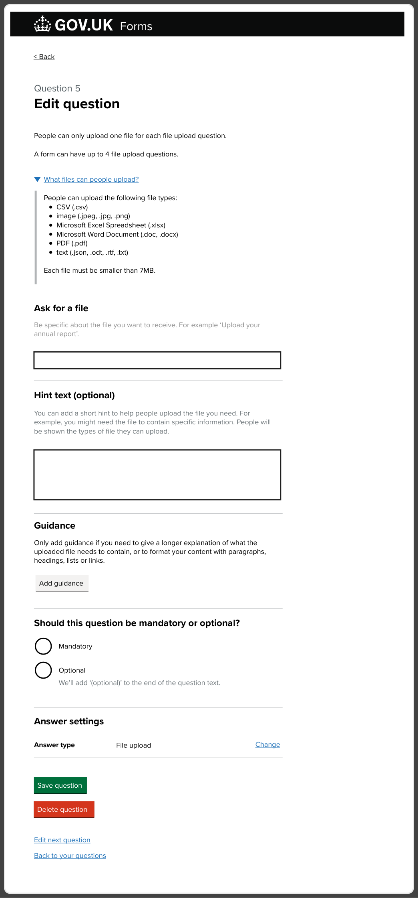
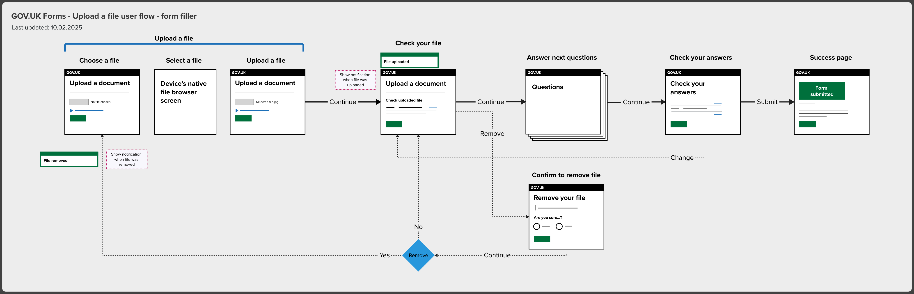
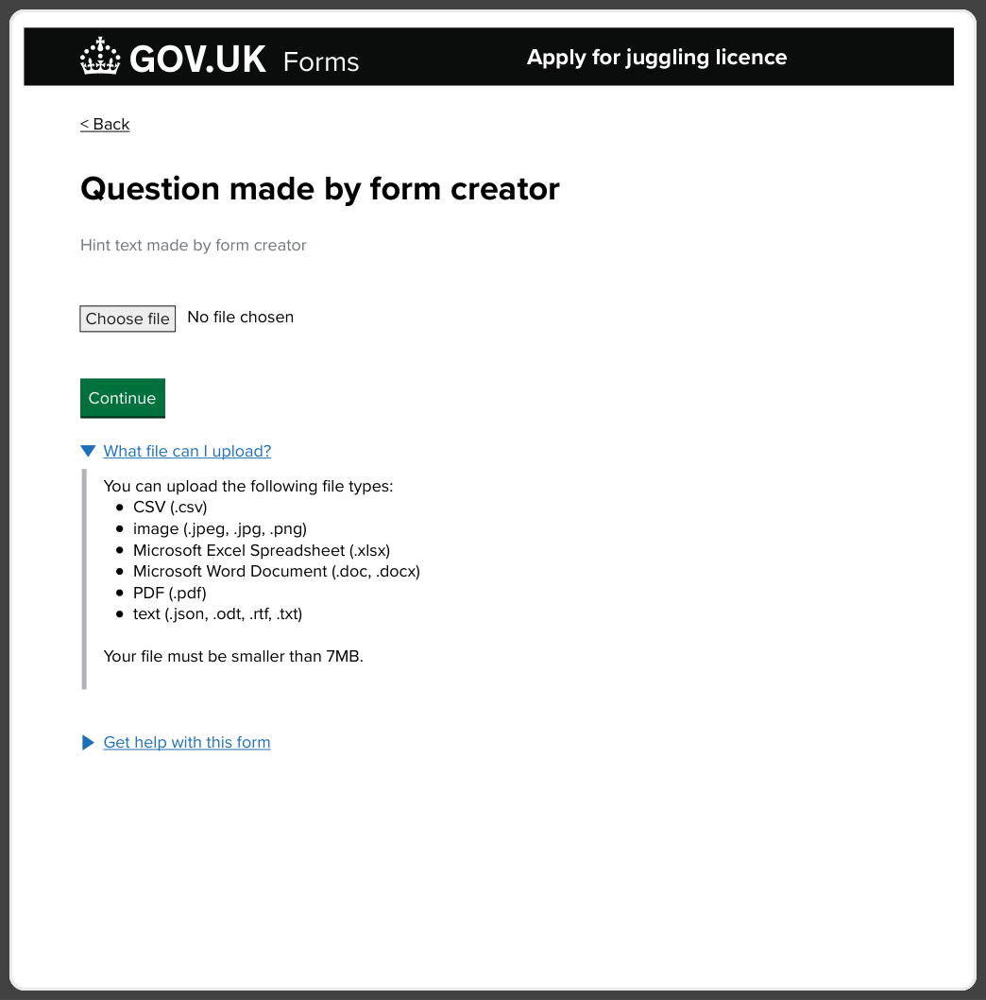
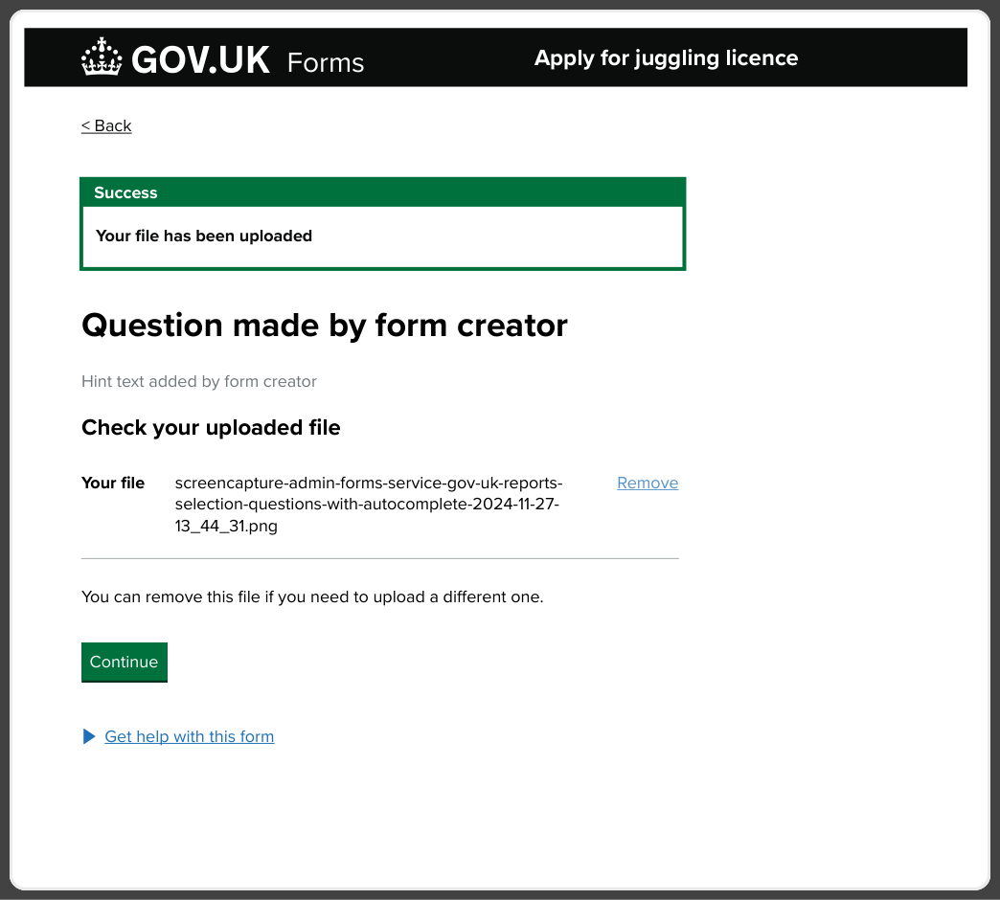
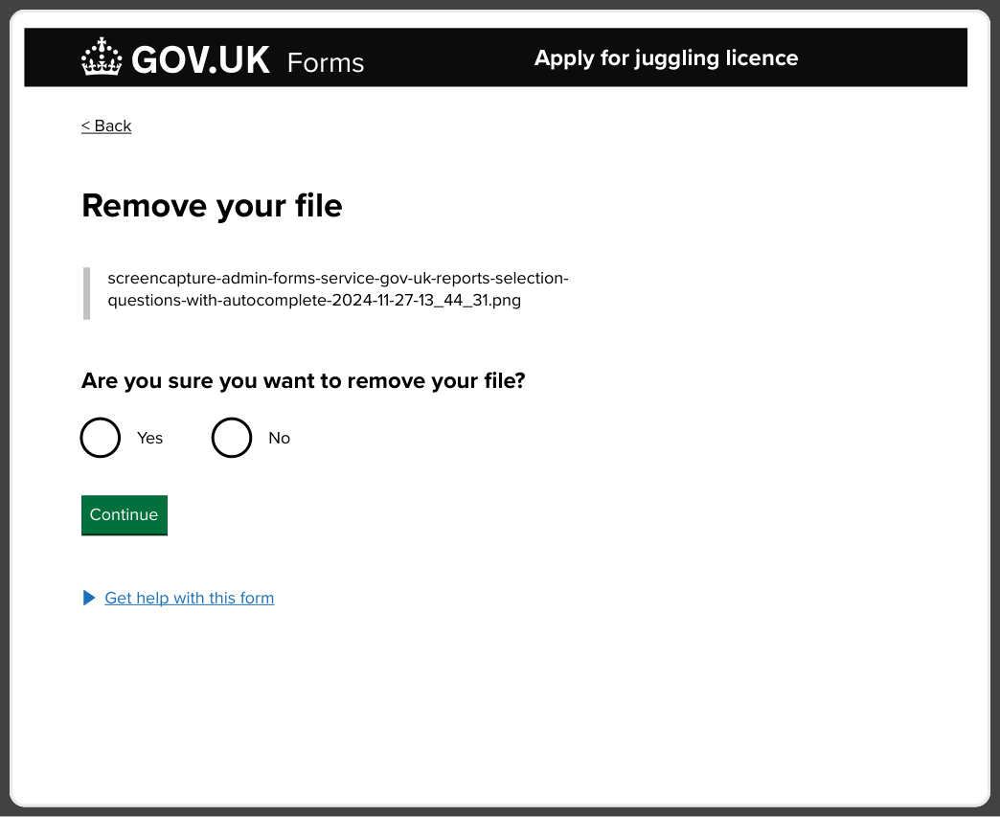
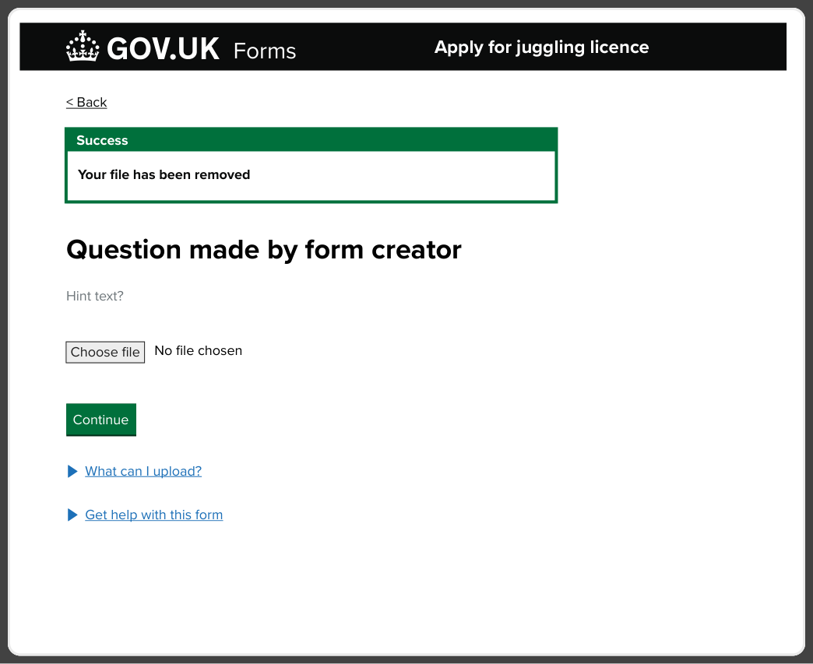
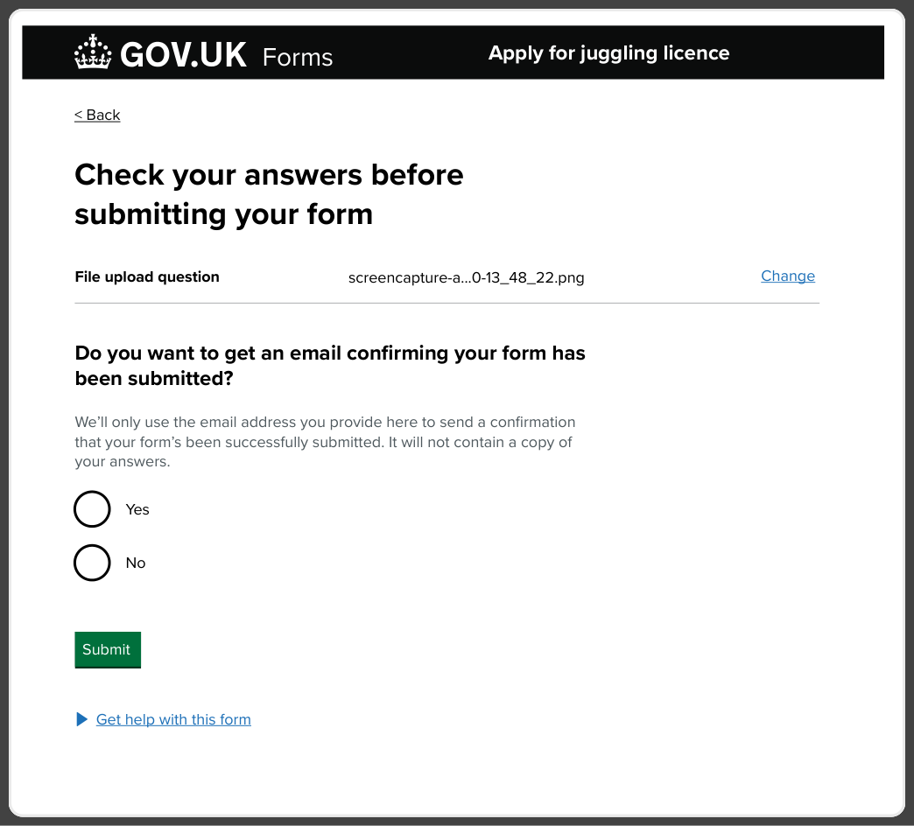
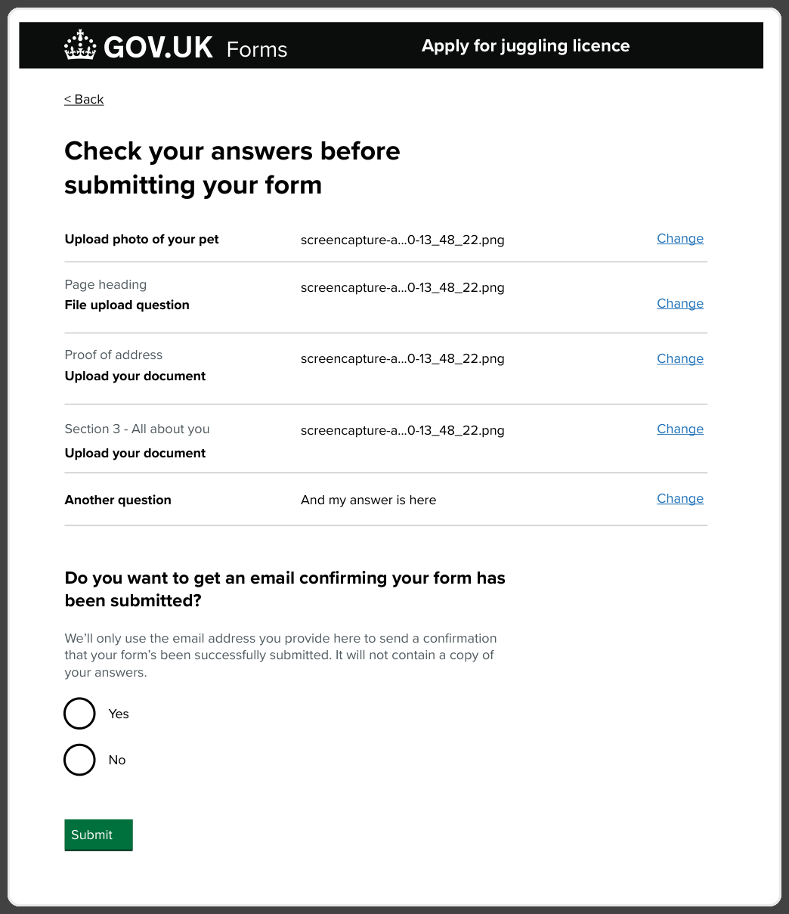
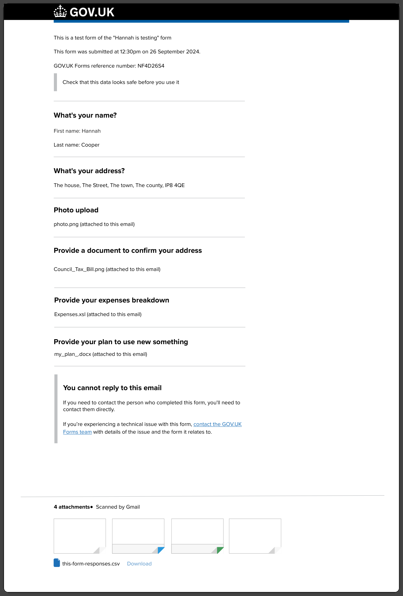

# File upload first release

## Status 

Date created: *2025-07-09*  

## What

Epic trello card: [https://trello.com/c/NWsgTJrc](https://trello.com/c/NWsgTJrc)

[Mural working board](https://app.mural.co/t/gaap0347/m/gaap0347/1731576709302/ed0fdc4d589481830738715cff7b00d6b4f268e3?sender=u1786fa2d2029c0638a5c0139)

### Our users

**Form creator** is a person who builds a digital form using GOV.UK Forms

**Form filler** is a person who fills in the form and submits it in order to receive a service

**Form processor** is a person who receives the answers from the form submission and uses the information to provide a service

### Previous research

 [File upload and optional questions research playback December 2022](https://docs.google.com/presentation/d/1fFSjoXwM0rO0sJHDHRUak9a4aphiutl8u7HYlYdqX1c/edit#slide=id.g1ab61843043_0_71) 

[File upload research insights November 2022](https://docs.google.com/document/d/1MDc2X3MSZJhkKLyyRb8dWapPthQAV_sMPaBC8q82zkQ/edit?usp=sharing) 

People currently asking for lists of documents to be sent in could see the benefit of structuring this request with a question for each. At the moment their form completers often miss some documents leading to correspondence back and forth. One estimated 90% of submissions are currently incomplete.

In previous research rounds participants clearly preferred the email attachment options over Notify-style links (one per document). Largely due to the number of steps the file links took, especially in cases where they received multiple documents. 

Participants mostly didn’t have a major issue with files being sent to their inbox as they had large amounts of storage. Most people transferred documents to another system as part of their initial processing of submissions.

The majority of forms asking for additional documents, that would be handled by a file upload, were asking for scans, photos of PDFs.

### The problem

A lot of forms require additional evidence to be attached to the form submission, so that the team processing the forms can provide a service to the end users (members of the public and organisations).

In order to onboard more forms to the [GOV.UK](http://GOV.UK) Forms product, we need to support file upload.

People processing the forms often receive submissions with missing or incomplete sets of documents, and most of the forms do not have any mechanisms beyond a checklist to ensure people send the right documents.

### User stories

| As a user | I need | So that | Is the need met? |
| :---- | :---- | :---- | :---- |
| Form creator | to require users to upload files of different sizes and formats as an answer to a question | we collect the data we need | yes |
| Form creator | require more than one file per question | we collect the supporting evidence related to a specific question | no |
| Form creator | know what file types and sizes are accepted for form fillers | I don’t have to repeat the same content in my question and communicate clearly if I need a specific file format. | yes |
| Form creator | to be able to set accepted file types per questions | I can receive the files in the format required for a form / question | no |
| Form creator / processor | to potentially get more than 4 files | we collect the supporting evidence we need to process a form | no |
| Form processor | to receive and access the files users upload | I can process the submitted information in the way I need to | yes |
| Form processor | an easy access to file attachments | I can process them quickly and save time | yes |
| Form processor | an identifying information (such as reference number) in the file name | I can process the right files with the right form submission | yes |
| Form processor | the files to be renamed before I receive it | the file name relates to the question asked | no |
| Form processor | a way to to tell which file relates to a specific question | I can process the form correctly | yes |
| Form filler | to be able to upload a file/files | I can provide the information I am being asked for | yes |

## Key decisions

We limit file upload to a maximum four files per form, with each file being a maximum of 7MB. This is due to the technical constraint of maximum size of file attachments per email. 

This means that a form creator can make up to four questions asking for a file, and when they reach this limit they would see an error message.

To keep the process simple and within the scope we decided to allow one file upload per question.

Following’s [Notify’s approach](https://docs.notifications.service.gov.uk/ruby.html#upload-your-file) the GOV.UK Forms supports uploading file types:

* CSV (.csv)  
* image (.jpeg, .jpg, .png)  
* Microsoft Excel Spreadsheet (.xlsx)  
* Microsoft Word Document (.doc, .docx)  
* PDF (.pdf)  
* text (.json, .odt, .rtf, .txt)

Show page heading content above the question text for file upload questions on the Check your answers page. \[link to the explanation\]

## Feedback from users

Source: Search Mural for: ‘File upload \- Feedback sessions’.

We did a few rounds of iterations based on user feedback from form creators in different departments. 

We learned that they would require multiple documents uploaded in one question. 

With the limits we set form creators could phrase the questions to ask for specific documents. Some users would need to create a workaround to fit the file upload constraints and might end up repeating a similar question to ask for one piece of evidence.

When users tried to fill in the form via preview and upload documents it wasn’t initially clear whether a question asks for one or multiple files.

Users expected to be able to receive larger files.

Form creators wanted to get more information about supported files when they were creating a file upload question

User said that adding reference numbers from the form submissions in the file attachment would help processors. 

“Having the ref number in the file name would be really useful \- so once you’ve saved the file to your computer it would make it easier to find the file. If you are dealing with 100’s of files. Last year we received 59 folders with files in. I’m not the only one who has access to it. It’s a way of making the files referencable”

Form creators also noted that it will be important for the file upload questions to work well on mobile when filling in the form.

Limit to 4 files per form submissions could be a blocker to some teams, if they needed more files they wouldn’t use GOV.UK Forms.

It wasn't clear to the form creator what file formats are accepted and if this is communicated back to form fillers. 

Form creators would like to have more control over what file types they accept.

Some form creators indicated that form fillers should be able to change the file names after uploading, so that it can help with processing and make it more findable.

Some users were concerned whether it would be safe to open the file attachments or receive files through email (with people’s personal data, like a passport photo).

## Released feature

### Form creator can add a file upload question

*A page titled “What kind of answer do you need to this question” with a list of options to select from*

When a user creates a question from this page they can select ‘File upload - people will only be able to upload on file’ as an option. We iterated the content multiple times to make it clearer that form fillers would be able to upload one file only. 

**Error messages**

When a form creator tried to add more than four file upload questions, we show an error message: “You cannot have more than 4 file upload questions in a form”

### Form creator edits file upload question

*A page titled “Edit question”*

The create and edit question page is tailored to be more specific to asking for a file. We removed the ‘Can answer more than once’ section as the file upload is restricted to one file per question.
At the top of the page we communicate the restrictions for file upload and after feedback from users we included a copy about what files people can upload including the file sizes. The copy:

> People can only upload one file for each file upload question. 
>
> A form can have up to 4 file upload questions.
>
> What files can people upload?
> People can upload the following file types:
> - CSV (.csv)
> - image (.jpeg, .jpg, .png)
> - Microsoft Excel Spreadsheet (.xlsx)
> - Microsoft Word Document (.doc, .docx)
> - PDF (.pdf)
> - text (.json, .odt, .rtf, .txt)
>
> Each file must be smaller than 7MB.

We used a specific copy to help form creators ask a file upload question:

The main question text changed to ‘Ask for a file’ and the hint text says: "Be specific about the file you want to receive. For example 'Upload your annual report'".

In the section for adding hint text we included information to explain that form fillers would be told about the files they could upload. We added this because we saw that form creators would put this information in the hint text, leading to duplicate content on the question page for form fillers.

The hint text content changed to: ‘You can add a short hint to help people upload the file you need. For example, you might need the file to contain specific information. People will be shown the types of file they can upload.’

We found that some form fillers need to include a lot of contextual information about the file they want to get, so we changed the guidance content to reflect that. The copy: ‘Only add guidance if you need to give a longer explanation of what the uploaded file needs to contain, or to format your content with paragraphs, headings, lists or links.’

### Upload a file - form filler user flow

*A user flow diagram showing steps to upload and remove the file*

Choose a file, select a file using the device’s native file browser, once the file is selected continue, on the next ‘Check your file’ page show notification that the file was uploaded successfully, and the user can check their file and can remove it. If they continue, they go to the next question to check your answers page. If the user decides to remove the file they are taken to a new page and asked to confirm removing the file.

If they don’t confirm they go back to the ‘Check your file’ page, if they confirm removal, they go to ‘Upload a file’ page, with a notification that a file was successfully removed.

When a user is on Check your answer page, and they want to change the file upload answer, they get directed to ‘Check your file’ page where they can remove the file and upload a new one. After uploading the new file, checking it, they should be taken back to the last check your answers page.
Once the user submits the form they are shown a confirmation page that the form was submitted.

The diagram below outlines the journey with these steps

### Upload a file - form filler

*A page titled: “Question made by form creator”*

The ‘upload a file’ question page for form fillers to upload a file. The content of the question and hint text is set by a form creator. So it could read like “Upload your receipt - The receipt must have a clear date and amount paid”. 

The page includes content in a detail component explaining to form fillers what files they can upload. This was iterated as we made decisions on the restrictions about file size and types. The copy:    

> What file can I upload?
>
> You can upload the following file types:
> - CSV (.csv)
> - image (.jpeg, .jpg, .png)
> - Microsoft Excel Spreadsheet (.xlsx)
> - Microsoft Word Document (.doc, .docx)
> - PDF (.pdf)
> - text (.json, .odt, .rtf, .txt)
> Each file must be smaller than 7MB.

When the user presses ‘Choose file’ it opens up the device’s default file browsing window and the user can select a file from the system. Depending on their device or operating system, the unsupported files won’t be displayed or won’t be selectable.
When they confirm, the file name and type would be displayed next to the ‘Choose file’ button. Then the user can press continue to upload the file and is taken to another page to ‘Check their uploaded file”.
The user can also drag a file over the ‘Choose file’ area, but with the standard file upload component it’s not very clear that this is possible. The new enhanced file upload component has clearer and better support for dropping files, and we will be using it once the issue we raised is addressed.

**Error messages**

We use the standard error messages mentioned in the [GOV.UK Design System file upload component](https://design-system.service.gov.uk/components/file-upload/#:~:text=Nunjucks-,Error%20messages,-Error%20messages%20should)

### Check your uploaded file - form filler

*Page title: “Question made by form creator - Success. Your file has been uploaded”*

Once the user uploads a file and continues, they get on the ‘Check your uploaded file” page. The page shows a success notification: “Success - Your file has been uploaded” to reassure the users. We keep the question text and hint text made by the form creator. We won’t show guidance or page heading on this page. 
Under a heading ‘Check your uploaded file” in a summary list component we list “your file” followed by the name and format of the uploaded file, with a link to ‘Remove”. If a user uses the ‘Remove’ link it takes them to a new page to “Remove your file”.

This step helps the users to double-check the file they provided and to remove the file if it’s not the right one or if they have changed their mind. We needed to provide a way of removing the uploaded files especially if a file upload question is optional and the users want to have changed their mind and want to delete the file.

Under the summary list we say “You can remove this file if you need to upload a different one” to make it clearer that they can only provide one file. 

### Confirm to remove your file - form filler

*Page titled: “Remove your file”*

When a user decides to remove a file they get taken to a “Remove your file” page. We play back the file name and type in the inset text component. And we ask the user “Are you sure you want to remove your file?” to confirm their action.

If they select ‘Yes” they land on the initial ‘Upload a file” question, where they can upload a new file. They would see a notification “Success - Your file has been removed” to confirm their previous action.

If they select “No” they get back to the “Check your uploaded file” page where they can continue filling in the form.

### File removed, upload a new one - form filler

*Page titled: “Question made by form creator. Success - Your file has been removed*

After the user confirms they want to remove the file they land on the initial file upload question page where the ‘Choose file’ file upload element is reset to default state. We show a notification: “Success. Your file has been removed” to confirm their previous action and reassure them that the file is removed.

### Check your answers with file upload

*Page titled: “Check your answers before submitting your form”*

Once the user has completed filling in the form they land on “Check your answers before submitting the form”. If the question asking for a file was simple, without any guidance, we display the question text in the summary list key. Followed by the name and format of the file in the summary list value and a ‘Change’ action link. The change link has a hidden text that contains the content of the question, so it reads like “Change Upload a photo of your pet”.

### Check your answer page with page heading for file upload question with guidance

*Page titled: “Check your answers before submitting your form”*

When a file upload question has a guidance it changes the structure of the question. This means that the main context of the question is likely to be in the page heading and the question text becomes more generic, like ‘Upload a photo”.

If there are multiple file upload questions with a generic question text, then on Check your answers page the form fillers might not be able to review which files they uploaded relate to a question without the context of the page heading.
We decided that for file upload questions, if they contain a page heading for the guidance we will display the page heading above the question text on the check your answer page to provide more context and help users review their answers before submitting the form. 

### Submitted form responses in an email to a form processor

*Email mockup containing the information submitted in the form with attachments.*

When a form is submitted the responses get sent to an email to processing teams. The email would contain the question answers in the body of an email in a structured way.
Answers to file upload questions are displayed under a questions text in the format of the uploaded file name and type. And each has appended content saying "(attached to this email)". To make it clear that the answer is an attachment and to help form processors match up the right uploaded file to the right question.

## Measuring

The first release of file upload for [GOV.UK](http://GOV.UK) Forms is mostly essential functionality with limitations, and we know there is more we could do to make it better for form creators and form fillers. We have implemented ways to measure the use of the feature, so that we can understand and prioritise any problematic parts to address. We check for:

- What is the impact of file upload features on completion rate? Do people drop off more often?  
- How often do people try to upload the wrong file format or size? What is the format?  
- Do people open the ‘detail’ component on what files are accepted  
- How often do form creators try to add more than 4 file upload questions

Other things we measure:

- How many forms use a file upload question  
- What are most common uploaded file types and sizes

## What we didn’t do and why

We learned through feedback from users that one file per question and total file size in one email submission won’t meet all user needs.
If form owners set up submissions to an S3 bucket, rather than use emails, we could potentially remove restrictions for them. As it stands, nobody is receiving submissions in this way. 
We discussed

We tested the enhanced file upload from the Design System to check if it is suitable for the feature launch, but we found a [bug](https://github.com/alphagov/govuk-frontend/issues/5791)

## What would we like to do in the next release

Support uploading multiple files per question, explore add another pattern for file upload
Remove the limits for the number of files uploaded per question
Make the total file size limits more flexible. 
Allow 
Support sending large file attachments over multiple emails per form submission
Gather feedback from using the feature and improve it in the next iteration
Explore if we can better support people uploading files and help them through the process, for example guide on taking a photo of a document, scanning a document, sending files between devices etc. This is because based on [MoJ Design System guidance](https://design-patterns.service.justice.gov.uk/patterns/upload-files/):

>Uploading files can be challenging for users, it may require things like
>
> - scanning a document or taking a photo
> - sending file from one device to another
> - selecting a file from a folder
> - waiting for a file to be uploaded

So it would be beneficial to develop a standard pattern for helping users to upload files that could be applied across all forms created with GOV.UK Forms.

Explore how we could support save and return, so that users can come back to a form if they don’t have access to evidence at hand.

