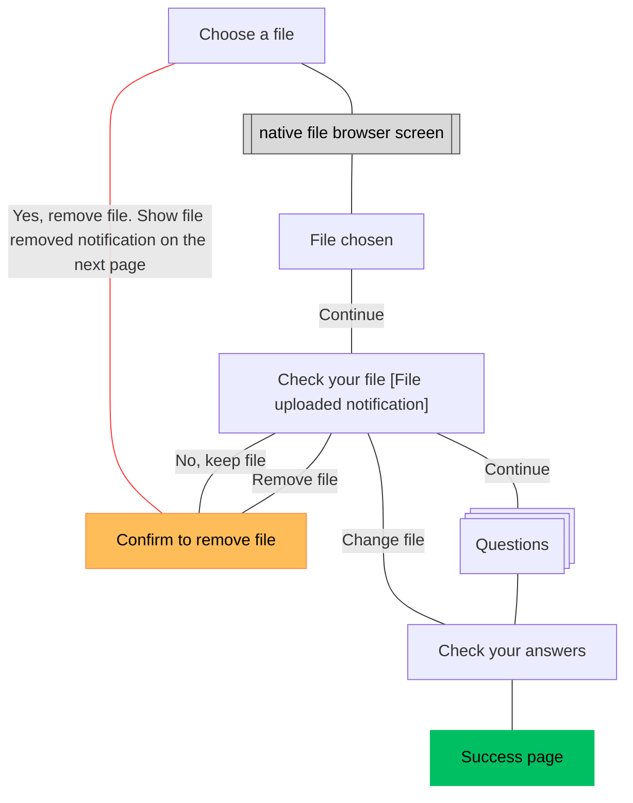

# File upload first release

## Status 

Date created: *2025-XX-XX*  

## **What**

\- Epic trello card: [https://trello.com/c/NWsgTJrc](https://trello.com/c/NWsgTJrc), 

\- Mural working board: [https://app.mural.co/t/gaap0347/m/gaap0347/1731576709302/ed0fdc4d589481830738715cff7b00d6b4f268e3?sender=u1786fa2d2029c0638a5c0139](https://app.mural.co/t/gaap0347/m/gaap0347/1731576709302/ed0fdc4d589481830738715cff7b00d6b4f268e3?sender=u1786fa2d2029c0638a5c0139)

### **Our users**

\- \*\*Form creator\*\* is a person who builds a digital form using GOV.UK Forms

\- \*\*Form filler\*\* is a person who fills in the form and submits it in order to receive a service

\- \*\*Form processor\*\* is a person who receives the answers from the form submission and uses the information to provide a service

### **Previous research**

File upload and optional questions research playback December 2022 [https://docs.google.com/presentation/d/1fFSjoXwM0rO0sJHDHRUak9a4aphiutl8u7HYlYdqX1c/edit\#slide=id.g1ab61843043\_0\_71](https://docs.google.com/presentation/d/1fFSjoXwM0rO0sJHDHRUak9a4aphiutl8u7HYlYdqX1c/edit#slide=id.g1ab61843043_0_71) 

File upload research insights November 2022

[https://docs.google.com/document/d/1MDc2X3MSZJhkKLyyRb8dWapPthQAV\_sMPaBC8q82zkQ/edit?usp=sharing](https://docs.google.com/document/d/1MDc2X3MSZJhkKLyyRb8dWapPthQAV_sMPaBC8q82zkQ/edit?usp=sharing) 

People currently asking for lists of documents to be sent in could see the benefit of structuring this request with a question for each. At the moment their form completers often miss some documents leading to correspondence back and forth. One estimated 90% of submissions are currently incomplete.

In previous research rounds participants clearly preferred the email attachment options over Notify-style links (one per document). Largely due to the number of steps the file links took, especially in cases where they received multiple documents. 

Participants mostly didn’t have a major issue with files being sent to their inbox as they had large amounts of storage. Most people transferred documents to another system as part of their initial processing of submissions.

The majority of forms asking for additional documents, that would be handled by a file upload, were asking for scans, photos of PDFs.

### **The problem**

A lot of forms require additional evidence to be attached to the form submission, so that the team processing the forms can provide a service to the end users (members of the public and organisations).

In order to onboard more forms to the [GOV.UK](http://GOV.UK) Forms product, we need to support file upload.

People processing the forms often receive submissions with missing or incomplete sets of documents, and most of the forms do not have any mechanisms beyond a checklist to ensure people send the right documents.

### **User stories**

| As a user | I need | So that | Is the need met? |
| :---- | :---- | :---- | :---- |
| Form creator | to require users to upload files of different sizes and formats as an answer to a question | we collect the data we need | yes |
| Form creator | require more than one file per question | we collect the supporting evidence related to a specific question | no |
| Form creator | know what file types and sizes are accepted for form fillers | I don’t have to repeat the same content in my question and communicate clearly if I need a specific file format. | yes |
| Form creator | to be able to set accepted file types per questions | I can receive the files in the format required for a form / question | no |
| Form creator / processor | to potentially get more than 4 files | we collect the supporting evidence we need to process a form | no |
| Form processor | to receive and access the files users upload | I can process the submitted information in the way I need to | yes |
| Form processor | an easy access to file attachments | I can process them quickly and save time | yes |
| Form processor | an identifying information (such as reference number) in the file name | I can process the right files with the right form submission | yes |
| Form processor | the files to be renamed before I receive it | the file name relates to the question asked | no |
| Form processor | a way to to tell which file relates to a specific question | I can process the form correctly | yes |
| Form filler | to be able to upload a file/files | I can provide the information I am being asked for | yes |

## **Key decisions**

We limit file upload to a maximum four files per form, with each file being a maximum of 7MB. This is due to the technical constraint of maximum size of file attachments per email. 

This means that a form creator can make up to four questions asking for a file, and when they reach this limit they would see an error message.

To keep the process simple and within the scope we decided to allow one file upload per question.

Following’s [Notify’s approach](https://docs.notifications.service.gov.uk/ruby.html#upload-your-file) the GOV.UK Forms supports uploading file types:

* CSV (.csv)  
* image (.jpeg, .jpg, .png)  
* Microsoft Excel Spreadsheet (.xlsx)  
* Microsoft Word Document (.doc, .docx)  
* PDF (.pdf)  
* text (.json, .odt, .rtf, .txt)

Show page heading content above the question text for file upload questions on the Check your answers page. \[link to the explanation\]

## **Feedback from users**

Source: Search Mural for: ‘File upload \- Feedback sessions’.

We did a few rounds of iterations based on user feedback from form creators in different departments. 

We learned that they would require multiple documents uploaded in one question. 

With the limits we set form creators could phrase the questions to ask for specific documents. Some users would need to create a workaround to fit the file upload constraints and might end up repeating a similar question to ask for one piece of evidence.

When users tried to fill in the form via preview and upload documents it wasn’t initially clear whether a question asks for one or multiple files.

Users expected to be able to receive larger files.

Form creators wanted to get more information about supported files when they were creating a file upload question

User said that adding reference numbers from the form submissions in the file attachment would help processors. 

“Having the ref number in the file name would be really useful \- so once you’ve saved the file to your computer it would make it easier to find the file. If you are dealing with 100’s of files. Last year we received 59 folders with files in. I’m not the only one who has access to it. It’s a way of making the files referencable”

Form creators also noted that it will be important for the file upload questions to work well on mobile when filling in the form.

Limit to 4 files per form submissions could be a blocker to some teams, if they needed more files they wouldn’t use [GOV.UK](http://GOV.UK) Forms.

It wasn't clear to the form creator what file formats are accepted and if this is communicated back to form fillers. 

Form creators would like to have more control over what file types they accept.

Some form creators indicated that form fillers should be able to change the file names after uploading, so that it can help with processing and make it more findable.

Some users were concerned whether it would be safe to open the file attachments or receive files through email (with people’s personal data, like a passport photo).

### Form creator can add a file upload question

*A page titled: "What kind of answer do you need to this question?" with a list of answer types to select from*

## **Released feature**

The diagram outlines the journey with these steps