# Move a form to a different group 

## Status  

Date created: *2025-08-08*    

In development  

___   

## Contents   

- [Move a form to a different group](#move-a-form-to-a-different-group)  
  - [Contents](#contents)  
  - [What](#what)  
  - [Key decisions](#key-decisions)  
  - [Designs](#designs)  
 
___   

## What  

We want to allow org admins to move a form from one group to another.  

We need to design how they could do this and make sure it’s feasible from an implementation POV.  

## Key decisions  

- In July 2025 the [kick-off session explored what was in scope based on what we heard from existing org admin users](https://app.mural.co/t/gaap0347/m/gaap0347/1750068288725/f59f4a60d90f6e9b3c88cb418005c61e9bb7b32e)

As part of a follow up workshop the team explored potential design options to meet this need. In this session there was a clear consensus of a new simple journey to allow only org admins to move a single form between groups. We discussed: 

### Where we think we could start the journey

- Action on the group page that lists the forms in the group and their status (draft/live/archived)
- Action in the form table row

### What is in scope for the journey?

- Move a single form to another group
- Email notifications to
  - inform group members (editors and group admins) that an org admin has moved a form from their group
  - inform all org admins from the organisation that another org admin has moved a form
- Limit the groups a form can be moved to based on the state of the form - a live form cannot be moved to a trial group
- Use select component where the list of groups is larger that 11
- Extra: Reuse autocomplete component where the list of groups is larger that 31
- Warning org admins about the impact of them moving a form - some users will lose access to it

### What notifications are needed, and for who? 

- Notify other org admins of a forms move
- Notify the group admins of the group the form has moved from of a forms move
- Notify the group editors of the group the form has moved from of a forms move

### What is OUT of scope for now? 

- Moving multiple forms to another group
- Being able to quickly and easily see all the forms in your organisation, and which group they belong to
- Being able to move user permissions with a form
- Audit trails and historical changes
- Platform banner notifications

After playing back the options designed by the designers the team agreed to take forward [option 1 from the mural area](https://app.mural.co/t/gaap0347/m/gaap0347/1752756571497/0452eaf50e2e6eb60472053cbd68c55b4f6e16a9?wid=0-1753696042341). This means adding a new link to “Change group” for each form on the group view page for org admins only. This design was then progressed into a [final option for development](https://app.mural.co/t/gaap0347/m/gaap0347/1752756571497/0452eaf50e2e6eb60472053cbd68c55b4f6e16a9?wid=0-1753883482071).  

## Designs  

### Your groups  
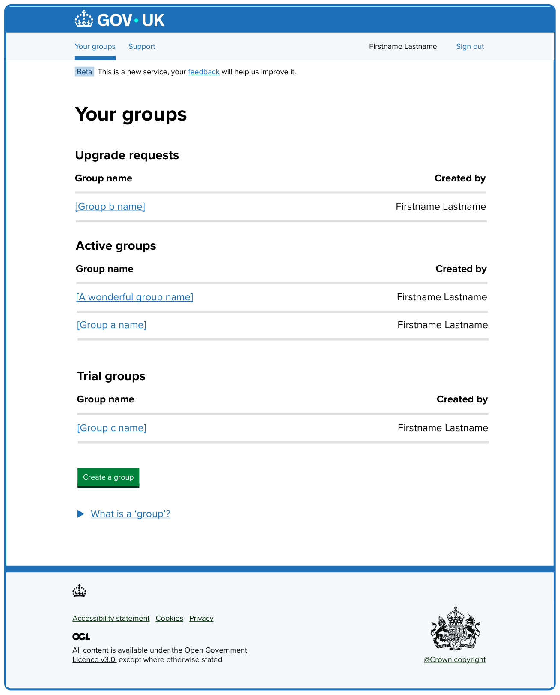

Page titled ‘Your groups’ which lists the different groups within an organisation. This view shows what an organisation admin user would see. 

Table captioned ‘Upgrade requests’ with 2 columns, ‘Group name’ and ‘Created by’. The ‘group name’ table item shows the name of the group as a link to view and edit it. The ‘created by’ table item shows the firstname and lastname of the user who created the group. 

Below is another table captioned ‘Active groups. The table format is the same but this table only shows groups that are in an ‘active’ state. 

This is followed by a third table captioned ‘Trial groups’. 

The page ends with a green ‘Create a group’ button and closed details component labelled “What is a ‘group’?”.  

### Active group   
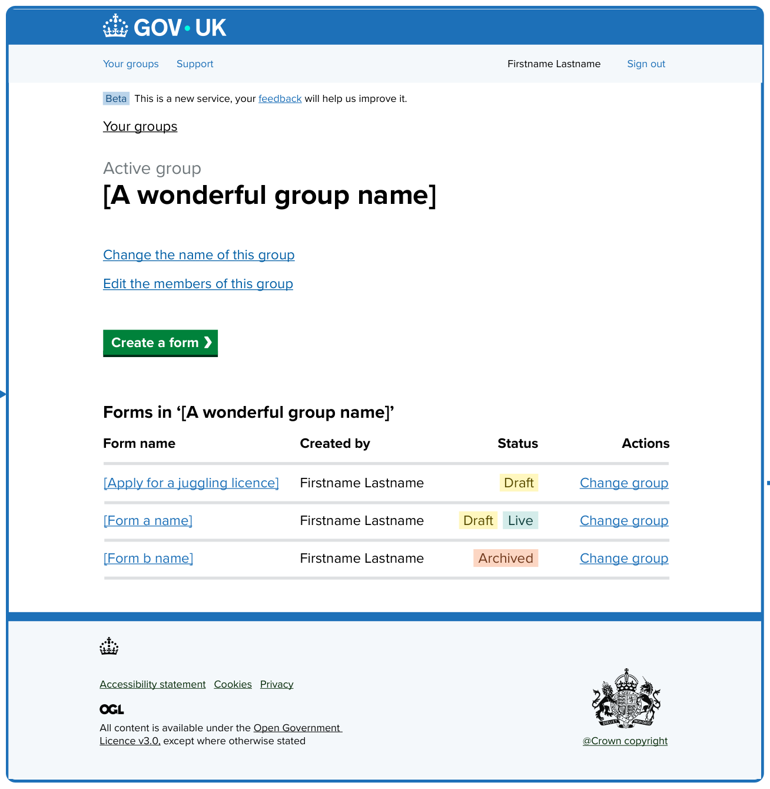

Page titled ‘A wonderful group name’, which is an example of what a group might be named. There is a caption above the heading, ‘Active group’, telling the user what state the current group is in. 

Beneath the heading are 2 links to edit this group: 

- Change the name of this group
- Edit the members of this group

Next is a green ‘Create a form’ button using the start button formatting with the right pointing arrow. 

Finally is a table captioned “Forms in ‘A wonderful group name’”. The table consists of 4 columns:  

- Form name
- Created by
- Status
- Actions

The ‘Actions’ column is new. It will only show for organisation admins. This column shows a ‘Change group’ link for each form. This is where the new journey starts. 

The table in this example shows 3 forms: 

- Apply for a juggling licence
- Form a name
- Form b name 

### Move this form to a different group  
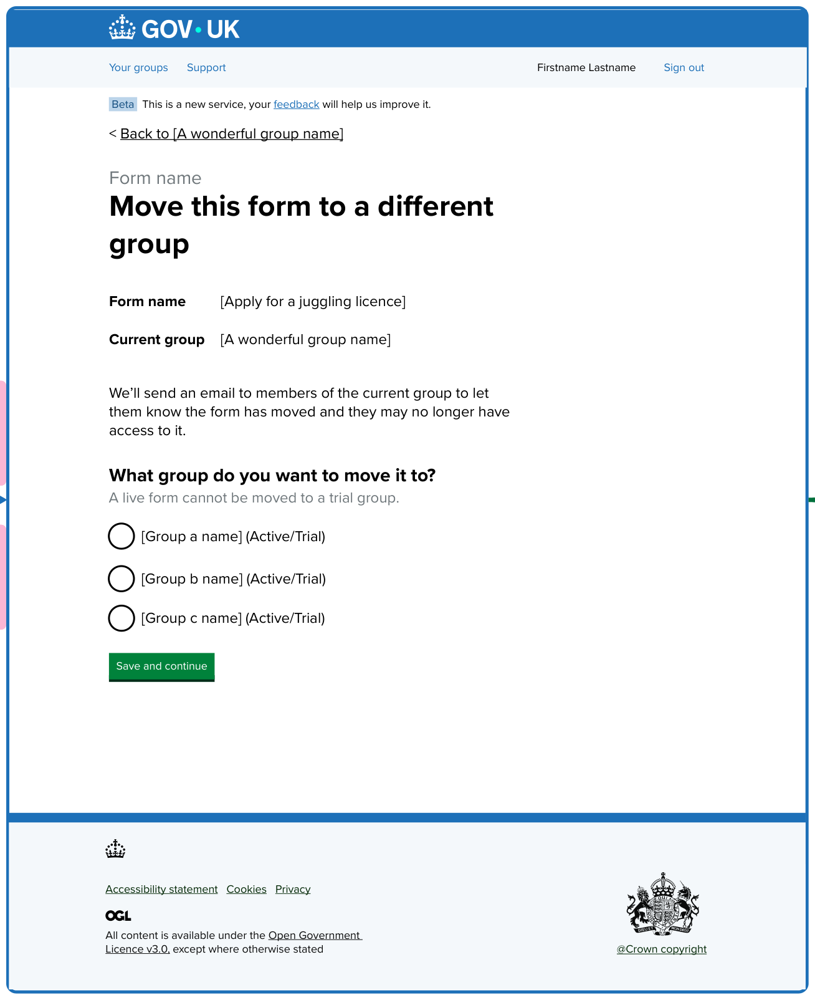

Page titled ‘Move this form to a different group’. There is a caption above the heading, ‘Form name’, reminding the user of the name for the form they’re editing.

Next is a summary list component playing back the name of the form and its current group to give some confidence that they are changing the correct form and group. It shows: 

- Form name: Apply for a juggling licence
- Current group: A wonderful group name

Next is some guidance to explain the effect moving a form may have and that an email will be sent to inform the group’s members: 

> We’ll send an email to members of the current group to let them know the form has moved and they may no longer have access to it.

There is now a question for the user to answer, ‘What group do you want to move it to?’.

If the form being moved is a live form, a hint will be shown to say: ‘A live form cannot be moved to a trial group.’

In the screenshot example, there are then 3 options listed as radio buttons: 

- Group a name (Active/Trial)
- Group b name (Active/Trial)
- Group c name (Active/Trial)

The radio options component is used where the options available are 10 or fewer. Each group name is followed by its status in brackets. 

Finally, there is a green ‘Save and continue’ button.  

#### If there are no other groups for the form to be moved to  
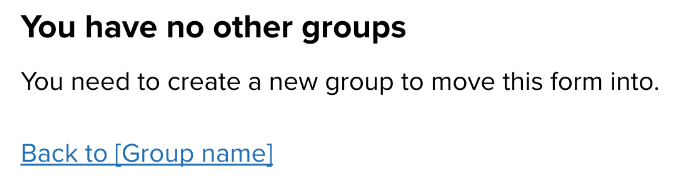

When the user lands on this page and they have no other groups, the question and options list is replaced with static content: 

> **You have no other groups**
>
> You need to create a new group to move this form into.

For this scenario we will not show the ‘Save and continue’ button and instead will show a link to go ‘Back to the [group name]’.

#### If there are no other active groups for a live form to be moved to  
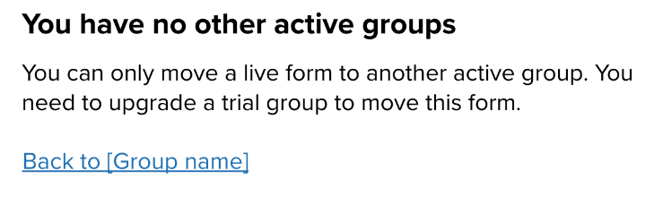

When the user is trying to move a live form but they have no other active groups, the question and options list is replaced with static content: 

> **You have no other active groups**
>
> You can only move a live form to another active group. You need to upgrade a trial group to move this form.

For this scenario we will not show the ‘Save and continue’ button and instead will show a link to go ‘Back to the [group name]’.  

#### If there are between 11 and 30 groups the form can be moved to  
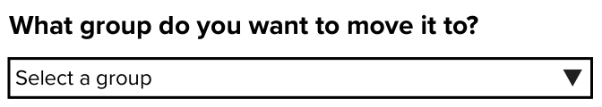

When the user sees this page where they have between 11 and 30 group options to choose from we will show a select component, this was agreed as a fall back to time there are over 11 options available. While an autocomplete component should be shown as the primary choice. 

### If there are more than 30 potential groups this form can be moved to 
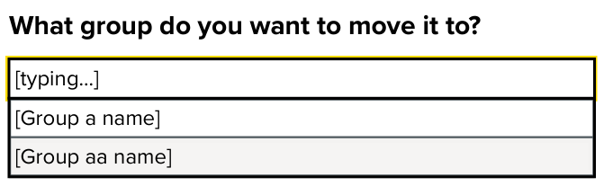

Where there are more than 30 groups to move a form to, the list should as much as possible be shown as an autocomplete, only showing as a select component where javascript is disabled. 

#### Error message if no selection is made  
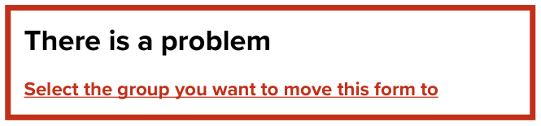

The error message shows ‘Select the group you want to move this form to’ which is a link to the page’s question input.

This error will only appear where a user tries to ‘Save and continue’ without making a choice. This is the same error as it would appear no matter which component is shown. 

### Active group - successfully moved form to a new group   
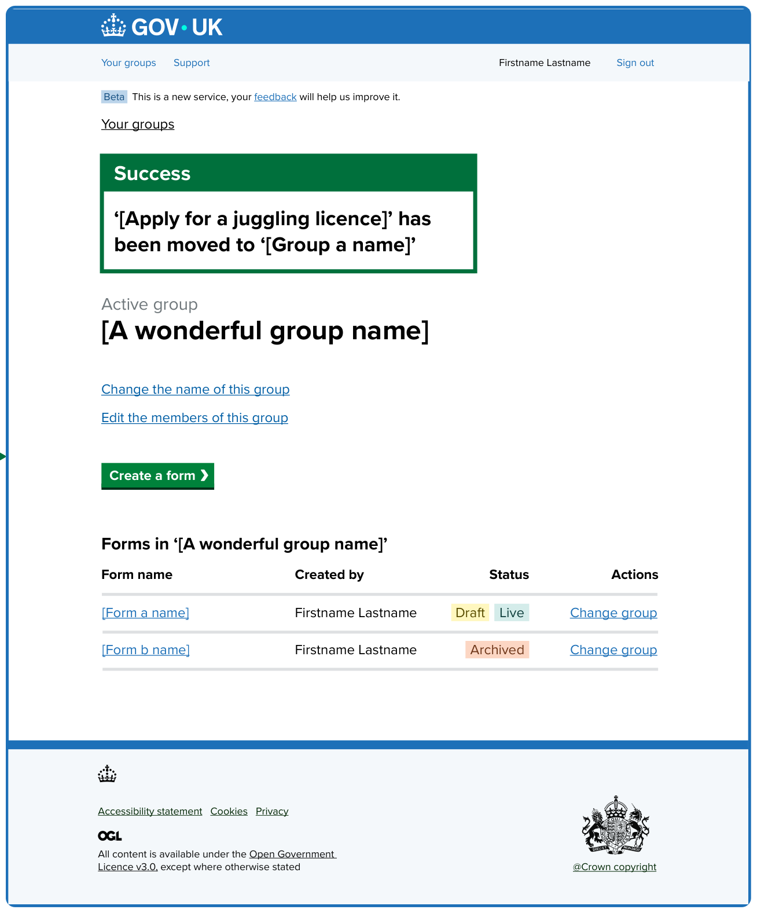

When a form is successfully moved from one group to another the user is returned to the form's old group page - titled with the name of the group. A green ‘Success’ banner now appears at the top of this page playing back the details of the change made to provide confidence that what the user has tried to do has taken effect. The message in this example says: 

> ‘Apply for a juggling licence’ has been moved to ‘Group a name’

The table captioned “Forms in ‘A wonderful group name’” further down the page now only shows 2 forms, no longer showing the ‘Apply for a juggling licence’ row as this form has been moved to another group in the organisation. 

### Notification email - Group admins and editors version 
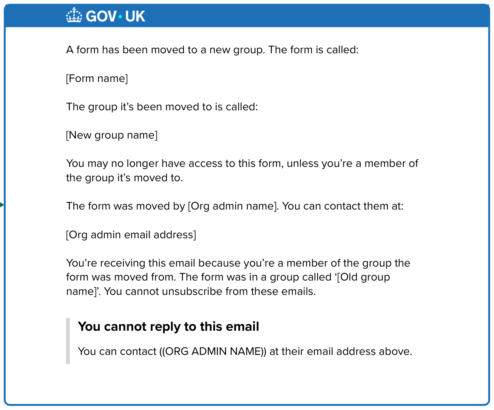

This is an example of the email that group admins and editors will receive when a form that was in one of their groups is moved elsewhere. The intention is to make sure all impacted users are notified of the change, who it was made by and when. This email has the subject line: 

> Your form has been moved

And the body reads: 

> A form has been moved to a new group. The form is called:
> 
> [Form name]
> 
> The group it’s been moved to is called:
> 
> [New group name]
> 
> You may no longer have access to this form, unless you’re a member of the group it’s moved to.
> 
> The form was moved by [Org admin name]. You can contact them at:
> 
> [Org admin email address]
> 
> You’re receiving this email because you’re a member of the group the form was moved from. The form was in a group called ‘[Old group name]’. You cannot unsubscribe from these emails.
>

Finally is some content explaining that this email is a no-reply email, as per the rest of the emails sent by GOV\.UK Forms. It reads: 

> **You cannot reply to this email**
>
> You can contact ((ORG ADMIN NAME)) at their email address above.

### Notification email - Org admins version 
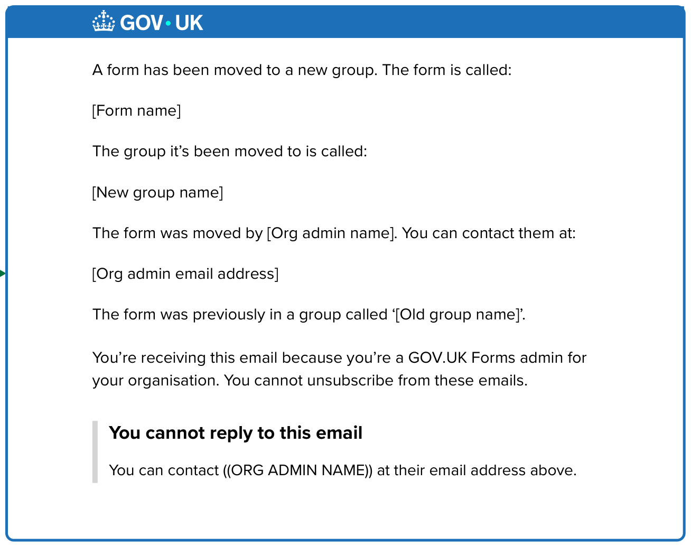

This is an example of the email that organisation admins will receive when a form in their organisation is moved. The intention is to make sure all organisation admins are notified of the change, who it was made by and when so there is accountability and traceability. This email has the subject line: 

> A form has been moved

And the body reads: 

> A form has been moved to a new group. The form is called:
> 
> [Form name]
> 
> The group it’s been moved to is called:
> 
> [New group name]
> 
> The form was moved by [Org admin name]. You can contact them at:
> 
> [Org admin email address]
> 
> The form was previously in a group called ‘[Old group name]’. 
> 
> You’re receiving this email because you’re a GOV⁠\.⁠UK Forms admin for your organisation. You cannot unsubscribe from these emails.

Finally is some content explaining that this email is a no-reply email, as per the rest of the emails sent by GOV\.UK Forms. It reads: 

> **You cannot reply to this email**
>
> You can contact ((ORG ADMIN NAME)) at their email address above. 

___   

   

[Back to the top](#move-a-form-to-a-different-group)  
