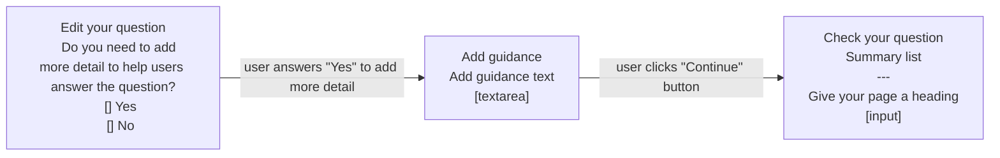

# Metrics for form creators v1

## Status

Date created: *2023-10-18*  

Developed  

___

## Contents

- [Status](#status)
- [Contents](#contents)
- [What](#what)
- [Key decisions](#key-decisions)
- [Design for build](#design-for-build)
- [Notes](#notes)
- [Research focus](#research-focus)

___

 

## What

### As-is

- Our performance analyst sends a manual report to form creators (OR main contacts)  

#### What have we been sending  

- In order of importance for service teams 
    1. Submissions
    2. Completion rate
    3. Question funnel
- Previously supplied: Questions amended from the check answers page - these are low in number, users seem more likely to use the browser forward/back buttons
- Submissions and completion rates over time
- Drop out/pain points
- Ability to download raw data
- Some of the Google Analytics metrics such as device type if/when we implement that on the forms runner (doing anything ourselves would be fraught with data privacy issues). They could then self serve these  

### To-be  

- Form creators can look at basic data relating to their forms performance  
- Admins from OGDs to be able to see the performance of all of their OGD forms  

## Key decisions

### What we will offer

- Number of submitted forms
- Number of unfinished forms - started but not complete
- Completion rate - as a percentage (%)
- A snapshot of the last week of data
  - This will only cover the previous 7 days
  - The previous 7 days will include the day previous to form creator looking but not todays data
  - It will change depending when the user looks at the form, day-to-day
 
### What we won’t offer

- No option to filter dates
- No data over 7 days old
  - Form creators can still ask us to manually produce this information, but is not to be expected
- No question funnel showing the drop outs at a page level
  - This is something we currently provide, and has been used to make improvements to forms when first going live
  - This is something we will try to look at in a future iteration, once we are confident in the data collection method

 

## Design for build

### page

*caption*  

 

#### Flow of prototype tested

 

## Notes

- 
___

 

## Research focus

### Things we plan to focus on in testing:
- 

 

___

 

[Back to the top](#metrics-for-form-creators-v1)
