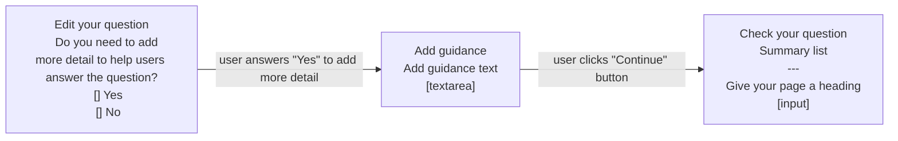

# Metrics for form creators v1

## Status

Date created: *2023-10-18*  

Developed  

___

## Contents

- [Status](#status)
- [Contents](#contents)
- [What](#what)
- [Key decisions](#key-decisions)
- [Design for build](#design-for-build)
- [Notes](#notes)
- [Research focus](#research-focus)

___

 

## What

### As-is

- 

### To-be

- 

## Key decisions

 

## Design for build

### page

*caption*  

 

#### Flow of prototype tested

 

## Notes

- 
___

 

## Research focus

### Things we plan to focus on in testing:
- 

 

___

 

[Back to the top](#metrics-for-form-creators-v1)
