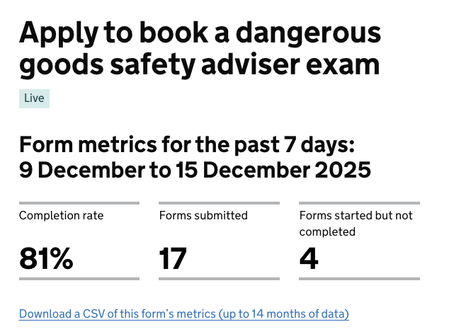
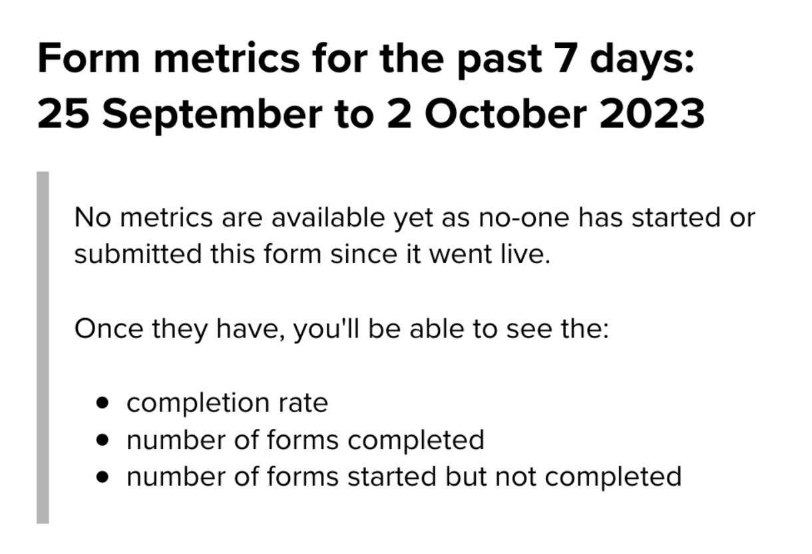

# Metrics for forms for more than 7 days 

Date released: December 2025

[Epic Trello card](https://trello.com/c/hgWpIwGS/153-allow-form-creators-to-see-their-performance-data-for-more-than-7-days)

___

## Contents

- [What is this iteration](#what-is-this-iteration)
- [Design and content](#design-and-content)

___

## What is this iteration?

This iteration allows form creators to download a CSV of data for a form so they can get metrics for a longer period than 7 days.

### As-is

Form creators can get up to 7 days worth of data for a form from the live details page of that form. The metrics they can get are: 

- completion rate
- number of forms completed
- number of forms started but not completed

### To-be  

We want to give form creators access to the same metrics over a longer period of time than 7 days. This will give them greater insights into the performance of their forms over time and mean they don’t need to remember to check the form’s page in admin every 7 days to note down its metrics. 

We already store this data for 14 months, so we will let them download a CSV of all of that form’s data. 

___

## Design and content

This iteration added this functionality with 5 variants of content to be shown on the live details page - depending on what data is available for the form in question. 

### At least 7 days of data

**Description of the image:**
 
This is a screenshot from the live details page of a DVSA form as an example.

Under the title of the form is a heading that reads:
> Form metrics for the past 7 days: 9 December to 15 December 2025

Under the heading, there are 3 metrics, each with a label. They read: 
> - Completion rate, 81%
> - Forms submitted, 17
> - Forms started but no completed, 4

Beneath the metrics is linked text that reads: 
> Download a CSV of this form’s metrics (up to 14 months of data)

### Less than a week’s worth of data

**Description of the image:**

This is a screenshot from the designs in Mural that shows how the content differs if we have fewer than 7 days worth of data for a form.

The content is the same as the previous example, but the heading reflects the number of days represented and the dates it covers. In this example it reads: 
> Form metrics for the past 4 days: 13 November to 16 November 2025

This is followed by the metrics and the link to download the CSV of all the form’s data.

### No starts in the past 7 days and the form is newly live

**Description of the image:**
 
The screenshot shows the content you’ll get if there is no data for the last 7 days because nobody has started or completed the form since it went live.

The heading reads: 
> Form metrics for the past 7 days: 25 September to 2 October 2023

This is followed by inset text that reads: 
> No metrics are available yet as no-one has started or submitted this form since it went live.
>
> Once they have, you'll be able to see the:
> - completion rate
> - number of forms completed
> - number of forms started but not completed

There is no data to download so there is no link to download a CSV.

### No starts in the past 7 days

**Description of the image:**
 
The screenshot shows the content you’ll get if there is no data for the last 7 days because nobody has started or completed the form in those days.

The heading reads: 
> Form metrics for the past 7 days: 25 September to 2 October 2023

This is followed by inset text that reads: 
> No one has started or submitted this form in the past 7 days.

This is followed by a link to download the CSV of all the form’s data. The link reads: 
> Download a CSV of this form’s metrics (up to 14 months of data)

### No data because there’s a problem

**Description of the image:**
 
The screenshot shows the content you’ll get if there is no data because of a system error. 

The heading reads: 
> Form metrics for the past 7 days: 25 September to 2 October 2023

This is followed by inset text that reads: 
> Sorry, there’s a problem getting your form’s metrics. 
>
> Try again later. 

There is no data to download so there is no link to download a CSV.

### The CSV of data for a form

The CSV that people can download shows that form’s data for up to the last 14 months. The CSV has 5 columns. The headings are: 

- Date
- Started
- Completed
- Completion rate (%)
- Started but not completed

The newest data is added to the top of the CSV. 
