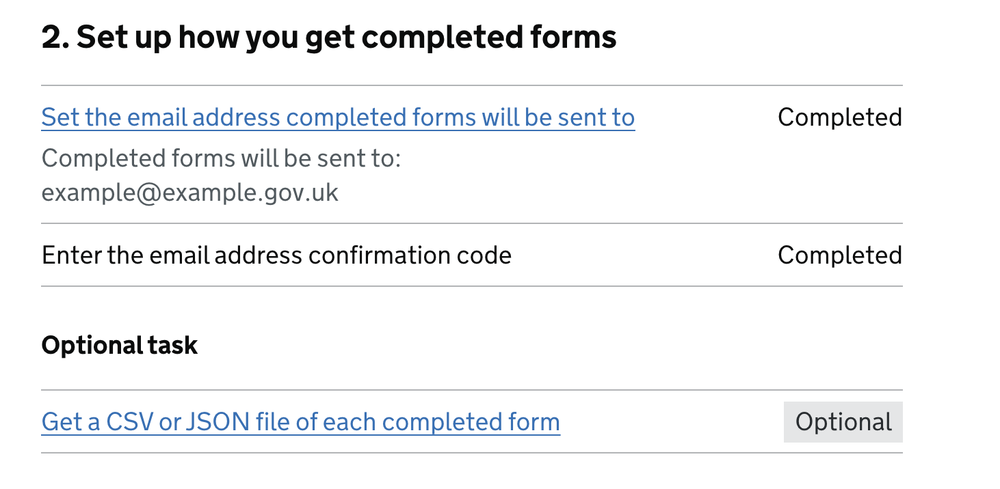
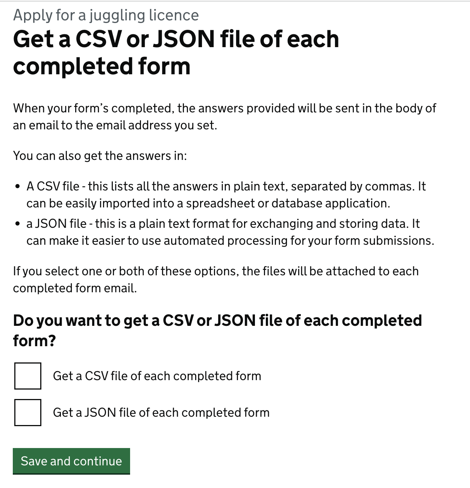

# JSON file submissions

- Date released: December 2025 
- [Epic Trello card](https://trello.com/c/Ou6R5hE4/146-alternative-submission-types-json)
___

## Contents

- [What is this iteration](#what-is-this-iteration)
- [Design and content](#design-and-content)

___

## What is this iteration?

This added the option for form owners to get the answers from each completed form in a JSON file attached to each completed form email.

### As-is

Form creators get answers from each completed form sent to them in the body of an email. They can also opt to get the answers in a CSV file that is attached to each email. 

### To-be  

People can also opt to receive data from each completed form in a JSON file attached to the completed form email. 

### Why?

We believe providing a JSON file as another way to get form submissions would be a useful iteration for people who use automated processing on the completed form emails. 

## Design and content
The designs and content changed for this iteration were: 

- the addition of a second option to the existing optional task to ‘Get a CSV of each completed form’, plus related error and success banner messages
- a new JSON schema and format for each JSON file to use
- additional lines of content for the completed form email and the live form details page if JSON submissions are turned on

### Task list page

**Description of the image and changes:**

The screenshot above shows the second section of the task list for creating a form. It has the heading: “2. Set up how you get completed forms”.

Under the heading there are two tasks. The link text for the first is “Set the email address completed forms will be sent to” and for the second is “Enter the email address confirmation code”. In the example here they each show a status on the right of “completed”. 

Beneath that, there is another task with a subheading, “Optional task”. There is one task listed under this subheading. The link text for this task is “Get a CSV or JSON file of each completed form”. The status of this task is ‘Optional’. 

Before this iteration, the link text for this task was “Get completed forms as CSV files”. 

If the form creator goes into this task and turns either CSV or JSON files on. The status of the task will change to ‘Completed’. If both options are unselected, it will be marked as ‘Optional’.

### ‘Get a CSV or JSON file of each completed form’ page

**Description of the image and changes:**
 
The screenshot above shows the new content on the page for the task. The H1 is: ‘Get a CSV or JSON file of each completed form’. Above the h1, a grey caption shows the name of the form being created. 

The content below the heading is: 

> When your form’s completed, the answers provided will be sent in the body of an email to the email address you set.
> 
> You can also get the answers in:
> 
> - A CSV file - this lists all the answers in plain text, separated by commas. It can be easily imported into a spreadsheet or database application.
> - a JSON file - this is a plain text format for exchanging and storing data. It can make it easier to use automated processing for your form submissions.
> 
> If you select one or both of these options, the files will be attached to each completed form email.

There is then a h2 question that reads: 

> Do you want to get a CSV or JSON file of each completed form?

Followed by two checkbox options: 

> - Get a CSV file of each completed form
> - Get a JSON file of each completed form

And then a green ‘Save and continue’ button. 

People can select one, both or neither option. 

### Success notification banners

If a form creator changes the options selected on the ‘Get a CSV or JSON file of each completed form’ page, they are returned to the task list and a green success banner notification is shown at the top of the page. 

The messages that can be shown: 

| What the form creator selects or unselects     | Banner to show                                            | Task status to set |
|------------------------------------------------|-----------------------------------------------------------|--------------------|
| Doesn't change anything                        | No banner                                                 | Unchanged          |
| Selects or unselects something and CSV is set  | Completed form emails will include a CSV file             | Completed          |
| Selects or unselects something and JSON is set | Completed form emails will include a JSON file            | Completed          |
| Selects something and CSV and JSON are set     | Completed form emails will include a CSV and a JSON file  | Completed          |
| Unselects something and nothing is set         | Completed form emails will not include a CSV or JSON file | Optional           |

### Live form details page
Once a form is live, the live form’s details page shows all information, content and settings for the form. With this iteration we’ve edited the section that listed if completed form emails would include a CSV attachment of the answers.

This section’s heading is now “CSV and JSON”.

Beneath that, the relevant line out of these 4 is shown: 

- Each completed form is also attached to the email as a CSV file. You have not opted to get each completed form as a JSON file.
- Each completed form is also attached to the email as a CSV file and a JSON file.
- Each completed form is also attached to the email as a JSON file. You have not opted to get each completed form as a CSV file.
- You have not opted to also get each completed form as a JSON or CSV file.

### Completed form email
If JSON attachments are turned on, there is a new additional line in the completed form email to tell the recipient that there is a JSON file attached, and its filename. For example: 

> A JSON file of these answers is attached to this email in a file named: govuk_forms_name_of_the_form_AR2DR5WF.json

