# Live and draft feature v1
## Status

Date created: *2022-05-26*  

## Contents

- [Live and draft feature v1](#live-and-draft-feature-v1)
  - [Status](#status)
  - [Contents](#contents)
  - [User steps](#user-steps)
  - [Decisions](#decisions)
  - [Designs](#designs)
    - [GOV.UK Forms landing page](#govuk-forms-landing-page)
    - [Live form view only](#live-form-view-only)
    - [Your questions view only](#your-questions-view-only)
    - [Edit draft form task list](#edit-draft-form-task-list)
      - [Edit draft in progress task list](#edit-draft-in-progress-task-list)
      - [Edit draft completed task list](#edit-draft-completed-task-list)
    - [Make your changes live](#make-your-changes-live)
    - [Your changes are live](#your-changes-are-live)
    - [Preview form](#preview-form)
      - [Preview live form](#preview-live-form)
      - [Preview draft form](#preview-draft-form)
    - [Form filler view of a live form](#form-filler-view-of-a-live-form)

## User steps

```mermaid

flowchart LR;

  step1["Create a form task list
  Complete all the tasks
  "]

  step2["Make form live
  Choose 'Yes' to proceed
  "]

  step3["Your form is live"]

  step4["Your form page
  View form details
  "]

  step5["Your questions page
  View all questions read only
  "]

  step6["Your form page"]

  step7["Edit your form page
  Complete all the tasks
  "]

  step8["Make your changes live
  Confirm 'Yes' to proceed
  "]

  step9["Your changes are live"]

  step1-->|"Activate 'Make form live' task link"|step2;
  step2-->|"Continue"|step3;
  step3-->|"Continue"|step4;
  step4-->|"Activate 'Questions' link"|step5;
  step5-->|"Back to 'Your form' view"|step6;
  step6-->|"Activate 'Create a draft' button"|step7;
  step7-->|"Activate 'Make changes live' task link"|step8;
  step8-->|"Continue"|step9;

```

## Decisions

- **Create a form** task list page: move 'Preview this form in a new tab' above the task list, so it's easier to access
- **Make form live** page: remove the 'Important' banner and content, because the flow of making changes will be different and we do not need to warn form creators about editing a live form
- **Your form is live**: include confirmation panel to reassure form creators that form went live. It will make the experience more consistent
  - Once the form is live it becomes view only and cannot be deleted. Only draft forms can be deleted
- **Live form view**: 
  - replace the task list with a read only view
  - Present all high level information about the form on one page
  - Initially we considered putting 'Declaration' and 'What happens next' content into their own pages and make them accessible via link. But we decided to present all the information on one page for quicker scan and include 'Details' component under the sections to provide more context about what these sections mean, especially to the uses that haven't created the form before
   - Under Questions section: Provide a link to view all questions and tell how many questions the form has
  - Include a call to action button to 'Create a draft to edit' for a live form that doesn't have a draft in progress. If a live form has a draft in progress the button changes to 'Edit the draft of this form'. Activating the call to action button will lead form creator to 'Edit your form' page
- **Your questions**, read only page: Use summary component to display details about all the questions in the form. 
  - Before we have considered presenting a simple read only list of questions, where each question would be a link to a question details read only page. We decided we want to try a simpler approach of presenting all information about the questions on one page that could be easier to scan.
  - We have iterated the summary component to only present question details that were relevant to the answer type.
  - We display the content of the question as the summary card title H2, so that it's easier to scan by screen readers. We decided to move question hint text content into summary list row, because it would introduce accessibility issues for screen readers if it was combined with the card title.
  - We are aware of potential problems with cognitive overload when a form has a large number of questions. Which might make it harder to scan. We will address any issues when they get raised during research sessions and directly as feedback from users to improve it.
- **Edit your form** task list page
  - Use Inset text component to communicate to the form creators that making their form changes live may have an impact on people filling in the live form at the same time. We think this also will be helpful to know for form creators that are making edits to a form, who might not necessary be the same person that made the form live.
  - Rename task list sections and links to be in line with the context of editing the form
  - If a user made a change to any of form sections and haven't marked the task it as completed, set the task as 'In progress'
  - Once all tasks are completed, form creator can make their changes live
  - Include a 'Delete' button on Edit your form page. We should allow form creators to delete drafts.  
    - If a user wants to delete a draft, we get them through a step 'Are you sure you want to delete this draft?' to confirm the action. 
    - Communicate that deleting a draft will not delete the live form
- **Make your changes live** page:
  - Communicate to form creators the impact on form fillers when the make changes live
  - Ask form creators to confirm with 'Yes' to continue
- **Your changes are live** confirmation page: use the confirmation panel to keep the experience consistent
- **Forms landing page**:
  - If a form has a live and a draft version, display both status tag. When a user activates the form name link, they should land on the Live form view only page and can access the draft form via 'Edit the draft of this form' button

## Designs

### GOV.UK Forms landing page

*Image Caption*
### Live form view only

*Image Caption*

### Your questions view only

*Image Caption*

### Edit draft form task list

#### Edit draft in progress task list

*Image Caption*

#### Edit draft completed task list

*Image Caption*

### Make your changes live

*Image Caption*

### Your changes are live

*Image Caption*

### Preview form

#### Preview live form

*Image Caption*
#### Preview draft form

### Form filler view of a live form
