# Live and draft feature v1
## Status

Date created: *2022-05-26*  

## Contents

- [Live and draft feature v1](#live-and-draft-feature-v1)
  - [Status](#status)
  - [Contents](#contents)
  - [User steps](#user-steps)
  - [Decisions](#decisions)
  - [Designs](#designs)
    - [GOV.UK Forms landing page](#govuk-forms-landing-page)
    - [Live form view-only](#live-form-view-only)
    - [Your questions view-only](#your-questions-view-only)
    - [Edit draft form task list](#edit-draft-form-task-list)
      - [Edit draft in progress task list](#edit-draft-in-progress-task-list)
      - [Edit draft completed task list](#edit-draft-completed-task-list)
    - [Make your changes live](#make-your-changes-live)
    - [Your changes are live](#your-changes-are-live)
    - [Preview form](#preview-form)
      - [Preview live form](#preview-live-form)
      - [Preview draft form](#preview-draft-form)
    - [Form filler view of a live form](#form-filler-view-of-a-live-form)

## User steps

```mermaid

flowchart LR;

  step1["Create a form task list
  Complete all the tasks
  "]

  step2["Make form live
  Choose 'Yes' to proceed
  "]

  step3["Your form is live"]

  step4["Your form page
  View form details
  "]

  step5["Your questions page
  View all questions read only
  "]

  step6["Your form page"]

  step7["Edit your form page
  Complete all the tasks
  "]

  step8["Make your changes live
  Confirm 'Yes' to proceed
  "]

  step9["Your changes are live"]

  step1-->|"Activate 'Make form live' task link"|step2;
  step2-->|"Continue"|step3;
  step3-->|"Continue"|step4;
  step4-->|"Activate 'Questions' link"|step5;
  step5-->|"Back to 'Your form' view"|step6;
  step6-->|"Activate 'Create a draft' button"|step7;
  step7-->|"Activate 'Make changes live' task link"|step8;
  step8-->|"Continue"|step9;

```

## Decisions

**Create a form** task list page:
- Moved the 'Preview this form in a new tab' link to above the task list, so it's easier to find.

**Make form live** page:
- Removed the 'Important' banner because we will no longer need to warn form creators about the impact on form fillers of each edit they make to a form once it's live.

**Your form is live**:
- Added a confirmation panel to reassure form creators that the form is now live. This also makes the experience more consistent.
- Once the form is live it becomes 'view-only' and cannot be deleted. Only draft forms can be deleted.

**Live form view**: 
- Replaced the task list with a read only view of the form's settings and content.
- Initially we considered putting the 'Declaration' and 'What happens next' content into their own pages, but we decided to present all the information on one page so it's easier to access. We used the 'Details' component under these two sections to describe what they are, primarily for people that haven't created a form before so may not know where that content is displayed.
- Questions section - Provided the number of questions in the form with a link to the 'Your questions' page to view them.
- Added a call to action button at the bottom of the page to 'Create a draft to edit' for a live form that doesn't have a draft in progress. If a live form has a draft already, the button changes to 'Edit the draft of this form'. Selecting the call to action button will take the form creator to the 'Edit your form' page.

**Your questions** read only page:
- Used summary component to display details about all the questions in the form. 
- We considered a simple list of the questions - where each question would link to a question details page - but we decided we wanted to try to make all the information about the questions available on one page to make it easier to navigate and scan.
- We have iterated the summary component to only present question details that were relevant to the answer type.
- We display the content of the question as the summary card's title H2 so that it's easier to scan by screen readers. We decided to move the question's hint text content into a summary list row, because it would introduce accessibility issues for screen readers if it was combined with the card title, and because it could have made the titles very long in some cases. 
- We are aware of potential problems with cognitive overload if a form has a large number of questions - which might make it harder to scan. We will address any issues when they get raised during research sessions and directly as feedback from users to improve it.

**Edit your form** task list page:
- Added inset text to communicate to the form creators that making their form changes live may have an impact on people filling in the live form at the same time. We think this is important to know upfront as form creators may need to bear this information in mind when they plan when to make their changes live. 
- Renamed the task list sections and links to match the context of editing the form rather than making it for the first time.
- If a user makes a change to any of form sections and doesn't mark the task as completed, we set the task status to 'In progress'
- Once all tasks are completed, the form creator can make their changes live.

Not yet implemented: 
- We added a 'Delete' button on the 'Edit your form' page to allow form creators to delete drafts of live forms.  
- If a user wants to delete a draft, we take them to a confirmation page to ask 'Are you sure you want to delete this draft?'.
- We also communicate that deleting a draft will not delete the live form.

**Make your changes live** page:
- This page communicates the potential impact on form fillers when changes to a form are made live.
- Form creators confirm with 'Yes' to continue.

**Your changes are live** confirmation page: 
- Used the confirmation panel to keep the experience consistent.

**Forms landing page**:
- If a form has a live and a draft version, we display both status tags. When a user selects a form link, they go to the Live form view-only page and can access the draft form via 'Edit the draft of this form' button.
  
**Preview form**:
- Made previewing a draft and live form look different from each other, so that it is clear what form state the user previewing.
- Removed the 'Beta' tag in the phase banner from the preview, as it wasn't relevant, and replaced it with a 'Draft' or 'Live' tag.
- Added 'You're previewing the draft version of this form' to the phase banner for a draft preview.
- Added 'You're previewing a live form' to the phase banner for a live form preview.
- Used different colours for the live and draft phase banner tag and the live and draft page header border.
- Added a 'PREVIEW' watermark for a live form preview.
- We didn't want to rely on a watermark only, as it wouldn't be accessible, so we also: 
  - added 'Draft/Live preview' to the page title, so it's present in the browser tab
  - added 'draft/live preview' as visually hidden in the question H1, so screen readers can announce it

## Designs

### GOV.UK Forms landing page

The main landing page of GOV.UK Forms. It has a black GOV.UK Forms banner and beta banner, a 'GOV.UK Forms' heading and a green 'Create a form' button. 

It then lists your organisations forms. In this case, 'Government Digital Service forms'. 

The form names are links. To the right of each form link the forms status is shown in either a 'LIVE', 'DRAFT' status tag - or both. 

### Live form view-only

An example of a live form's view-only page. It shows:

- the title of the form
- it's 'LIVE' status tag
- a link to 'preview this form'
- The form URL and a button to copy the URL to your clipboard
- a link to 'Your form's 13 questions'
- the form's declaration text, and a details component explaining where it is shown
- the form's 'what happens next' text, and a details component explaining where it is shown
- the form's submission email, privacy policy link and support contact details
- a green button to 'Create a draft to edit'

### Your questions view-only

An example of the view-only page of a form's questions. Each question is listed in a table with:
- the question as a bold heading
- the question's hint text if it has any
- the question's answer type and details of the answer type as relevant
- the options for selection questions

### Edit draft form task list

#### Edit draft in progress task list

The task list page to 'Edit your form'. The tasks have slightly different wording to the 'Create a Form' task list to reflect that the form builder is editing an existing forma rather than creating it for the first time. Above the task list, inset text warns the form builder than when a draft is made live there can be an impact on people who are part-way through completing the form at that time. The tasks each have a status alongside them, the 'Edit your questions' task in this example is shown as 'IN PROGRESS" while the other tasks are shown as 'COMPLETED'. The final task in the list. 'Make your changes live', is not an active link and has no status (as it cannot be completed yet). 

#### Edit draft completed task list

Same as the previous screenshot but in this example all the tasks except the final 'Make your changes live' taks have the 'COMPLETED' status tag. 'Make your changes live' is now an active link. 

### Make your changes live

This page warns again that "when you make your changes live, there may be an impact on people who are filling in the live form at the same time." It also states that the URL will remain the same (Note that this isn't quite accurate. The URL will still work, but it may have changed if the form creator changes the name of the form. This will be corrected).

The page then asks 'Are you sure you want to make your draft live' with Yes/No radio options and a green "Save and continue" button.

### Your changes are live

A green confirmation page says "Your changes are live". The content beneath the green banner plays back the form's name and URL, then some text explains that the form is not indexed by search engines and you'll need to contact your publishing team to publish the link on GOV.UK. Then there is a link to 'Continue to form details' which takes the user to to view-only live form page.

### Preview form

#### Preview live form

An example of a preview of a question page from a live form. Under the black GOV.UK banner there is a blue 'LIVE PREVIEW' tag and 'You're previewing the live version of this form'. There is a repeating grey 'PREVIEW' watermark behind the content of the question.

#### Preview draft form

An example of a preview of a question page from a draft form. Under the black GOV.UK banner there is a purple 'DRAFT PREVIEW' tag and 'You're previewing the draft version of this form'. Then a link to 'Edit this question'. There is a repeating grey 'DRAFT' watermark behind the content of the question.

### Form filler view of a live form

The same question that was previewed in the previous two designs but in this case it does not have a status tag os extra content under the banner, and it does not have a watermark. 
