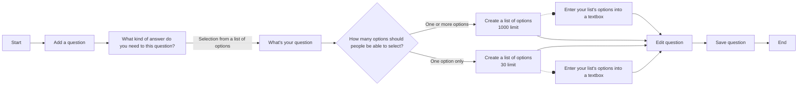

# Create long list autocomplete 

## Status 

Date created: *2024-11-26*  

## Contents

- [Create long list autocomplete](#create-long-list-autocomplete)
  - [Status](#status)
  - [Contents](#contents)
  - [What](#what)
    - [Our users](#our-users)
    - [The problem](#the-problem)
    - [As-is](#as-is)
    - [To-be](#to-be)
  - [Key decisions](#key-decisions)
  - [Measuring impact](#measuring-impact)
  - [Designs](#designs)
      - [Create a select from a list of options question journey](#create-a-select-from-a-list-of-options-question-journey)
    - [Form creator can select an answer type for their question](#form-creator-can-select-an-answer-type-for-their-question)
    - [Form creator can specify their question first](#form-creator-can-specify-their-question-first)
    - [How many options should people be able to select - new step](#how-many-options-should-people-be-able-to-select---new-step)
    - [Create a list of options pages](#create-a-list-of-options-pages)
      - [One only](#one-only)
      - [One or many](#one-or-many)
    - [Edit question page - how we display answer settings and lists of options](#edit-question-page---how-we-display-answer-settings-and-lists-of-options)
    - [Edit selection type warning messages and flows](#edit-selection-type-warning-messages-and-flows)

___

## What

- Epic trello card: https://trello.com/c/HV51GGDO
- Mural working board: https://app.mural.co/t/gaap0347/m/gaap0347/1728565191326/4e246ebea66098d181118529effec7e8776719db?sender=u1786fa2d2029c0638a5c0139

### Our users

- **Form creator** is a person who builds a digital form using GOV.UK Forms
- **Form filler** is a person who fills in the form and submits it in order to receive a service
- **Form processor** is a person who receives the answers from the form submission and uses the information to provide a service

### The problem

- There are forms that require longer lists of options to select from and a lack of custom list creation is a barrier to onboarding more forms
- Form creators have to manually create long list questions
(up to 30 options)
- There is no quicker way to creating lists of options
- Long lists of options are not user-friendly for form fillers
- We don't have an autocomplete support for select one only long lists

### As-is

- Form creator creates a question where the answer can be selected from a list of options. The list of options is limited to 30. Form creator can set if a person can select only one option or one or more options.
- Form creator uses single repeatable fields to create their list of options
- Form creator can specify if the list should include 'none of the above'

### To-be

- Form creator can create a list of more than 30 options when they expect the form filler to select only one option
- Form creator has an easier way for creating a list of options, like pasting the list into a text box
- Form filler can use an easier way to select from a longer list of options (30 +) by typing in the input field that reveals the options and progressively narrows them down with an autocomplete

## Key decisions

- For select only one option we will allow long list for up to 1000 options. When the list of options is longer than 30, we present it to the form fillers as an autocomplete field. Form fillers will be able to search and find the options by typing into an autocomplete box. When the list of options is 30 and under we present it as radios.
- For select one or more (checkboxes) we keep the limit to 30 options, so to ensure that form fillers have a positive user experience, as long lists can be difficult to use.
- We introduce a new step where form creators can choose how many options should people be able to select, so that we can tailor their journey for creating lists of options
- We introduce an additional way of entering options. Form creators can enter all the options into one text box with each option on a new line
- After form creator has made their list of options, on the Edit page we present the list of options as a bullet list and we play back the amount of options they created for reassurance. If the list is longer than 10 options we present it in a 'detail' component, so that

## Measuring impact
We made assumptions and trade-offs when designing and implementing the long lists feature. We needed to measure how the feature is used and in what context, so that we can spot potential problems and find ways to improve it.
We kept the option to include 'None of the above' for select one only longer lists (30+) as weren't sure if there would be use cases for it, but didn't have enough evidence to remove it.

We're measuring how many live forms and questions use the select from a list of options answer type with a specific look into specific details on 

- how many and which forms and questions use the long list autocomplete feature and do the questions include the 'none of the above' - this can tell us if there is an actual need and use for including 'none of the above'. And allow us to drill into more details of the context of the questions and the 
 

## Designs

#### Create a select from a list of options question journey

The diagram outlines the journey with these steps

**Start**

Page: Add and edit your questions -> Use 'Add a question' button

Page: What kind of answer do you need to this question? -> user selects 'Selection from a list of options' -> Continue

Page: What's your question -> User types in their question -> Continue

Page: How many options should people be able to select? -> Presenting two radio buttons: One option only or One or more options -> Select an option -> Continue

*The journey splits depending on which option was selected, but the steps are the same*

Page: Create a list of options -> User can input options one by one or Select a link to enter options into a text box -> Select link or Continue

If continue go to 'Edit question' page

If select link:

Page: Enter your list's of options into a text box -> User can Type or paste a list of options in to t a textarea -> User decides if their list should include 'none of the above' option -> Continue

Page: Edit question -> User can add more information to their question and edit it -> Save question

**End**

 

### Form creator can select an answer type for their question

*A page titled: "What kind of answer do you need to this question?" with a list of answer types to select from*

From this page a **form creator** can select one answer type from a list 

> * Person's name
> * Company or organisation’s name
> * Email address
> * Phone number
> * National Insurance number
> * Address
> * Date
> * Selection from a list of options - *You’ll be able to create a list of options for people to select from*
> * Number - *People will only be able to enter whole or decimal numbers*
> * Text

Selection from a list of option is the starting point of creating lists of options as answers

### Form creator can specify their question first

*A page titled: "What's your question?"*

With a text input and Continue button

### How many options should people be able to select - new step
 

*A page titled: "How many options should people be able to select"*

With two radio options. User can select:
* One option only - *Your list can have up to 1,000 options*
* One or more options - *Your list can have up to 30 options*

and Continue button

We introduced this page to then tailor the content and logic to a specific case, where we allow single selection options to be up to 1000, but we keep the limit for multiple selection to 30 options.

## Create a list of options pages

### Create a list of options - One only

*A page titled: "Create a list of options"*

On this page we:
* play back that people filling in the form will be able to select one option from the list
* state that the limit of options is 1000
* provide a standard way of creating list of options, where user enters each option into text field and can add more or remove them
* provide an alternative way to creating a list of options, where form creator can enter all their options into one text box as a link to a new page
* let users decide if their list should have a 'None of the above' option

 

### Enter your list's options into a text box

*A page titled: "Enter your list's options into a text box"*

On this page we:
* play back that people filling in the form will be able to select one option from the list
* state that the limit of options is 1000
* tell users, that if their list is longer than 30 options, people [filling in the forms] will be able to search and find the options by typing into an autocomplete box
* provide a text box where users can type or paste long lists of options, which each option on a new line
* let users decide if their list should have a 'None of the above' option

The task of creating the list of options is the same, but the main heading of this page is different, so that is more accessible and easier to distinguish for users when the land on a new page following a link.

### Create a list of options - One or many

On this page we:
* play back that people filling in the form will be able to select one option or more options from the list
* state that the limit of options is 30
* provide a standard way of creating list of options, where user enters each option into text field and can add more or remove them
* provide an alternative way to creating a list of options, where form creator can enter all their options into one text box as a link to a new page
* let users decide if their list should have a 'None of the above' option

*A page titled: "Create a list of options"*

### Enter your list's options into a text box

*A page titled: "Enter your list's options into a text box"*

On this page we:
* play back that people filling in the form will be able to select one or more options from the list
* state that the limit of options is 30
* provide a text box where users can type or paste long lists of options, which each option on a new line
* let users decide if their list should have a 'None of the above' option

The task of creating the list of options is the same, but the main heading of this page is different, so that is more accessible and easier to distinguish for users when the land on a new page following a link.

### Edit question page - how we display answer settings and lists of options

*A page titled: "Edit question"*

On this page we:
* Display the question text, and let user edit it
* Let users include an optional hint text in a text box
* Let user add guidance optionally if their question is more complex, and they need to explain how to answer the question
* Show answer settings, where the user can review and edit them
* in the answer settings we display the number of options they created, followed by the list of options. If the list is longer than 10 options, we wrap them in the detail component so that it's easier for them to scan the page
* Let the use save the question, or delete it (after it's saved)
* Provide a link to go back to their questions
* Provide a link to edit next question

### Warning messages and errors

*A screenshot titled: "Important banner warnings"*

We provide warnings to the user when their actions can have an impact on the structure of their form, like routes or to the lists of options itself

If their list is longer than 30 options, and they want to switch to 'one or more options' we say:
> If you change this to 'one or more options', you'll need to edit your list. You can only have up to 30 options in a list where people can select one or more options. If you make this change, you'll be able to edit your list on the next page.

If their list was using a route and was above 30 options, we say
> If you change this to ‘one or more options’, the route from this question will be deleted, and you’ll need to edit the list. You can only have up to 30 options in a list where people can select one or more options. If you make this change, you’ll be able to edit your list on the next page. 

 

*A page titled: "Edit list of options"*

When a form creator wants to change their list of options from 'select one only' to 'select one or more' we show them a message that they might need to edit their list of options (As shown in the 'Important banner warnings").
If they proceed and their list of options is longer than 30, they will see an error message on the 'Edit list of options' page

>You cannot have more than 30 options in a list when people can select more than one option"

The form creator then can edit down their list of options in the text area to meet the limit.

If they save their changes, they get taken to Edit question page to view all their changes.

If the form creator didn't save their changes and used a back link, they will land on the 'Edit question' page. When they try to save the question and their list is still above the limit, we show them the same error message and highlight the area where they can 'Change' the list of options. Screenshot below.

 

*A page titled: "Edit question" with an error message*

