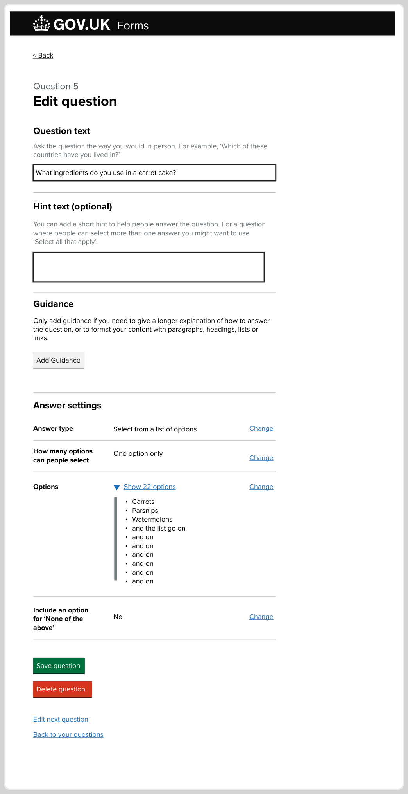

# Create long list autocomplete 

## Status 

Date created: *2024-11-26*  

## Contents

- [Create long list autocomplete](#create-long-list-autocomplete)
  - [Status](#status)
  - [Contents](#contents)
  - [What](#what)
    - [Our users](#our-users)
    - [The problem](#the-problem)
    - [As-is](#as-is)
    - [To-be](#to-be)
  - [Key decisions](#key-decisions)
  - [Measuring impact](#measuring-impact)
  - [Designs](#designs)
      - [Create a select from a list of options question journey](#create-a-select-from-a-list-of-options-question-journey)
    - [Form creator can select an answer type for their question](#form-creator-can-select-an-answer-type-for-their-question)
    - [Form creator can specify their question first](#form-creator-can-specify-their-question-first)
    - [How many options should people be able to select - new step](#how-many-options-should-people-be-able-to-select---new-step)
    - [Create a list of options pages](#create-a-list-of-options-pages)
      - [One only](#one-only)
      - [One or many](#one-or-many)
    - [Edit question page - how we display answer settings and lists of options](#edit-question-page---how-we-display-answer-settings-and-lists-of-options)
    - [Edit selection type warning messages and flows](#edit-selection-type-warning-messages-and-flows)

___

## What

- Epic trello card: https://trello.com/c/HV51GGDO
- Mural working board: https://app.mural.co/t/gaap0347/m/gaap0347/1728565191326/4e246ebea66098d181118529effec7e8776719db?sender=u1786fa2d2029c0638a5c0139

### Our users

- **Form creator** is a person who builds a digital form using GOV.UK Forms
- **Form filler** is a person who fills in the form and submits it in order to receive a service
- **Form processor** is a person who receives the answers from the form submission and uses the information to provide a service

### The problem

- There are forms that require longer lists of options to select from and a lack of custom list creation is a barrier to onboarding more forms
- Form creators have to manually create long list questions
(up to 30 options)
- There is no quicker way to creating lists of options
- Long lists of options are not user friendly for form fillers
- We don't have an autocomplete support for select one only long lists

### As-is

- Form creator creates a question where the answer can be selected from a list of options. The list of options is limited to 30. Form creator can set if a person can select only one option or one or more options.
- Form creator uses single repeatable fields to create their list of options
- Form creator can specify if the list should include 'none of the above'

### To-be

- Form creator can create a list of more than 30 options when they expect the form filler to select only one option
- 

## Key decisions

- For select only one option we will allow long list for up to 1000 options. When the list of options is longer than 30, we present it to the form fillers as an autocomplete field. Form fillers will be able to search and find the options by typing into an autocomplete box. When the list of options is 30 and under we present it as radios.
- For select one or more (checkboxes) we keep the limit to 30 options, so to ensure that form fillers have a positive user experience, as long lists can be difficult to use.
- We introduce a new step where form creators can choose how many options should people be able to select, so that we can tailor their journey for creating lists of options
- We introduce an additional way of entering options. Form creators can enter all the options into one text box with each option on a new line
- After form creator has made their list of options, on the Edit page we present the list of options as a bullet list and we play back the amount of options they created for reassurance. If the list is longer than 10 options we present it in a 'detail' component, so that

## Measuring impact

 

## Designs

#### Create a select from a list of options question journey

Steps are

From the Add and edit questions page -> Create a question
What kind of answer do you need to this question page -> user selects 'Selection from a list of options' -> continue
What's your question -> Use types in their question -> Continue
How many options should people be able to select? -> Radio selection One option only or One or more options

The journey splits

If One option only

If One or more options

 

### Form creator can select an answer type for their question

*A page titled: "What kind of answer do you need to this question?" with a list of answer types to select from*

From this page a **form creator** can select one answer type from a list 

> * Person's name
> * Company or organisation’s name
> * Email address
> * Phone number
> * National Insurance number
> * Address
> * Date
> * Selection from a list of options - *You’ll be able to create a list of options for people to select from*
> * Number - *People will only be able to enter whole or decimal numbers*
> * Text

Selection from a list of option is the starting point of creating lists of options as answers

### Form creator can specify their question first

*A page titled: "What's your question?"*

With a text input and Continue button

### How many options should people be able to select - new step

### Create a list of options pages

#### One only

#### One or many

### Edit question page - how we display answer settings and lists of options

### Edit selection type warning messages and flows

