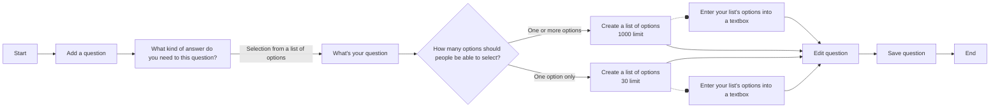

## Create a question with a select from list answers

```mermaid
    
flowchart LR
    A["Start"] --> B["Add a question"]
    B --> C["What kind of answer do you need to this question?"]
    C -- Selection from a list of options --> D@{ label: "What's your question" }
    F{"How many options should people be able to select?"} -- One or more options --> G["Create a list of options<br>1000 limit"]
    F -- One option only --> H["Create a list of options<br>30 limit"]
    G -.-o I@{ label: "Enter your list's options into a textbox" }
    G --> n3["Edit question"]
    D --> F
    H --> n3
    H -.-o n4@{ label: "Enter your list's options into a textbox" }
    n3 --> n5["Save question"]
    n5 --> n6["End"]
    n4 --> n3
    I --> n3
    
```