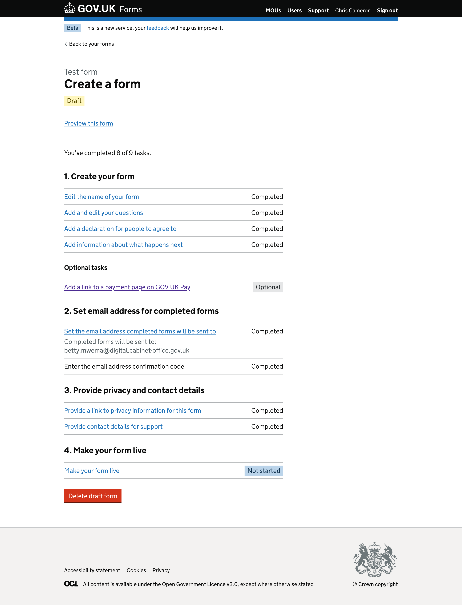
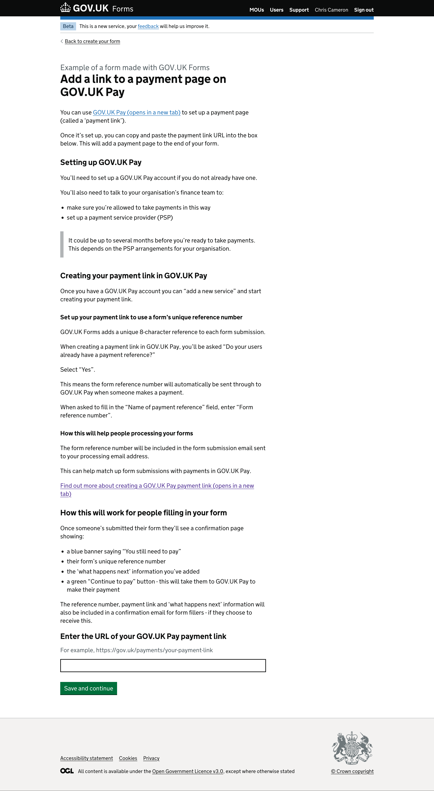
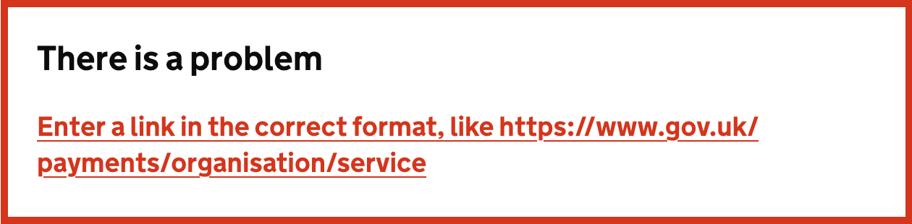
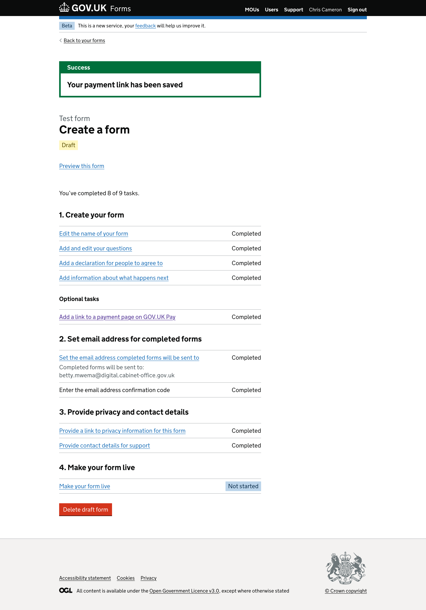
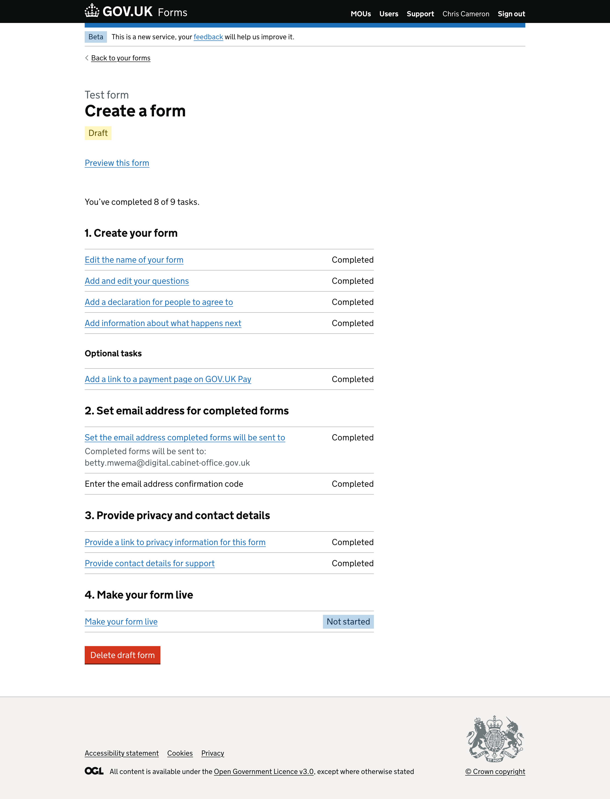
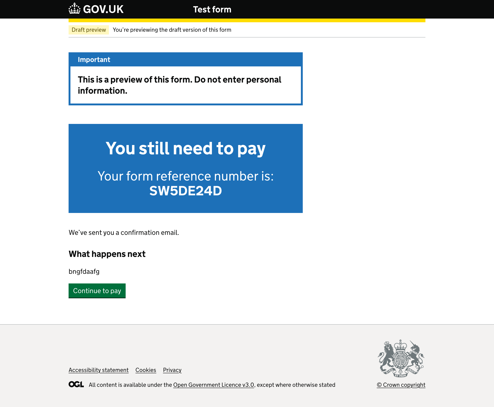
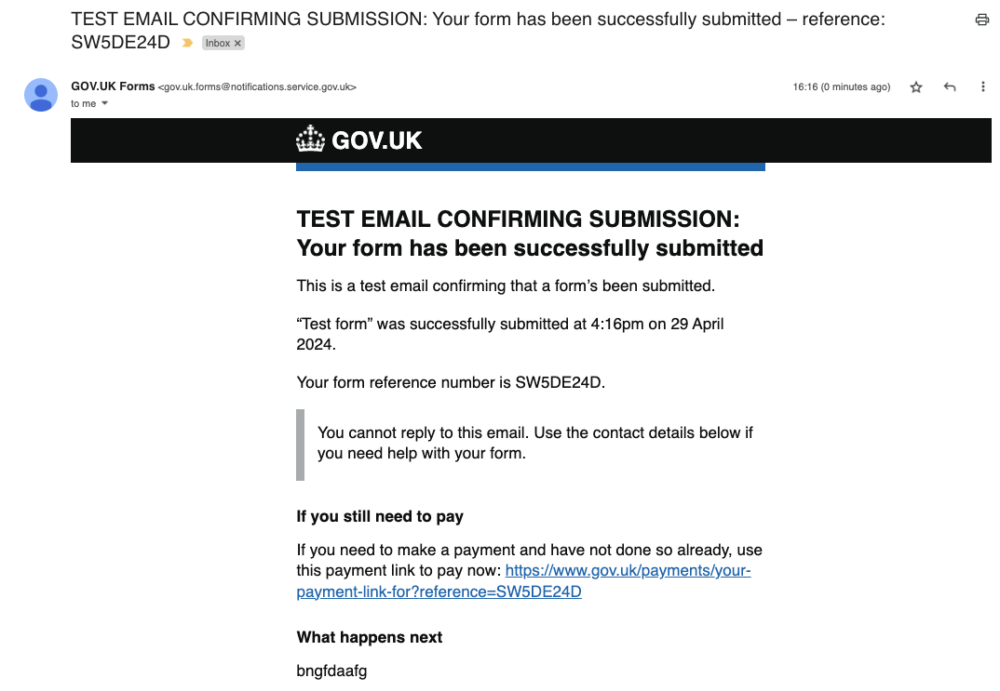
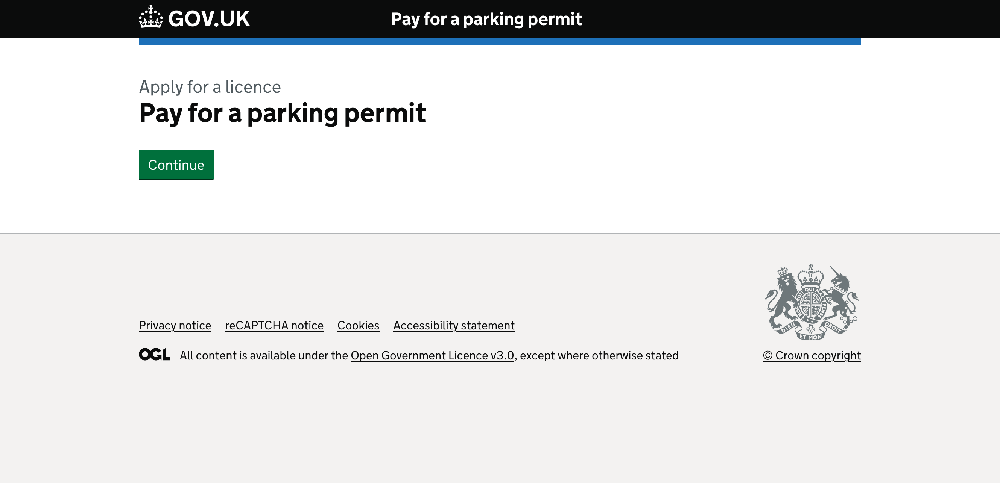

# Payment link v1

## Status

Date created: *2024-04-30*  

Developed  

___

## Contents

- [Status](#status)
- [Contents](#contents)
- [What](#what)
- [Key decisions](#key-decisions)
- [Designs](#designs)
- [Preveiwing the form fillers journey](#preveiwing-the-form-fillers-journey)
- [Research focus](#research-focus)

___

## What

### As-is

- With the introduction of detailed guidance, form creators can now add links to question pages. This in theory allows them to add payment links they generate in GOV.UK Pay - but this is not built into the form building process and it would create a disjointed journey for the form filler. 
- Form creators can also add links to the 'What happens next' information. This in theory allows them to add payment links they generate in GOV.UK Pay - but it's not part of the form building process and we don't provide any guidance about how to do this. 

### To-be

- Form creators can add payment links they have created via GOV.UK Pay
- GOV.UK Forms will handle the journey to make it consistent across forms - this means payments are taken after the form has been submitted (this aligns us with MoJ Forms, and means we don’t need to wait or worry about any work or timelines of the GOV.UK Pay team)  

___

## Key decisions

- We will only offer the opportunity to add a GOV.UK Pay payment link, meaning we will not support other payment providers
  - we will validate the URL provided to make sure it meets the expected GOV.UK Pay link structure  
- We will make the task of adding a payment link ‘optional’ for every form created adding it as a new task on the “Create a form” task list screen  
  - this new ‘optional’ task won’t have an impact on the task completed count used to inform form creators of how many tasks they have outstanding  
- We will give basic guidance as is helpful for our users, we don’t want to replicate anything explained by the GOV.UK Pay documentation or journey  
- GOV.UK Forms will generate a unique reference number for every form submission  
  - this will be included in the submission email sent to the processing email address  
  - this will be included on the confirmation screen  
  - this will be included in the body of the confirmation email, if a form filler chooses to receive it  
  - if a payment link is added, we will include this link in the confirmation email  
- We will align the journey and design with MoJ Forms as our first iteration  
  - using the blue banner with content “You still need to pay” to make it clear to form fillers that they have not finished yet  
  - we will include a clear call to action on this new confirmation screen to make a payment  

___

## Designs

### Create a form - new ‘optional tasks’ section

As part of the journey designs we explored how best to include a new task for payment links. Whether this should be within the ‘what happens next’ information task, a new task as part of the first section on the “create a form” task list or as a new section all together.  

For this version we wanted to make it clear that this new task was ‘optional’ while allowing room for expansion later. Due to this we introduced a new heading within the first “Create your form” section. We also left the total number of ‘completed tasks’ the same, totalling ‘9’. We believe this will help remove the confusion, or ambiguity, of whether a payment link needs to be added to a form to make it live.    

The task list has section “1. Create your form” with the same four tasks: 

- “Edit the name of your form”
- “Add and edit your questions”
- “Add a declaration for people to agree to”
- “Add information about what happens next”

Below this summary list of tasks is the new heading level 3, “Optional tasks”. This heading is followed by a summary list with a single item to “Add a link to a payment page on GOV.UK Pay”. This row has a grey tag with the word “Optional” in it. We decided that this task could only ever be in one of two state; ‘Optional’ or ‘Completed’.  

### Add a link to a payment page on GOV.UK Pay

Beneath the heading “Add a link to a payment page on GOV.UK Pay” is some initial explanatory text. 

> You can use GOV.UK Pay (opens in a new tab) to set up a payment page (called a ‘payment link’).  
> Once it’s set up, you can copy and paste the payment link URL into the box below. This will add a payment page to the end of your form.

The next section titled “Setting up GOV.UK Page” outlines what is needed before you can get started with creating a payment link. 

> You’ll need to set up a GOV.UK Pay account if you do not already have one.
> You’ll also need to talk to your organisation’s finance team to:
> - make sure you’re allowed to take payments in this way
> - set up a payment service provider (PSP)

This is followed by an inset text component informing form creators about potential timing implications if they have not already started the GOV.UK Pay set up journey. “It could be up to several months before you’re ready to take payments. This depends on the PSP arrangements for your organisation.”  

The next section “Creating your payment link in GOV.UK Pay” outlines key steps to make sure that the payment link works correctly with GOV.UK Forms.  

> Once you have a GOV.UK Pay account you can “add a new service” and start creating your payment link.

There is heading level 3 “Set up your payment link to use a form’s unique reference number”, which provides more detail about the reference numbers GOV.UK Forms uses and how to make sure these are correectly processed with the payment link provided by form creators.  

> GOV.UK Forms adds a unique 8-character reference to each form submission.
> When creating a payment link in GOV.UK Pay, you’ll be asked “Do your users already have a payment reference?”
> Select “Yes”.
> This means the form reference number will automatically be sent through to GOV.UK Pay when someone makes a payment.
> When asked to fill in the “Name of payment reference” field, enter “Form reference number”.

Next is another heading level 3 “How this will help people processing your forms” informing form creators why this is important to get right. 

> The form reference number will be included in the form submission email sent to your processing email address.
> This can help match up form submissions with payments in GOV.UK Pay.
> Find out more about creating a GOV.UK Pay payment link (opens in a new tab)  

The next section “How this will work for people filling in your form” gives more information to form creators about how this will work for people filling in their form and where the reference number and links will appear.  

> Once someone’s submitted their form they’ll see a confirmation page showing:
> - a blue banner saying “You still need to pay”
> - their form’s unique reference number
> - the ‘what happens next’ information you’ve added
> - a green “Continue to pay” button - this will take them to GOV.UK Pay to make their payment
>
> The reference number, payment link and ‘what happens next’ information will also be included in a confirmation email for form fillers - if they choose to receive this.

Finally the page ends with a text input labelled “Enter the URL of your GOV.UK Pay payment link”, giving the hint text “For example, https://gov.uk/payments/your-payment-link” to help form creators find the correct link format for their payment link that they need to share with GOV.UK Forms.  

Finally there’s a green “Save and continue” button taking the form creator back to the “Create a form” task list page.  

#### Add a link error summary

*The error message that is linked to the input says “Enter a link in the correct format, like https​://www.gov.uk/payments/organisation/service”*  

### Create a form - payment link added

*The “Optional tasks” summary list item, “Add a link to a payment page on GOV.UK Pay”, now shows ‘Completed’ with no background to the right side of the row.*

#### Payment link successfully added notification

*The message says “Your payment link has been saved”* 

### Create a form - landing on the task list page that already has a payment link  

When the form creator returns to the “Create a form” task list, if there is already a payment link added then this row appears with ‘Completed’ on the right side of the row. There is still no increase in number of tasks completed.  

___

## Preveiwing the form fillers journey

### Confirmation screen preview 

  

This is an alternative confirmation screen used where a payment link has been added to a form. It shows a blue background panel with the heading “You still need to pay” followed by “Your form reference number is:” and the unique generated reference number for this forms submission.  

We have the usual “We have sent you a confirmation email” text where the form filler has asked for one.  

Next is the heading level 2 “What happens next” below which is the content the form creator has added to inform their form fillers of their internal service level agreements (SLAs) and any next steps the person needs to take.  

The screen ends with a green “Continue to pay” call to action button. This takes the form filler to the payment page that the form creator will have added from GOV.UK Pay. They are then able to make their payment through this journey. The button is a link which we pass the reference number through to Pay to allow matching by the form processor or financial team in the department.  

This journey was adopted from the MoJ Forms teams implementation of [taking payments through GOV.UK Pay](https://moj-forms.service.justice.gov.uk/settings/#payment-links).  

### Confirmation email   

Where a form filler chooses to receive one, and a valid email address is provided, GOV.UK Forms will send an email confirming their submission with basic information such as; date and time; name of the form; what happens next; and contact details to get support if it’s needed.  

As part of the payment link feature we also include a section of content telling form fillers that if they haven’t done so already they should pay for the service.  

The email is a test version titled “TEST EMAIL CONFIRMING SUBMISSION: Your form has been successfully submitted”. Beneath the title is some of the basic information about the submission.  

> This is a test email confirming that a form’s been submitted.
> “Test form” was successfully submitted at 4:16pm on 29 April 2024.
> Your form reference number is SW5DE24D.

There is some inset text to inform users that this email shouldn’t be used to reply to if they need help.  

> You cannot reply to this email. Use the contact details below if you need help with your form.

Next is the new section, “If you still need to pay”, that will display when a payment link is added to the form. The next paragraph is used to nudge form fillers who haven’t paid to do so.  

> If you need to make a payment and have not done so already, use this payment link to pay now: https://www.gov.uk/payments/your-payment-link-for?reference=SW5DE24D

The link also includes the unique reference for the form submission to link payments with submissions.  

Next is the “What happens next” under which is the information the form creator has added, as per their confirmation page.  

The email body ends with a “Contact details” section displaying the contact information provided by the form creator.  

### Example of a GOV.UK Pay payment link start page   

This is an example of a GOV.UK Pay start page. It shows what the form filler would see when they click through to make a payment. 
In this example it shows the service name, “Apply for a licence”, the task or name of the payment as set in GOV.UK Pay, “Pay for a parking permit”. There is no additional content added, but this can be done as part of setting up the payment link within GOV.UK Pay. There is a ‘continue’ button call to action to take the form filler into their payment journey.  

### Notes

Through designing and developing the feature the team wanted to know more information about how we could better align with GOV.UK Pay and if there were any small wins we could work with them to implement, we were able to ask this at a show and tell we attended with the Pay team: 

1. Can you add content for us around payment references? - Maybe a new radio option?  
  - Something sure they could look at  
2. Do you validate reference numbers, to make sure they aren’t paid already?   
  - Something we were looking at - some complexity about this and who can do what in the API  
  - Need to figure out permissions - so one service can’t lookup another service  
3. Can the information on the landing page be formattable? Markdown?   
  - Possibly - not sure … answer is no at the moment  
4. Is there an API we can use to validate payment link URLs are real and/or set up correctly?   
  - Think it's possible for reference number to be reused...  
5. If we send a reference number through but the person has set up the link to use Pay reference will our reference in the URL overwrite the Pay one?  
  - Not asked   

___

## Research focus

### To test
- the journey for form creators in adding payment links
- focus on the content to get a clearer idea of the minimum amount of detail required by most form creators
- unique reference numbers and how they are seen

### Aims
- Explore participants’ understanding of the payment link process acquired from three options for content on the payment link page.
- Understand the amount of content and context that users need to have a good understanding of the payment link feature.

[Usability testing: Add a payment link (GitHub documentation)](../../../research/2024-2-21-Add_a_Payment_Link.md)

 

___

 

[Back to the top](#payment-link-v1)
