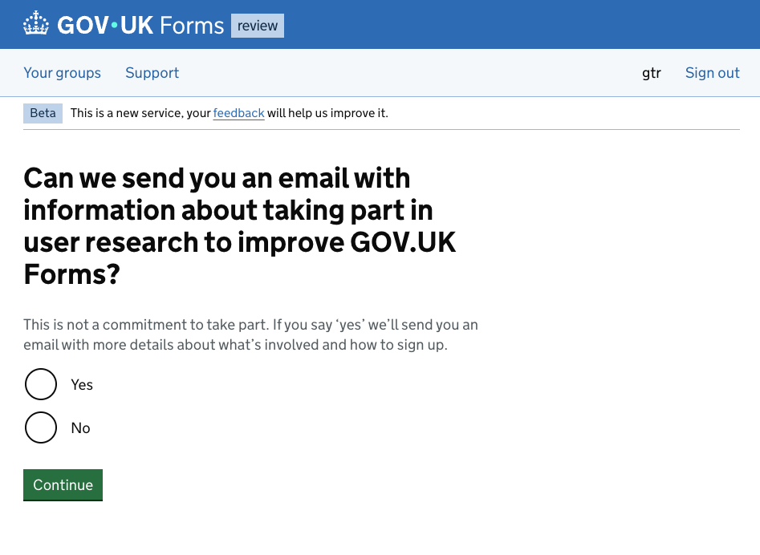

# Get consent to email a form creator about user research

Date: September 2025

Relevant documents: 

- [Feature document ](https://docs.google.com/document/d/1TG1SuyZEouKTTlA4Lzfo5KP6BRWJt8zQf0-yD-rcmsQ/edit?usp=sharing)
- [Trello card](https://trello.com/c/6Vsps6ev/2380-design-and-build-the-new-opt-in-to-be-invited-to-take-part-in-ur-page-for-the-govuk-forms-signup-journey) 
- [Figma designs](https://www.figma.com/design/K1pKN2fX1S5pnuJOcFRCQm/Opt-in-for-user-research-during-sign-up?node-id=0-1&t=2qvhRNGhlCMe0y7x-1) 
- [Content for the new consent page](https://docs.google.com/document/d/1h1LRnzFBK4TsGfqWzWQ1qazPi7lSgHD6-eQpqEx-AJg/edit?usp=sharing)
- [Content changes for the privacy notice](https://docs.google.com/document/d/1htdRh5ecIMvmwACAN3FunAlHPq3wDbkhxUkQdW4mjxY/edit?tab=t.7ya2ml8h8tgn#heading=h.dn2re1follhw)
- [Template email to send to people who give consent](https://docs.google.com/document/d/1ERtkIvN81S88J4R_6-Xo1GT1xu-yszolK5-Iw2ntoMk/edit?usp=sharing)

## What’s the need?  

The user research team wanted to recruit more people to the research panel to take part in user research. We have a SmartSurvey form that people need to complete to sign up to the panel. 

We wanted to share this form with people when they created an account, but without disturbing their journey to create an account and start using the platform. To do this we have to get their explicit consent to contact them about it separately. 

## Design decisions

We decided to focus on getting approval to send an email about user research, rather than asking people to sign up to the research panel directly. This would mean: 

- we don’t divert them from the task they’re part way through to create an account and try out GOV.UK Forms
- they will get the email with the information and link to the research panel form at a slightly later time or date, and can leave it for another time if they need to

We will not send emails to people who give consent automatically - at least initially. This reduced the amount of development work needed to get this up and running. The user researcher will need to send emails manually to the people who give consent instead. 

The user researcher will need to be able to access a list of the names and email addresses of people who have given their consent to be emailed about user research. We decided to keep this inside the platform to reduce the movement of people’s data and to make it easier to meet GDPR. The user researcher would also need the date and time each person gave this consent so they can see who they need to send emails to since they last sent them out. 

Names and details of people who go on to sign up to the research panel are all stored and managed outside of the platform. 

## How does it work? 

The feature introduces a new page to the journey for people when they first create an account. 

The page asks them if they would be willing to get an email about user research. If they give their consent and select ‘Yes’, their name is then recorded in a report along with their email address and the time and date they consented. 

A user researcher can then consult the report periodically to get the email addresses of people who have given their consent. They will then send an email to them with information about taking part in user research and a link to the form to sign up to the research panel. 

We decided to show the new page and ask the question to everyone with an account next time they sign in - as well as to people who create an account for the first time. That was easier to implement, and would also increase the number of people we can potentially email about taking part in research.

## The user journey

This image shows where the new consent page appears in the journey users follow when they create a new account or when they sign in to an existing account. 

They start by going to the platform - either directly or by clicking the links on the product site.

They then either create a new account or sign in to an existing account through Auth0. As part of this, they are emailed a code to authenticate their email address. 

If they are creating a new account, they then get 3 pages that ask them:

- to select their organisation
- to enter their name
- to agree to the terms of use

Both people who are creating a new account and people who are signing in to an existing account are then shown the new page that asks for their consent to send them an email about taking part in user research. Once they have answered this question, they will not be shown this page again. 

## The consent page

The image shows a screenshot of the new page. 

The page’s heading asks “Can we send you an email with information about taking part in user research to improve GOV.UK Forms?”

This is followed by hint text that says “This is not a commitment to take part. If you say ‘yes’ we’ll send you an email with more details about what’s involved and how to sign up.”

There are then 2 radio options: ‘Yes’ and ‘No’.

And then a green ‘Continue’ button.

## The report

The image shows the ‘Users interested in research’ report. The report is in a table format with 3 columns. The columns are: ‘Name’, ‘Email’ and ‘Date agreed’.

There are 3 rows with example data for 3 dummy users - showing their names, email addresses and the date and time they agreed to be contacted about user research.
