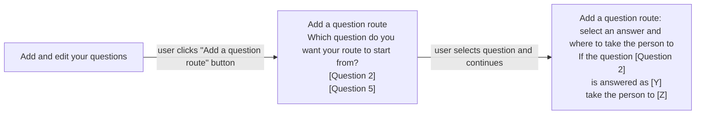
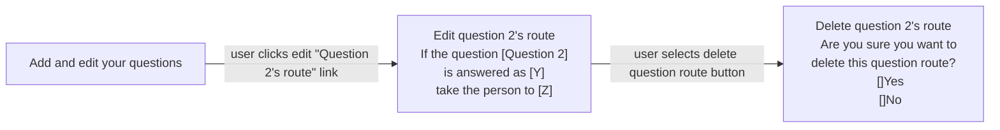

# Simple routing v1

## Status

Date created: *2023-05-25*  

Developed  

___

## Contents

- [Status](#status)
- [Contents](#contents)
- [What](#what)
- [Key decisions](#key-decisions)
- [Designs](#designs)
  - [Breaking changes errors](#breaking-changes-errors)
  - [Edit answer type warning](#edit-answer-type-warning)
  - [Notes](#notes)
- [Research focus](#research-focus)

___

<br>

## What

### As-is

- Form creator creates questions and marks them as optional. Form creators can use hint text to explain who needs to complete a question.

### To-be

- Form creator can create a 'question route' by selecting a radio option ('select from a list' question) and setting a page to go to depending on the answer to the route's start question. If a radio option has no set page then option will go to next page in the order (unless another option has the next page set as the next step)  
- Form creator **must** select a next question for each radio option **if** one radio option in a list has had a next question set  
- Form creator can set next (single) question as skippable if radio option X is chosen  


## Key decisions

- We're only going to allow routing to be set up from a radio button answer type 
- Only one route can be set up for each question
  - A question can be routed to and then routed from
  - A question cannot have multiple routes from it
- We will not consider branching journeys as part of this work
- We'll prioritise errors for breaking changes, such as:
  - the answer the route is based on is changed or deleted
  - the question the route takes the person to is deleted
  - the question the route takes the person to is now above the question the route should start from
- We'll also show an error when a question the route takes the person to is now directly below the question the route starts from 
  - This could make our database complicated and have an impact on future iterations
  - This is mostly house keeping
- We will not allow a form to be made 'Live' without the breaking change errors being resolved
  - This is to reduce the likelihood of poor forms, and infinite loops within forms
- We will not allow a creator to change the question the route is based on when editing a route
  - The user should delete a route in this situation, as they'll need to select all the different parts of the route
  - This is something we might revisit, but it makes development easier for now
- Moving a page that has a route attached (meaning the start question) will also move the route
- If the route start question is deleted, the route will also be deleted
- If the route's start question answer type is changed from a radio option, the route will be deleted. This includes:
  - the answer type being changed
  - the option for “People can only select one option” being unselected on the “Create a list of options” screen, making the question a checkbox rather than a radio-type question

<br>

## Designs

### New “Add a question route” journey and view on questions list page


*As part of the list of questions added to the form there's a new row, with the row heading “Question 2’s route”. To the right of this are the start question, the answer to base the route on and the page to take the user to if the answer is chosen. There's an edit link at the end of the row.*

<br>

### Create a new route 


*From left to right, “Add and edit your questions” with grey “Add a question route” button. User is taken to “Add a question route” screen with drop-down list if more than 10 pages have radio answer type. Otherwise, user is taken to the same page but with radio buttons for the appropriate pages. Next, user is taken to “Add a question route: select an answer and where to take the person to” screen. The route the question is based on is played back above a new drop-down list labelled “is answered as” and a second drop-down list labelled “take the person to”.*

#### Create a new route: flow diagram



<br>

### Edit an existing route


*From left to right. “Edit question 2’s route” screen with playback of “If the question” and the question selected. Below is a dropdown labelled “is answered as” with the answer selected, and a second dropdown labelled “take the person to” with a question selected. There is an “Add another answer” grey button above a green “Save and continue” button and a red “Delete question route” button. A red dotted line points to the next screen from the delete button. “Delete question 2’s route” screen shows a playback of the full route with rows for “If this question”, “is answered as”, and “take the person to” above inset text “By deleting this question route the person filling in the form will have to complete every question, even if you do not need them to. Do you want this to happen? If you do, select ‘Yes’.” There is a mandatory question “Are you sure you want to delete this question route?” with radio options for “Yes” and “No” above a green “Save and continue” button.*

#### Edit an existing route: flow diagram



<br>

### Breaking change errors


*List of 4 errors with 2 options of how to display them as inline errors.*

### Edit answer type warning


*We're using the blue notification banner to inform a form creator that if they change the answer type from “Selection from a list of options” the existing question route attached to this question will be deleted. They can cancel by using the back button or the “go to your questions” link in the notification banner.*

This design needs to be tested and is a temporary implementation due to time constraints. We know there's a better way of implementing this breaking change warning - such as introducing an “Are you sure?”-type page journey. 

Current content:  
```
Your existing question route may be deleted
Changing the answer type from “Selection from a list of options” to a different answer type means your route will no longer work and will be deleted.

If you do not want to lose your question route you can cancel this change by using the back button or go to your questions.
```

<br>

### Notes

- Changing the answer type doesn’t actually delete the question route or create any issues or changes to the database until the user presses one of the “Save” button options on the “Edit question” screen
- We still need to consider what (if any) content should be on the “Create a list of options” screen if a user returns to edit if the form completer can select more than one option

___

<br>

## Research focus

### Scenarios to test (prioritised for time):
- Skipping a single question
- Skipping a series of questions
- Errors
  - Error 1: Destination question deleted / Error 2: Removed the option in selection question for defined route
  - Error 5: Changes routing question type to from "selection from a list" to something else
  - Error 4: Destination question moved to immediately below routing question
  - Error 3: Destination question moved above route
- Add questions to… Skip questions(s) based on binary answer (yes/no)
- Add questions to… Skip questions(s) based on multiple answer (country)

[Simple Routing Research Planning and discussion guide](https://docs.google.com/document/d/1OF9Tz-SL3o8qj-yk0mAHkZ9gVhA6ajVy66h7Ct5Lhis/edit)

<br>

___

<br>

[Back to the top](#simple-routing-v1)
