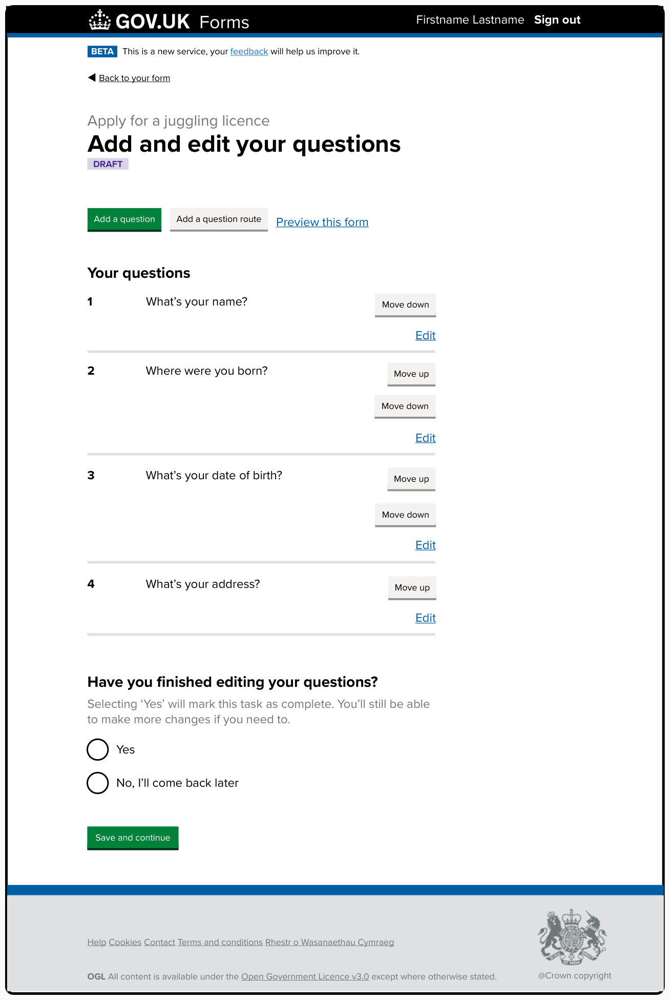
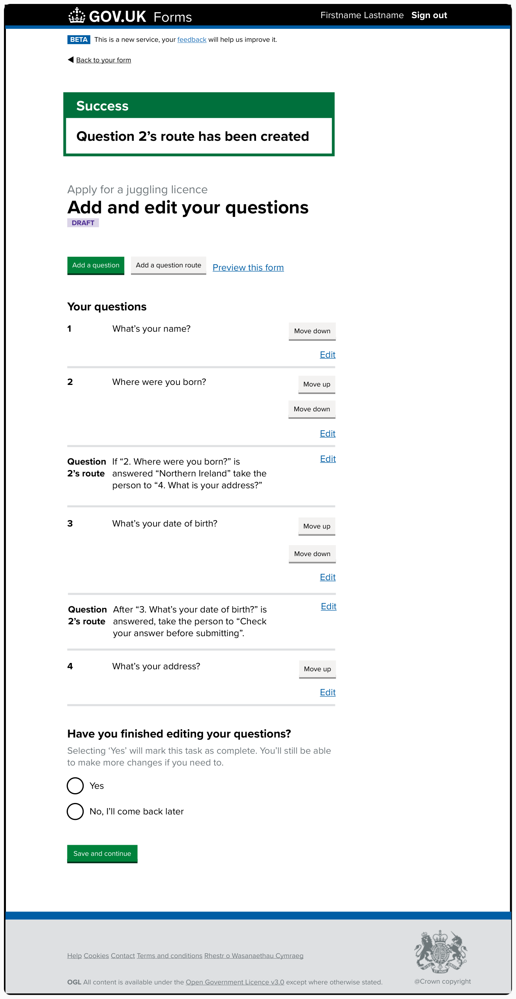
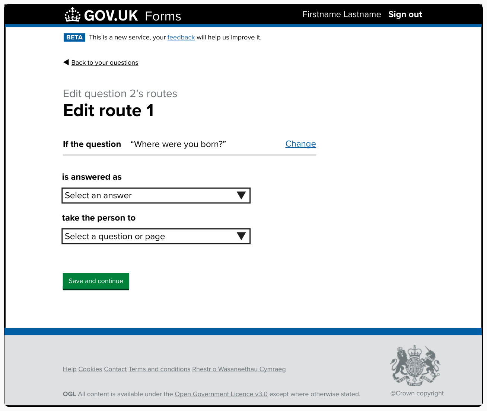
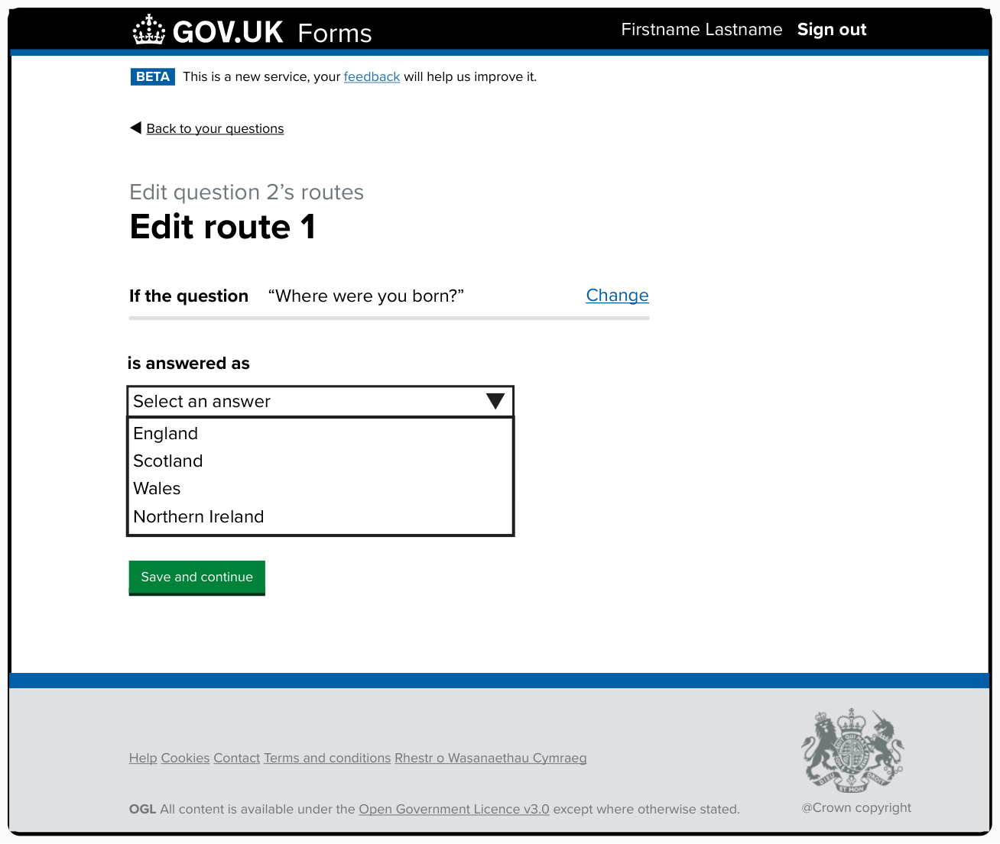
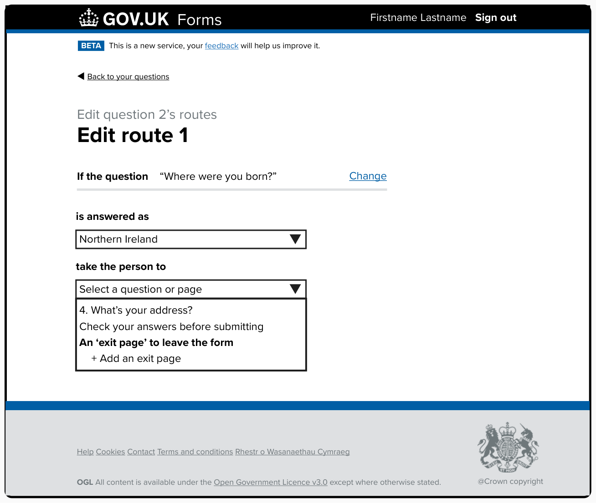
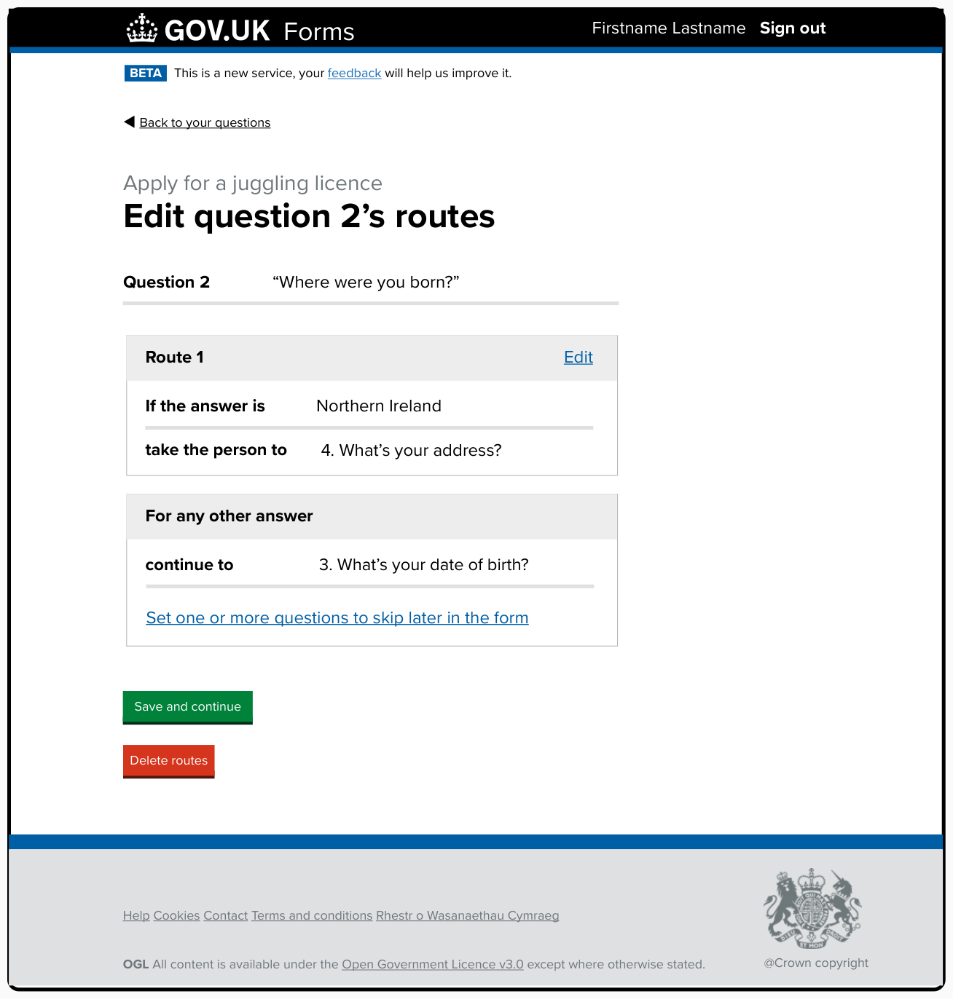
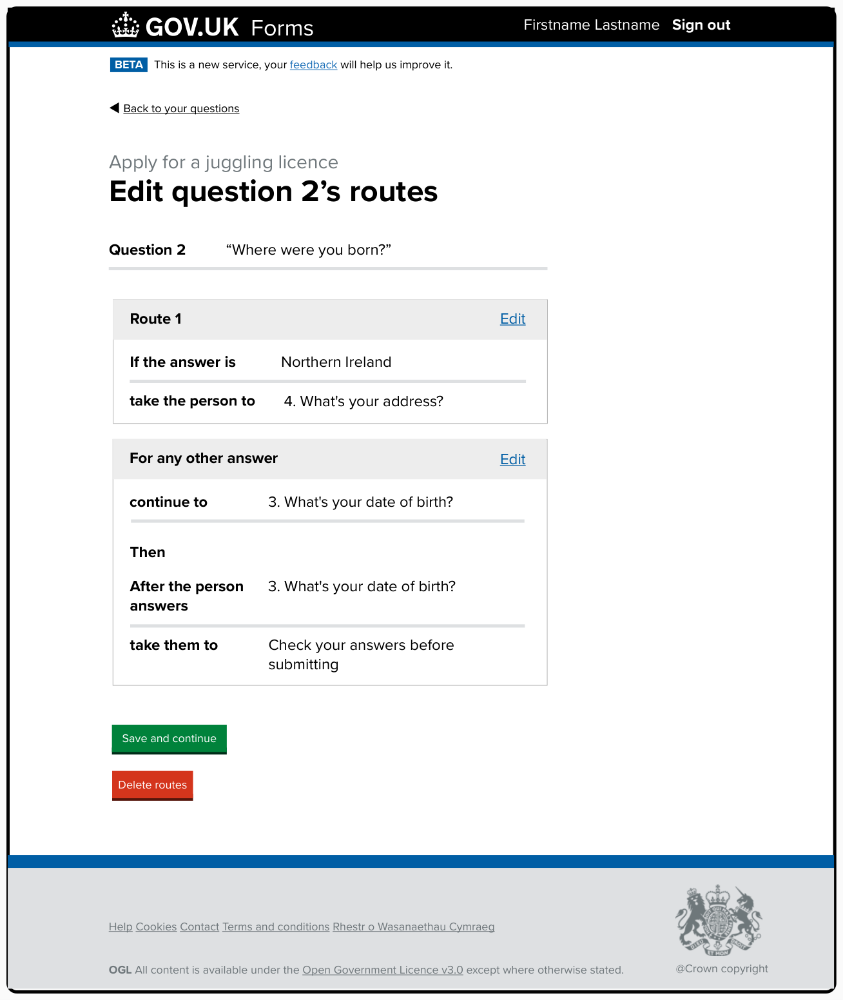
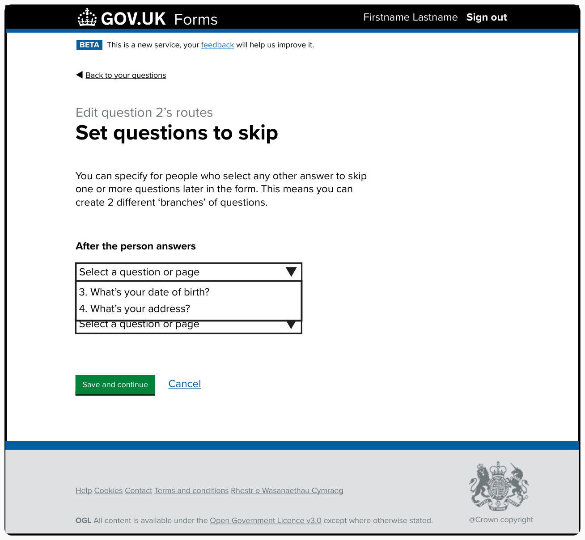
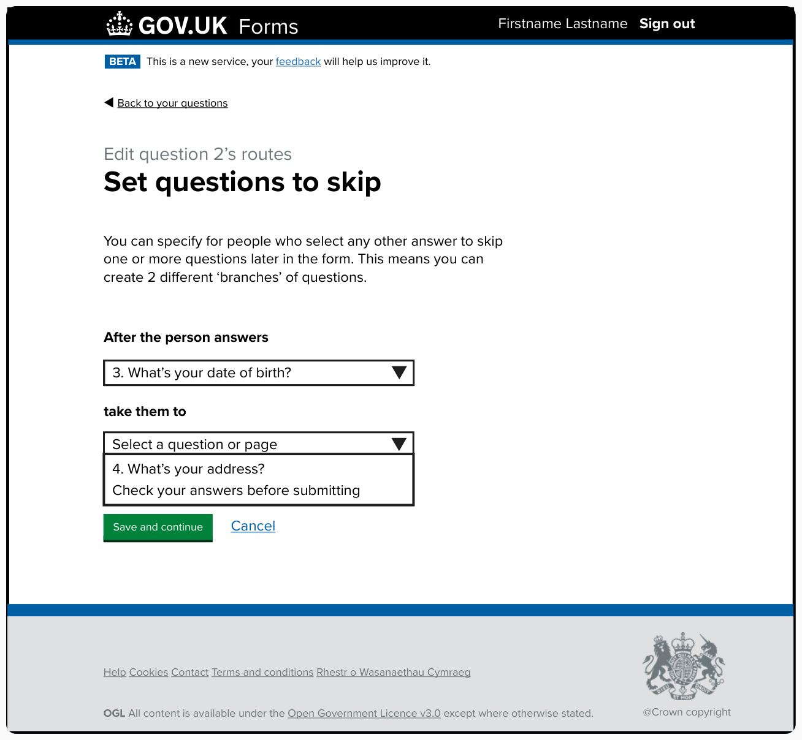
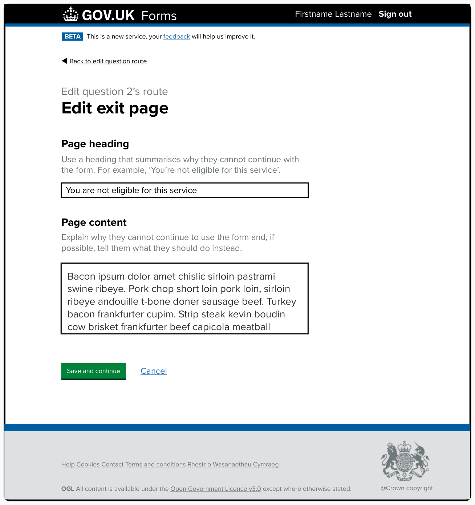

# Branching and exit pages iteration 1

## Status

Date created: *2024-10-24*  

Developing  

___

## Contents

- [Status](#status)
- [Contents](#contents)
- [What](#what)
- [Key decisions](#key-decisions)
- [Designs](#designs)
  - [Breaking change errors](#breaking-change-errors)
  - [Edit answer type warning](#edit-answer-type-warning)
  - [Notes](#notes)
- [Research focus](#research-focus)

___

## What

### As-is

- 1 question can have 1 answer (radio only) that can skip one or more questions

### To-be

- A question can have one radio answer that skips one or more questions - with the option to apply skip logic to any question after the trigger question.  
- A question can have one radio answer that takes the form filler out of the form journey, showing them an ‘exit page’ with custom content created by the form creator. 

## Key decisions

- We’re only going to allow routing to be set up from a radio-button answer type 
- Only one route, branch or ‘exit page’ can be set up for each question
  - A question can be routed to and then routed from
  - A question cannot have multiple routes from it
- We’ve considered allowing multiple routes from a single question, but have deprioritised this for our first development
- We’ll continue to prioritise errors for breaking changes, and will try to inform form creators of orphaned questions but not force them to fix these 
- We’ll continue to show breaking errors previously found and agreed 
- We’ll continue to stop a form being made ‘Live’ without the breaking-change errors being resolved 
- We’ll not allow a form creator to change the question the route is based on when editing a route 
  - The user should delete a route in this situation, as they’ll need to select all the different parts of the route
  - This will also be true at the time of review (checking a question’s routes on the summary card list view) 
- Moving a page that has a route attached (meaning the start question) will also move the initial skip route, but will not impact the secondary route as this should be associated with a different question
  - Moving a page with a secondary route attached will also move the associated route
- If the route start question is deleted, the route will also be deleted
  - The secondary route should also be deleted
  - Any exit pages attached to the route should be deleted, until we have the option to share exit pages across multiple routing questions
- If the route’s start-question answer type is changed from a radio option, the route will be deleted. This includes:  
  - the answer type being changed  
  - the option for “People can only select one option” being unselected on the “Create a list of options” screen, making the question a checkbox rather than a radio-type question
- When a form creator has a route that ends on the “Check your answers before submitting” page, if they add any new questions to their form the original route will still take the person to the “Check your answers before submitting” page
  - It’s up to the form creator to make changes to their route if they now need the form filler to answer the new questions
- As with the current skip routing, if a form creator moves pages up or down they can move them in or out of a branch route
- **TBC: Can a question have an override from a route, while also being a route start?**

## Designs

### Add and edit your questions

*Draft form with a summary list showing questions added to the form “Apply for a juggling licence”.*  

The questions each appear on a new numbered row in the summary list: 

> 1 What’s your name?  
> 2 Where were you born?  
> 3 What’s your date of birth?  
> 4 What’s your address?  

Each row has a button to move the question either ‘up’ or ‘down’ in the form’s order. Question 1 “What’s your name?” only has a “Move down” button, while question 4 “What’s your address?” only has a “Move up” button.  

Each row also has a blue ‘edit’ link that takes the form creator to edit the relevant question.  

#### Add and edit your questions with question routes 

*Draft form with a summary list showing questions and question routes added to the form “Apply for a juggling licence”.*  

At the top of the screen is a green ‘Success’ notification banner saying, “Question 2’s route has been created”. This appears above the page heading, “Add and edit your questions”, and caption, “Apply for a juggling licence”.   

Within the summary list, under question 2 “Where were you born?”, is a new row: 

> Question 2’s route   
> If “2. Where were you born?” is answered “Northern Ireland” take the person to “4. What is your address?”

There is a blue ‘edit’ link for the row that will take the form creator to edit their route.  

Further down, under question 3, “What’s your date of birth?”, is another new row:  

> Question 2’s route   
> After “3. What’s your date of birth?” is answered, take the person to “Check your answer before submitting”.

### Add a route from a question   

*Page titled “Add a route from a question” - for form creators to start their route from.*  

At the top of the page we try to explain what the form creator can do with the routing functionality: 

> You can set up a route so if someone selects a specific answer to a question they will skip some, or all, of the remaining questions in the form. 
> 
> You can also specify for anyone who selects any other answer to skip one or more questions later in the form. This means you can create 2 different ‘branches’ of questions. 
> 
> Or you can add a route to take someone who selects a specific answer to an ‘exit page’ to remove them from the form. For example, because they’re not eligible to use the form.

Below is the question “Which question do you want to start a route from?”. Under the question text we include hint text, “A route can only start from a question where people select one item from a list.”  

Next are the relevant radio options for questions that the Forms tool allows the form creator to start their route from - this means it only shows ‘select from a list’ (radio option) questions.  

Finally, there’s a green ‘continue’ button.  

### Edit route 1  

*Page titled “Edit route 1”, with caption “Edit question 2’s routes” above it.*

There’s a summary list at the top of the page. The row title is “If the question”. The question text appears to the right, “Where were you born?”, with a blue ‘change’ link at the end of the row.  

Below are two labelled dropdowns: 

> Label: is answered as  
> Dropdown default text: Select an answer  

> Label: take the person to  
> Dropdown default text: Select a question or page  

Finally, there’s a green ‘save and continue’ button.  

#### Edit route 1 with “is answered as” dropdown open

*Page titled “Edit route 1”. The first dropdown is open.* 

> Label: is answered as  
> Dropdown default text: Select an answer  

The dropdown is open, showing the four options the form creator has added: 

> England  
> Scotland  
> Wales  
> Northern Ireland  

#### Edit route 1 with “take the person to” dropdown open

*Page titled “Edit route 1”. The second dropdown is open.* 

> Label: take the person to  
> Dropdown default text: Select a question or page  

The dropdown is open, showing the options available to the form creator. This will list the questions and pages in the form that come after the trigger question that the route is based on, “Where were you born?”.  

We’re also including a dropdown option for an exit page, with the possibilty for form creators to “add an exit page” associated with their chosen answer’s route:  

> 4\. What’s your address?  
> Check your answers before submitting  
> An ‘exit page’ to leave the form  
> \+ Add an exit page  

### Edit question 2’s route 

*Page titled “Edit question 2’s routes” showing the routes created for ‘question 2’.*

At the top is the summary list showing the question the route is based on:  

> Question 2  
> “Where were you born?”

There is no ‘change’ link, as the form creator has added a route to their question. If they were to change the question they would lose the routing that’s been added - we therefore remove this option and the form creator can instead delete the routes and create a new route based on the correct question by starting the “Add a question route” journey again.  

Under the summary list is a [summary card](https://design-system.service.gov.uk/components/summary-list/#summary-cards) for the created route.  

The summary card is titled “Route 1” with a blue ‘edit’ link to the top right of the card component. Within the card is a summary list detailing the route:  

> If the answer is  
> Northern Ireland  
>  
> take the person to  
> 4. What’s your address?

Beneath is a second summary card telling the form creator what will happen for people who have not made the selection to go down their created route.  

The summary card is titled “For any other answer”. There is no ‘edit’ link for this route as the form creator currently hasn’t done anything with this route that should be changeable.  

Within the card is a summary list detailing what happens when a form filler hasn’t gone down “Route 1”: 

> continue to  
> 3. What’s your date of birth?  

Finally, within the card is a blue ‘Set one or more questions to skip later in the form” link. This will take the form creator to add additional skip functionality for form fillers who have gone down the ‘any other answer’ route, allowing form creators to turn this route into two separate branches.  

At the bottom of the page is a green ‘save and continue’ button above a red ‘delete routes’ button.  

#### Edit question 2’s route with branching

*Page titled “Edit question 2’s routes” - now also showing the extra routing for the “For any other answer” route.*  

The second summary card titled “For any other answer” now has a blue ‘edit’ link at the top right of the card.   

Within the card is a summary list detailing what happens when a form filler hasn’t gone down “Route 1” including the new branching added by the form creator: 
  
> continue to  
> 3. What’s your date of birth?  
>   
> Then  
> After the person answers  
> 3. What’s your date of birth?  
> take them to  
> Check your answers before submitting   

This now shows that the form fillers who have gone down the ‘any other answer’ route will be skipped to the end of the form after completing the “What’s your date of birth?” question.  

### Set questions to skip

*Page titled “Set questions to skip” with the caption “Edit question 2’s route” above the page heading.* 

There is a lead paragraph designed to help form creators understand what they are able to do on this screen:    

> You can specify for people who select any other answer to skip one or more questions later in the form. This means you can create 2 different ‘branches’ of questions.

Next are two labelled dropdowns for the form creator to add the additional routing to the ‘any other answer’ journey:  

> Label: After the person answers   
> Dropdown default text: Select a question  

> Label: take them to   
> Dropdown default text: Select a question or page  

At the bottom of the page is a green ‘save and continue’ button with a blue ‘cancel’ link next to it.  

#### Set questions to skip with “After the person answers” dropdown open

*Page titled “Set questions to skip” with the first dropdown open.*  

The “After the person answers” dropdown is open showing the questions the form creator can select to end their branch, and the question to take the form filler from once they have answered it. This list only includes questions that come after the trigger question that the route is based on. In this instance it includes the question the form filler is taken to if they’re on the ‘any other answer’ route:  

> 3\. What’s your date of birth?  
> 4\. What’s your address?  

#### Set questions to skip with “take them to” dropdown open

*Page titled “Set questions to skip” with the second dropdown open.*  

The “take the person to” dropdown is open showing the questions and pages the form creator can select to skip the person to. This list only includes questions that come after the question that the ‘any other answer’ route started from - “What’s your date of birth?”. The dropdown shows:  
 
> 4\. What’s your address?   
> Check your asnwers before submitting  

### Edit exit page

*Page titled “Edit exit page” with the caption “Edit question 2’s route” above the page heading.*  

The first question is asking form creators to give their exit page a meaningful page heading: 

> Label: Page heading  
> Hint text: Use a heading that summarises why they cannot continue withe the form. For example, ‘You’re not eligible for this service’.  

This is followed by a single-line text input. Example text in the input is “You are not eligible for this service”.  

Next is a textarea input asking the form creator for the page content to explain why the form filler cannot continue with the form and whether there are potential next steps or someone they should contact instead:  

> Label: Page content   
> Hint text: Explain why they cannot continue to use the form and, if possible, tell them what they should do instead.  

The intention is to try and prompt form creators to give meaningful next steps to reduce the likelihood that the person filling in the form hits a dead end as they may still need to contact the department to get to their required outcome.

At the bottom of the page is a green ‘save and continue’ button with a blue ‘cancel’ link next to it.  

___

## Research focus

- To understand the high-level user needs when using branching (we will learn about more detailed needs when we see them using our designs in action)
- To understand the user’s mental model for branching (where and how to implement it)
- To learn what language people use around branching
- For those who have their own department platform - find out how they’ve implemented this and what they’ve learned

[Research planning and discussion guide](https://drive.google.com/drive/folders/1Jb7oUSfBXBamRgFkIjxf_DMRZEK5sfnM)

### What we tested

[User research session Oct 24 (Mural board)](https://app.mural.co/t/gaap0347/m/gaap0347/1729773162641/fbe698a2b44f833842196c252bb254abbb806042)

___

[Back to the top](#branching-and-exit-pages-iteration-1)
