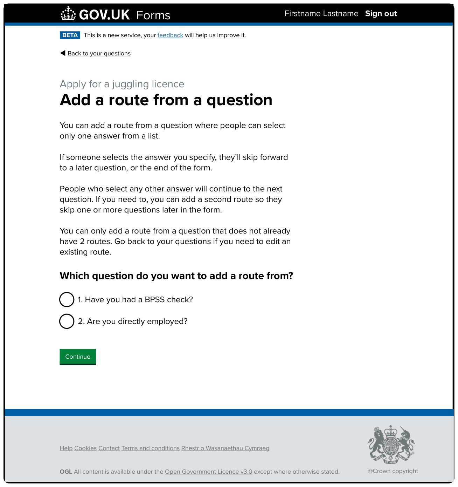
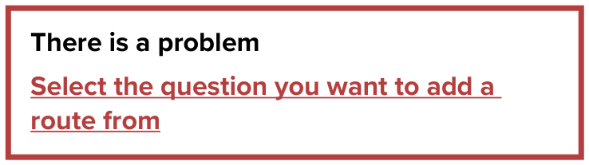
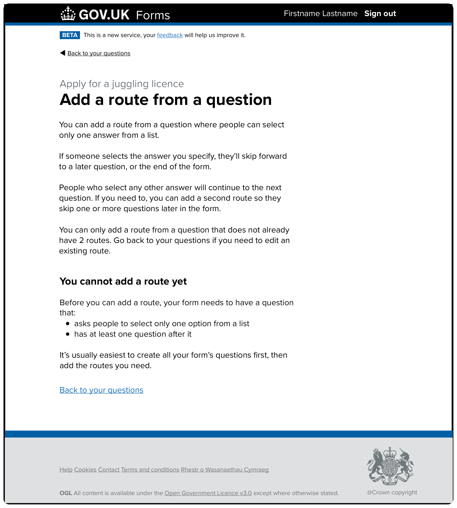
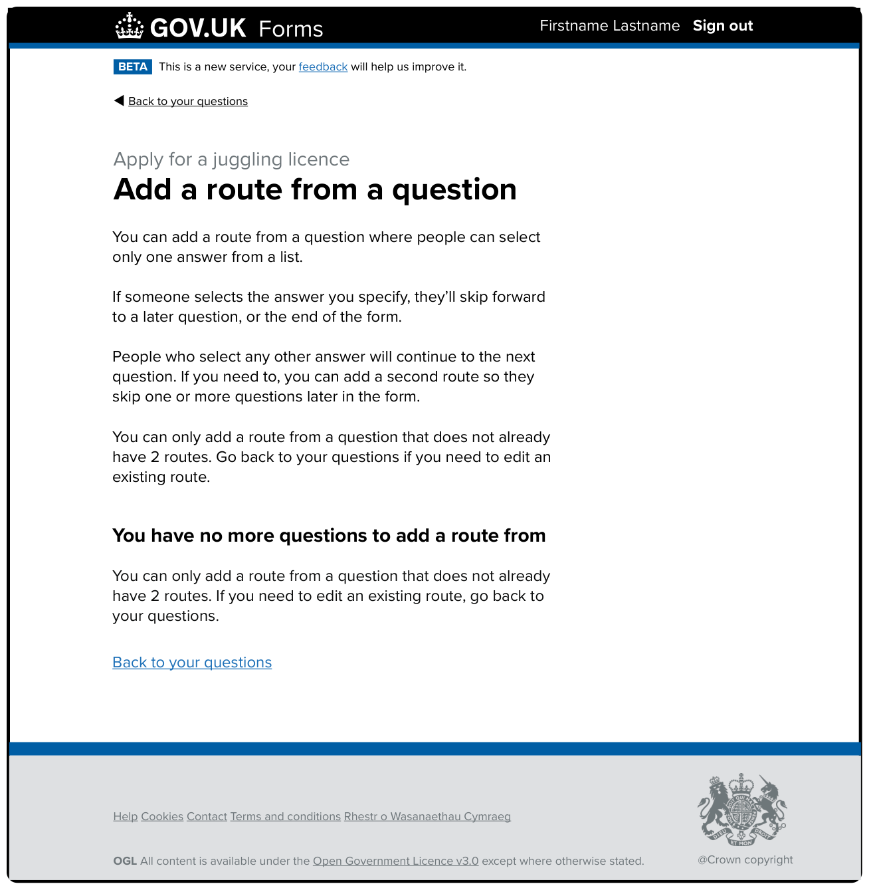
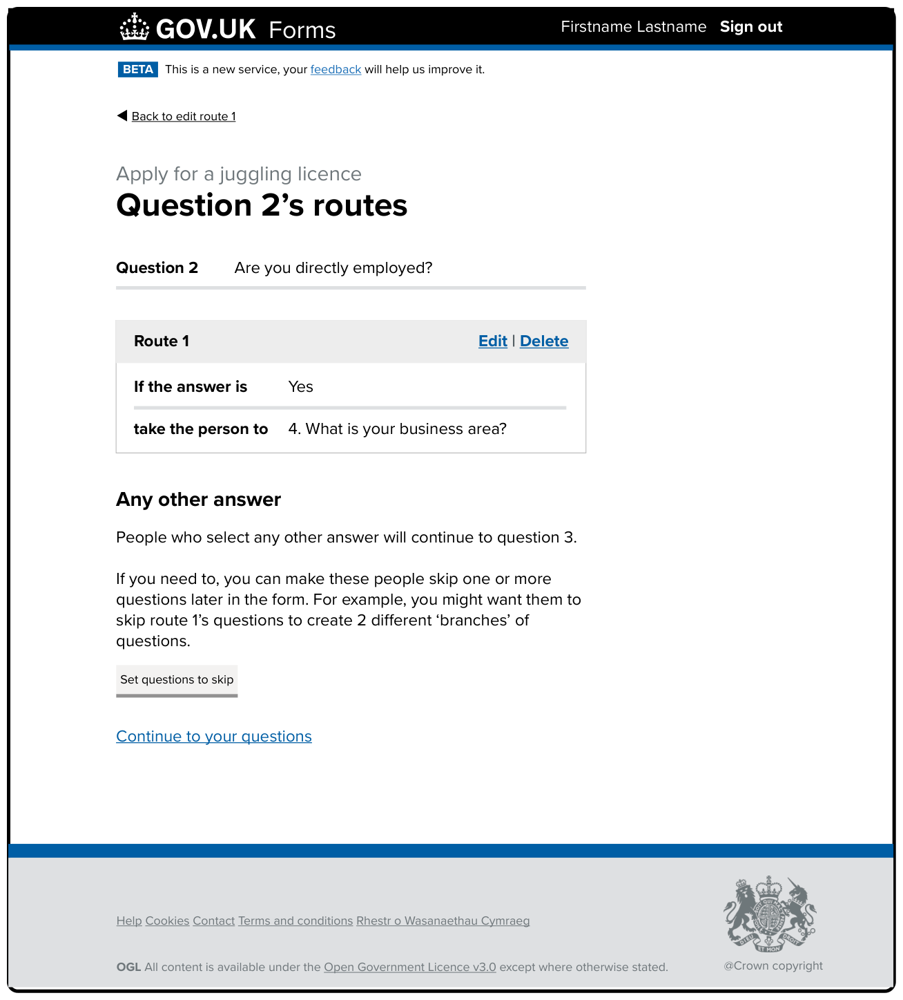
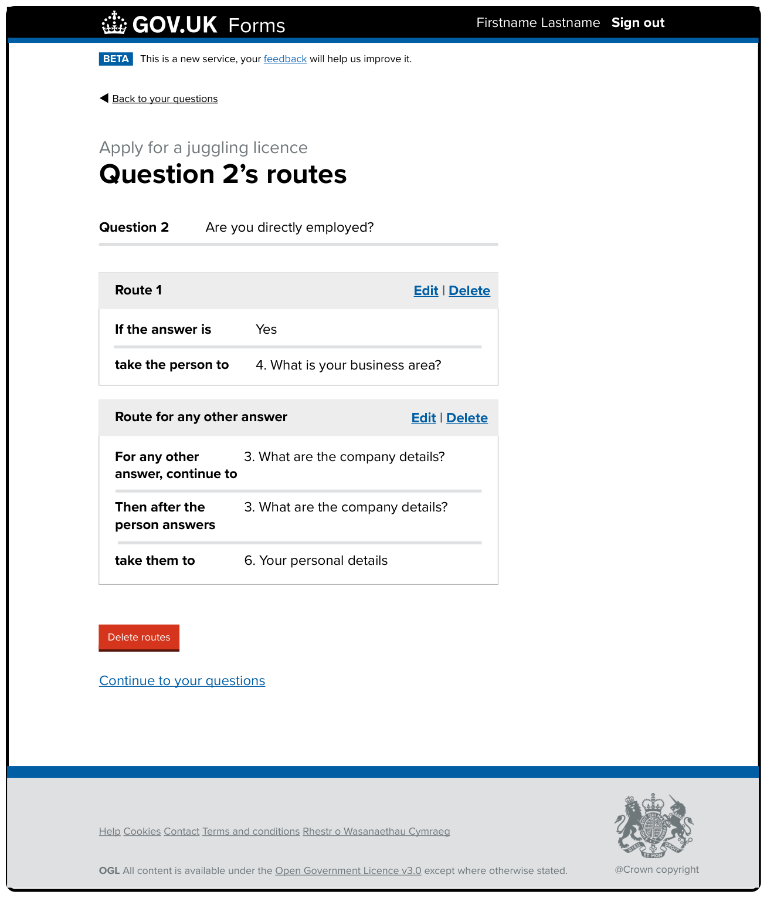
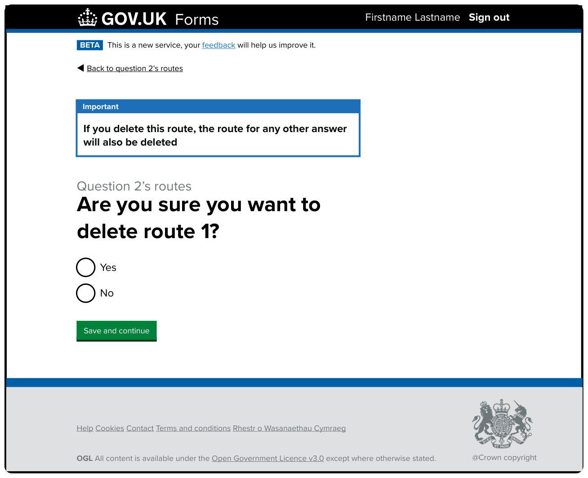
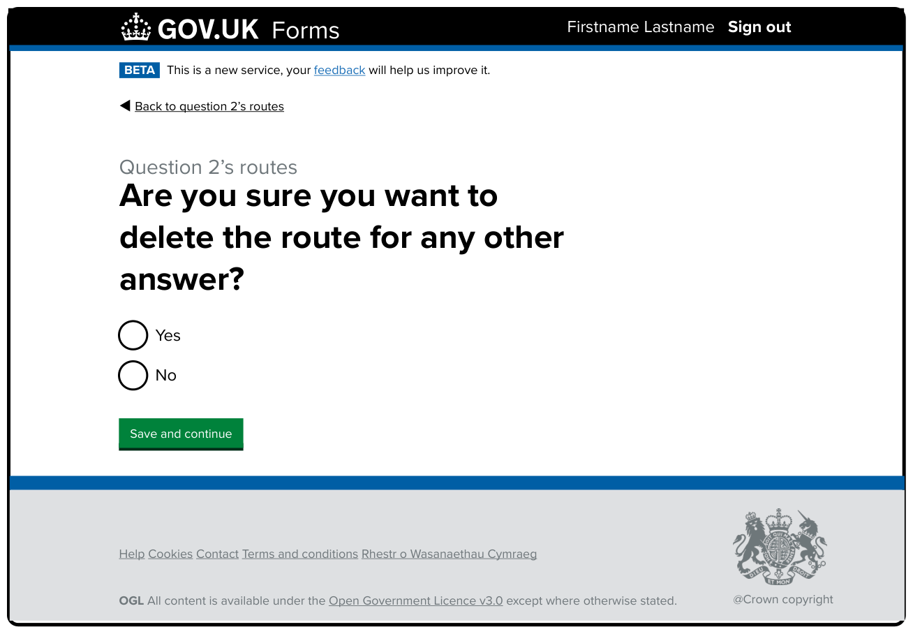
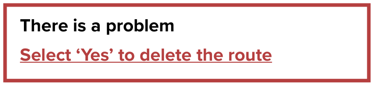
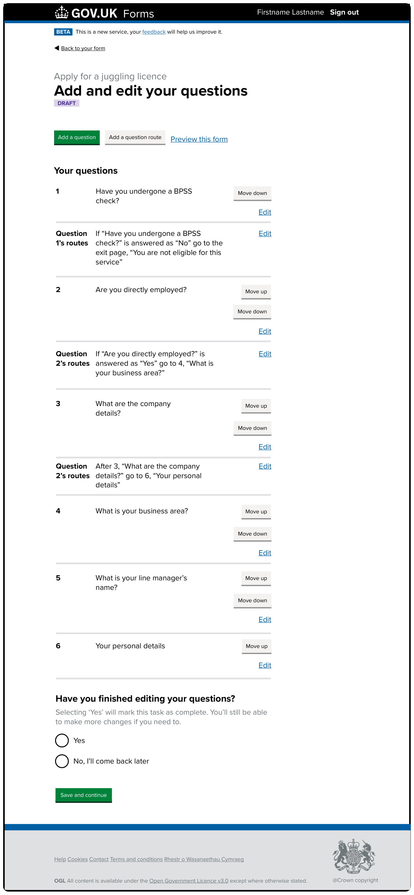

# Branching iteration 3

Date created: 2025-06-11

* * *

## Contents

- [What this documentation covers](#what-this-documentation-covers)
- [Designs](#designs)

* * *

## What this documentation covers

This is the third iteration that was created and put live into production based on previous research. 

[This iteration’s designs in Mural](https://app.mural.co/t/gaap0347/m/gaap0347/1728478914347/6a7e0b709f50f00f81cab37414fdf44ec8601a70?wid=0-1737023334487).

## Designs

### Add a route from a question

#### Description of the image and the changes made in this iteration: 

The page’s H1 is ‘Add a route from a question’. It then has some guidance and a radio question for form creators to select a question to start a route from.

The guidance aims to set expectations for the form creator about what they can and cannot do with routing. It has been updated since the last iteration to make it clearer. It now reads: 

> You can add a route from a question where people can select only one answer from a list.  
>   
> If someone selects the answer you specify, they’ll skip forward to a later question, or the end of the form.  
>   
> People who select any other answer will continue to the next question. If you need to, you can add a second route so they skip one or more questions later in the form.
>
> You can only add a route from a question that does not already have 2 routes. Go back to your questions if you need to edit an existing route.  

Note: this implementation did not include exit page functionality so that is not mentioned in the guidance. 

The guidance is followed by a question: 

> Which question do you want to add a route from? 

This was previously followed by hint text but has been incorporated into the guidance removing the need for it as part of the question component.  

The answer options are all the ‘selection from a list’ questions from the form that only allow one answer (radio questions) and do not already have 2 routes added to them. In the example in the image above, there are 2 questions the form creator can select from. 

Finally, there’s a green ‘Continue’ button.

After the form creator has selected a question to start their route from and then ‘Continue’, they move to the ‘Edit route 1’ page.

### Add a route from a question - You cannot add a route yet

#### Description of the image and the changes made in this iteration: 

This page shows an alternative version of the ‘Add a route from a question’ page where a form does not meet the minimum criteria that allows routing to be added. 

The page heading and guidance content remain the same while the bottom section is replaced by a section titled ‘You cannot add a route yet’. The content reads:  

> Before you can add a route, your form needs to have a question that:  
>   
> - asks people to select only one option from a list  
> - has at least one question after it  
>   
> It’s usually easiest to create all your form’s questions first, then add the routes you need.

The updated content reflects more accurately the criteria required to be able to add routing to a question. We also add new additional context of adding all your forms questions before adding your routing. 

The page ends with a blue ‘Back to your questions’ link. 

### Add a route from a question - You have no more questions to add a route from

#### Description of the image and the changes made in this iteration: 

This page shows an alternative version of the ‘Add a route from a question’ page where a form already has routes applied to all possible questions that meet the minimum criteria - so there are no more questions that can have a new route added. 

The page heading and guidance content remain the same while the bottom section is replaced by a section titled ‘You have no more questions to add a route from’. The content reads:  

> You can only add a route from a question that does not already have 2 routes. If you need to edit an existing route, go back to your questions.  

The new content more accurately reflects the updated criteria for routing and informs form creators to consider returning to their question list if they need to make changes to an existing question’s routes. 

The page ends with a blue ‘Back to your questions’ link. 

### Edit route 1

We’ve made no changes to this page in this iteration. The form creator selects the answer that will skip people forward, and the question they want them to skip to. 

When they click ‘Continue’ they are taken to the ‘Question x’s routes’ page.

### Question x’s routes - with Route 1 set

#### Description of the image and the changes made in this iteration: 

This page shows the routes that you have from a specific question. It also allows you to:

- edit the first route  
- delete the first route  
- set questions to skip later in the form for any other answer    
- delete all routes from this question, after having added 2 routes to the question   
- continue to your questions  

The H1 is now ‘Questions 2’s routes’. This was changed from ‘Edit question 2’s routes’ for accuracy - because you can’t actually edit the routes on this page.

The page then plays back the question the routes in the page apply to. In this example: 

> Question 2: Are you directly employed? 

There is then 1 grey box - using the ‘summary card’ component. Titled ‘Route 1’.

There is a blue ‘Edit’ link alongside a newly added ‘Delete’ link in the top right corner of the Route 1 summary card. 

The Route 1 box content has not been updated in this iteration. It shows the route that has been created by the form creator. It reads: 

> If the answer is: Yes
> 
> take the person to: 4. What is your business area? 

Below the Route 1 box is now a secondary heading, ‘Any other answer’, followed by guidance content explaining how the forms routes will normally work for people filling in the form who haven’t selected the answer that triggers Route 1. This content reads:  

> People who select any other answer will continue to question 3.  
>  
> If you need to, you can make these people skip one or more questions later in the form. For example, you might want them to skip route 1’s questions to create 2 different ‘branches’ of questions.

Next is a grey secondary action button ‘Set questions to skip’.  

This has changed from the previous version to try to make it clearer how the other routes work and that the form creator can change the default form flow for the other routes on this screen by way of the button.

We have then hidden the previously always there red ‘Delete routes’ button to reduce confusion - since there is only one route currently. Finally there is a link to ‘Continue to your questions’. 

If the form creator selects the button to ‘Set questions to skip’ they’ll go to the ‘Set questions to skip’ page.  

### Set questions to skip

We’ve made no changes to this page in this iteration. The form creator selects the question that people will skip from if they haven’t triggered Route 1, and the question they want them to skip to. 

When they click ‘Save and continue’ they are taken back to the ‘Question x’s routes’ page.

### Question x’s routes - with Route 1 and Route for any other answer set

#### Description of the image and the changes made in this iteration: 

People are returned to this page after setting questions to skip for Route 2. The page now shows the question that will be skipped as part of Route for any other answer, as well as the option to edit or delete Route for any other answer.

The H1 is ‘Questions 2’s routes’.

The page then plays back the question the routes in the page apply to. In this example:  

> Question 2: Are you directly employed? 

There are then 2 grey boxes - using the ‘summary card’ component. The first is titled ‘Route 1’ and the second ‘Route for any other answer’.

The Route 1 box is unchanged from previously. It reads:

> If the answer is: Yes
> 
> take the person to: 4. What is your business area?

There are also blue ‘Edit’ and ‘Delete’ links in the top right corner of the Route 1 summary card.

In the Route for any other answer summary card, we then play back the secondary route associated with this question. It reads:

> For any other answer, continue to: 3. What are your company details?  
>  
> Then after the person answers: 3. What are the company details?  
>  
> take them to: 6. Your personal details  

There is then a red ‘Delete routes’ button. And a link to ‘Continue to your questions’.

### Are you sure you want to delete route 1 

#### Description of the image and the changes made in this iteration: 

This page asks the form creator to confirm whether they want to delete the Route 1 associated with question 2. 

As part of this iteration we added a blue ‘Important’ notification banner to the start of the page which reads: 

> If you delete this route, the route for any other answer will also be deleted. 

This will only appear where a question has 2 routes added to it. It is designed to warn the form creator what will happen if they choose to continue the deletion of Route 1. 

The page’s H1, ‘Are you sure you want to delete route 1?’, appears next and is the question label for 2 radio options, ‘Yes’ or ‘No’. 

Finally is a green ‘Save and continue’ button which will take the form creator to the next screen depending on their answer. 

If they select: 

- ‘Yes’ they will continue to their questions list  
- ‘No’ they will return to the question x’s routes screen  

### Are you sure you want to delete the route for any other answer 

#### Description of the image and the changes made in this iteration: 

This page asks the form creator to confirm whether they want to delete the Route for any other answer associated with question 2. 

The page’s H1 ‘Are you sure you want to delete the route for any other answer?’ is the question label for 2 radio options, ‘Yes’ or ‘No’. 

There is a green ‘Save and continue’ button which will return the form creator to the question x’s routes screen. If they selected ‘Yes’ a green success banner will appear confirming the deletion of the route. 

### Add and edit your questions - showing routes 

#### Description of the image and the changes made in this iteration: 

This page shows a list of the questions in a form. It shows what number each question is and its question text. To the right of each question there’s an ‘Edit’ link, ‘Move up’ and ‘Move down’ grey buttons. Between 3 of the questions in the design there are route descriptions to explain to the form creator what routing has been set and where people are skipped to.

In this iteration, the wording for the label of a route has been made less concise. It now only tells the form creator which question the route belongs to. 

There are 3 examples in the image. The route label and description between questions 1 and 2 reads:

> Question 1’s routes: If “Have you undergone a BPSS check?” is answered as “No” go to the exit page, “You are not eligible for this service”  

The route label and description between questions 2 and 3 reads: 

> Question 2’s routes: If “Are you directly employed?” is answered as “Yes” go to 4, “What is your business area?”  

The route label and description between questions 3 and 4 reads: 

> Question 2’s routes: After 3, “What are the company details?” go to 6, “Your personal details”  

Each route description also has a blue ‘Edit’ link to the right. 

### Your questions - read-only view of a live form

We’ve made no changes to this page in this iteration. 

[Back to the top](#branching-iteration-3)
