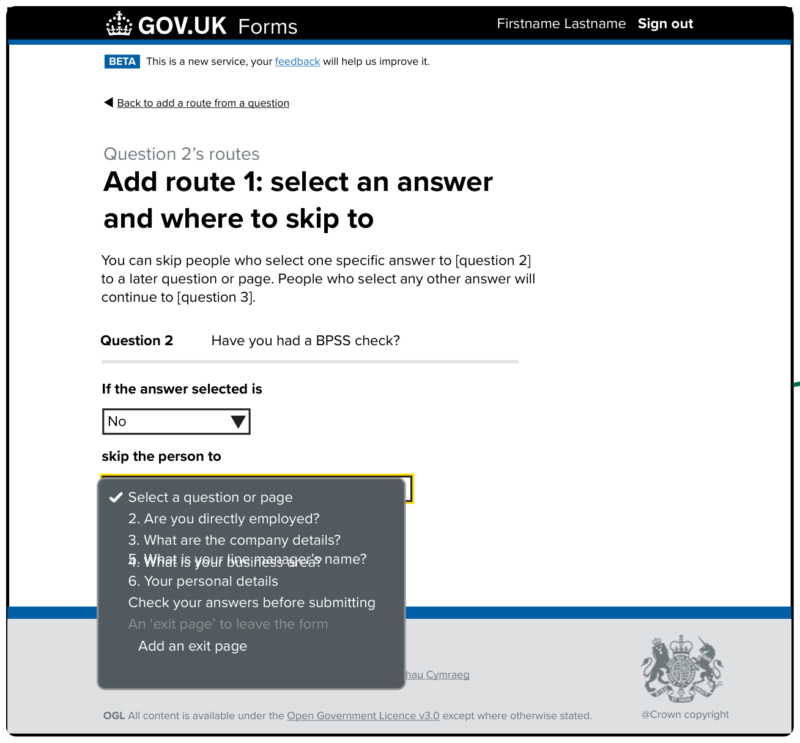
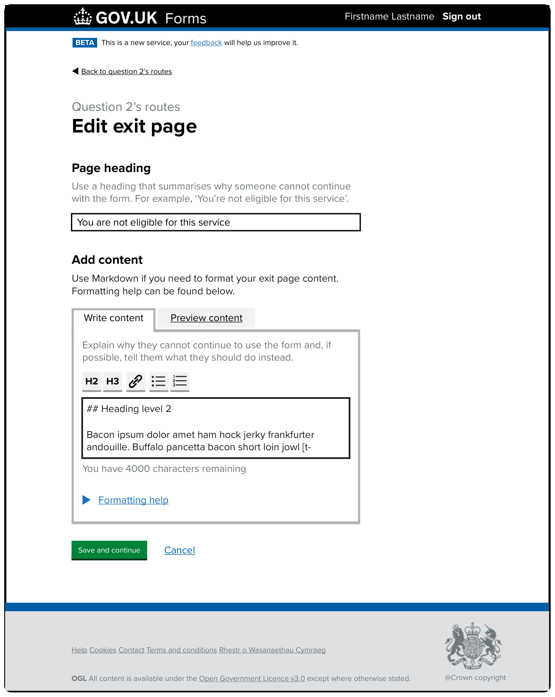
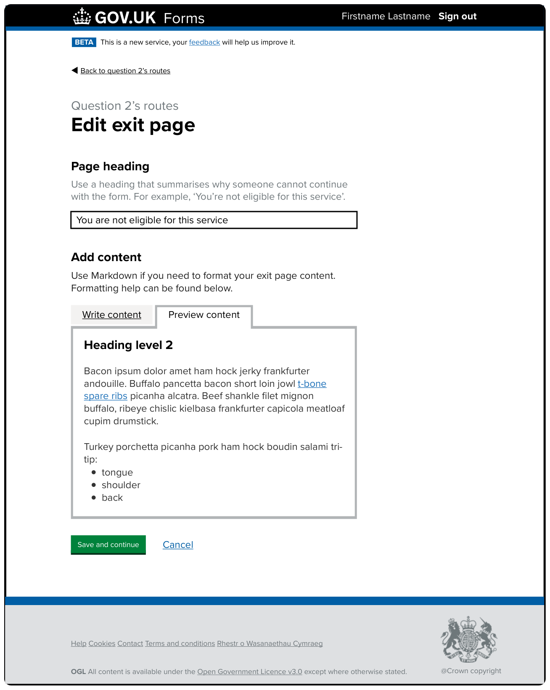
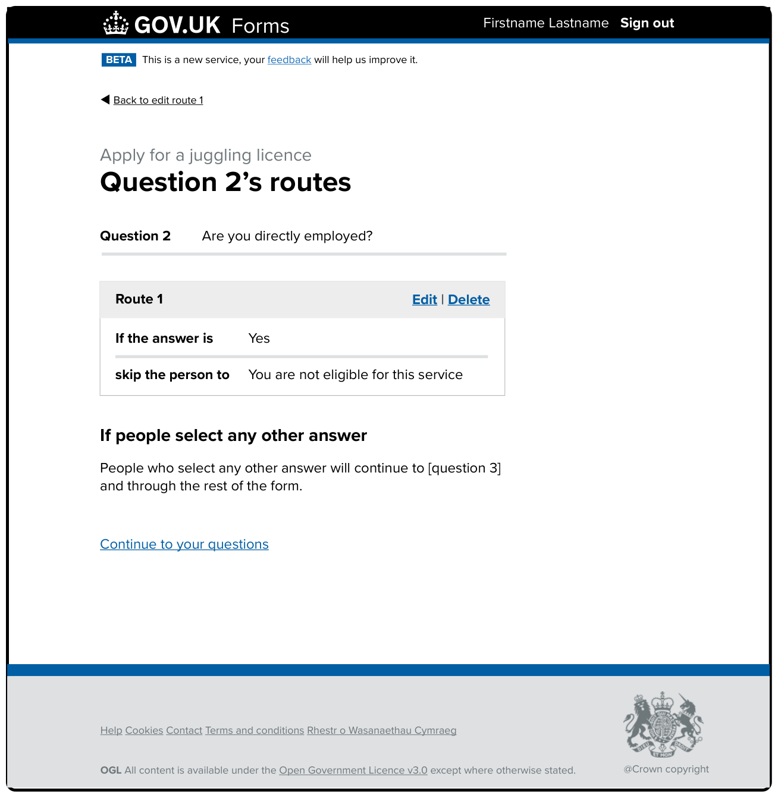

# Exit pages iteration 2

Date created: 2025-06-20

* * *

## Contents

- [What this documentation covers](#what-this-documentation-covers)
- [Designs](#designs)

* * *

## What this documentation covers

This is based on the first iteration that was created with minor changes that were then put live in production. 

[This iteration’s designs in Mural](https://app.mural.co/t/gaap0347/m/gaap0347/1740496027781/5a34f1bab377b7c7126742591825b0d3d616b9dc?wid=0-1740496156549).

## Designs

### Add a route from a question

#### Description of the image and the changes made in this iteration: 

The page’s H1 is ‘Add a route from a question’. It then has some guidance and a radio question for form creators to select a question to start a route from.

The guidance aims to set expectations for the form creator about what they can and cannot do with routing. It has been updated since the last iteration to make it clearer. It now reads: 

> You can add a route to a question so if someone selects one specific answer, they’ll be skipped to:  
>  
> - a later question  
> - the end of the form  
> - an ‘exit page’ to remove them from the form - for example, because they’re not eligible  
>  
> People who select any other answer will continue to the next question and through the rest of the form.  

Note: this implementation did not include exit page functionality and so missed additional guidance content that was added later. 

The guidance is followed by a question:  

> Which question do you want to start a route from?  

Then hint text:  

> A route can only start from a question where people select one item from a list.  

The answer options are all the ‘selection from a list’ questions from the form that only allow one answer (radio questions). In the example in the image above, there are 2 questions the form creator can select from. 

Finally, there’s a green ‘Continue’ button.

After the form creator has selected a question to start their route from and then ‘Continue’, they move to the ‘Edit route 1’ page.

### Add route 1: select an answer and where to skip to - showing ‘skip the person to’ dropdown  

#### Description of the image and the changes made in this iteration: 

The page’s H1 is ‘Add route 1: select an answer and where to skip to’. It then has some guidance before a summary component showing the question number and content. In this example it reads: 

> Question 2: Have you had a BPSS check?  

The guidance above aims to set expectations for the form creator about what they can do with content of the current and following questions. It reads: 

> You can skip people who select one specific answer to [question 2] to a later question or page. People who select any other answer will continue to [question 3].

Next are two dropdowns that the form creator select from to create their route. The first, ‘If the answer selected is’, has already been selected and is showing the word ‘No’. The second dropdown labelled ‘skip the person to’ is covered by an open dropdown menu showing the list of options available to the form creator. It lists the placeholder text, ‘Select a question or page’, followed by all of the questions, number followed by content, left in the form starting from the current question. The final two rows of the dropdown list give the form creator the option to see and create a new ‘exit page’ for the above answer. They show: 

> An ‘exit page’ to leave the form  
>   Add an exit page  

By selecting the ‘Add an exit page’ option from the list when the form creator clicks ‘Save and continue’ they are taken to the ‘Edit exit page’ screen.

### Edit exit page - Markdown editor - Write content  

#### Description of the image and the changes made in this iteration: 

The page’s H1 is ‘Edit exit page’. This is followed by a labelled single line text input, ‘Page heading’ with the hint text: 

> Use a heading that summarises why someone cannot continue with the form. For example, ‘You’re not eligible for this service’.  

This is followed by the ‘Add content’ section with some basic guidance reading: 

> Use Markdown if you need to format your exit page content. Formatting help can be found below.  

Below are two tabs, ‘Write content’ and ‘Preview content’. We are reusing the markdown what you see is what you get (WYSIWYG) type editor that was developed as part of the [detailed guidance work](). The idea is to allow form creators to have greater control over how their content appears to form fillers. Meaning they can make the content more legible while adding clear next steps, options and links to follow based on the reason for seeing an ‘exit page’. 

Within the ‘Write content’ tab we include some additional help text: 

> Explain why they cannot continue to use the form and, if possible, tell them what they should do instead.  

Followed by the different format type buttons that inject markdown code into the textarea beneath. These include: 

- H2 for secondary-level headings  
- H3 for third-level headings  
- Hyperlink to add links to other pages outside of the form  
- Bulleted lists  
- Numbered lists  

The textarea has a character counter to show form creators the limit of characters than are supported by the form tool. The screenshot includes a limit of 4000 characters but this was set to 4999 characters to match other maximum character limits placed on textareas. 

Finally in editing tab is a ‘Formatting help’ detail component, hiding the extra guidance to help form creators write and understand the markdown code.  

At the bottom of the page is a green ‘Save and continue’ button which will take the user back to the ‘question xs routes’ screen. Alongside the button is a blue ‘Cancel’ link which will return the form creator back to the ‘Add route 1: select an answer and where to skip to’ page. 

### Edit exit page - Markdown editor - Preview content  

#### Description of the image and the changes made in this iteration: 

This screen is the same as the ‘Edit exit page - Markdown editor - Write content’ above but the ‘Preview content’ tab is now active. 

Within the tab is a preview of how the form creators markdown will be presented to the form filler. This example shows a heading level 2 followed by some content with a link half way through it. This is followed by an example of bulleted list items. 

### Question x’s routes - with Route 1 set 

#### Description of the image and the changes made in this iteration: 

This page shows the routes that you have from a specific question. It also allows you to:

- edit the first route
- delete the first route
- continue to your questions

Some things that have changed when a form creator adds an exit page to an answer include removing: 

- set questions to skip later in the form for any other answer
- delete all routes from this question, after having added 2 routes to the question

The H1 is ‘Questions 2’s routes’. 

The page then plays back the question the routes in the page apply to. In this example:  

> Question 2: Are you directly employed?  

There is then 1 grey box - using the ‘summary card’ component. Titled ‘Route 1’.

There is a blue ‘Edit’ link alongside a ‘Delete’ link in the top right corner of the Route 1 summary card.

It shows the route that has been created by the form creator, in this case the page heading of the newly created exit page. It reads:

> If the answer is: Yes
>
> skip the person to: You are not eligible for this service

Below the Route 1 box is now a secondary heading, ‘If people select any other answer’, followed by guidance content explaining how the forms routes will normally work for people filling in the form who haven’t selected the answer that triggers Route 1. This content reads:   

> People who select any other answer will continue to [question 3] and through the rest of the form.

This content was updated to reflect the fact we do not allow 2 or more routes from a question while also limiting the functionality of an exit page question to only allow one bit of routing. Removing the chances that questions later in the form are orphaned by accident.  

The page ends with a link to ‘Continue to your questions’.
