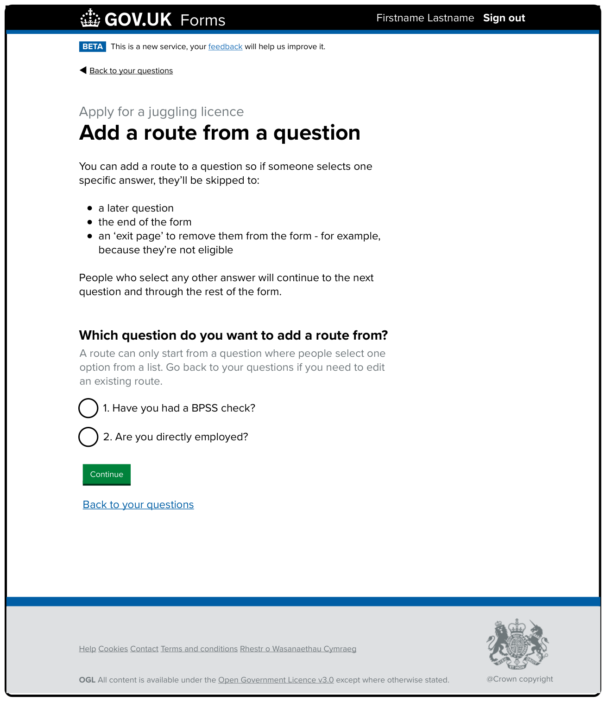

# Exit pages iteration 2

Date created: 2025-06-20

* * *

## Contents

- [What this documentation covers](#what-this-documentation-covers)
- [Designs](#designs)

* * *

## What this documentation covers

This is based on the first iteration that was created with minor changes that were then put live in production. 

[This iteration’s designs in Mural](https://app.mural.co/t/gaap0347/m/gaap0347/1740496027781/5a34f1bab377b7c7126742591825b0d3d616b9dc?wid=0-1740496156549).

## Designs

### Add a route from a question

#### Description of the image and the changes made in this iteration: 

The page’s H1 is ‘Add a route from a question’. It then has some guidance and a radio question for form creators to select a question to start a route from.

The guidance aims to set expectations for the form creator about what they can and cannot do with routing. It has been updated since the last iteration to make it clearer. It now reads: 

> You can add a route to a question so if someone selects one specific answer, they’ll be skipped to:  
>  
> - a later question  
> - the end of the form  
> - an ‘exit page’ to remove them from the form - for example, because they’re not eligible  
>  
> People who select any other answer will continue to the next question and through the rest of the form.  

Note: this implementation did not include exit page functionality and so missed additional guidance content that was added later. 

The guidance is followed by a question:  

> Which question do you want to start a route from?  

Then hint text:  

> A route can only start from a question where people select one item from a list.  

The answer options are all the ‘selection from a list’ questions from the form that only allow one answer (radio questions). In the example in the image above, there are 2 questions the form creator can select from. 

Finally, there’s a green ‘Continue’ button.

After the form creator has selected a question to start their route from and then ‘Continue’, they move to the ‘Edit route 1’ page.
