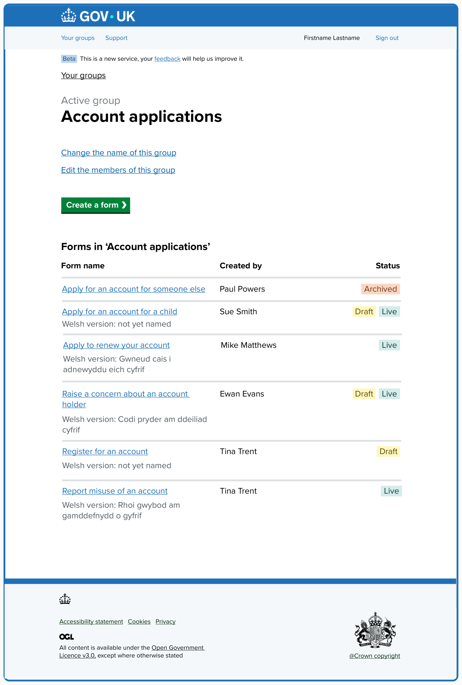

# Add Welsh version of a form v1

## Status

Date created: 17 November 2025  
Tested: Week commencing 10 November 2025  

In development  

___

## Contents

- [Status](#status)
- [Contents](#contents)
- [What](#what)
- [Key decisions](#key-decisions)
- [Design for build](#design-for-build)
- [Design to test in the prototype](#design-to-test-in-the-prototype)
- [Notes](#notes)
- [Research focus](#research-focus)

___

 

## What

### As-is

- Form creators need to create separate forms for Welsh, or any other language. This means that key pieces of form interactive elements such as buttons and get help links are still in English making these forms look broken to form fillers.  

### To-be

- Form creators can add a Welsh version of their form by providing Welsh translations to all content as part of their form. This means form fillers will be able to switch between languages when completing a form.  

## Key decisions  

Based on an initial round of research, the team agreed to:  

- prioritise testing an MVP single page design to understand if this is sufficient
- work towards developing the single page design with the understanding that some elements might change and the journey might need to be broken up and become a multi step journey later if findings tell us such
- release our MVP as soon as possible, unless research shows massive problems with the single page journey  

 

## Design for build

### Your forms - group view  

*Account applications group view. Showing our test form, “Register for an account” in the forms table list.*  

### Your forms - static screen used in testing   

*Account applications group view. Showing our several forms with various states in the forms table list. This was used in testing to see how creators understood statuses and Welsh version names.*  

The page is headed “Account applications”, the name of the group that the form creator has given their group. Above the page heading is a caption, “Active group”. 

Next are 2 links: 

- Change the name of this group
- Edit the members of this group 

There is a green “Create a form” button styled like the GOV.UK start button.  

The page also has a table captioned, “Forms in ‘Account applications’”. Column headings appear as: “Form name”, “Created by”, and “Status”. 

Each row is a form within the group. To test this version of the screen we show 6 different forms with varying statuses and with differing levels of Welsh version, they are: 

- Apply for an account for someone else (link) - this form has no Welsh version and is “Archived”  
- Apply for an account for a child (link) - under the form name link is the text, “Welsh version: not yet named”. This form is “Live” with a “Draft” version  
- Apply to renew your account (link) - under the form name link is the text, “Welsh version: Gwneud cais i adnewyddu eich cyfrif”. This form is “Live”
- Raise a concern about an account holder (link) - under the form name link is the text, “Welsh version: Codi pryder am ddeiliad cyfrif”. This form is “Live” with a “Draft” version
- Register for an account (link) - under the form name link is the text, “Welsh version: not yet named”. The form is “Draft” only
- Report misuse of an account (link) - under the form name link is the text, “Welsh version: Rhoi gqybod am gamddefnydd o gyfrif”. Ths form is “Live” 

This page was created in Mural only to show to participants. We wanted to test if they understood the information that appeared on this screen. Whether it was all useful, with a focus on the “Welsh version” name and whether it had no name but a Welsh version was at least in “Draft”. 

We also wanted to get a better idea if the statuses made sense alongside each form, especially when a “Welsh version” existed. 

### Create a form - task list 

*Create a form task list page showing 3 of 10 tasks marked completed.*  

As part of the new feature we wanted to test if it made sense to include a new optional section and task to the “Create a form” task list page. 

We introduced this as the new section 4, moving the “Make your form live” section down to a new section 5.  

The new section reads: 

> 4. Create a Welsh version of your form (optional)  
> Add a Welsh version of your form 

The “Add a Welsh version of your form” task has an “Optional” tag to match other optional tasks added to the task list and will only appear as “In progress”, when Welsh inputs are filled in by the form creator, and “Completed” after all the English tasks are complete and the Welsh version tasks is marked as completed by the form creator when they are finished adding their translations.  

### Add a Welsh version of your form - empty English form  

*Add a Welsh version of your form showing that no tasks have been completed in English yet.*  

If the form creator has only created a new form and added a name they will still be able to click into the Welsh version task. 

The page at this point is in it’s empty state. The page is titled, “Add a Welsh version of your form”. 

Their is a grey “Download as a spreadsheet” button, that we wanted to test with form creators to understand if it waas useful and made sense to be on this screen.  

Next is a table captioned, “Form name” showing 2 columns “English content” and “Welsh content”.  

The next row reads:  

> Register for an account: _Enter Welsh form name_ (placeholder text) 

The second column in the row is an editable textarea ready for the form’s name in Welsh.  

There are an additional 6 h2s, each with text informing the form creator that that section has not been added yet. They read:  

> **Form questions**  
> No questions have been added to the form yet.  
> 
> **Declaration for people to agree to**  
> No declaration was added to the form.  
> 
> **Information about what happens next**  
> No information about what happens next was added to the form yet. 
> 
> **Payment link**  
> No payment link has been added to the form. 
> 
> **Link to privacy information for this form**  
> No privacy information has been added to the form yet.  
> 
> **Contact details for support**  
> No contact details for support have been added to the form yet. 

### Add a Welsh version of your form - partially completed English form  

*Add a Welsh version of your form showing several tasks completed in English.*  

### Add a Welsh version of your form - completed English form  

*Add a Welsh version of your form showing all tasks completed in English.*  

### Create a form - show new ‘Make your Welsh form live’ task  

*Create a form task list page showing 6 of 10 tasks marked completed. Including the optional Welsh task which reveals a new “Make your Welsh form live” task.* 

 

## Form filler screens  

### Question screen preview - showing question with guidance text  

*Previewing a Welsh language question screen as form fillers would see it.*  

### Check your answers screen preview    

*Previewing a Welsh language check your answers screen as form fillers would see it.*  

### Confirmation screen preview - showing successful submission  

*Previewing a Welsh language successful confirmation screen as form fillers would see it.*  
___

 

## Research

[Research findings from testing](../../../research/2025-11-18-Welsh-usability-testing-nov25.md)

 

___

 

[Back to the top](#add-welsh-version-of-a-form-v1)
