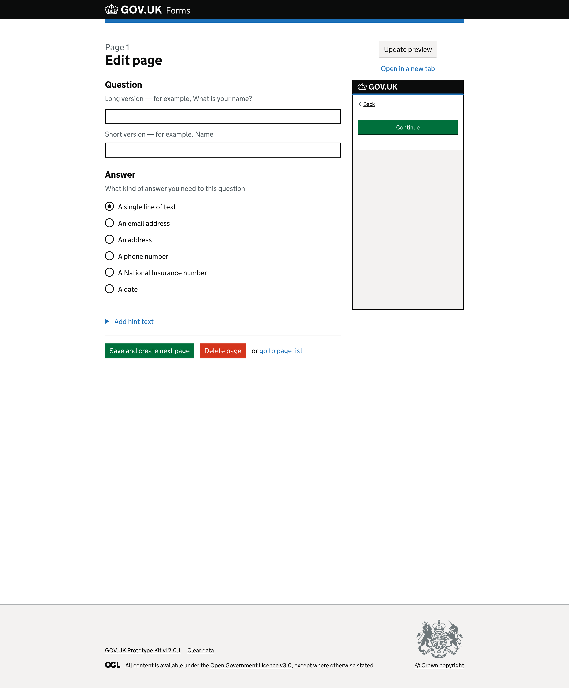
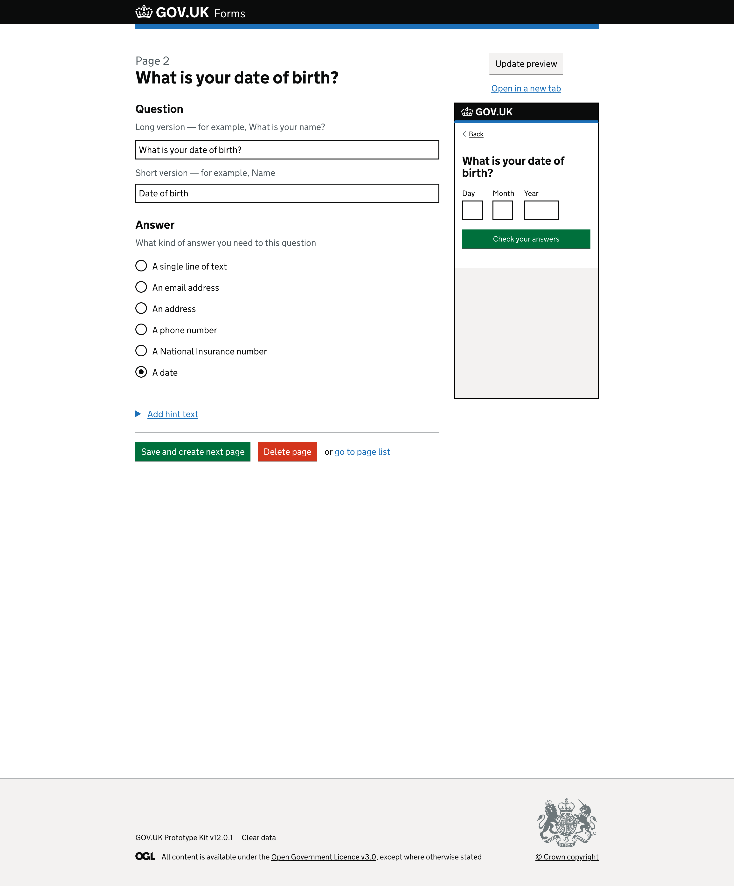
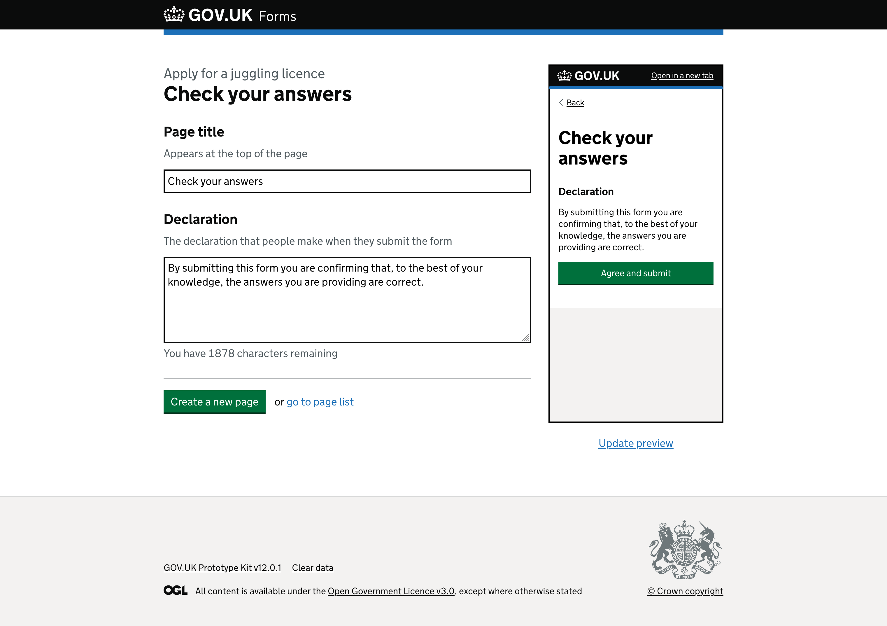
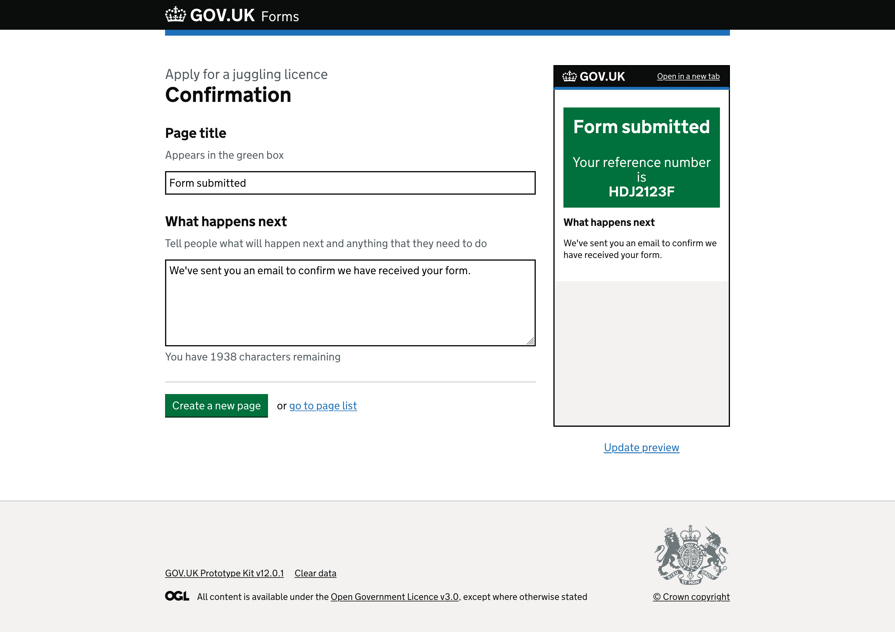
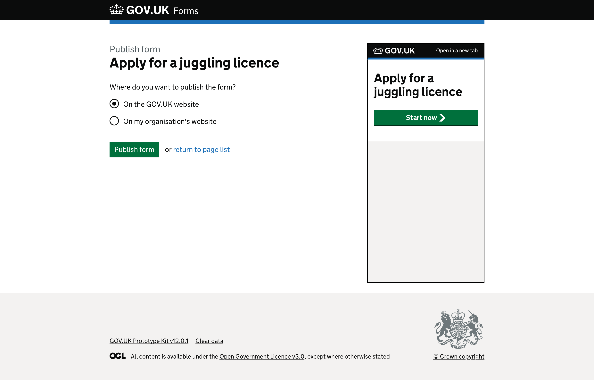
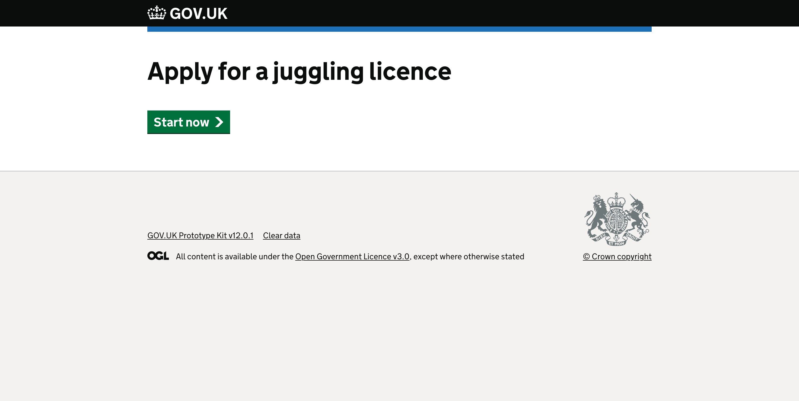
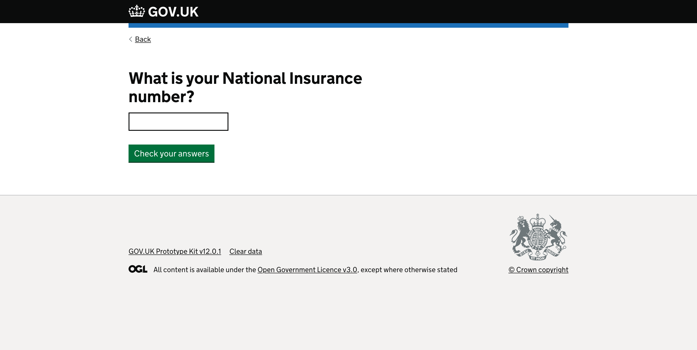
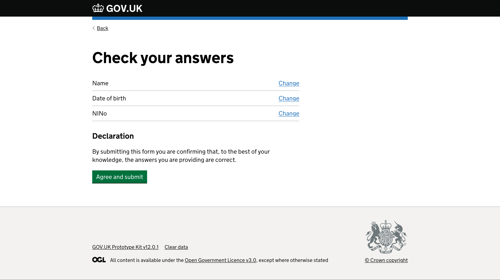

# Prototype version 1

Dates tested: *2022-05-03 to 2022-05-04*

## Status

Superceeded by [version 2](../prototype-version-2)

___

## Contents

- [Context](#context)
- [Admin interface screenshots](#admin-interface-screenshots)
- [Form runner screenshots](#form-runner-screenshots)
- [What we learned](#what-we-learned)
- [Opportunites](#opportunities)

___

 

## Context

> **Sprint 2**  
> For this round of testing we want to get a baseline with our first private beta partners at the Insolvency Service

We plan to test the full creation of a sample form as if the user has already logged into the GOV.UK Forms platform and is re-creating one of their department's existing document-based forms.

 
 

## Admin interface screenshots

Below are the screens a form creator will see when making or editing their forms.

 

### GOV.UK Forms landing page

*Page with “GOV.UK Forms” heading and green “Create a form” start button.*

 

### Name your form page

*Page with “What is the name of your form?” question heading.*

There is hint text that says, “Use a name that describes what the form will help people to do. For example, ‘Apply for a licence’.” above a text input.

Below the text input is a green “Save and continue” button.

 

### Form overview page

*Page with “Form” caption above the heading “Apply for a juggling licence”.*

There is a paragraph of text, “2 page draft form.” above a green “Add a question” button followed by a link to “Preview form (opens in new tab)”.

Below the link is a summary list component of the standard generated pages, “Check your answers” and “Confirmation”. To the right of each of these rows is an “Edit” link.

*Page with “Form” caption above the heading “Apply for a juggling licence” with newly added questions listed in a summary list component.*

The paragraph of text has now updated to “5 page draft form - Publish.” with “Publish” as a link.  
The green “Add a question” button followed by a link to “Preview form (opens in new tab)” still appear below the paragraph.

Below the link there are now three new pages that have been added by the form creator and appear at the top of the summary list. In three new rows, the short version of the name given to a question appear on the left.  

On the right are grey buttons for moving the page ‘Up’ or ‘Down’ reordering them in the form journey.   
Depending on where they are in the list, the buttons vary. The first row - and therefore the first page in the form - only has a ‘Down’ button, while the second row has both an ‘Up’ and ‘Down’ button, and the final row - and final question page in the form - only has an ‘Up’ button.

Each new row also has a relevant “Edit” link to make changes to the corresponding page.

 

### Edit page 1

*Page with “Page 1” caption above heading “Edit page”.*

A secondary heading, “Question”, comes directly before the hint text “Long version - for example, What is your name?” and a text input.  
A second hint text of “Short version - for example, Name” comes next before a second text input.

Below is another secondary heading, “Answer”, with the hint text “What kind of answer you need to this question”. There are then radio buttons that determine the input type required:

- A single line of text
- An email address
- An address
- A phone number
- A National Insurance number
- A date

There is a detail component, blue link with an arrow before the text, “Add hint text”, that is currently collapsed.

The page ends with a green “Save and create next page” button; a red “Delete page” button; the word ‘or’; and finally a “go to page list” link.

<!-- describe side preview pane -->
On the right side of the screen there is a grey “Update preview” button above an “Open in a new tab” link.

Below the link is a smaller version of an empty GOV.UK service page within an iframe, mimicking a mobile screen. It shows the GOV.UK logo on a black header. Within the body of the page is a ‘Back’ link and below this is a green ‘Continue’ button.

<!-- describe expanded hint text -->
*Page with “Page 1” caption above heading “Edit page” with detail component expanded.*

The detail component, “Add hint text”, is now expanded revealing the hint text “A short hint to help people answer the question” before a text input.

 

### Edit page 2 - saved page

*Page with “Page 2” caption above heading “What is your date of birth?”.*

The first text input contains the text that appears as the pages heading, “What is your date of birth?”.

The second text input with hint text ‘short version’ has the text “Date of birth” in the text input.  

‘A date’ radio has been selected.

<!-- describe side preview pane -->
On the right side of the screen the iframe has updated to show the question text “What is your date of birth?” and displays the date component underneath with separate inputs labelled ‘Day’, ‘Month’ and ‘Year’.

 

### Edit check your answers

*Page with “Apply for a juggling licence” caption above the heading “Check your answers”.*

There is a secondary heading label, “Page title”, with hint text “Appears at the top of the page”. Below is a prefilled text input containing, “Check your answers”, also shown in the preview iframe on the right.

There is another secondary heading label, “Declaration”, with hint text “The declaration that people make when they submit the form”. Below this is an editable text area containing a provided example of what the form filler needs to agree to, “By submitting this form you are confirming that, to the best of your knowledge, the answers you are providing are correct.”  
Under the text area is a character counter, “You have 1878 characters remaining”, giving form creators an idea of how much they have left of a 2,000 character limit.

At the end of the page is a green “Create a new page” button followed by the word ‘or’ and a “go to page list” link.

<!-- describe side preview pane -->
On the right side of the screen the iframe includes the title “Check your answers” and displays the secondary heading, “Declaration”, above the text area content provided on the left.

There is a button styled like a link, “Update preview”, centered to the aside underneath the iframe.

 

### Edit confirmation page

*Page with “Apply for a juggling licence” caption above the heading “Confirmation”.*

There is a secondary heading label, “Page title”, with the hint text “Appears in the green box”. Under this is an editable text input containing a provided name, “Form submitted”, also shown in the preview on the right.

There is another secondary heading label, “What happens next”, with hint text “Tell people what will happen next and anything that they need to do”. Below this is an editable text area containing a provided example of what the form filler should expect, “We’ve sent you an email to confirm we have received your form.”  
Below the text area is a character counter, “You have 1938 characters remaining”, giving form creators an idea of how much they have left of a 2,000 character limit.

At the end of the page is a green “Create a new page” button followed by the word ‘or’ and then a “go to page list” link.

<!-- describe side preview pane -->
On the right side of the screen the iframe includes the title “Form submitted” above text “Your reference number is HDJ2123F” in a green box. There is also a secondary heading, “What happens next”, above the text area content provided on the left.

There is a button styled like a link, “Update preview”, centered to the aside underneath the iframe.

 

### Publish a form

*Page with “Publish form” caption above the heading “Apply for a juggling licence”.*

There is a question, “Where do you want to publish the form?” with two radio options below, “On the GOV.UK website” and “On my organisation’s website”.

There is a green “Publish form” button, the word ‘or’, and then a link to “return to page list”.

<!-- describe side preview pane -->
On the right side of the screen the iframe includes the title “Apply for a juggling licence” above a green “Start now” button to simulate the journey from the start page.

 
 

## Form runner screenshots

Below are the screens the form filler (the end user) would see as they complete the form.

 

### Preview start page

*Page with “Apply for a juggling licence” heading and a green “Start now” button containing a white arrow.*

 

### Preview question 1

*Page with “What is your name?” question as a label for a text input. There is a green “Continue” button at the bottom.*

This page is an example of the first (and all following) question pages that a form creator has added to their form.  

The basic structure includes a “Back” link which should take the form filler to the previous page, mimicking the browser back button - in this instance it would return the user to the start page.

When the form filler clicks the “Continue” button the product should validate that an input has been given (field is not empty or radio is selected for example) before continuing through to the next question in sequence.

 

### Preview final question

*Page with “What is your National Insurance number?” question as a label for a text input. There is a green “Check your answers” button at the bottom.*

This page is an example of the last question in a form sequence. The difference being a green “Check your answers” button in place of the usual “Continue”.

 

### Preview check your answers (summary page)

*Page with “Check your answers” heading followed by a summary list component.*

The summary list component lists rows of the “Short version” of the questions the form creator has added with a space to the right where the form fillers answer would appear. Finally there is a “Change” link for the form filler to correct or change any answer they feel is incorrect.

Below is a secondary heading, “Declaration”, before the text “By submitting this form you are confirming that, to the best of your knowledge, the answers you are providing are correct.” This is an example declaration for the form filler to agree to, by clicking the green “Agree and submit” button. The text of the declaration is editable by the form creator within the admin side of the builder, meaning it can be customised as to the needs of the different forms or department.

 

### Preview form submitted (confirmation page)

*Page with “Form submitted” heading followed by “Your reference number is HDJ2123F” in a green box.*

This page includes a secondary heading “What happens next” followed by the content “We’ve sent you an email to confirm we have received your form.” This text is editable by the form creator within the admin side of the builder, meaning it can be customised as to the needs of the different forms or department and should match their internal service level agreements (SLAs).

 

___

 

## What we learned

> Give a synopsis of the key findings from the round of research we tested this version.  
> Include examples of found needs, pain points or quotes to help explain the findings. These do not have to be too detailed, as this should be covered in the research findings packs/decks - which can be linked to from here.

To see the write up go to [Research: Basic form building](../../research/2022-05-03_Basic_Form_Building.md).

 

## Opportunities

> Are there any opportunities we would like to explore, or ideas that we think we could consider?  
> List these here. They do not have to be full formulated at this point, but will inform our work (and should be added to Trello to discuss and ideate as a team).

 

[Back to the top](#prototype-version-1)
