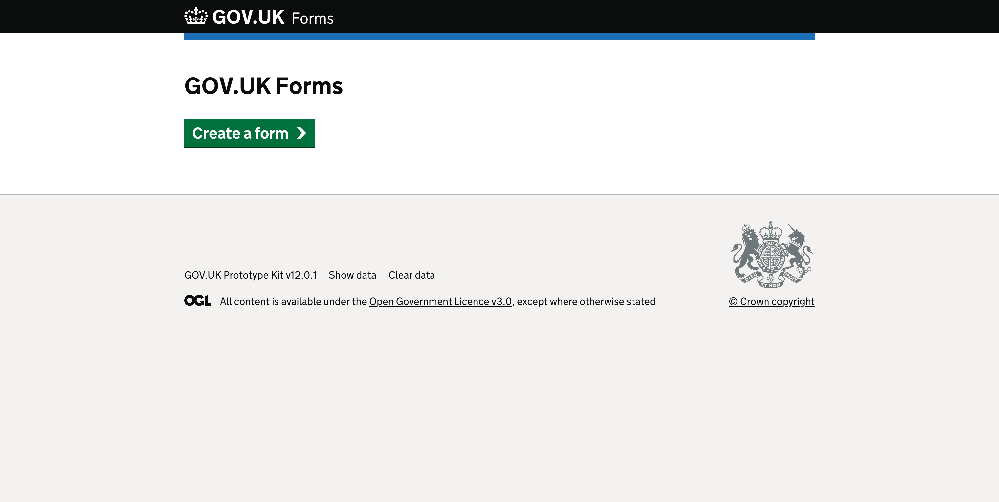
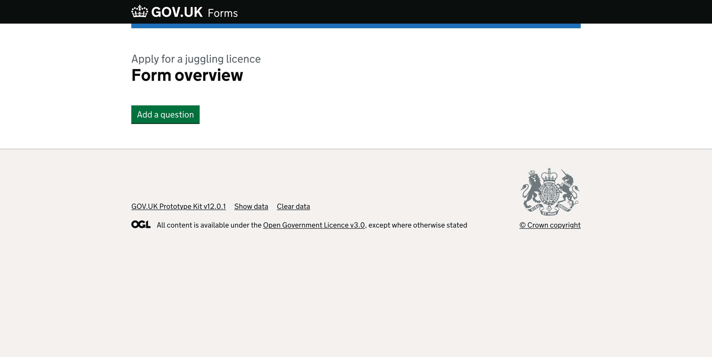
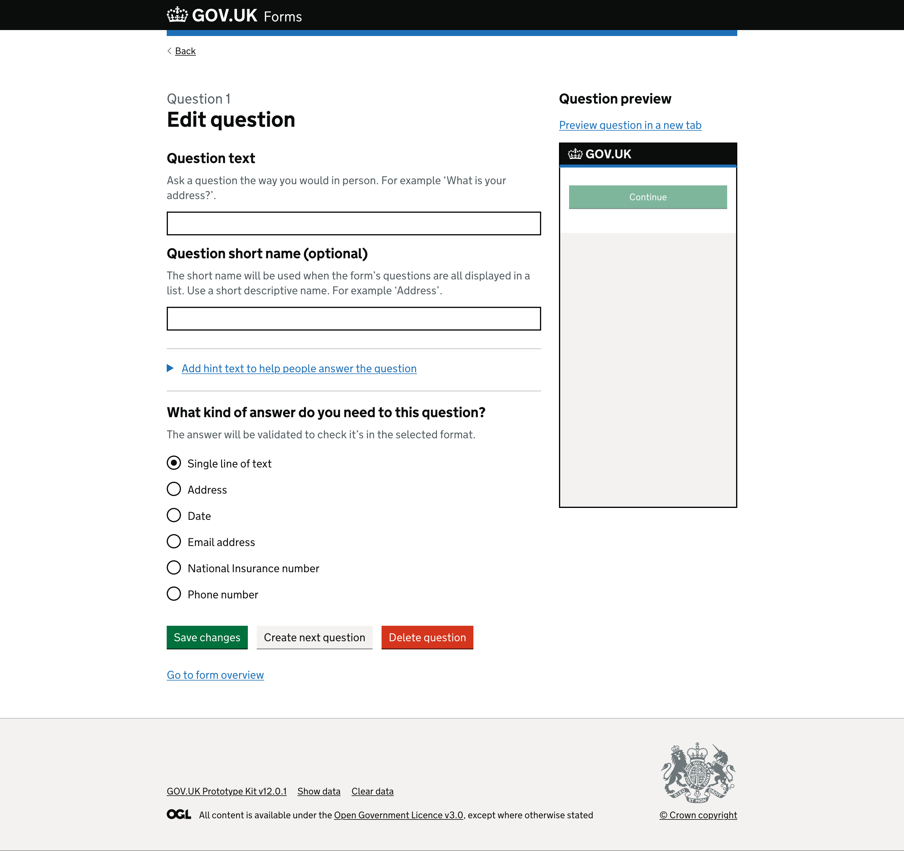
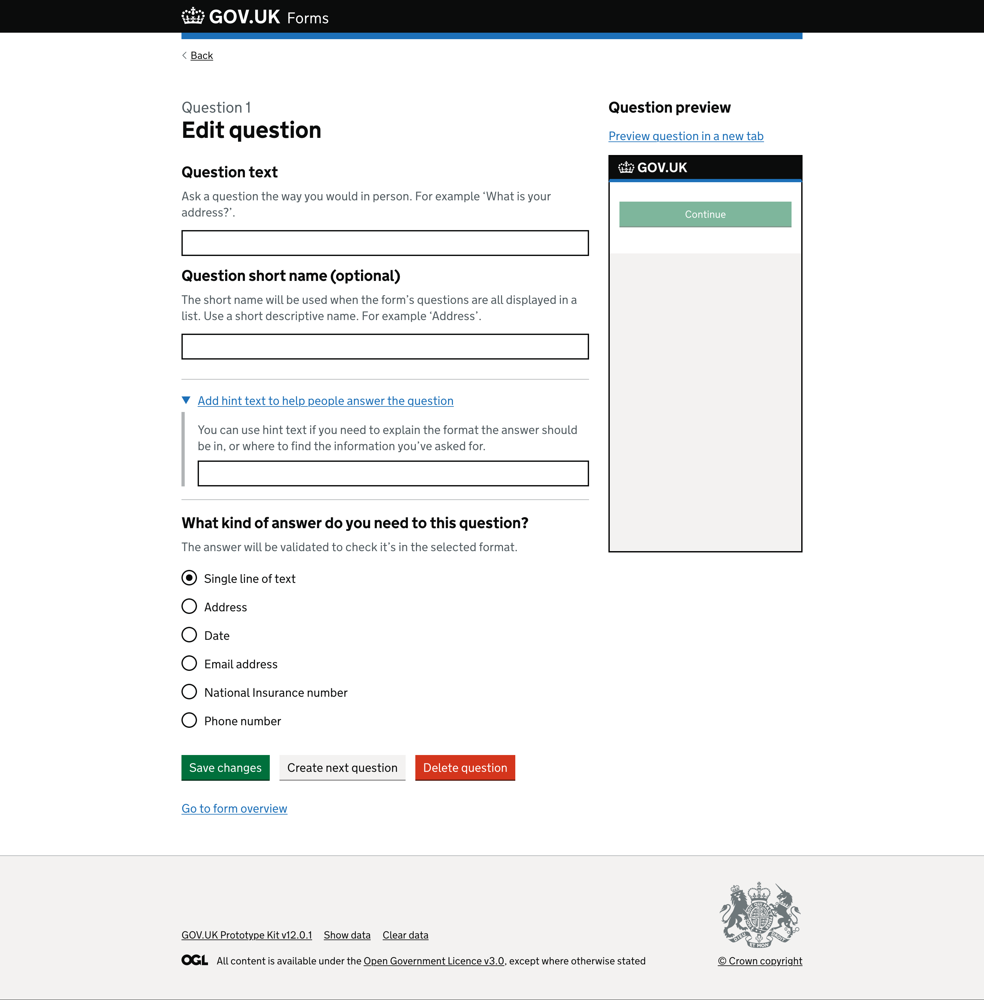
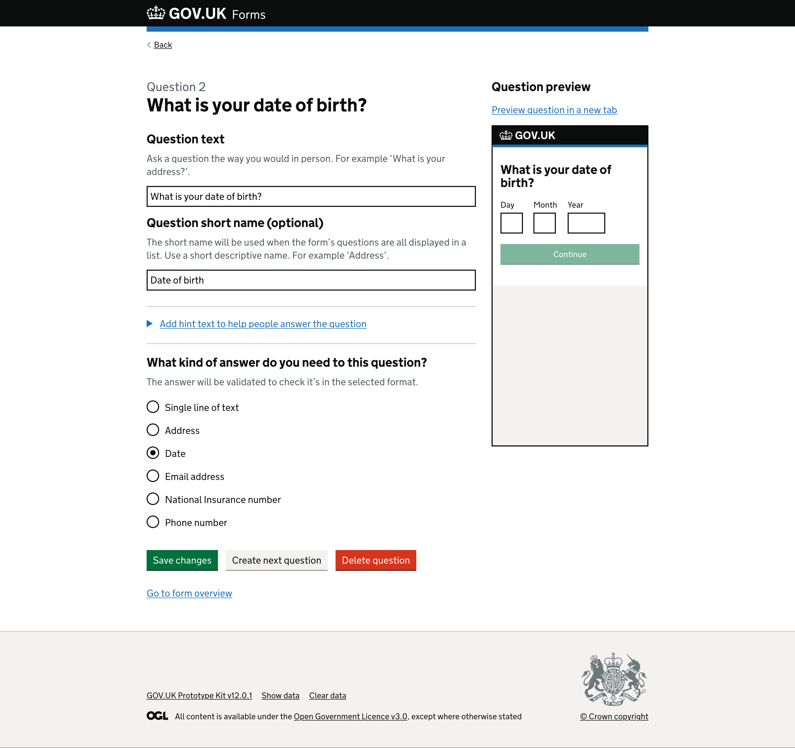
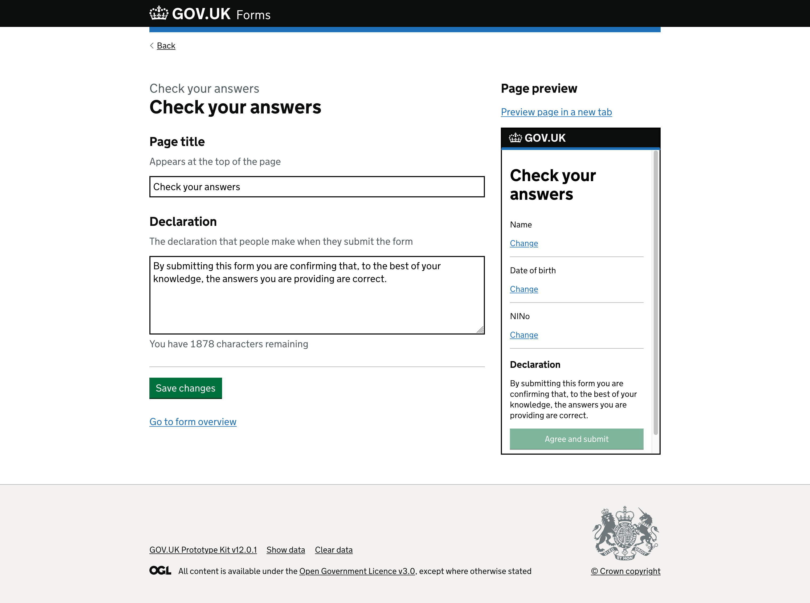
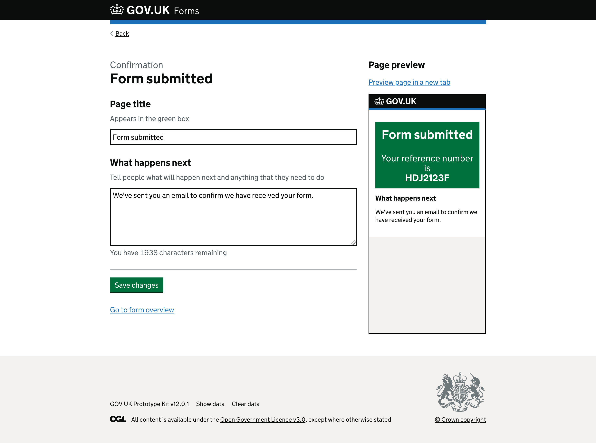
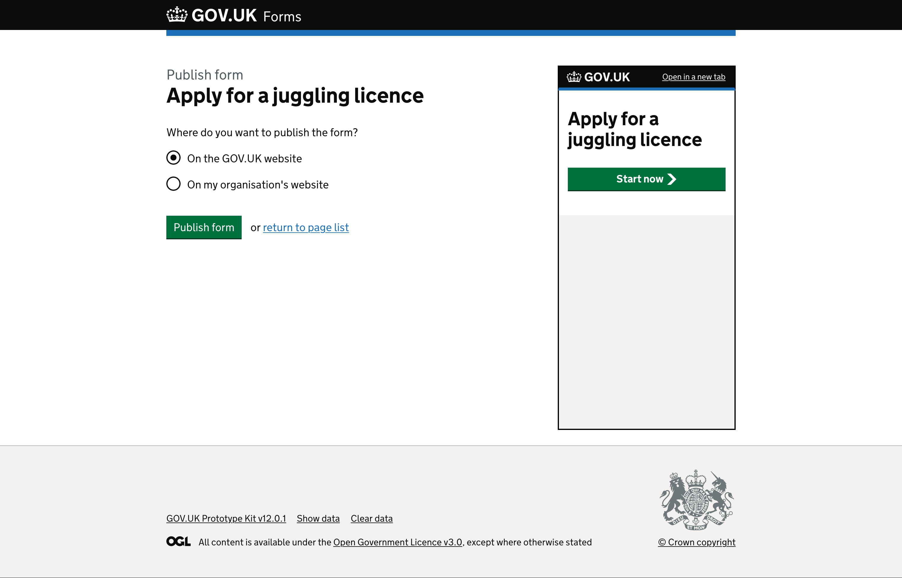
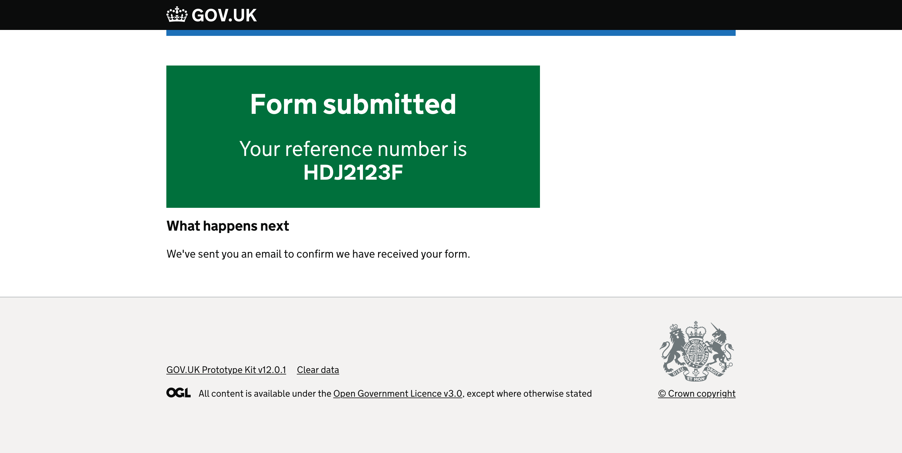

# Prototype version 2

Dates tested: *2022-05-12 to 2022-05-13*

## Status

Superceeded by [version 3](../prototype-version-3)

___

## Contents

- [Context](#context)
- [Admin interface screenshots](#admin-interface-screenshots)
- [Form runner screenshots](#form-runner-screenshots)
- [What we learned](#what-we-learned)
- [Opportunites](#opportunities)

___

## Context

> **Sprint 3**  
> In this sprint we want to test an updated version of the form builder with Insolvency Service staff who are likely to be our users  

Changes made were based on feedback received during the first round of research.

We introduced a return journey for testing, where we faked a previously created form with some errors and based the task on the form creator getting feedback from a colleague to make fixes.

___

## Admin interface screenshots

Below are the screens a form creator will see when making or editing their forms.

### GOV.UK Forms landing page

*Page with “GOV.UK Forms” heading and green “Create a form” start button.*

### Name your form page

*Page with “What is the name of your form?” question heading.*

There is hint text that says, “The form name will be shown at the top of each page of the form. Use a name that describes what the form will help people to do. For example, ‘Apply for a licence’.” above a text input.

Below the text input is a green “Save and continue” button.

#### What we changed from the previous version

[Changes to the ‘name your form’ page](name-your-form)

### Form overview page

*Page with “Apply for a juggling licence” caption above the heading that says “Form overview”.*

There is a green “Add a question” button.

#### What we changed from the previous version

[Changes to the ‘form overview’ page](form-overview)

### Edit question 1

*Page with “Question 1” caption above a heading “Edit question”.*

A secondary heading, “Question text”, comes directly before the hint text “Ask a question the way you would in person. For example ‘What is your address?’” and then a text input.

A second secondary heading, “Question short name (optional)”, followed by hint text “The short name will be used when the form’s questions are all displayed in a list. Use a short descriptive name. For example ‘Address’.” and then a text input.

Below these is a detail component, blue link with an arrow before the text, “Add hint text to help people answer the question” that is closed.

Next is a secondary heading, “What kind of answer do you need to this question?”, which has the hint text “The answer will be validated to check it’s in the selected format.” Below are radio buttons that determine the input type required:

- Single line of text, selected
- Address
- Date
- Email address
- National Insurance number
- Phone number

The page ends with a green “Save changes” button, next to a grey “Create next question” button before a red “Delete question” button. Below the three buttons is a “Go to form overview” link.

<!-- describe side preview pane -->
On the right side of the screen there is a secondary heading, “Question preview” with a link to “Preview question in a new tab”.

Below the link is a smaller version of an empty GOV.UK service page within an iframe, to mimic a mobile screen. It shows the GOV.UK logo on a black header. Within the body of the page is a disabled green ‘Continue’ button.

<!-- describe expanded hint text -->
*Page with “Question 1” caption above a heading “Edit question” with detail component expanded.*

The detail component, “Add hint text to help people answer the question”, is now expanded revealing the hint text “You can use hint text if you need to explain the format the answer should be in, or where to find the information you’ve asked for.” before a text input.

### Edit question 2 - saved question

*Page with “Question 2” caption above a heading “What is your date of birth?”.*

The first text input contains the text that appears as the pages heading, “What is your date of birth?”.

The second text input with the secondary heading label “Question short name (optional)” has the text “Date of birth” in the text input.  

The ‘Date’ radio is now selected.

<!-- describe side preview pane -->
On the right side of the screen the iframe has now updated to include the question text “What is your date of birth?” and displays the date component underneath with inputs for ‘Day’, ‘Month’ and ‘Year’. The green “Continue” button is still disabled.

#### What we changed from the previous version

[Changes to the ‘edit question’ page](edit-question)

### Edit check your answers

*Page with “Check your answers” caption above the heading “Check your answers”.*

There is a secondary heading label, “Page title”, with the hint text “Appears at the top of the page”. Under this is an editable text input containing a provided name, “Check your answers”, also shown in the preview on the right.

There is another secondary heading label, “Declaration”, with hint text “The declaration that people make when they submit the form”. Below this is an editable text area containing a provided example of what the form filler needs to agree to, “By submitting this form you are confirming that, to the best of your knowledge, the answers you are providing are correct.”  
Below the text area is a character counter, “You have 1878 characters remaining”, giving form creators an idea of how much they have left of a 2,000 character limit.

At the end of the page is a green “Save changes” button above a “Go to form overview” link.

<!-- describe side preview pane -->
On the right side of the screen there is a secondary heading, “Page preview” with a link to “Preview page in a new tab”.

The iframe includes the title “Check your answers” and displays the secondary heading, “Declaration”, above the text input content provided on the left, “By submitting this form you are confirming that, to the best of your knowledge, the answers you are providing are correct.”

### Edit confirmation page

*Page with “Confirmation” caption above the heading “Form submitted”.*

There is a secondary heading label, “Page title”, with the hint text “Appears in the green box”. Under this is an editable text input containing a provided name, “Form submitted”, also shown in the preview on the right.

There is another secondary heading label, “What happens next”, with hint text “Tell people what will happen next and anything that they need to do”. Below this is an editable text area containing a provided example of what the form filler should expect, “We’ve sent you an email to confirm we have received your form.”  
Below the text area is a character counter, “You have 1938 characters remaining”, giving form creators an idea of how much they have left of a 2,000 character limit.

At the end of the page is a green “Save changes” button above a “Go to form overview” link.

<!-- describe side preview pane -->
On the right side of the screen there is a secondary heading, “Page preview” with a link to “Preview page in a new tab”.

The iframe includes the title “Form submitted” above text “Your reference number is HDJ2123F” in a green box. There is also a secondary heading, “What happens next”, above the text input content provided on the left, “We’ve sent you an email to confirm we have received your form.”

### Publish a form

*Page with “Publish form” caption above the heading “Apply for a juggling licence”.*

There is a question, “Where do you want to publish the form?” with two radio options below, “On the GOV.UK website” and “On my organisation’s website”.

There is a green “Publish form” button, the word ‘or’, and then a link to “return to page list”.

<!-- describe side preview pane -->
On the right side of the screen the iframe includes the title “Apply for a juggling licence” above a green “Start now” button to simulate the journey from the start page.

### Some things we changed since last time

- standard pages call to action button text changed from “Create a new page” to “Save changes”
- standard pages rework of the in page preview (iframe on the right side of the screen) including adding a secondary heading, “Page preview” and adding a “Preview question in a new tab” or “Preview page in a new tab” link above the iframe

For more information, see [v0.0.2 release notes](https://github.com/alphagov/forms-prototypes/releases/tag/v0.0.2).

___

## Form runner screenshots

Below are the screens the form filler (the end user) would see as they complete the form.

### Preview start page

*Page with “Apply for a juggling licence” heading and a green “Start now” button containing a white arrow.*

### Preview question 1

*Page with “What is your name?” question as a label for a text input. There is a green “Continue” button at the bottom.*

This page is an example of the first (and all following) question pages that a form creator has added to their form.  

The basic structure includes a “Back” link which should take the form filler to the previous page, mimicking the browser back button - in this instance it would return the user to the start page.

When the form filler clicks the “Continue” button the product should validate that an input has been given (field is not empty or radio is selected for example) before continuing through to the next question in sequence.

### Preview final question

*Page with “What is your National Insurance number?” question as a label for a text input. There is a green “Check your answers” button at the bottom.*

This page is an example of the last question in a form sequence. The difference being a green “Check your answers” button in place of the usual “Continue”.

### Preview check your answers (summary page)

*Page with “Check your answers” heading followed by a summary list component.*

The summary list component lists rows of the “Short version” of the questions the form creator has added with a space to the right where the form fillers answer would appear. Finally there is a “Change” link for the form filler to correct or change any answer they feel is incorrect.

Below is a secondary heading, “Declaration”, before the text “By submitting this form you are confirming that, to the best of your knowledge, the answers you are providing are correct.” This is an example declaration for the form filler to agree to, by clicking the green “Agree and submit” button. The text of the declaration is editable by the form creator within the admin side of the builder, meaning it can be customised as to the needs of the different forms or department.

### Preview form submitted (confirmation page)

*Page with “Form submitted” heading followed by “Your reference number is HDJ2123F” in a green box.*

This page includes a secondary heading “What happens next” followed by the content “We’ve sent you an email to confirm we have received your form.” This text is editable by the form creator within the admin side of the builder, meaning it can be customised as to the needs of the different forms or department and should match their internal service level agreements (SLAs).

___

## What we learned

There were several key issues identified that we should explore in the next iteration, including: 

- users wanted an explicit option to change/ edit the name of a form rather than use the ‘back button’
- there is still some confusion over what value a short name provides
- there was still uncertainty around saving/ how to save the form
- Preview pane is confusing initially and users don't know what's its for. However, it becomes much more useful when editing/ or going back to a question

### User resaearch documentation
- [2022-05-23 Basic Form Building](https://github.com/alphagov/forms/blob/main/research/2022-05-23_Basic_Form_Building.md)  
- [MURAL board playback](https://app.mural.co/t/gaap0347/m/gaap0347/1652262618825/de85a467bad90d061809431a9fa8007393135c43?wid=0-1652696148470)
- [Supporting documents (Google drive)](https://drive.google.com/drive/folders/1ePhbd9quZvA8Z4l8WB9sMjmsWDI5rZd-)

___

## Opportunities

Key decisions

1. we are ready to implement th basic first steps of the form builder
2. we want to test the prototype with users who have never seen the tool before
3. we need to understand the needs around processing emails and if we should make it a default part of the tool

 

[Back to the top](#prototype-version-2)
