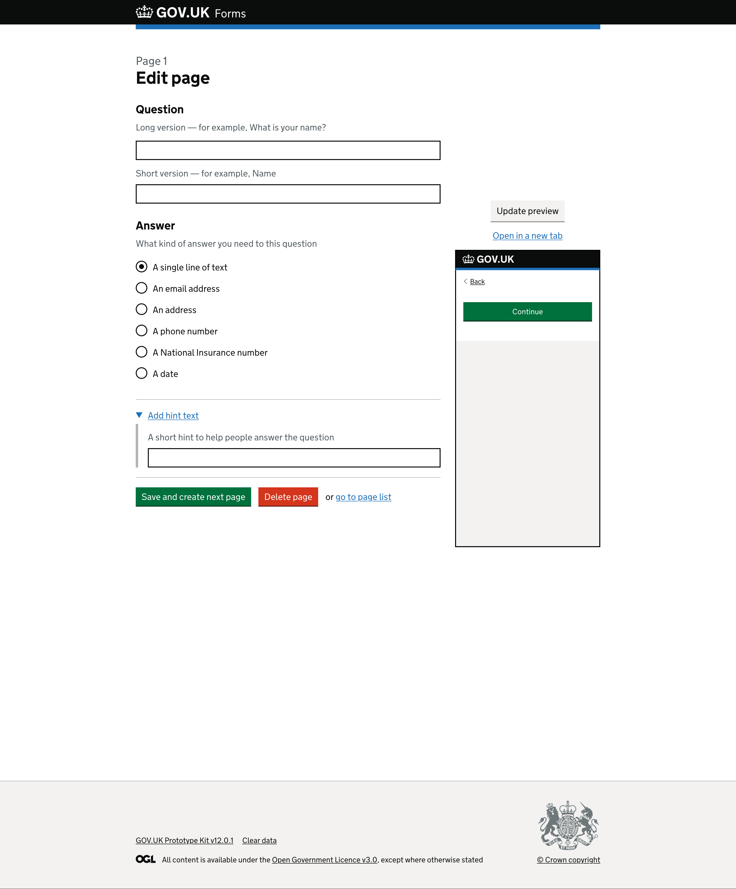

# Edit question page

## Context

For this round there we made a large change to the level of information we gave form creators for each of the options when creating their form questions. This included more useful hint text and more explicit input labels.  

As part of the testing we asked users to create a form exploring how they experienced the iterated version of adding a short answers and date question type. We also tested how they previewed a question.  
We then set the task of asking the participant to update an existing form, making changes based on feedback from a colleague.  

## What we tested last time

*Page with “Page 1” caption above heading “Edit page”.*

A secondary heading, “Question”, comes directly before the hint text “Long version - for example, What is your name?” and a text input.  
A second hint text of “Short version - for example, Name” comes next before a second text input.

Below is another secondary heading, “Answer”, with the hint text “What kind of answer you need to this question”. There are then radio buttons that determine the input type required:

- A single line of text
- An email address
- An address
- A phone number
- A National Insurance number
- A date

There is a detail component, blue link with an arrow before the text, “Add hint text”, that is currently collapsed.

The page ends with a green “Save and create next page” button; a red “Delete page” button; the word ‘or’; and finally a “go to page list” link.

<!-- describe side preview pane -->
On the right side of the screen there is a grey “Update preview” button above an “Open in a new tab” link.

Below the link is a smaller version of an empty GOV.UK service page within an iframe, mimicking a mobile screen. It shows the GOV.UK logo on a black header. Within the body of the page is a ‘Back’ link and below this is a green ‘Continue’ button.  

### What we saw

...

## What we changed and why

We updated the...

*Page with “Question 1” caption above a heading “Edit question”.*

A secondary heading, “Question text”, comes directly before the hint text “Ask a question the way you would in person. For example ‘What is your address?’” and then a text input.

A second secondary heading, “Question short name (optional)”, followed by hint text “The short name will be used when the form’s questions are all displayed in a list. Use a short descriptive name. For example ‘Address’.” and then a text input.

Below these is a detail component, blue link with an arrow before the text, “Add hint text to help people answer the question” that is closed.

Next is a secondary heading, “What kind of answer do you need to this question?”, which has the hint text “The answer will be validated to check it’s in the selected format.” Below are radio buttons that determine the input type required:

- Single line of text, selected
- Address
- Date
- Email address
- National Insurance number
- Phone number

The page ends with a green “Save changes” button, next to a grey “Create next question” button before a red “Delete page” button. Below the three buttons is a “Go to form overview” link.  

<!-- describe side preview pane -->
On the right side of the screen there is a secondary heading, “Question preview” with a link to “Preview question in a new tab”.  

Below the link is a smaller version of an empty GOV.UK service page within an iframe, to mimic a mobile screen. It shows the GOV.UK logo on a black header. Within the body of the page is a disabled green ‘Continue’ button.  

### Feedback from testing this version 

-  
> 
