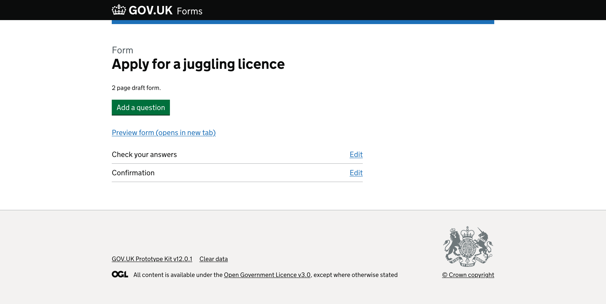
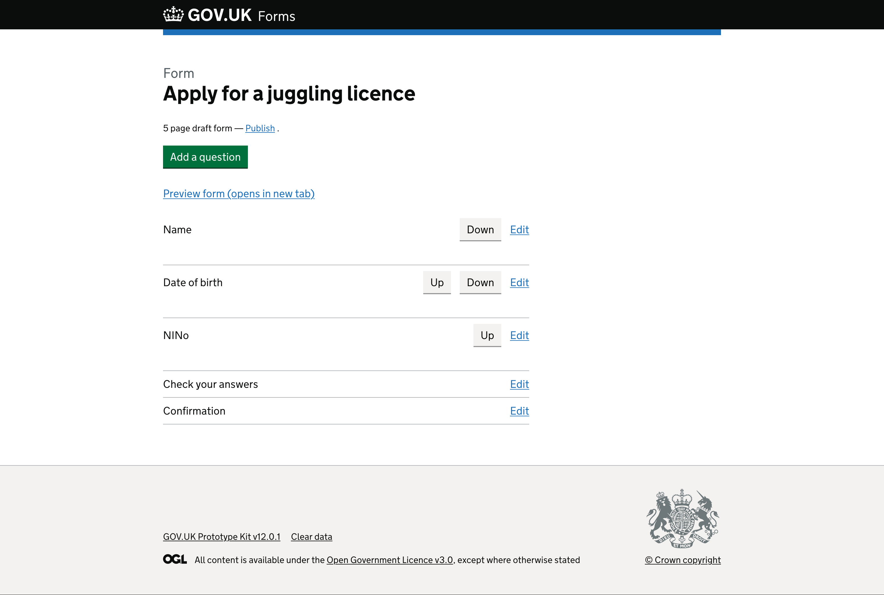
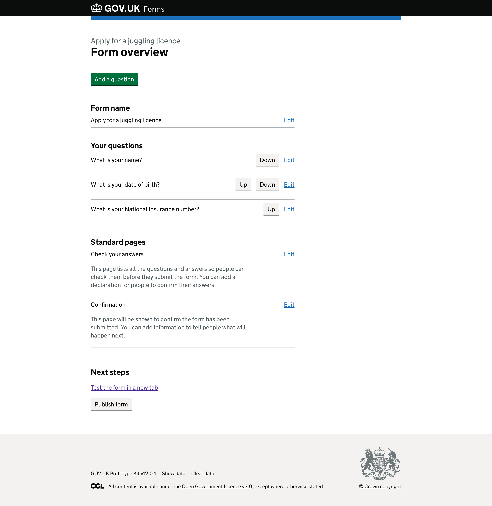

# Form overview page

## Context

For this round of testing we removed clutter from the screen, only making certain elements appear when the user had added questions to their form and returned to the ‘form overview’ screen. We introduced sections to help the user identify what they were seeing - questions they had added versus pages added by the tool and what their next steps should be. We wanted to understand if this made sense to users and if it would be helpful to offer more handholding throughout the creation journey.  

As part of the testing we asked users to create a form, and then explored returning to edit an existing form, including the task of changing the name of a form, based on feedback from a colleague.  

## What we tested last time

### User first lands on the ‘form overview’ page without any questions

*Page with “Form” caption above the heading “Apply for a juggling licence”.*

There is a paragraph of text, “2 page draft form.” above a green “Add a question” button followed by a link to “Preview form (opens in new tab)”.

Below the link is a summary list component of the standard generated pages, “Check your answers” and “Confirmation”. To the right of each of these rows is an “Edit” link.  

### User lands on the ‘form overview’ page after adding some questions

*Page with “Form” caption above the heading “Apply for a juggling licence” with newly added questions listed in a summary list component.*

The paragraph of text has now updated to “5 page draft form - Publish.” with “Publish” as a link.  
The green “Add a question” button followed by a link to “Preview form (opens in new tab)” still appear below the paragraph.

Below the link there are now three new pages that have been added by the form creator and appear at the top of the summary list. In three new rows, the short version of the name given to a question appear on the left.  

On the right are grey buttons for moving the page ‘Up’ or ‘Down’ reordering them in the form journey.   
Depending on where they are in the list, the buttons vary. The first row - and therefore the first page in the form - only has a ‘Down’ button, while the second row has both an ‘Up’ and ‘Down’ button, and the final row - and final question page in the form - only has an ‘Up’ button.

Each new row also has a relevant “Edit” link to make changes to the corresponding page.

### What we saw

When testing all the users were quickly and easily able to proceed with the task of adding a question to their form. All 3 users either go straight into adding their questions, or ask if they can. There was little hesitation and users appeared confident in the approach. We later heard from users - when they returned to the screen with their added questions - that there was some confusion.  

- 1 user was a little confused by the ‘Down’ and ‘Up’ buttons next to each question, feeling unsure what they were for to begin with until tasked with moving questions about  
  > P2: “Now I get what these buttons [up and down buttons] are for, but before they were a mystery to me.”  
- The other 2 users were able to guess and use the ‘Down’ and ‘Up’ buttons without an issue, but commented about the page reloading without acknoledgement of the change - having to scroll to find if the change had happened - and that this way of re-ordering questions would be painful where forms started getting longer - suggesting click and drag functionality as a potential option  
  > P1: “It’s maybe a bit annoying that it drops you up to the top of the page so you have to scroll down to see if it works.”  
- 1 user - who described themselves as neurotypical - told us the way we were dislpaying the questions would cause them some difficulty in reading and keeping track of where they were and if an action had taken place. They suggested visually separating the questions a bit more, or maybe numbering them [this idea came up again in version 2 research, with this participant]   
  > P3: “This might be a bit hard to read actually... quite tricky for me as someone who’s not neurotypical”  
  > P3: “Maybe have some numbers, visually separate the questions a bit more - the line definitely helps”   

## What we changed and why

We removed unnecessary content from the screen, such as reference to number of pages in the draft and the summary list of standard generated pages - check your answers and confirmation page - on first time the user lands on the screen, or where there are no questions added to the form yet. We wanted to reduce confusion and test if we should simplify the page going forward.  

*Page with “Apply for a juggling licence” caption above the heading that says “Form overview”.*

There is a green “Add a question” button.

*Page with “Apply for a juggling licence” caption above the heading that says “Form overview” with newly added questions listed in a summary list component.*

There is a green “Add a question” button.

Below this is a section titled ‘Form name’ with a summary list showing the form name as the user had entered it with an ‘Edit’ link to the right of the row.  

The next section is titled ‘Your questions’. There is a summary list showing the questions the user has added; “What is your name?”; “What is your date of birth?”; and “What is your National Insurance number?”. In each row alongside the questions are actions the user can take. There is a ‘Down’ button for the first and second question. An ‘Up’ button for the second and last question. Each row ends with an ‘Edit’ link.  

The next section ‘Standard pages’ shows the pages that the platform automatically adds for each form. These include: 
- ‘Check your answers’ which has hint text of “This page lists all the questions and answers so people can check before they submit the form. You can add a declaration for people to confirm their answers.” under the name. On the right side of the row is an ‘Edit’ link.  
- ‘Confirmation’ with hint text “This page will be shown to confirm the form has been submitted. You can add information to tell people what will happen next.” There is an ‘Edit’ link on the right.  

The final section is titled ‘Next steps’. There is a link to “Test the form in a new tab” above a grey ‘Publish form’ button.  

### Feedback from testing this version 

- None of the users were confused when landing on the screen for the first time, and each were confident what their next step was going to be. All 3 were able to share what they expected the page to do once they moved through the journey  
  > P1: “I’m guessing it’ll be some sort of preview page that you’ll come back to as you go along.”  
- All 3 users were able to identify how they could change or fix the form name by using the browser back button. However, they suggested that this could be easier by having a more explicit way to edit it from this screen, as they were worried that by going back they would break the form  
  > P3: “If this page is going to change to show all of the questions, when this is complete then an edit button might be better than a back button.”  
- 1 user commented about the need they had for numbered questions to help them  
  > P3: “I think having the questions numbered would make this a tiny bit easier to understand at a glance”  
- Only 1 user commented on the newly added hint text for the generated pages  
  > P3: “I don’t know what differences you’ve made from the last one but this is a lot easier to read. This feels a bit simpler.”  
- When asked about finalising the form, 2 users said they would definitely want to test the form our as though they were form fillers, with the other saying they would only test it if the were “feeling insecure” (P1)  
  > P2: “I’d expect there to be a full preview where I could go through all the questions one by one”  
  > P3: “‘Test the form in a new tab’ that is great. That’s 100% what I’d want to do.”  
- 1 user brought up the fact that they still hadn’t set up an email for form submissions to be sent to
  > P1: “Then I’d click on ‘publish form’. I still haven’t had a chance to add an email address of where the form is going, but I imagine the publish form process would take me through that.”
