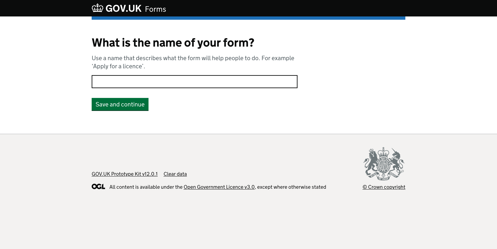
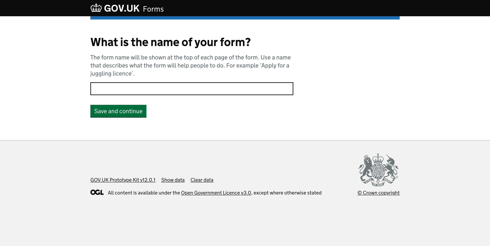

# Name your form page

## Context

> Give a brief overview of
> - what we wanted to test for example, user needs or design changes
> - what tasks we gave to users

 

## What we tested last time

  
*Page with “What is the name of your form?” question heading.*

There is hint text that says, “Use a name that describes what the form will help people to do. For example, ‘Apply for a licence’.” above a text input.

Below the text input is a green “Save and continue” button.

### What we saw

When testing some users were unsure what to call their forms, with some suggesting that they should have a list of names to choose from. This seemed to feel as though they expected the system to know or have a list of their department's forms already listed.  

We also heard from some users that they were unsure what the name would be used for and who would see it.  
> “we should better explain what the name of the form will be used for - that the end user will see it” - P2

 

## What we changed and why

We updated the hint text content to help give form creators more context of what the name they give will be used for and where they can expect to see it. We believe that this will give them confidence and a nudge to give the form a useful name that reflects the [service manual](https://www.gov.uk/service-manual/design/naming-your-service).

  
*Page with “What is the name of your form?” question heading.*

There is hint text that says, “The form name will be shown at the top of each page of the form. Use a name that describes what the form will help people to do. For example, ‘Apply for a licence’.” above a text input.

Below the text input is a green “Save and continue” button.
