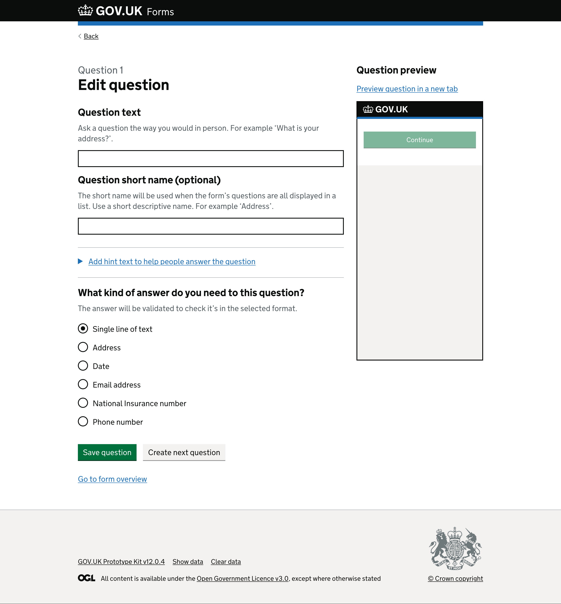
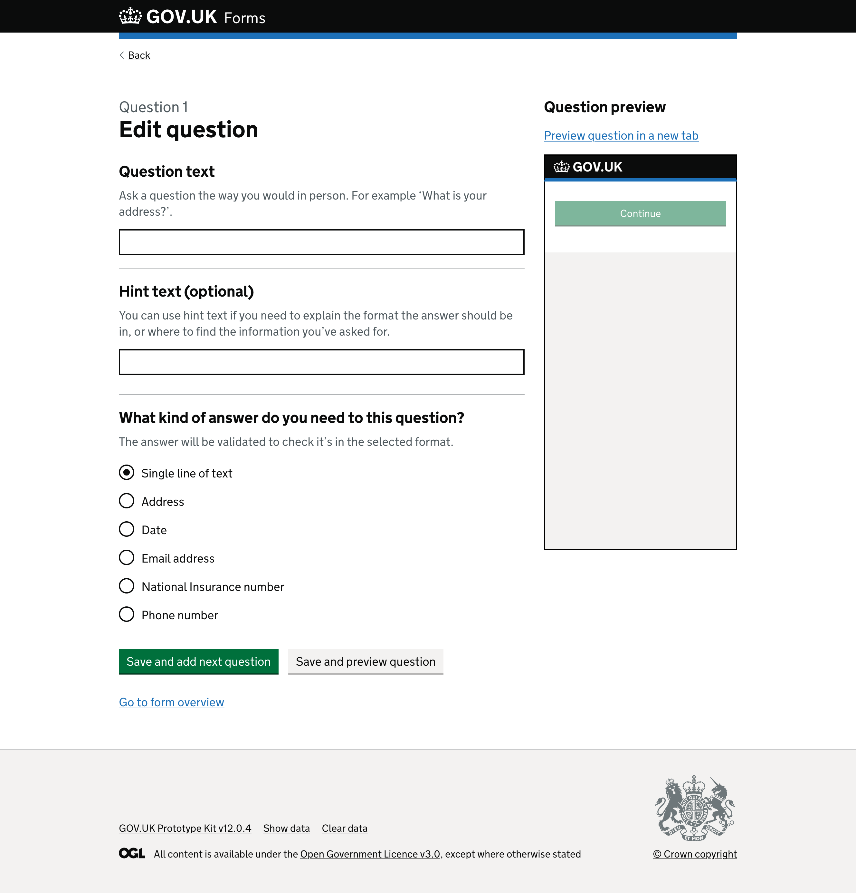

# Edit question page

## Context

We tested version 3 with members of the public who had access needs. This provided us with some valuable insights and formed the basis of version 4. 

For this version we wanted to re-test the overall usability of creating a form from the start, and then returning to make changes to an existing form. 

Based on previous rounds we decided to remove the ‘short version’ of a question, and we made the ‘hint text’ always visible.  

We also went back slightly to previous ‘save’ buttons making it clearer which action the user would take when clicking one.  

## What we tested last time

*Page with “Question 1” caption above a heading “Edit question”.*

A secondary heading, “Question text”, comes directly before the hint text “Ask a question the way you would in person. For example ‘What is your address?’”, followed by a text input.

A second secondary heading, “Question short name (optional)”, is followed by hint text “The short name will be used when the form’s questions are all displayed in a list. Use a short descriptive name. For example ‘Address’.”. This is followed by a text input.

Below these is a closed details component showing a blue link with an arrow before the text “Add hint text to help people answer the question”.

Next is a secondary heading, “What kind of answer do you need to this question?”, which has the hint text “The answer will be validated to check it’s in the selected format.” Below are radio buttons that determine the input type required:

- Single line of text, selected
- Address
- Date
- Email address
- National Insurance number
- Phone number

The page ends with a green “Save question” button next to a grey “Create next question” button. Below the two buttons is a “Go to form overview” link.

<!-- describe side preview pane -->
On the right side of the screen there is a secondary heading, “Question preview” with a link to “Preview question in a new tab”.

Below the link is a smaller version of an empty GOV.UK service page within an iframe, to mimic a mobile screen. It shows the GOV.UK logo on a black header. Within the body of the page is a disabled green ‘Continue’ button.

### What we saw

- User was unsure whether the save button would move them to another page
- ‘Preview question in a new tab’ caused a navigation challenge when user tried to get out of the preview and back to form editing  
- Some uncertainty around whether work had been saved when creating a question  
- Some uncertainty as to what the preview pane did, particularly before users had saved a question and it had been populated with their content  
- Users often needed to consider answer type before they were able to write useful hint text, but the current interface asks for hint text first  
- They are also not shown how the answer type will display in the preview pane until they have saved a question. Some users re-wrote their hint text after saving and previewing  

## What we changed and why

- Removed the ‘short version’ input for a question. Users continued to query the need for it, and were unsure when or how they could use it. We decided that this is probably not needed as a basic feature, and if we return to consider it in the future it may be a more ‘advanced’ feature
- Made the ‘hint text’ question and input always visible - no longer in a ‘details’ component - meaning it is more prominent
- Added more context to the ‘save’ buttons making it clearer what action each will take
- Made ‘save and add next question’ the main call to action when adding a new question to the end position in the form
- Made ‘save and edit next question’ the main call to action when editing a question within the form journey, not last
- Secondary action button now saves the question reloading the page

*Page with “Question 1” caption above a heading “Edit question”.*

A secondary heading, “Question text”, comes directly before the hint text “Ask a question the way you would in person. For example ‘What is your address?’”. This is followed by a text input.

A second secondary heading, “Hint text (optional)”, comes directly before hint text “You can use hint text if you need to explain the format the answer should be in, or where to find the information you’ve asked for.”. This is followed by a text input.

Next is a secondary heading, “What kind of answer do you need to this question?”, which has the hint text “The answer will be validated to check it’s in the selected format.” Below are radio buttons that determine the input type required:

- Single line of text (selected)
- Address
- Date
- Email address
- National Insurance number
- Phone number

The page ends with a green “Save and add next question” button next to a grey “Save and preview question” button.  
Below this is a blue link saying “Go to form overview”.

<!-- describe side preview pane -->
On the right side of the screen there is a secondary heading “Question preview” above a link to “Preview question in a new tab”.

Below the link is a smaller version of an empty GOV.UK service page within an iframe. It shows the GOV.UK logo on a black header. Within the body of the page is a disabled green ‘Continue’ button.

### Feedback from this version

- In this round we did not see any more confusion or concern about ‘short version’ and why it was different to the ‘long version’
- Moving the ‘hint text’ seemed to have little to no impact on users' experience and ability to use it effectively
- Users started using the in-page preview pane (aside) more spontaneously, checking how their questions might look. However, the value of this wasn’t immediately clear and to begin with users did still seem to be ignoring it 
- One user wanted the preview to update as they typed
- One user commented on expecting to be asked for the answer type earlier/further up the page - feeling that the ‘hint text’ was too high up
  > P1: ‘What kind of answer do you need to this question? - I’d expect this to be higher up instead of the hint text’
