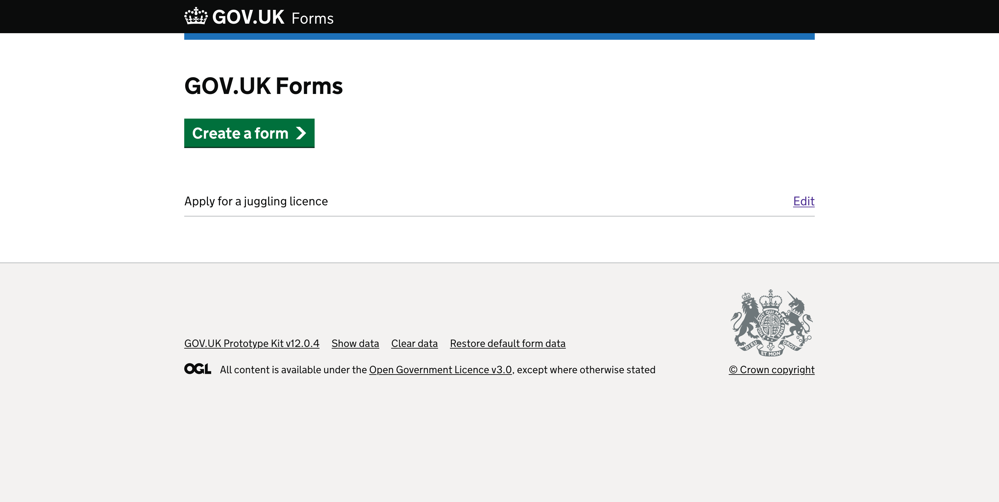
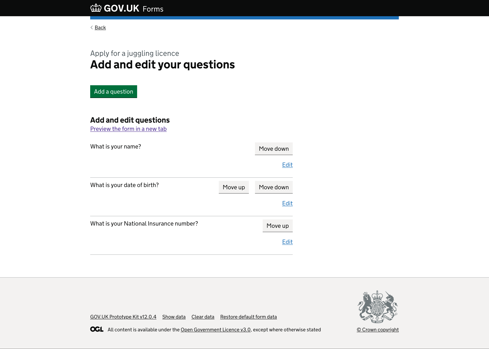
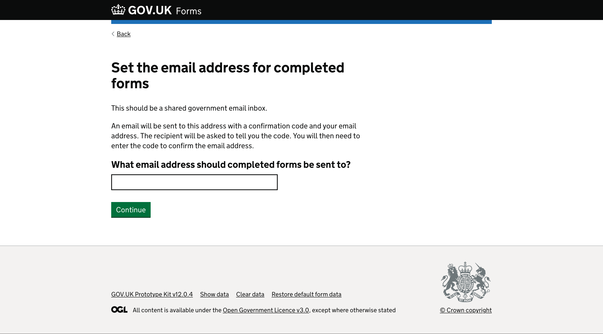
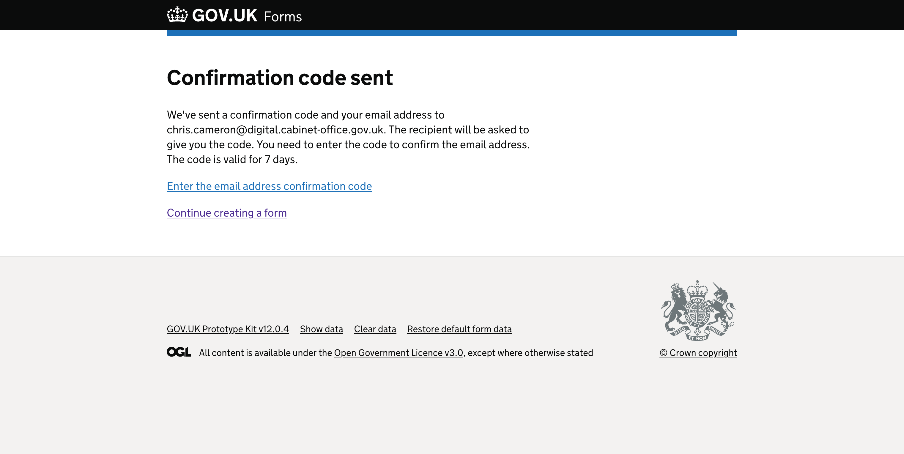
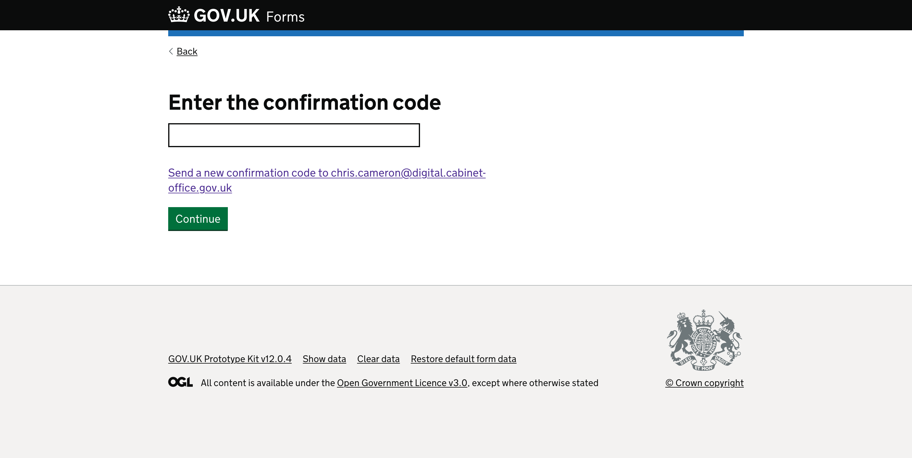
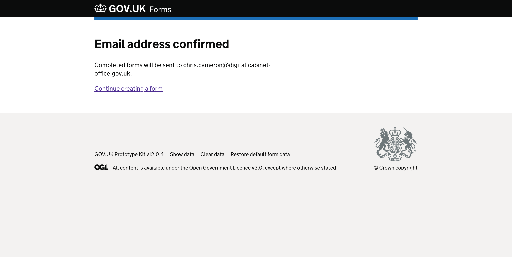
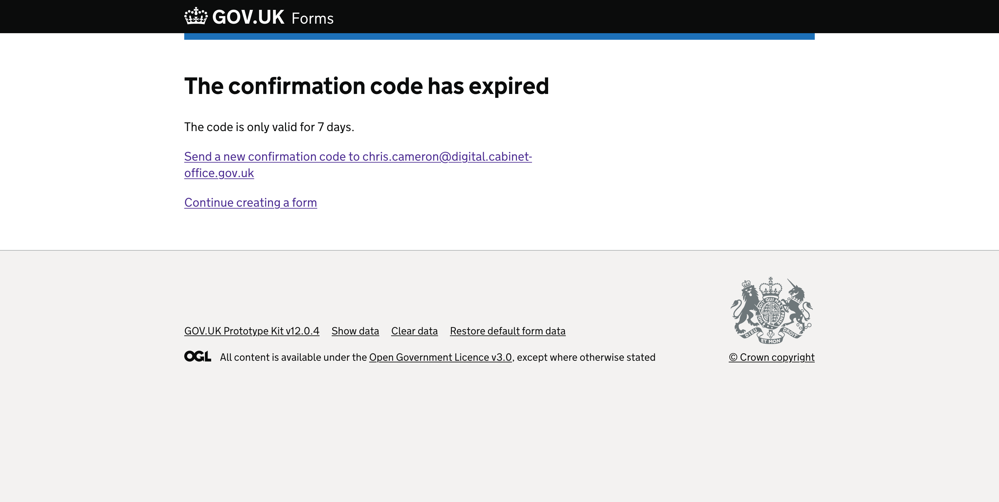
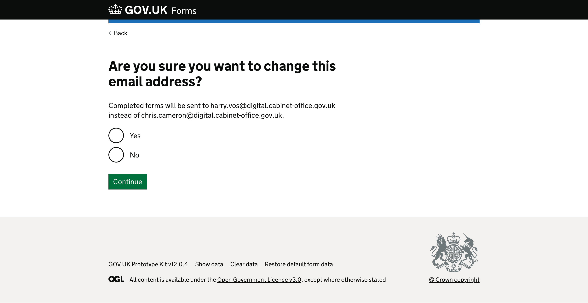
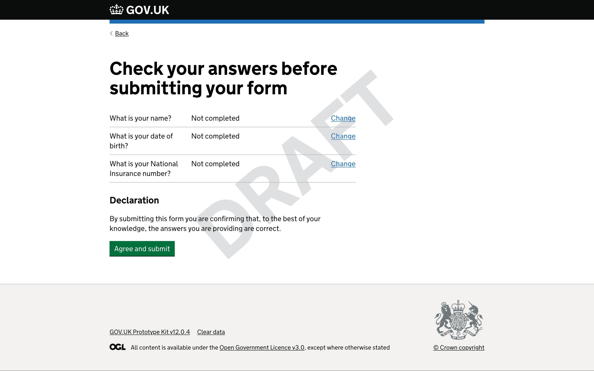
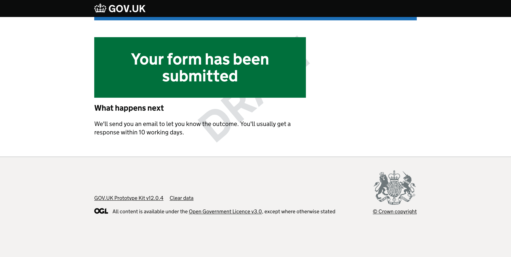

# Prototype version 6

Dates tested: *2022-08-02 to 2022-08-04*

## Status

Superceeded by [version 7](../prototype-version-7)

___

## Contents

- [Context](#context)
- [Admin interface screenshots](#admin-interface-screenshots)
  - [Add and edit your questions page](#add-and-edit-your-questions-page)
  - [Edit check your answers / form summary page](#edit-check-your-answers--form-summary-page)
  - [Edit confirmation / form submitted page](#edit-confirmation--form-submitted-page)
  - [Set the email address for completed forms](#set-the-email-address-for-completed-forms)
  - [Enter the confirmation code](#enter-the-confirmation-code)
  - [Publish a form](#publish-a-form)
- [Some things we changed since last time](#some-things-we-changed-since-last-time)
- [Form runner screenshots](#form-runner-screenshots)
- [What we learned](#what-we-learned)
- [Opportunites](#opportunities)

___

## Context

> **Sprint 9**  
> When we started testing with a very simplified version of the form builder, with only simple features, we were able to use a single page to show all the options available to our form creators.  
>    
> With the increasing complexity of our service, however, and based on findings from further rounds of research, we decided that creating a more ‘guided’ journey to form creation would improve the experience, make it clearer what form creators need to do, and hopefully ensure that the quality of the forms created would mean they could be considered ‘good’.  

___

## Admin interface screenshots

Below are the screens a form creator will see when making or editing their forms.

### GOV.UK Forms landing page

*Page with “GOV.UK Forms” heading and green “Create a form” start button.*

#### GOV.UK Forms landing page with one form already created

*Page with “GOV.UK Forms” heading and green “Create a form” start button.*

Below is a summary list with a single row. The row contains the name of a form, “Apply for a juggling licence”, and an ‘edit’ link to its right.  

### Name your form page

*Page with “What is the name of your form?” question heading.*

There is hint text that says, “The form name will be shown at the top of each page of the form. Use a name that describes what the form will help people to do. For example ‘Apply for a juggling licence’.” This is above a text input.

Below the text input is a green “Save and continue” button.

### Create a form (task list page) for a draft form

*Page with “Apply for a juggling licence” caption above the heading that says “Create a form”.*

Below the heading is bold text saying “Form incomplete“. This tells the form creator they have not completed all the steps needed to create their form.

This is followed by the sentence “You have completed 1 of 10 sections.“ This tells the form creator how many sections they have completed.

There is then an ordered list of steps with an unordered list of sections under each step, as set out below. Each section needs to be completed by the form creator before they can make their form ‘live’. 

Step “1. Create your form” has 4 rows under it.

The first row has a link to “Edit the name of your form“ and a blue highlighted tag on the far right of the row that reads “completed“.

The second row has a link to “Add and edit your questions“ and a grey highlighted tag on the far right that reads “not started“.

The third row has a link to “Review summary page and add declaration“ and a grey highlighted tag on the far right that reads “not started“.

The fourth row has a link to “Add information about what happens next“ and a grey highlighted tag on the far right that reads “not started“.

Step “2. Set form responses“ has 2 rows under it.

The first row has a link to “Set the email address completed forms will be sent to“ and a grey highlighted tag on the far right of the row that reads “not started“.

The second row has an inactive link to “Enter the email address confirmation code“ and a grey highlighted tag on the far right of the row that reads “Cannot start yet“. This inactive link changes to active when the form creator completes the previous step and the grey highlighted status tag would change to “not started“.

Step “3. Get your form ready to go live“ has 2 rows under it.

The first row has a link to “Provide link to your privacy information“ and a grey highlighted tag on the far right of the row that reads “not started“.

The second row has a link to “Provide link to your accessibility statement“ and a grey highlighted tag on the far right of the row that reads “not started“.

Step “4. Publish your form“ has 2 rows under it.

The first row has a link to “Make your form live“ and a grey highlighted tag on the far right of the row that reads “not started“.

The second row has a link to “How to publish the form on GOV.UK“ and a grey highlighted tag on the far right of the row that reads “not started“.

### Add and edit your questions page

*Page with “Apply for a juggling licence” caption above the heading “Add and edit your questions”.*

There is a green “Add a question” button under the heading.

#### Add and edit your questions page with added questions  

*Page with “Apply for a juggling licence” caption above the heading “Add and edit your questions”.*

There is a green “Add a question” button under the heading.  

Below is a secondary heading, “Add and edit questions”. There is a blue link directly underneath that which says “Preview the form in a new tab”.  

Next is a summary list with 3 rows - one for each question added by the form creator. To the right of each row is a grey button labelled ‘move up’ or ‘move down’ which lets someone move the question up or down in the form order. There is also a blue ‘edit’ link for each row.  

### Edit question 1

*Page with “Question 1” caption above a heading “Edit question”.*

A secondary heading, “Question text”, comes before the hint text “Ask a question the way you would in person. For example ‘What is your address?’.” There’s then an empty text input.

Beneath this is another secondary heading, “Hint text (optional)”, followed by hint text saying “You can use hint text if you need to explain the format the answer should be in, or where to find the information you’ve asked for.” There's then another empty text input. 

Next is a secondary heading, “What kind of answer do you need to this question?”, which has the hint text “The answer will be checked to make sure it’s in the selected format.”  

Below are [small radio buttons](https://design-system.service.gov.uk/components/radios/#smaller-radios) that let the form creator indicate the input type required. Each radio has hint text associated with it.  

- Single line of text (selected)  
  For a short answer  
- Multiple lines of text  
  For a longer answer  
- Number    
  Requires a numerical answer  
- Address  
  To collect an address with separate fields for line 1, line 2, town or city.    
- Date  
  Requires a specific day, month and year  
- Email address  
  Requires an answer in the format of an email address  
- National Insurance number  
  Requires an answer in the format of a National Insurance number  
- Phone number    
  Requires an answer in the format of a phone number  

The page ends with a green “Save and add next question” button next to a grey “Save and preview question” button.  

Below is a blue link which says “Go to form overview”.

<!-- describe side preview pane -->
On the right side of the screen there is a secondary heading “Question preview” above a link to “Preview question in a new tab”.

Below the link is a smaller version of an empty GOV.UK service page within an iframe. It shows the GOV.UK logo on a black header. Within the body of the page is a disabled green ‘Continue’ button.

### Edit question 2 - saved question

*Page with “Question 2” caption above a heading “What is your date of birth?”.*

The first text input contains the text that appears as the page’s heading, “What is your date of birth?”.

The second text input with the secondary heading label “Hint text (optional)” has the text “Date of birth” in the text input.  

The ‘Date’ radio is now selected.

At the bottom of the screen under the green “Save and add next question” and grey “Save and preview question” buttons is a new red “Delete this question” button.  

<!-- describe side preview pane -->
On the right side of the screen the iframe has now updated to include the question text “What is your date of birth?”. It displays the date component underneath with inputs for ‘Day’, ‘Month’ and ‘Year’. The green “Continue” button is still disabled.

### Delete a question

*Page with “Are you sure you want to delete this question?” as the heading.*

There are two radio options beneath the heading - “Yes” and “No”. Below is a green “Continue” button.

### Edit check your answers / form summary page

*Page with “Apply for a juggling licence” caption above the heading “Form summary page”.*

There is a paragraph describing what the summary page is to help the form creator: “This page lists all the questions and answers so people can check them before they submit the form.”

This is followed by some additional help text about what this page is for, to give additional context: “You can add a declaration for people to confirm their answers. For example:” It then gives an example, which says “By submitting this form you are confirming that, to the best of your knowledge, the answers you are providing are correct.”

There is a secondary heading label, “Declaration”, before a text area with a character counter that says “You have 2,000 characters remaining”. This gives form creators an idea of how many characters they have left within a 2,000 character limit.

At the end of the page there’s a green “Save and continue” button alongside a grey “Save and preview” secondary action button.

<!-- describe side preview pane -->
On the right side of the screen there is a secondary heading, “Page preview”, above an iframe.

The iframe includes the title “Check your answers before submitting your form” and the questions that have been added to the form so far. Each has a corresponding “Change” link. There is a faded green “Agree and submit” button for illustrative purposes.

  
<em>Close up of preview iframe showing the second level heading “Declaration” followed by added content “By submitting this form you are confirming that, to the best of your knowledge, the answers you are providing are correct.”</em>

### Edit confirmation / form submitted page

*Page with “Apply for a juggling licence” caption above the heading “Form submitted page”.*

There is a paragraph describing what the form submitted page is to help the form creator:

> This page will be shown after someone has completed and submitted the form to let them know that the form has been submitted successfully.

This is followed by some additional help text about what content should be included and an example using the [inset text component](https://design-system.service.gov.uk/components/inset-text/):  

> Add some content to let people know what will happen next and when, so they know what to expect. For example:  
>   
> We'll send you an email to let you know the outcome. You'll usually get a response within 10 working days.

This is followed by a secondary heading label, “What happens next”, before a textarea with a character counter, “You have 2000 characters remaining”. This gives form creators an idea of how many characters they have left within a 2,000 character limit.

At the end of the page is a green “Save and continue” button next to a grey “Save and preview” secondary button.

<!-- describe side preview pane -->
On the right side of the screen there is a secondary heading, “Page preview”, above an iframe showing a preview of the page as a form filler would see it. 

The iframe includes the title “Your form has been submitted” inside a green box. There is also a secondary heading, “What happens next”, above where the text input content provided on the left would appear.  

  
<em>Close up of preview iframe showing the second level heading “What happens next” followed by added content “We'll send you an email to let you know the outcome. You'll usually get a response within 10 working days.”</em>

### Set the email address for completed forms  

*Page headed “Set the email address for completed forms”.*  

Under the page heading is some content explaining the limitations and what the form creator needs to consider when choosing which email address their submissions should go to:  

> This should be a shared government email inbox.
>
> An email will be sent to this address with a confirmation code and your email address. The recipient will be asked to tell you the code. You will then need to enter the code to confirm the email address.

There is a secondary heading label, “What email address should completed forms be sent to?”, above a text input that validates for GOV.UK emails.  

Finally, there is a green “Continue” button.  

#### Confirmation code sent  

*Page headed “Confirmation code sent”.*  

Under the page heading is content confirming where the code has been sent. It also replays some of the content from the ‘set the email address...’ screen. 

> We've sent a confirmation code and your email address to provided.email@department.gov.uk. The recipient will be asked to give you the code. You need to enter the code to confirm the email address.  
> The code is valid for 7 days.

Next are two links that let the form filler move forward: 

- Enter the email address confirmation code  
- Continue creating a form  

### Enter the confirmation code  

*Page headed “Enter the confirmation code” which also acts as the label for a text input underneath.*  

There is a link under the input, which says: “Send a new confirmation code to provided.email@department.gov.uk”. This lets a form creator request a new code if the one sent previously is out of date, or has not been received.  

Finally, there is a green “Continue” button.  

#### Email address confirmed

*Page headed “Email address confirmed” with text “Completed forms will be sent to provided.email@department.gov.uk.” beneath.*

There is a link at the bottom of the page, “Continue creating a form”, to let the form creator move forward.  

#### The confirmation code has expired

*Page headed “The confirmation code has expired” with text “The code is only valid for 7 days.” beneath.*
 
There are two links at the bottom of the page to let the form creator move forward: 

- Send a new confirmation code to provided.email@department.gov.uk  
- Continue creating a form  

#### Are you sure you want to change this email address? - return to set the email address journey  

*Page headed “Are you sure you want to change this email address?” which also acts as the legend for radio options underneath.*

There is hint text explaining what this change will mean for form creators: 

> Completed forms will be sent to new.provided.email@department.gov.uk instead of provided.email@department.gov.uk.  

Under the hint text are the radio options, ‘yes’ (which comes first) and ‘no’. Finally, there is a green “Continue” button.  

### Publish a form

*Page with “Publish form” caption above the heading “Apply for a juggling licence”.*

There is a question, “Where do you want to publish the form?”, with two radio options below. These are: “On the GOV.UK website” and “On my organisation’s website”.

There is a green “Publish form” button, the word ‘or’, and then a link to “return to page list”.

<!-- describe side preview pane -->
On the right side of the screen the iframe includes the title “Apply for a juggling licence” above a green “Start now” button to simulate the journey from the start page.

___

## Some things we changed since last time

In version 6 we wanted to consider how best to use a task list to help form creators create working forms. 

We explored:  

- using the task list for the “Next steps” - still keeping it on the same screen but showing “in progress”, “complete” and “not able to start yet” for each ‘step’    
- a more guided experience using the key steps and actions needed to publish a form, to help users successfully create a form
- adding additional steps that the team believe will need to be taken before a new form can be made live, inlcuding adding a privacy statement link and an accessibility statement link for the form
  - these were added to prompt conversations with participants during testing 

We also added new journeys to test including: 

- Review summary page and add declaration
  - Redesigned declaration journey to only allow customisation of declaration content
  - Added more context about what the form creator is being asked for on this page and added an example of what a declaration might be 
- Add information about what happens next
  - Redesigned the edit summary page journey to limit customisation to the what happens next content
  - Added more context about what the form creator is being asked for on this page and added an example of what the content might be  
- Set form responses
  - Designed a new journey to let form creators set up the email address where GOV.UK Forms will send the form filler submissions
  - The journey allows adding an email address, changing/updating an existing address and confirmation of access to a given email address

For more information, see [v0.0.6 release notes](https://github.com/alphagov/forms-prototypes/releases/tag/v0.0.6).

___

## Form runner screenshots

Below are the screens the form filler (the end user) would see as they complete the form.

### Preview question 1

*Page with “What is your name?” question as a label for a text input. There is a green “Continue” button at the bottom. The background of the screenshot has a “DRAFT” watermark.*

### Preview final question

*Page with “What is your National Insurance number?” question as a label for a text input. There is a green “Check your answers” button at the bottom. The background of the screenshot has a “DRAFT” watermark.*

### Preview check your answers (summary) page

*Page with “check your answers before submitting your form” heading followed by a summary list component. The background of the screenshot has a “DRAFT” watermark.*

The summary list component lists rows of questions the form creator has added with a space to the right where the form filler’s answer would appear, currently displaying placeholder text “Not completed”. There is then a “Change” link for the form filler to correct or change any answer they feel is incorrect.

Below is a secondary heading, “Declaration”, before the text “By submitting this form you are confirming that, to the best of your knowledge, the answers you are providing are correct.” This is an example declaration for the form filler to agree to, by clicking the green “Agree and submit” button.  

The declaration text is editable by the form creator within the admin side of the builder, meaning it can be customised to meet the needs of the different forms or department.  

### Preview form submitted (confirmation) page

*Page with “Your form has been submitted” heading in a green box. The background of the screenshot has a “DRAFT” watermark which is mostly covered by the green box.*

This page includes a secondary heading, “What happens next”, followed by the content that would have been added by the form creator within the admin side of the builder. It should match their internal service level agreements (SLAs) and include any information relevant to the form filler’s journey, including any next steps they need to take.  

___

## What we learned

This round of testing saw form creators understanding the task list as a way of guiding them through the creation journey.  

Overall, users were positive about the steps as they were displayed and the playback of status tags for each task that needed completing. They understood that tasks could be completed in any order, but most seemed to go through it as they were laid out on screen.  

We got feedback about the language used for some task links and headings being too vague or unhelpful before they clicked into a task. In this version of the prototype there was no way to mark a question’s task as complete, which caused some anxiety and is something we should look at for the next version.  

### User research documentation
[Usability testing: Task list and steps to make form live (GitHub)](../../research/2022-08-15_Task_list_and_steps_to_make_form_live.md)

___

## Opportunities

Based on the research we want to: 

- Make the task list links clearer, where we saw or heard problems for users
- Make improvements to the content for ‘what happens next’ to help users provide useful information to their form fillers, including: 
  - Make the label text more specific?
  - Make it clearer it’s for people completing the form
  - Consider adding an example heading to make it clearer what the example is
  - Remove character count? It adds an expectation of the amount of text you should provide (and we really don’t want more than a couple of lines if they can’t format the text).
- Make improvements to the declaration content to help users decide whether they need to add a declaration to their form or not, including: 
  - Focus on providing declaration content (which is the action) rather than on checking answers 
  - Make the task list link text, heading and content more specific
  - Make it clearer that the declaration is content for people who are completing the form to agree to
  - Add an example heading to make it clearer what the example is, and to be consistent with the pattern on the 'what happens next' page
- Improve the content and journey for setting an email for form submissions to be sent to

[Back to the top](#prototype-version-6)
