# Prototype version 6

Dates tested: *2022-08-02 to 2022-08-04*

## Status

Superceeded by [version 7](../prototype-version-7)

___

## Contents

- [Context](#context)
- [Admin interface screenshots](#admin-interface-screenshots)
- [Form runner screenshots](#form-runner-screenshots)
- [What we learned](#what-we-learned)
- [Opportunites](#opportunities)

___

## Context

> **Sprint 9**  
> In this sprint we want to test

___

## Admin interface screenshots

Below are the screens a form creator will see when making or editing their forms.

### GOV.UK Forms landing page

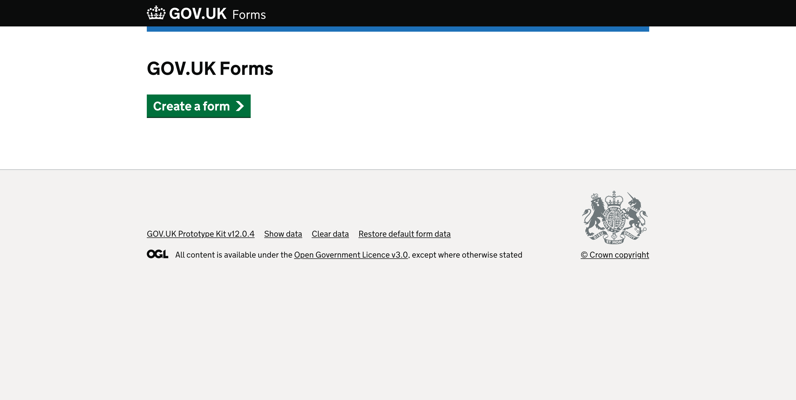
*Page with “GOV.UK Forms” heading and green “Create a form” start button.*

### Name your form page

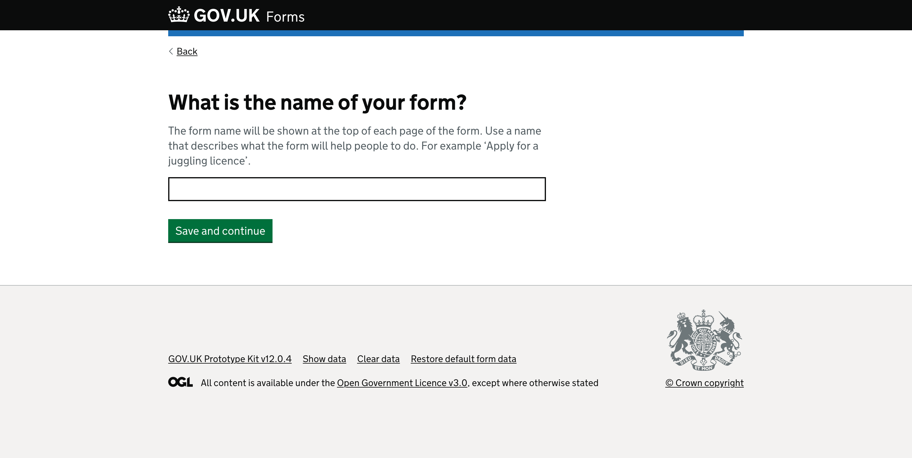
*Page with “What is the name of your form?” question heading.*

There is hint text that says, “The form name will be shown at the top of each page of the form. Use a name that describes what the form will help people to do. For example ‘Apply for a juggling licence’.” above a text input.

Below the text input is a green “Save and continue” button.

### Create a form (task list page) for a draft form

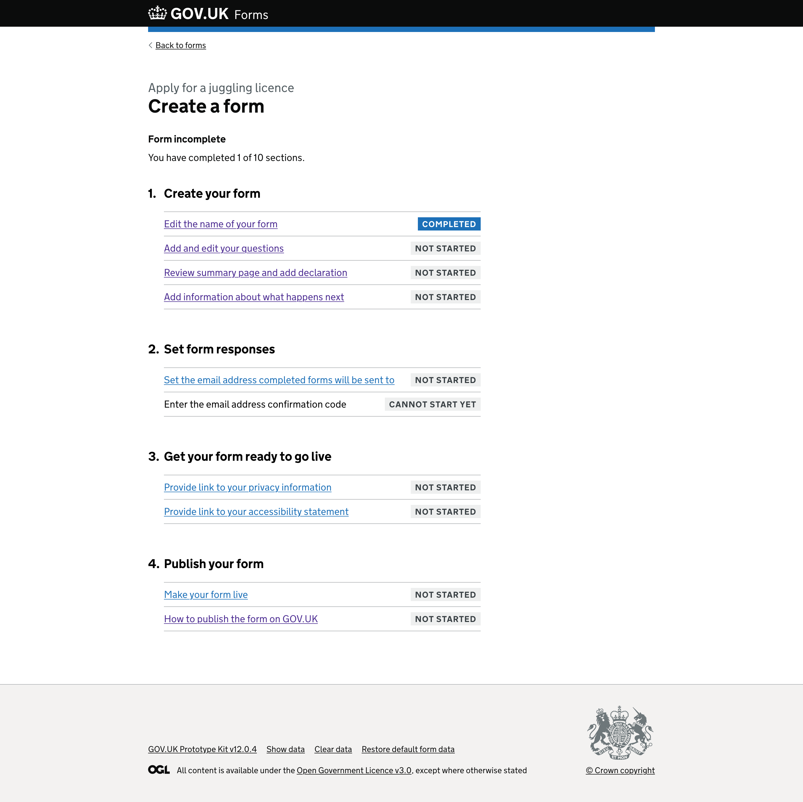
*Page with “Apply for a juggling licence” caption above the heading that says “Create a form”.*

Below the heading is bold text saying “Form incomplete“ that tells the form creator they have not completed all the steps to create their form.

This is followed by the paragraph “You have completed 1 of 10 sections.“ This tells the form creator how many sections they have completed.

There is an ordered list of steps with an unordered list of sections under each. Each section needs to be completed by the form creator before they can make their form ‘live’.

Step “1. Create your form” which has 4 rows under it.

The first row has a link to “Edit the name of your form“ and a blue highlighted tag on the far right of the row that reads “completed“.

The second row has a link to “Add and edit your questions“ and a grey highlighted tag on the far right that reads “not started“.

The third row has a link to “Review summary page and add declaration“ and a grey highlighted tag on the far right that reads “not started“.

The fourth row has a link to “Add information about what happens next“ and a grey highlighted tag on the far right that reads “not started“.

Step “2. Set form responses“ which has 2 rows under it.

The first row has a link to “Set the email address completed forms will be sent to“ and a grey highlighted tag on the far right of the row that reads “not started“.

The second row has an inactive link to “Enter the email address confirmation code“ and a grey highlighted tag on the far right of the row that reads “Cannot start yet“. This inactive link changed to an active when the form creator completes the previous step and the grey highlighted status tag would change to “not started“.

Step “3. Get your form ready to go live“ which has 2 rows under it.

The first row has a link to “Provide link to your privacy information“ and a grey highlighted tag on the far right of the row that reads “not started“.

The second row has a link to “Provide link to your accessibility statement“ and a grey highlighted tag on the far right of the row that reads “not started“.

Step “4. Publish your form“ which has 2 rows under it.

The first row has a link to “Make your form live“ and a grey highlighted tag on the far right of the row that reads “not started“.

The second row has a link to “How to publish the form on GOV.UK“ and a grey highlighted tag on the far right of the row that reads “not started“.

### Add and edit your questions page

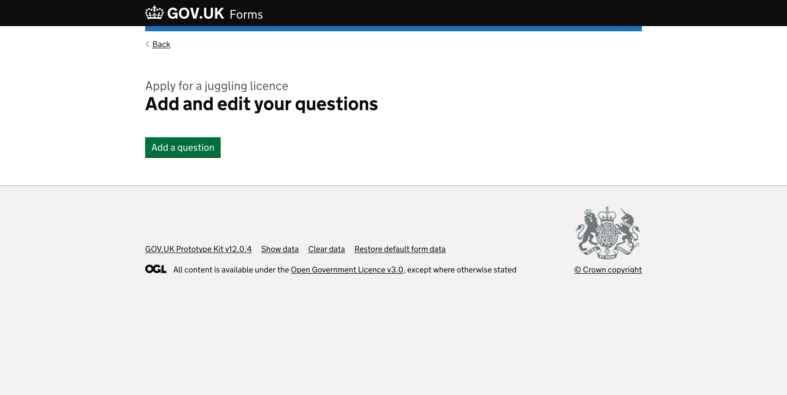
*Page with “Apply for a juggling licence” caption above the heading that says “Add and edit your questions”.*

There is a green “Add a question” button.

### Edit question 1

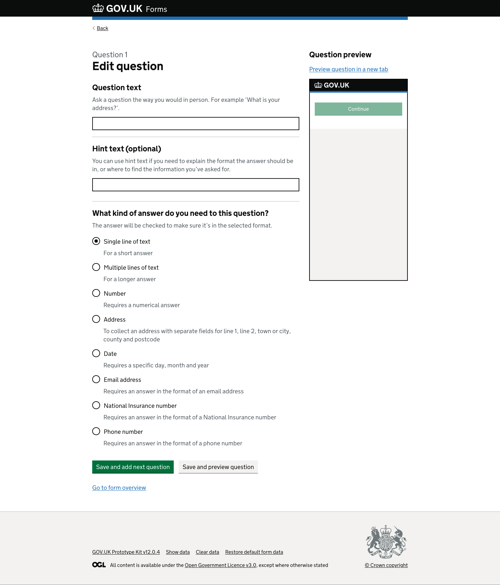
*Page with “Question 1” caption above a heading “Edit question”.*

A secondary heading, “Question text”, comes directly before the hint text “Ask a question the way you would in person. For example ‘What is your address?’” and then a text input.

A second secondary heading, “Hint text (optional)”, followed by hint text “You can use hint text if you need to explain the format the answer should be in, or where to find the information you’ve asked for.” and then a text input.

Next is a secondary heading, “What kind of answer do you need to this question?”, which has the hint text “The answer will be checked to make sure it’s in the selected format.” Below are radio buttons that determine the input type required:

- Single line of text (selected)
- Address
- Date
- Email address
- National Insurance number
- Phone number

The page ends with a green “Save and add next question” button next to a grey “Save and preview question” button.  
Below is a blue link “Go to form overview”.

<!-- describe side preview pane -->
On the right side of the screen there is a secondary heading “Question preview” above a link to “Preview question in a new tab”.

Below the link is a smaller version of an empty GOV.UK service page within an iframe. It shows the GOV.UK logo on a black header. Within the body of the page is a disabled green ‘Continue’ button.

### Edit question 2 - saved question

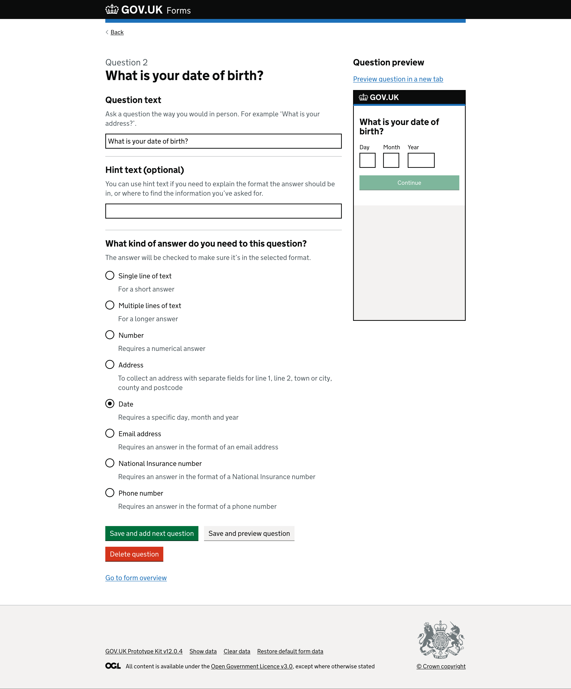
*Page with “Question 2” caption above a heading “What is your date of birth?”.*

The first text input contains the text that appears as the pages heading, “What is your date of birth?”.

The second text input with the secondary heading label “Hint text (optional)” has the text “Date of birth” in the text input.  

The ‘Date’ radio is now selected.

<!-- describe side preview pane -->
On the right side of the screen the iframe has now updated to include the question text “What is your date of birth?” and displays the date component underneath with inputs for ‘Day’, ‘Month’ and ‘Year’. The green “Continue” button is still disabled.

### Delete a question

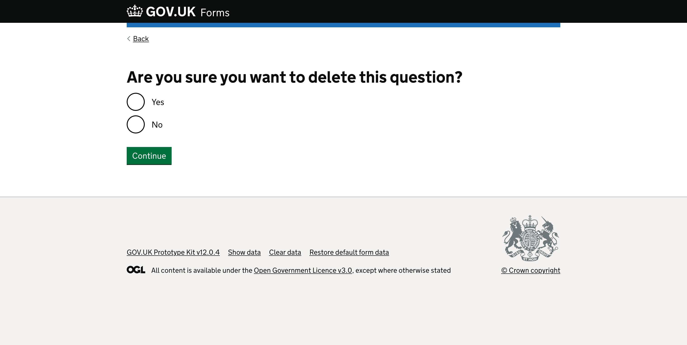
*Page with “Are you sure you want to delete this question?” as the heading.*

There are two radio options, “Yes” and “No”. Below is a green “Continue” button.

### Edit check your answers / form summary page

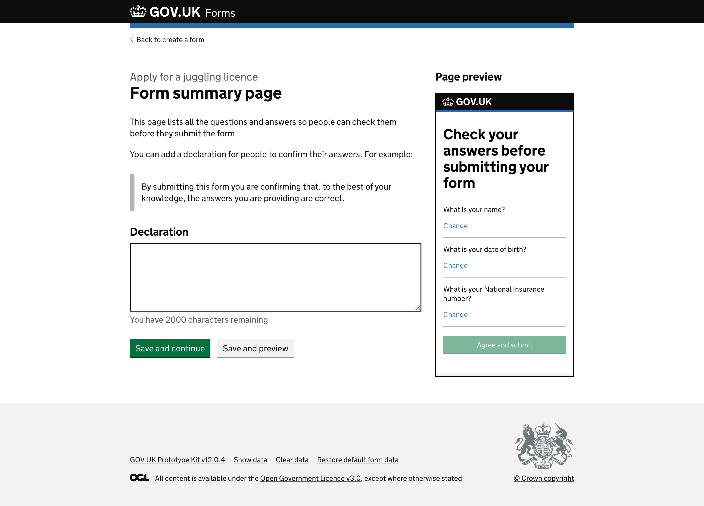
*Page with “Apply for a juggling licence” caption above the heading “Form summary page”.*

There is a paragraph describing what the summary page is to help the form creator, “This page lists all the questions and answers so people can check them before they submit the form.”

This is followed by some additional help text about what this page is for by giving additional context “You can add a declaration for people to confirm their answers. For example:” and an example “By submitting this form you are confirming that, to the best of your knowledge, the answers you are providing are correct.”

There is a secondary heading label, “Declaration” before a text area with a character counter, “You have 2,000 characters remaining”, giving form creators an idea of how much they have left of a 2,000 character limit.

At the end of the page is a green “Save and continue” button along side a grey “Save and preview” secondary action button.

<!-- describe side preview pane -->
On the right side of the screen there is a secondary heading, “Page preview” above an iframe.

The iframe includes the title “Check your answers before submitting your form” and the questions that have been added to the form so far, each having a corresponding “Change” link. There is a faded green “Agree and submit” button for illustrative purposes.

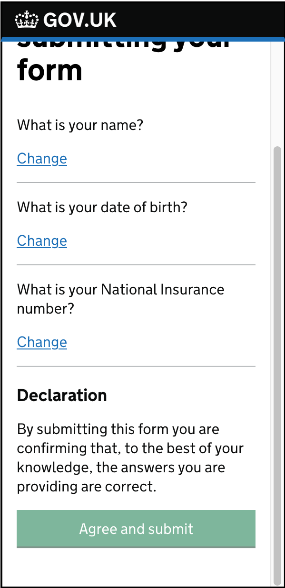
*Close up of preview iframe showing the second level heading “Declaration” followed by added content “By submitting this form you are confirming that, to the best of your knowledge, the answers you are providing are correct.”*

### Edit confirmation / form submitted page

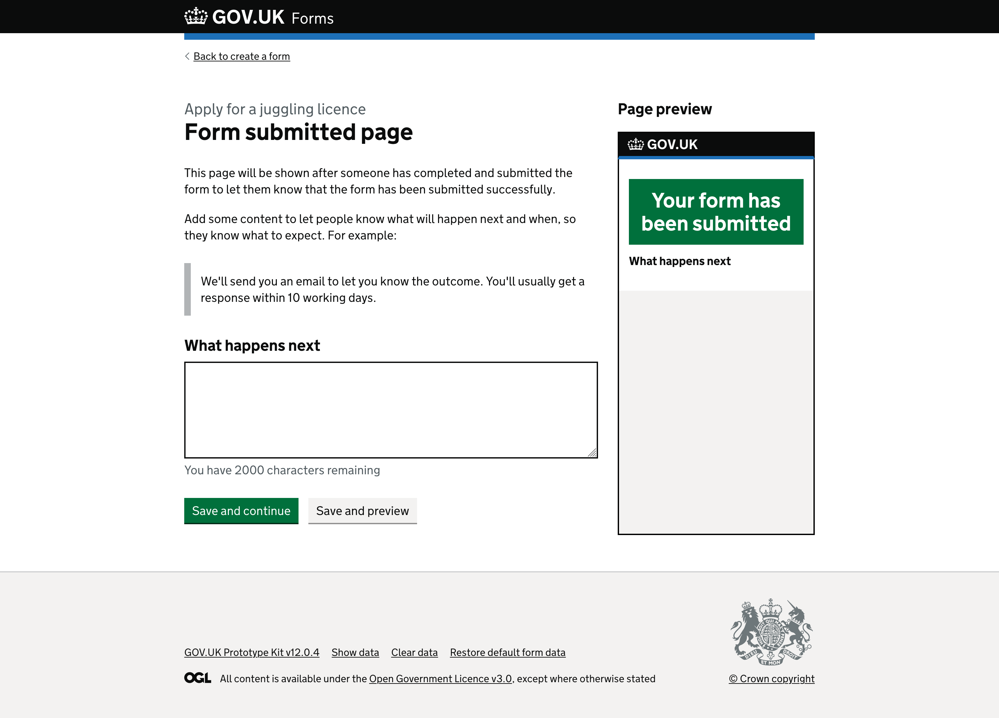
*Page with “Apply for a juggling licence” caption above the heading “Form submitted page”.*

There is a paragraph describing what the submitted page is to help the form creator, “This page will be shown after someone has completed and submitted the form to let them know that the form has been submitted successfully.”

This is followed by some additional help text about what this page is for by giving additional context “Add some content to let people know what will happen next and when, so they know what to expect. For example:” and an example “We'll send you an email to let you know the outcome. You'll usually get a response within 10 working days.”

There is a secondary heading label, “What happens next” before a text area with a character counter, “You have 2,000 characters remaining”, giving form creators an idea of how much they have left of a 2,000 character limit.

At the end of the page is a green “Save and continue” button along side a grey “Save and preview” secondary action button.

<!-- describe side preview pane -->
On the right side of the screen there is a secondary heading, “Page preview”.

The iframe includes the title “Your form has been submitted” inside a green box. There is also a secondary heading, “What happens next”, above where the text input content provided on the left would appear.

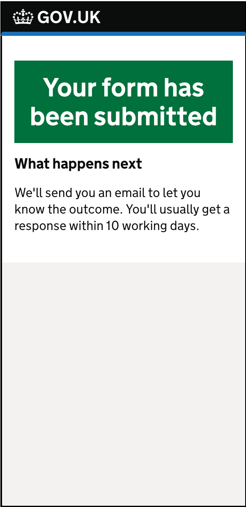
*Close up of preview iframe showing the second level heading “What happens next” followed by added content “We'll send you an email to let you know the outcome. You'll usually get a response within 10 working days.”*

### Publish a form

*Page with “Publish form” caption above the heading “Apply for a juggling licence”.*

There is a question, “Where do you want to publish the form?” with two radio options below, “On the GOV.UK website” and “On my organisation’s website”.

There is a green “Publish form” button, the word ‘or’, and then a link to “return to page list”.

<!-- describe side preview pane -->
On the right side of the screen the iframe includes the title “Apply for a juggling licence” above a green “Start now” button to simulate the journey from the start page.

___

## Some things we changed since last time

For more information, see [v0.0.6 release notes](https://github.com/alphagov/forms-prototypes/releases/tag/v0.0.6).

___

## Form runner screenshots

Below are the screens the form filler (the end user) would see as they complete the form.

### Preview question 1

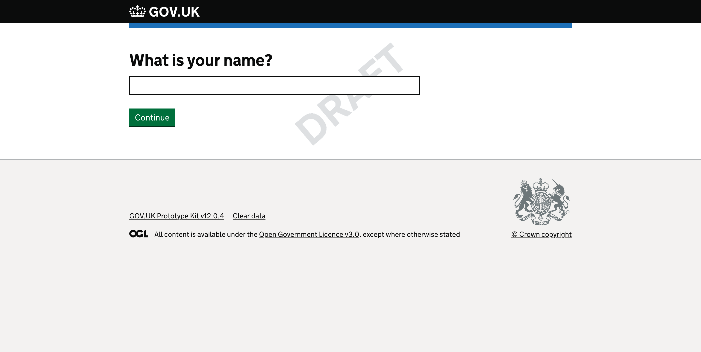
*Page with “What is your name?” question as a label for a text input. There is a green “Continue” button at the bottom.*

### Preview final question

*Page with “What is your National Insurance number?” question as a label for a text input. There is a green “Check your answers” button at the bottom.*

### Preview check your answers (summary page)

*Page with “Check your answers” heading followed by a summary list component.*

The summary list component lists rows of the “Short version” of the questions the form creator has added with a space to the right where the form fillers answer would appear. Finally there is a “Change” link for the form filler to correct or change any answer they feel is incorrect.

Below is a secondary heading, “Declaration”, before the text “By submitting this form you are confirming that, to the best of your knowledge, the answers you are providing are correct.” This is an example declaration for the form filler to agree to, by clicking the green “Agree and submit” button. The text of the declaration is editable by the form creator within the admin side of the builder, meaning it can be customised as to the needs of the different forms or department.

### Preview form submitted (confirmation page)

*Page with “Form submitted” heading followed by “Your reference number is HDJ2123F” in a green box.*

This page includes a secondary heading “What happens next” followed by the content “We’ve sent you an email to confirm we have received your form.” This text is editable by the form creator within the admin side of the builder, meaning it can be customised as to the needs of the different forms or department and should match their internal service level agreements (SLAs).

___

## What we learned

This round of testing saw form creators understanding the task list as a way of guiding them through the creation journey.  

Users were over all positive about the steps as they were displayed, the playback of status tags for each task needed to be complete. They understood that tasks could be completed in any order, but most seemed to go through it as they were layed out on screen.  

We got feedback about language used for some task links and headings being to vague or unhelpful before they clicked in to a task. In thius version of the prototype there was no way to mark questions task as complete which caused some anxiety, and is something we should look at for the next version.  

### User research documentation
[Usability testing: Task list and steps to make form live (GitHub)](../../research/2022-08-15_Task_list_and_steps_to_make_form_live.md)

___

## Opportunities

> Are there any opportunities we would like to explore, or ideas that we think we could consider?  
> List these here. They do not have to be full formulated at this point, but will inform our work (and should be added to Trello to discuss and ideate as a team).

[Back to the top](#prototype-version-6)
