# Prototype version 7

Dates tested: 

## Status

Superceeded by [version 8](../prototype-version-8) -->

___

## Contents

- [Context](#context)
- [Admin interface screenshots](#admin-interface-screenshots)
- [New journeys we introduced](#new-journeys-we-introduced)
- [Form runner screenshots](#form-runner-screenshots)
- [What we learned](#what-we-learned)
- [Opportunites](#opportunities)

___

 

## Context

> In this prototype version, we introduced new user journeys and made content improvements to some pages, based on findings from usability testing in Sprint 9 on prototye version 6. 
 
 

## Admin interface screenshots

Below are the screens a form creator will see when making or editing their forms.

 

### GOV.UK Forms landing page

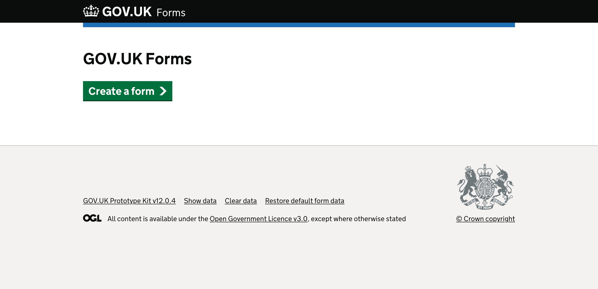
*Page with “GOV.UK Forms” heading and green “Create a form” start button.*

 

### Name your form page

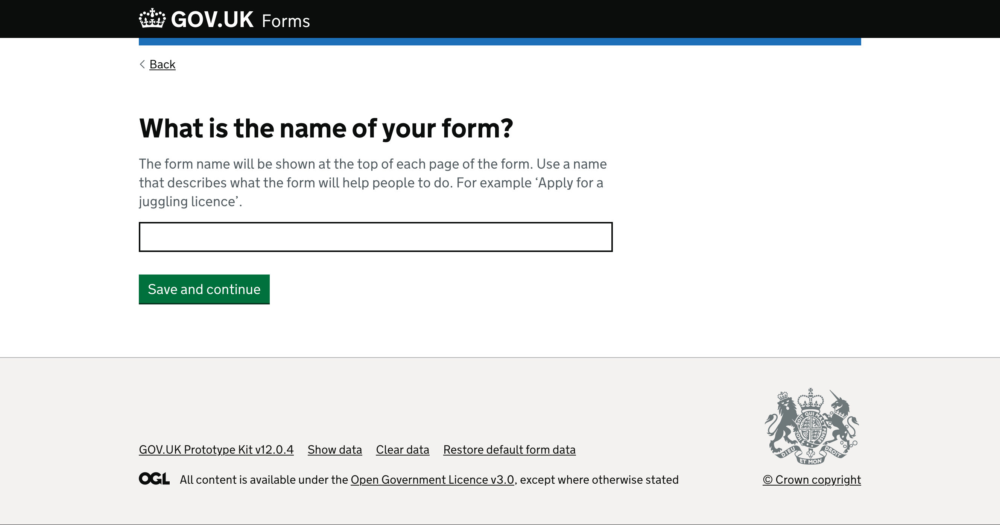
*Page with “What is the name of your form?” question heading.*

There is hint text that says, “The form name will be shown at the top of each page of the form. Use a name that describes what the form will help people to do. For example ‘Apply for a juggling licence’”, above a text input.

Below the text input is a green “Save and continue” button.

 

### Name your form page - with form

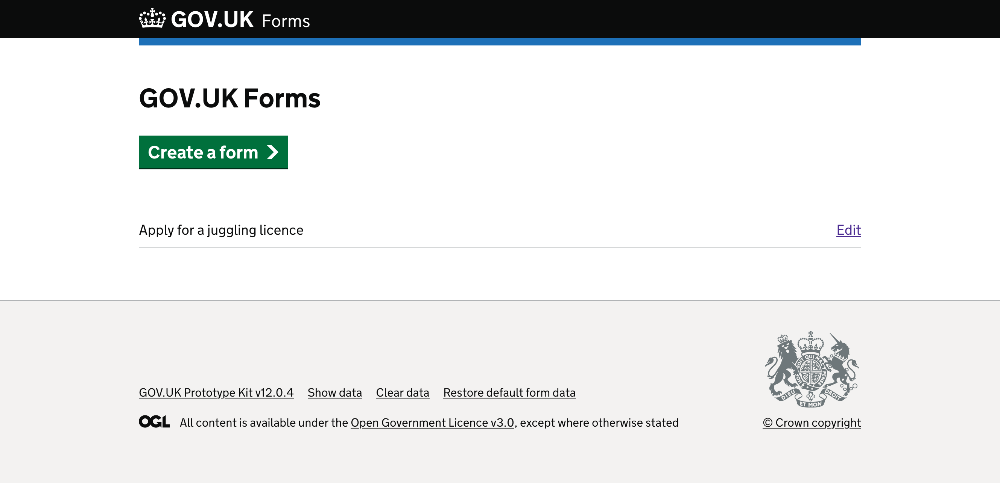
*Page with “GOV.UK Forms” heading, followed by a green primary button to “Create a form“.*

Below the button is a summary list component showing the name of the form that has been created “Apply for a juggling licence“ and to its far right an “Edit“ link.

 

### Create a form (task list page) for a draft form

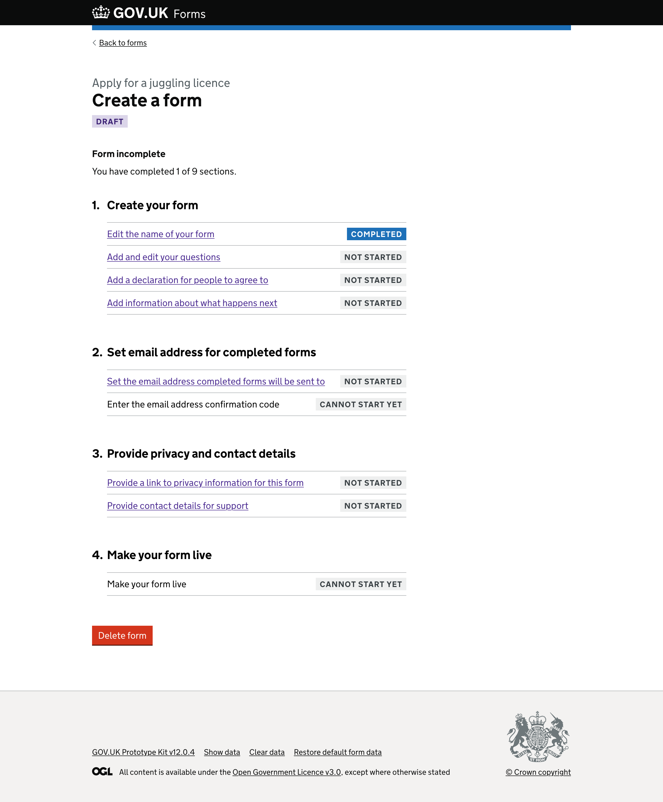
*Page with “Apply for a juggling licence” caption above the heading that says “Create a form“ and just below, a purple tag that says “DRAFT“.*

We made several changes to this page from the previous version - 
[changes to the 'task list' page](https://github.com/alphagov/forms/tree/documenting-prototype-version-7/design/prototype-version-7/task-list)

 

### Add and edit your questions page

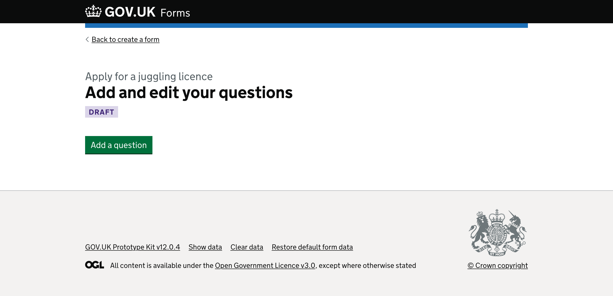
*Page with “Apply for a juggling licence” caption above the heading that says “Add and edit your questions”.*

There is a purple status tag that says 'DRAFT' to let users know this is a draft form. 
Below the tag, there is a green “Add a question” button.

 

### Edit question 1

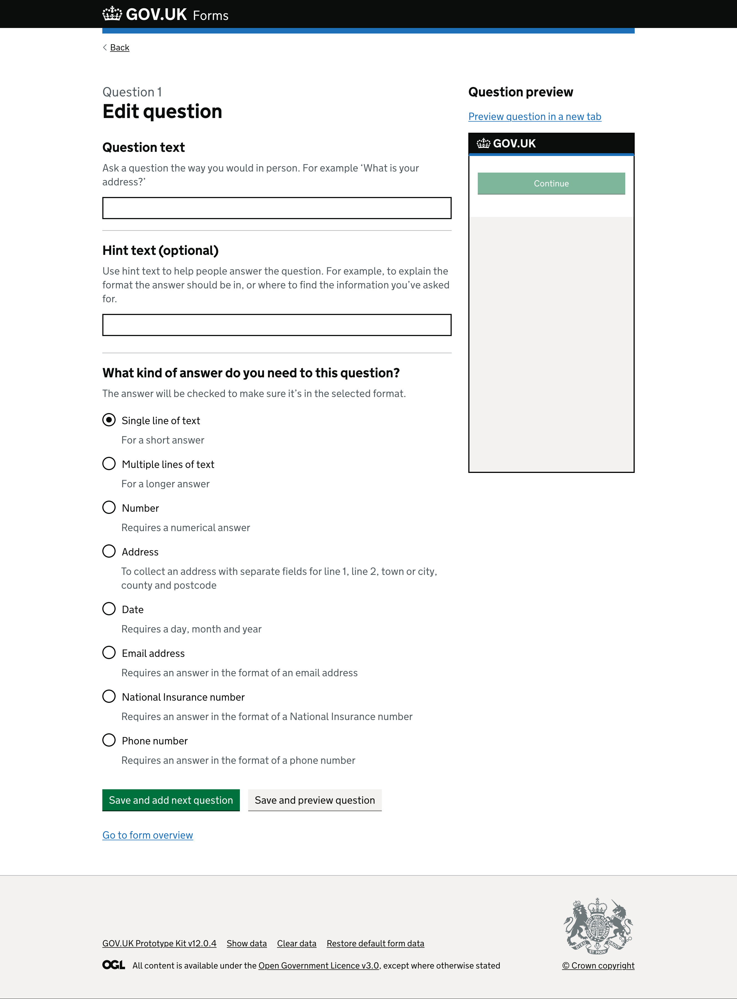
*Page with “Question 1” caption above a heading “Edit question”.*

A secondary heading, “Question text”, comes directly before the hint text “Ask a question the way you would in person. For example ‘What is your address?’” and then a text input. In this version, we made a minor context change by removing the full stop that was at the end of this hint text, because it already has a question mark.

A second secondary heading, “Hint text (optional)”, followed by hint text “You can use hint text if you need to explain the format the answer should be in, or where to find the information you’ve asked for.” and then a text input. We updated this hint text to be more descrptive than the previous [edit question page on prototype version 6](https://github.com/alphagov/forms/blob/main/design/prototype-version-6/screenshots/005-Edit-question-1.png). 

Next is a secondary heading, “What kind of answer do you need to this question?”, which has the hint text “The answer will be checked to make sure it’s in the selected format.” Below are radio buttons that determine the input type required:

- Single line of text (selected)
- Multiple lines of text
- Number
- Address
- Date
- Email address
- National Insurance number
- Phone number

We updated the content on the hint text of the date radio button from “Requires a specific day, month and year“ to “Requires a day, month and year“ to avoid people thinking it will only accept one specific date.

The page ends with a green “Save and add next question” button next to a grey “Save and preview question” button.
Below is a blue text link “Go to form overview”.

On the right side of the screen there is a secondary heading “Question preview” above a link to “Preview question in a new tab”.

Below the link is a smaller version of an empty GOV.UK service page within an iframe. It shows the GOV.UK logo on a black header. Within the body of the page is a disabled green ‘Continue’ button.

 

### Edit question 2 - saved question
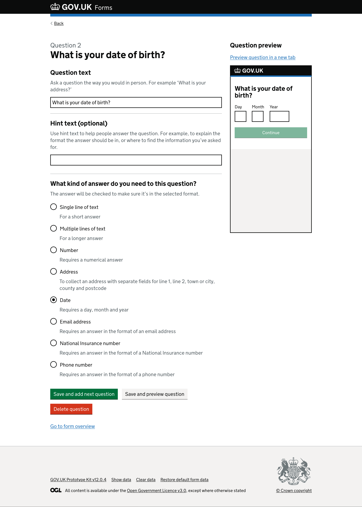
*Page with “Question 2” caption above a heading “What is your date of birth?”.*

The first text input contains the text that appears as the pages heading, “What is your date of birth?”.

The second text input with the secondary heading label “Hint text (optional)” has the text “Date of birth” in the text input.

The ‘Date’ radio is now selected.

The page ends with a green “Save and add next question” button next to a grey “Save and preview question” button. Below the green button is a red "Delete question" button
Below is a blue link “Go to form overview”.

On the right side of the screen the iframe has now updated to include the question text “What is your date of birth?” and displays the date component underneath with inputs for ‘Day’, ‘Month’ and ‘Year’. The green “Continue” button is still disabled.

 

### Delete a question
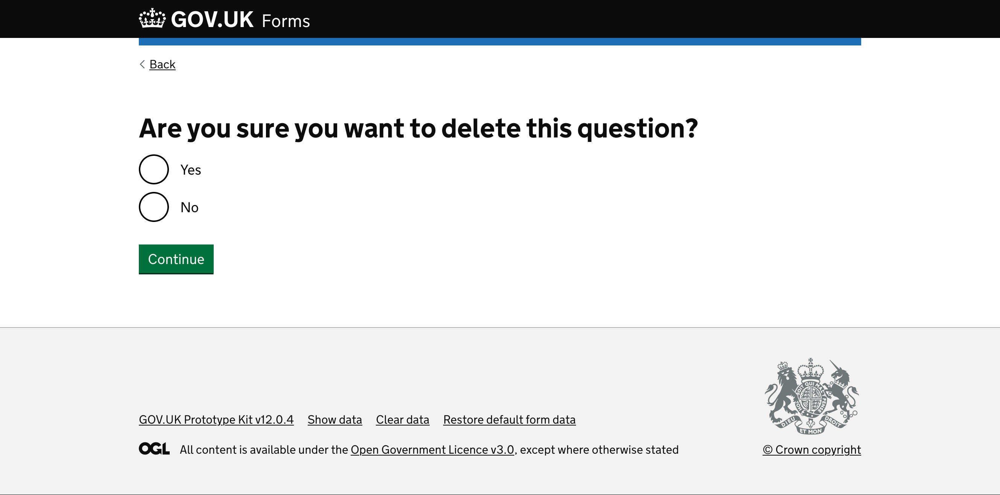
*Page with “Are you sure you want to delete this question?” as the heading.*

There are two radio options, “Yes” and “No” and below a green “Continue” button.

 

### Add and edit your questions - with questions

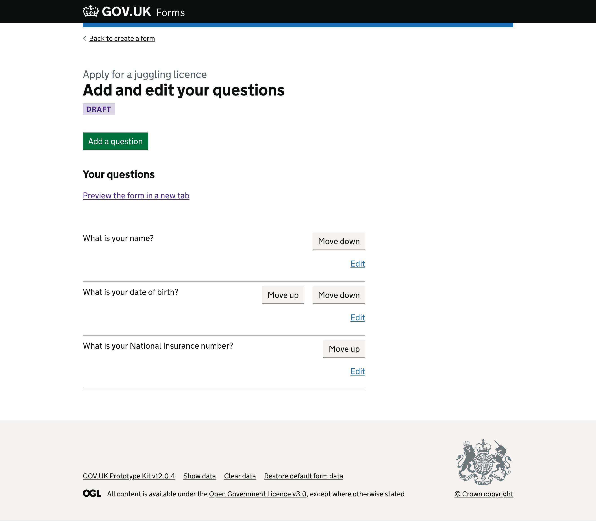
*Page with “Apply for a juggling licence” caption above the heading that says “Add and edit your questions”.*

There is a purple status tag that says 'DRAFT' to let users know this is a draft form. 
There is a green “Add a question” button.
There is a secondary heading, “Your questions" and below is a link "Preview the form in a new tab". 

There is a list of questions created and saved for this form. 
The first question is "What is your name?". To the right is a grey “Move down” button and below it a link "edit".
There is a section break
The second question is "What is your date of birth?". To the right is a grey “Move up” button, next to it a grey "Move down" button. Bellow the "Mode down" is a link "edit".
There is a section break
The third queston is "What is your National Insurance number?". To the right is a grey "Move up" button and below is a link "edit".

 

### Edit add a declaration / check your answers page 
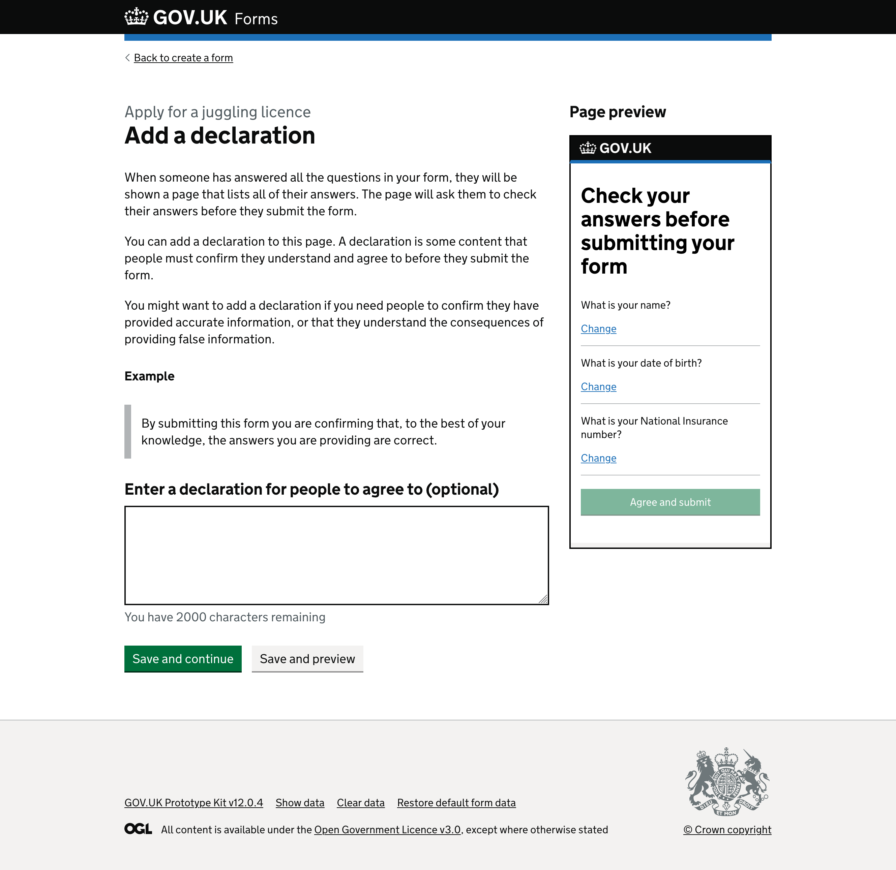
*Page with “Apply for a juggling licence” caption above the heading that says “Add a declaration".*

We updated the heading of this page from 'Form summary page' in [version 6 of the prototype](https://github.com/alphagov/forms/blob/documenting-prototype-version-7/design/prototype-version-6/screenshots/010-Edit-form-summary-page.png) to 'Add a declaration' to make the action for the form creator clear.

Below the heading there is a paragraph describing the purpose of the check your answers page, “When someone has answered all the questions in your form, they will be shown a page that lists all of their answers. The page will ask them to check their answers before they submit the form."

The next paragraph describes what a declaration is "You can add a declaration to this page. A declaration is some content that people must confirm they understand and agree to before they submit the form". 

Another paragraph follows describing how a form creator can add a declaration, "You might want to add a declaration if you need people to confirm they have provided accurate information, or that they understand the consequences of providing false information". 

There is a third level heading that says "Example", followed by an inset text with the example "By submitting this form your are confirming that, to the best of your knowledge, the answers you are providing are correct." In this prototype version, we added the example heading to make it clear what the example is, and to be consistent with the pattern on the ['Edit confirmation/form submitted page'](###Edit-confirmation/form submitted-page).

There is a secondary heading label, “Enter a declaration for people to agree to (optional)". We updated this heading to be more descriptive than the previous label "Declaration" that was on the previous version 6. 

The text input box has a character counter that says, “You have 2,000 characters remaining”, giving form creators an idea of how much they have left of a 2,000 character limit. 

At the end of the page is a green “Save and continue” button along side a grey “Save and preview” secondary action button.

<!-- describe side preview pane -->
On the right side of the screen there is a secondary heading, “Page preview”.

The iframe includes the title “Check your answers before submitting your form" and the questions that have been added to the form so far, each having a corresponding “Change” link. There is a faded green “Agree and submit” button for illustrative purposes.

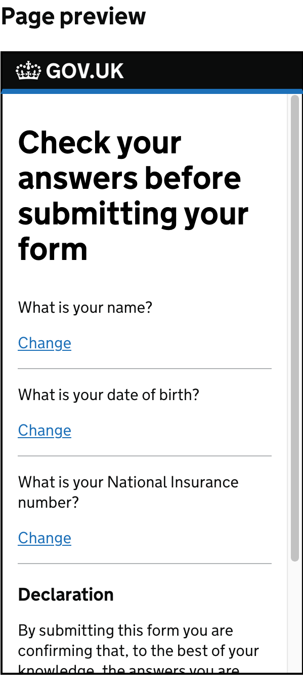
*Close up of preview iframe showing the second level heading “Check your answers before submitting your form”, the questions that have been added to the form so far, each having a corresponding “Change” link. This is followed by the second level heading “Declaration” with the added content “By submitting this form you are confirming that, to the best of your knowledge, the answers you are providing are correct.”*

 

### Edit confirmation/form submitted page

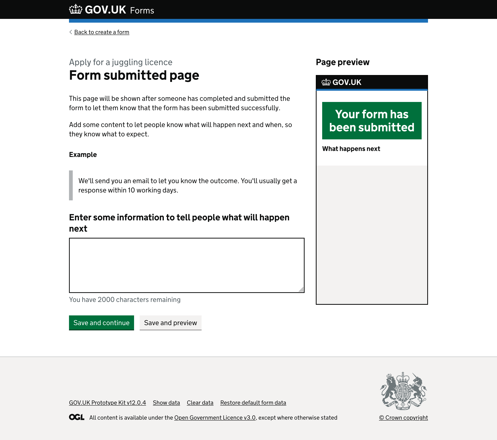
*Page with “Apply for a juggling licence” caption above the heading “Form submitted page”.*

There is a paragraph describing what the form submitted page is, “This page will be shown after someone has completed and submitted the form to let them know that the form has been submitted successfully.”

This is followed by some additional text to help the form creator edit the confirmation page “Add some content to let people know what will happen next and when, so they know what to expect.“ There is a third level heading, "Example" followed by inset text giving an example of content the form creator can use for their form submitted page “We'll send you an email to let you know the outcome. You'll usually get a response within 10 working days.”

There is a secondary heading label before the text input box that says, “Enter some information to tell people what will happen next”. We updated the content of this label to be more descriptive than the previous label that was "What happens next" on [the edit confirmation page of prototype version 6](https://github.com/alphagov/forms/blob/main/design/prototype-version-6/screenshots/012-Edit-form-submitted-page.png). 

The text input box has a character counter, “You have 2,000 characters remaining”, giving form creators an idea of how much they have left of a 2,000 character limit.

At the end of the page is a green “Save and continue” button along side a grey “Save and preview” secondary action button.

<!-- describe side preview pane -->
On the right side of the screen there is a secondary heading, “Page preview”.

The iframe includes the title “Your form has been submitted” inside a green box. There is also a secondary heading, “What happens next”, above where the text input content provided on the left would appear.

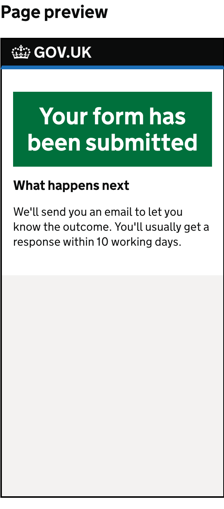
*Close up of preview iframe showing the second level heading “What happens next” followed by added content “We'll send you an email to let you know the outcome. You'll usually get a response within 10 working days.”*

 

### Set the email address for completed forms

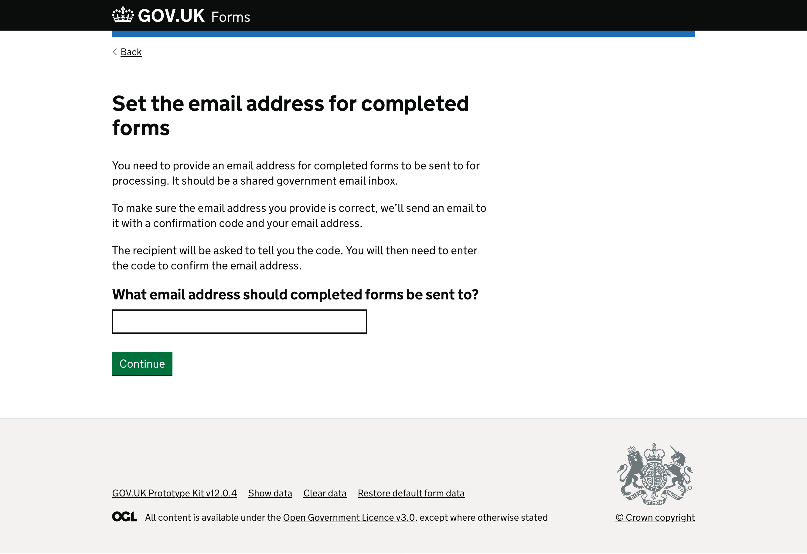
*Page with the heading “Set the email address for completed forms”.*

There is a paragraph describing why form creators need to set an email address, the need to confirm it and the type of email address required “You need to provide an email address for completed forms to be sent to for processing. It should be a shared government email inbox.“

This parapgraph descibes how the GOV.UK Forms platform will verify the email address provided by the form creator is correct “To make sure the email address you provide is correct, we’ll send an email to it with a confirmation code and your email address.“

“The recipient will be asked to give you the code. You'll then need to enter the code to confirm the email address.“

There is a secondary heading label, “What email address should completed forms be sent to?“ followed by a text input. 

At the end of the page is a green “Continue” button. 

 

### Confirmation code sent 

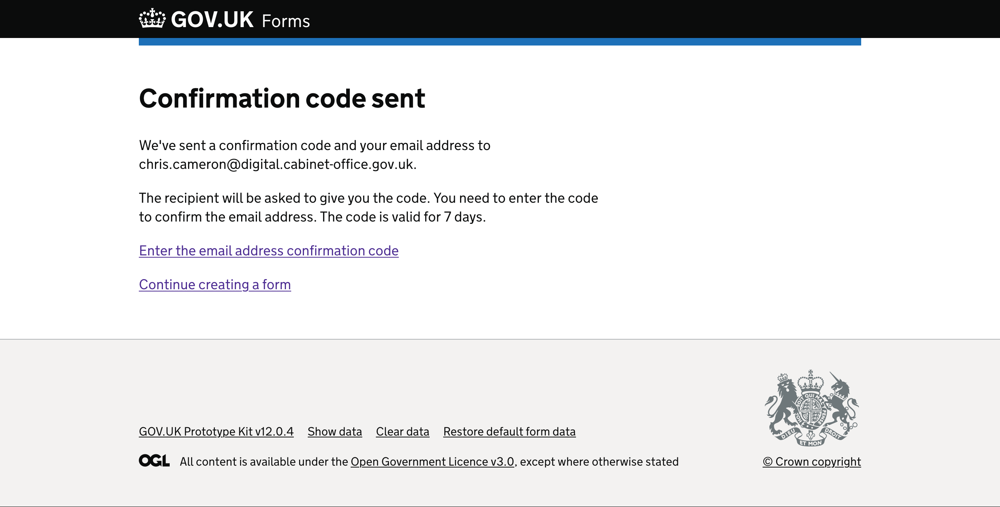
*Page with the heading “Confirmation code sent”.*

There is a paragraph that confirms to the form creator that a code has been sent to the email address they entered “We've sent a confirmation code and your email address to email@example.gov.uk.“

A paragrah explains to the form creator what to do with the confirmation code “The recipient will be asked to give you the code. You need to enter the code to confirm the email address. The code is valid for 7 days.“

This is followed by a blue link to “Enter the email address confirmation code".
There is another link to “Continue creating a form“. 

 

### Enter the confirmation code

*Page with the heading “Enter the confirmation code” as a label for a text input to enter the confirmation code.* 

Followed by a link to help the form creator request a new confirmation code “Send a new confirmation code to email@example.gov.uk“. 

At the end of the page is a green “Continue” button. 

 

### Email address confirmed

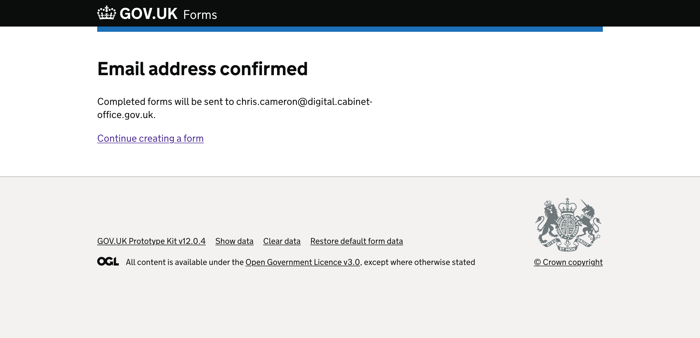
*Page with the heading “Email address confirmed”.*

There is text to confirm to the form creator that completed forms will be sent to the email address they entered and confirmed “Completed forms will be sent to email@example.gov.uk“. 

Followed by a blue text link to “Continue creating a form“. 

 

### The confirmation code has expired

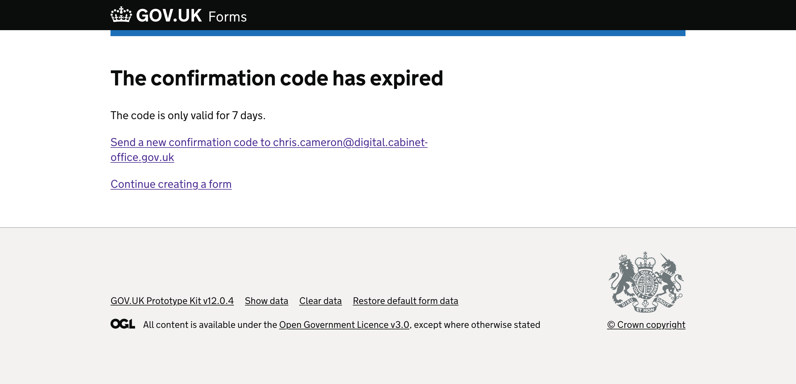
*Page with the heading “The confirmation code has expired”.*

There is text to let the form creator know why the confirmation code has expired “The code is only valid for 7 days.“

Followed by a hypertext link to help the form creator request for a new confirmation code “Send a new confirmation code to email@example.gov.uk“. 

There is another hypertext link to “Continue creating a form“. 

 

## New journeys we introduced

In this prototype version 7 we introduced new journeys to enable form creators to:
- provide a link to privacy information for a form
- provide contact details for support 
- make a form live 
- return to a live form to edit it

### Provide a link to privacy information for this form

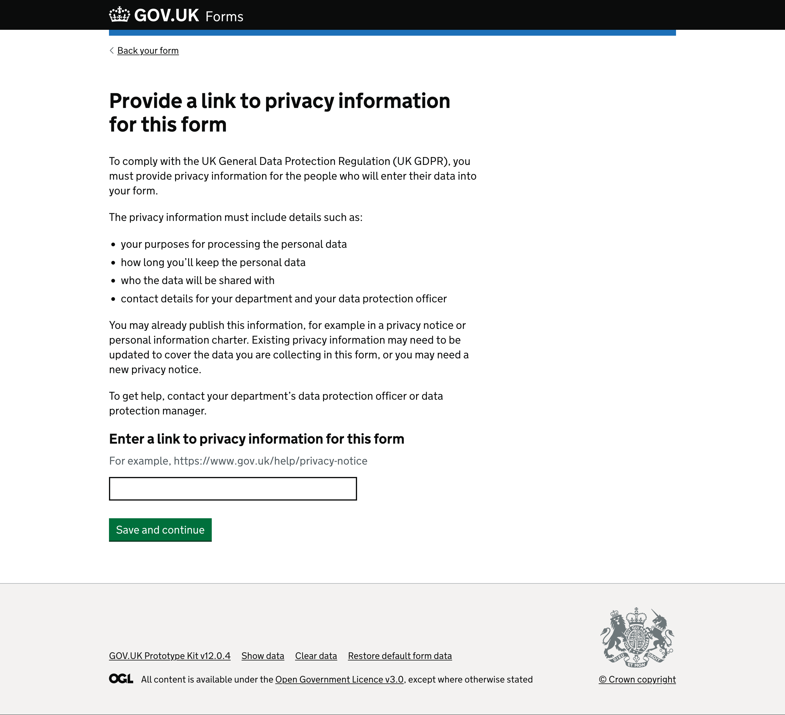
*Page with the heading “Provide a link to privacy information for this form”.*

There is a paragraph that explains why a form creator needs to provide privacy information, “To comply with the UK General Data Protection Regulation (UK GDPR), you must provide privacy information for the people who will enter their data into your form.“

There is a list of the details that must be included in the privacy information, “The privacy information must include details such as:

- your purposes for processing the personal data
- how long you’ll keep the personal data
- who the data will be shared with
- contact details for your department and your data protection officer“

This is followed by a paragrah to help the form creator know where to find the privacy information, “You may already publish this information, for example in a privacy notice or personal information charter. Existing privacy information may need to be updated to cover the data you are collecting in this form, or you may need a new privacy notice.“

“To get help, contact your department’s data protection officer or data protection manager.“

There is a secondary heading label, “Enter a link to privacy information for this form“ with hint text giving an example “For example, https://www.gov.uk/help/privacy-notice“. 
This is followed by text input. 

At the end of the page is a green “Save and continue” button. 

 

### Provide contact details for support

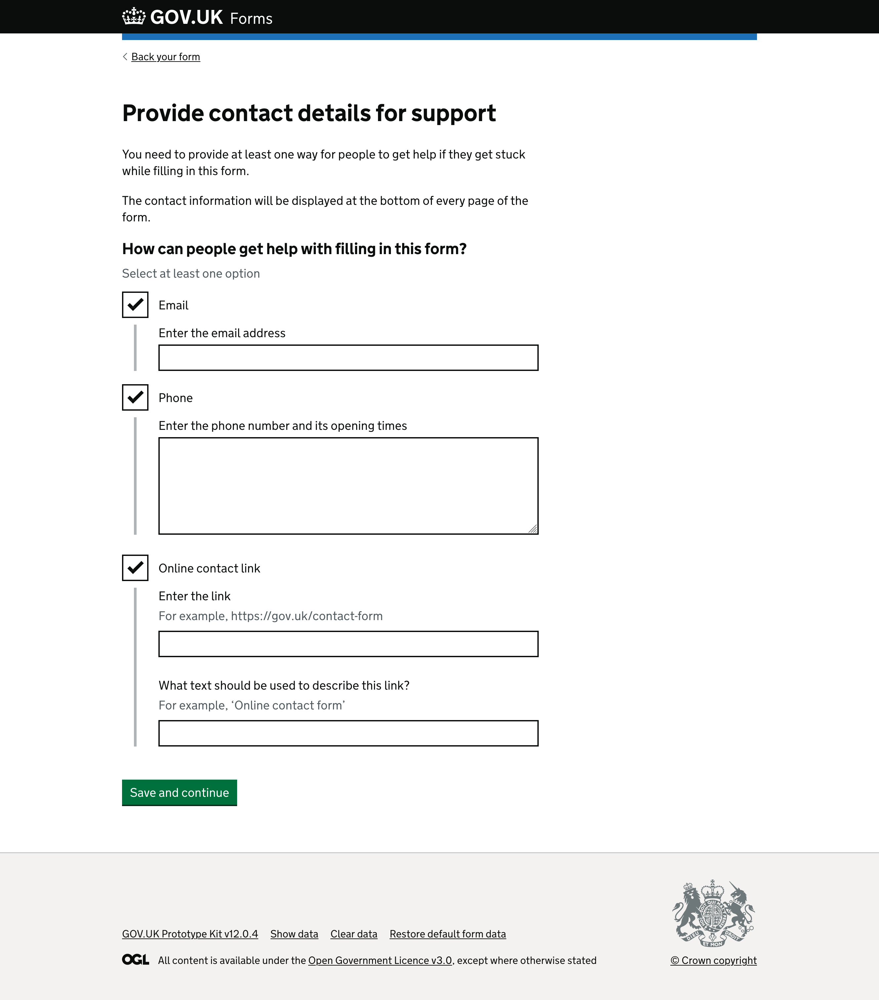
*Page with the heading “Provide contact details for support”.*

There is a paragraph describing why form creators need to provide contact details for support, “You need to provide at least one way for people to get help if they get stuck while filling in this form.“

There is text that says where person filling the form will find the contact information “The contact information will be displayed at the bottom of every page of the form.“

There is a secondary heading label, “How can people get help with filling in this form? “ with hint text saying “Select at least one option“.

This is followed by the first checkbox option labelled “Email“ (selected) with a hint text saying “Enter the email address“. This is followed by a text input. 

The next checkbox option is “Phone“ (selected) with hint text saying “Enter the phone number and its opening times“. This is followed by a large text input. 

The third checkbox option is “Online contact link“ (selected). There is “Enter the link“ and hint text “For example, https://gov.uk/contact-form“ labels for a text input. The form creator is asked to give the text to describe the link,  “What text should be used to describe this link?“ with an example in hint text, “For example, ‘Online contact form’“. This is followed by a text input. 

At the end of the page is a green “Save and continue” button. 

 

### Make your form live

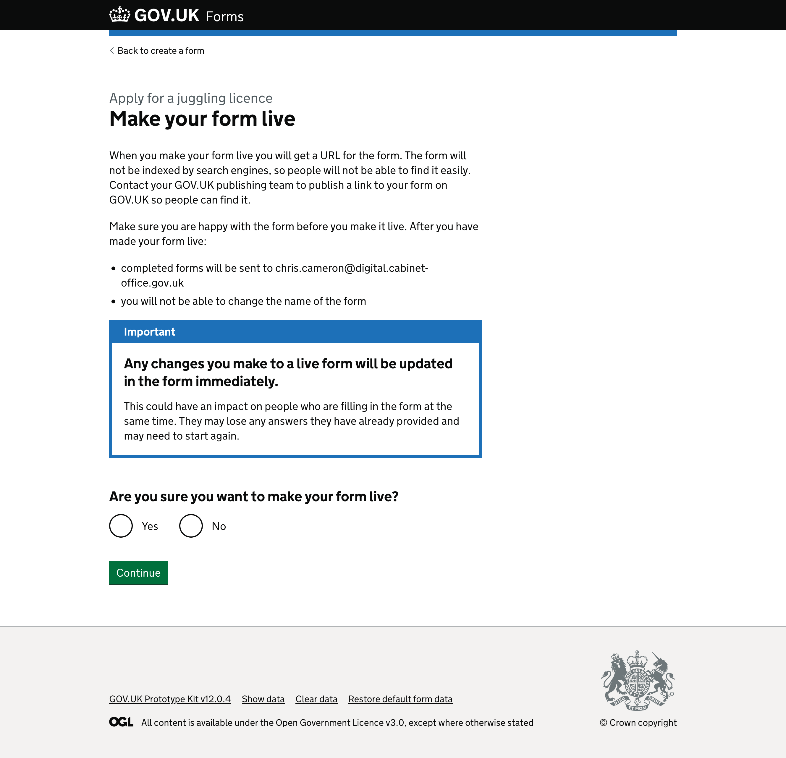
*Page with “Apply for a juggling licence” caption above the heading that says “Make your form live".*

There is a paragraph that describes what happens when a form is made live “When you make your form live you will get a URL for the form. The form will not be indexed by search engines, so people will not be able to find it easily. Contact your GOV.UK publishing team to publish a link to your form on GOV.UK so people can find it.“

There is text and a bullet list saying  “Make sure you are happy with the form before you make it live. After you have made your form live:
- completed forms will be sent to email@example.gov.uk
- you will not be able to change the name of the form“

There is a blue notification banner with title “Important“. Inside the notification banner there is a secondary heading saying “Any changes you make to a live form will be updated in the form immediately.“ 
This is followed by a paragraph describing how any changes will affect people filling the form “This could have an impact on people who are filling in the form at the same time. They may lose any answers they have already provided and may need to start again.“

Below the notification banner there is a secondary heading “Are you sure you want to make your form live?“ followed by two radio options, “Yes” and “No”. 

At the end of the page is a green “Continue” button. 

 

### Your form is live

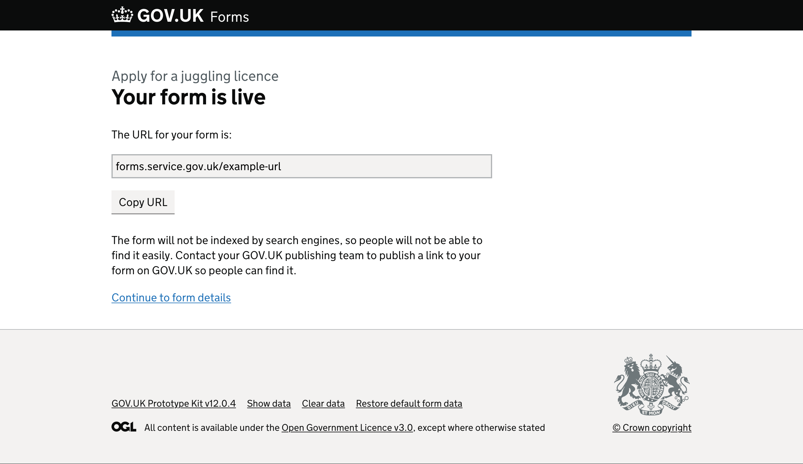
*Page with “Apply for a juggling licence” caption above the heading that says “Your form is live".*

There is text saying "The URL for your form is:" followed by an inactive link of the live form "forms.service.gov.uk/example-url“. Below is a grey button to copy the link “Copy URL“.

There is a paragraph describing what the form creator needs to do with the link “The form will not be indexed by search engines, so people will not be able to find it easily. Contact your GOV.UK publishing team to publish a link to your form on GOV.UK so people can find it.“

There is a link to “Continue to form details“ which takes the form creator to the task list page for their live form. 

 

### Create a form (task list page) for a live form

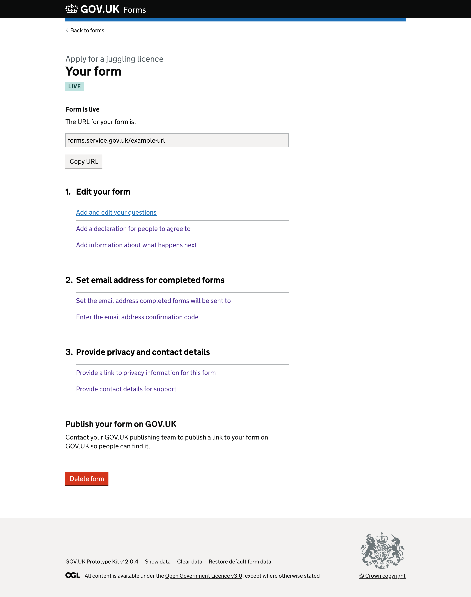
*Page with “Apply for a juggling licence” caption above the heading that says “Your form”. Followed by a green “LIVE“ tag.*

This is the task list page for a live form. This is the beginning of the form creator's journey returning to a live form to edit it. 

 

### Add and edit questions (make changes to a live form)

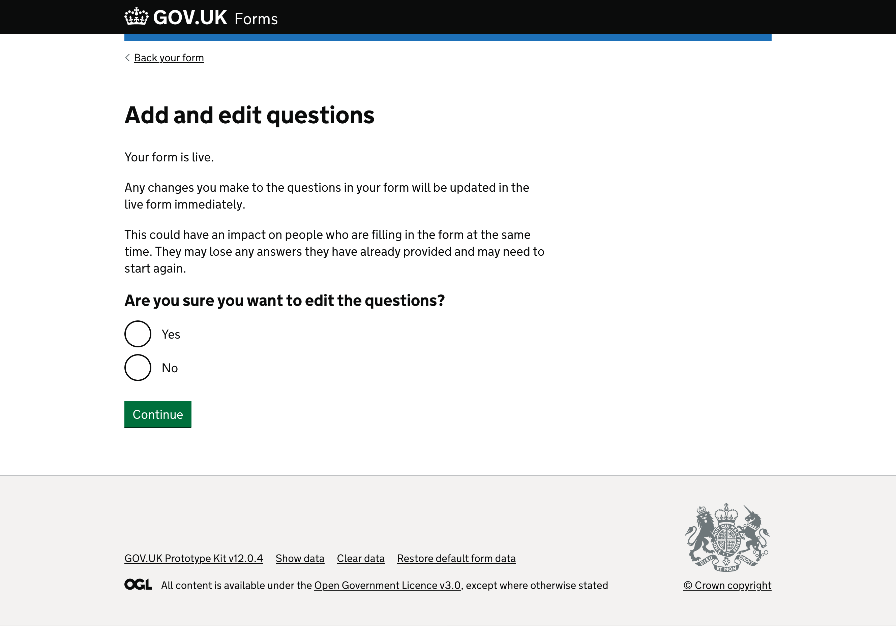
*Page with heading that says “Add and edit questions”.*

There is text saying “Your form is live“ 

Followed with a paragrah descibing what happens when changes are made to a live form “Any changes you make to a live form will be updated in the form immediately.“ 
This is followed by a paragraph describing how any changes will affect people filling the form “This could have an impact on people who are filling in the form at the same time. They may lose any answers they have already provided and may need to start again.“

There is a secondary heading “Are you sure you want to edit the questions?“ followed by two radio options, “Yes” and “No”. 

At the end of the page is a green “Continue” button. 

 

### Add and edit questions (on a live form) 

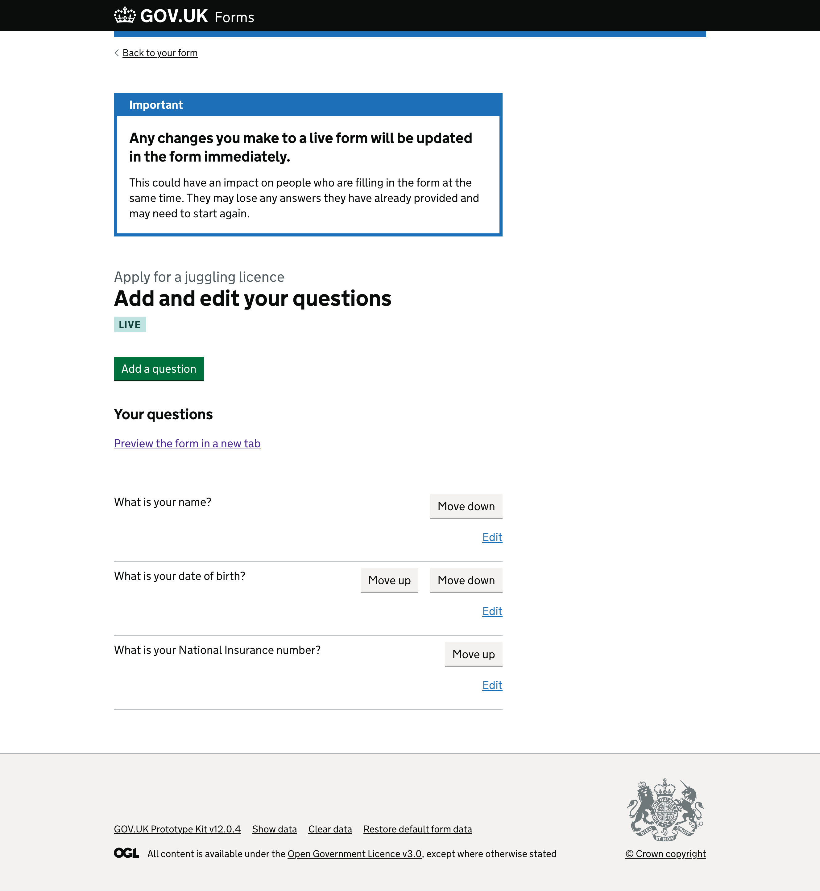
*Page with a blue notification banner with title “Important“, followed by “Apply for a juggling licence” caption above the heading that says “Add and edit your questions”.*

At the start of the page is a blue notification banner with title “Important“. Inside the notification banner there is a secondary heading saying “Any changes you make to a live form will be updated in the form immediately.“ 

This is followed by a paragraph describing how any changes will affect people filling the form “This could have an impact on people who are filling in the form at the same time. They may lose any answers they have already provided and may need to start again.“

Below the heading is a green status tag “LIVE“ to let the form creator know this is a live form. 

There is a green “Add a question” button followed by a secondary heading, “Your questions" and below is a link "Preview the form in a new tab". 

There is a list of questions created and saved for this form. 
The first question is "What is your name?". To the right is a grey “Move down” button and below it a link "edit".
There is a section break
The second question is "What is your date of birth?". To the right is a grey “Move up” button, next to it a grey "Move down" button. Bellow the "Mode down" is a link "edit".
There is a section break
The third queston is "What is your National Insurance number?". To the right is a grey "Move up" button and below is a link "edit".

 
 

## Some things we changed since last time
- Added draft and live status tags to let a user know what state a form is in
- Content changes on the example heading and text input label on the edit confirmation / form submitted page
- Content changes on the example heading and text input label on the edit add a declaration / check your answers page
- Updated the second level heading 'Add and edit your questions' page to 'Your questions'
- Content updates on the 'edit question page' 
- [Made changes to the Create a form (task list) page](https://github.com/alphagov/forms/tree/documenting-prototype-version-7/design/prototype-version-7/task-list)
- [Introduced new journeys](#new-journeys-we-introduced)

For more information, see [v0.0.7 release notes](https://github.com/alphagov/forms-prototypes/releases/tag/v0.0.7). 

 

___

## Form runner screenshots

Below are the screens the form filler (the end user) would see as they complete the form.

 

### Preview question 1

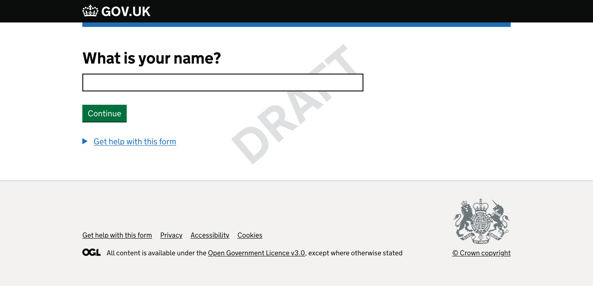
*Page with “What is your name?” question as a label for a text input. There is a green “Continue” button and a details summary text “Get help with this form“ at the bottom.*

### Preview final question

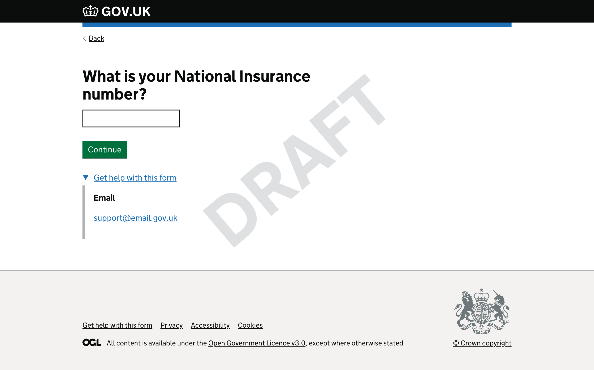
*Page with “What is your National Insurance number?” question as a label for a text input, followed below by a green “Continue” button.*

There is a details summary link text that says “Get help with this form“ that is expanded to reveal the third level heading “Email“ and an example of a contact email address “support@email.gov.uk“. We added this details component of the contact details that can be used by a person filling a form to get help.

This is the contact details added by the form creator within the admin side of the builder, meaning it can be customised. The form creator can also provide a link to contact support form or a phone number or all three options.

There is a new visually recessive ‘watermark’ saying “DRAFT” across the background of the page.  

### Preview check your answers (summary page)

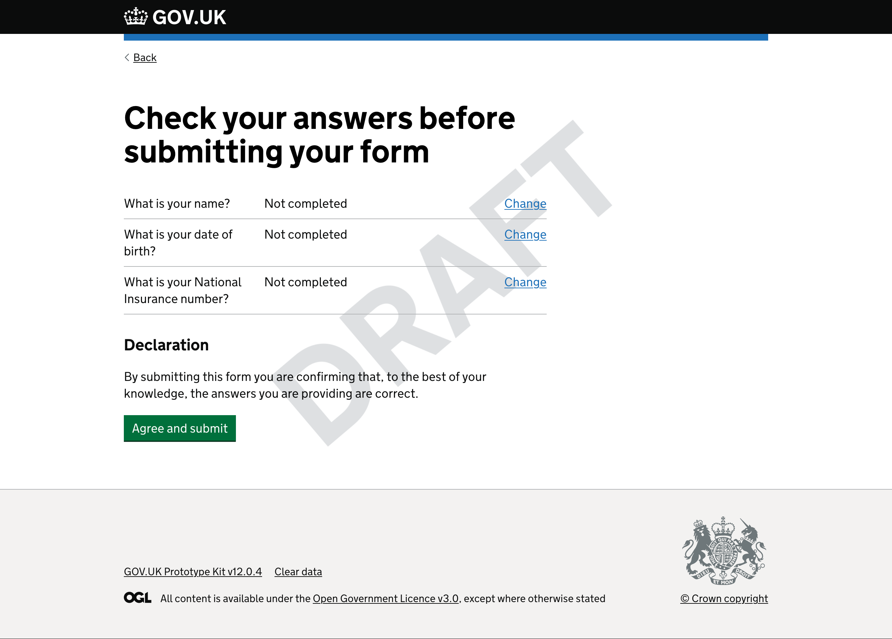
*Page with “Check your answers before submitting your form” heading followed by a summary list component.*

The summary list component lists rows showing the form’s full questions. There is a space to the right where the form filler's answer would appear: this has placeholder text saying “Not completed”. Finally, there is a “Change” link for the form filler to correct or change any answer they feel is incorrect.

Below is a secondary heading, “Declaration”, before the text “By submitting this form you are confirming that, to the best of your knowledge, the answers you are providing are correct.” This is an example declaration for the form filler to agree to, by clicking the green “Agree and submit” button. The text of the declaration is editable by the form creator within the admin side of the builder, meaning it can be customised to suit the needs of the different forms or department.

There is a visually recessive ‘watermark’ saying “DRAFT” which stretches across the background of the page. 

### Preview your form has been submitted (confirmation page)

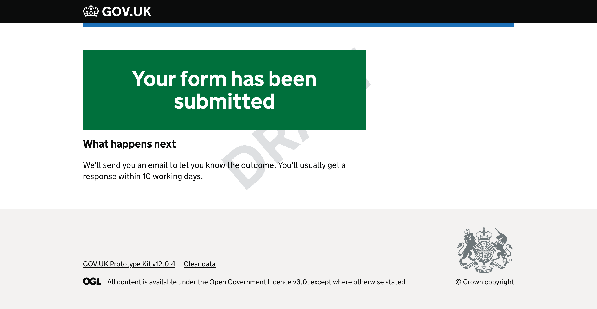
*Page with “Your form has been submitted” heading in a green box.*

This page includes a secondary heading “What happens next” followed by the content “We'll send you an email to let you know the outcome. You'll usually get a response within 10 working days.” This text is editable by the form creator within the admin side of the builder, meaning it can be customised as to the needs of the different forms or department and should match their internal service level agreements (SLAs).

There is a visually recessive ‘watermark’ saying “DRAFT” across the background of the page - this is mostly hidden behind the green success panel.  

 
 

## Some things we changed since last time
- We added a details component on the question page to reveal the contact details provided by the form creator. The contact details can be used by a person filling a form to get help. 
 

___

[Back to the top](#prototype-version-7)

